# 强化学习解决魔方(以及其他复杂问题！)

> 原文：<https://medium.datadriveninvestor.com/reinforcement-learning-to-solve-rubiks-cube-and-other-complex-problems-106424cf26ff?source=collection_archive---------0----------------------->

# 序

我的书[《深度强化学习手把手》](https://www.amazon.com/Deep-Reinforcement-Learning-Hands-Q-networks/dp/1788834240)见光已经半年了。我花了将近一年的时间来写这本书，在写作休息一段时间后，我发现解释 RL 方法并将理论论文转化为工作代码对我来说很有趣，我不想停下来。幸运的是，RL 领域正在不断发展，因此有很多主题可以写。

# 介绍

在大众感知中，深度强化学习是一种主要用于玩游戏的工具。这并不奇怪，因为事实上，历史上该领域的第一次成功是在 2015 年由 Deep Mind 在雅达利游戏套件[中实现的](https://deepmind.com/research/dqn/)。

[Atari benchmark suite](https://github.com/mgbellemare/Arcade-Learning-Environment) 在解决 RL 问题上非常成功，甚至现在，许多研究论文都在使用它来展示他们方法的效率。随着 RL 领域的发展，经典的 53 Atari 游戏继续变得越来越不具挑战性(在撰写本文时，超过一半的游戏以超人的准确性解决)，研究转向更复杂的游戏，如星际争霸和 Dota2。

但这种对游戏的偏见造成了一种“RL 就是玩游戏”的错误印象，与事实相差甚远。在 2018 年 6 月出版的[我的书](https://amazon.com/Deep-Reinforcement-Learning-Hands-Q-networks/dp/1788834240/)，
中，我试图用其他领域的例子来补充雅达利游戏，包括股票交易([第 8 章](https://github.com/PacktPublishing/Deep-Reinforcement-Learning-Hands-On/tree/master/Chapter08))、聊天机器人和 NLP 问题([第 12 章](https://github.com/PacktPublishing/Deep-Reinforcement-Learning-Hands-On/tree/master/Chapter12))、网络导航自动化([第 13 章](https://github.com/PacktPublishing/Deep-Reinforcement-Learning-Hands-On/tree/master/Chapter13))、连续控制([第 14…16 章](https://github.com/PacktPublishing/Deep-Reinforcement-Learning-Hands-On/tree/master/Chapter16))和棋盘游戏([第 18 章](https://github.com/PacktPublishing/Deep-Reinforcement-Learning-Hands-On/tree/master/Chapter18))。

事实上，具有非常灵活的 MDP 模型的 RL 潜在地可以应用于各种各样的领域，其中计算机游戏只是复杂决策的一个方便而壮观的例子。

在这篇文章中，我试图详细描述最近将 RL 应用于组合优化领域的尝试。讨论的论文由来自 UCI(加州大学欧文分校)的研究人员小组发表，名为[“在没有人类知识的情况下解开魔方”](https://arxiv.org/abs/1805.07470)。除了本文的详细描述之外，我们还将介绍[我的开源 PyTorch 实现](https://github.com/Shmuma/rl/tree/master/articles/01_rubic)提出的方法，用训练模型做实验，并概述改进本文提出的方法的方向。

在下面的文本中，我将把本文方法的描述与我的版本中的代码片段结合起来，用具体的实现来说明概念。如果您只对该方法的理论描述感兴趣，您可以很容易地跳过代码。

让我们从魔方和组合优化的概述开始。

# 魔方与组合优化

我怀疑找到一个没有听说过魔方的人是可能的，所以，我不打算重复这个谜题的维基百科描述，而是关注它与数学和计算机科学的联系。如果没有明确说明，我说的“魔方”是指 3×3 的经典魔方。基于最初的 3x3 拼图有许多变体，但它们仍然远不如经典发明受欢迎。

就机械和任务描述而言，魔方 3x3 非常简单，就我们可以通过旋转魔方侧面进行的所有转换而言，它是一个非常复杂的对象。据计算，通过旋转立方体，立方体 3x3 总共具有 4.33 × 10 个⁹不同态。这只是不分解立方体就可以达到的状态，通过把东西拆开然后再组装，你总共可以达到十二倍多的状态(≈5.19 × 10 ⁰)，但是那些“额外”的状态使得立方体不分解就无法求解。

通过立方体侧面的旋转，所有这些状态都紧密地交织在一起。例如，如果我们在某个状态下顺时针旋转左侧，我们会到达该状态，从该状态开始，同侧逆时针旋转会破坏变换的效果，我们会到达初始状态。但是如果我们连续应用左侧旋转三次，那么到达初始状态的最短路径将只是左侧顺时针旋转一次，而不是逆时针旋转三次(这也是可能的，只是不是最优的)。

由于立方体 3x3 有 6 条边，每条边都可以向两个方向旋转，所以总共有 12 种可能的旋转。有时，半圈(两个同方向的连续旋转)也包括在不同的旋转中，但为了简单起见，我们将它们视为立方体的两个不同的变换。

在数学中，有几个领域研究这类对象。首先，它是“抽象代数”，数学的一个非常广泛的分支，研究抽象的对象集合及其上面的运算。就其本身而言，魔方是相当复杂的[组](https://en.wikipedia.org/wiki/Group_theory)的一个例子，具有许多有趣的属性。

但是魔方不仅仅是状态和变换，它是一个难题，主要目标是找到一系列旋转，最终解决魔方。这类问题由[组合优化](https://en.wikipedia.org/wiki/Combinatorial_optimization)研究，它是应用数学和理论计算机科学的一个子领域。举几个例子来说，这个学科有许多具有很高实用价值的著名问题:

*   [**旅行推销员问题**](https://en.wikipedia.org/wiki/Travelling_salesman_problem) :求一个图中最短的封闭路径
*   [**蛋白质折叠模拟**](https://en.wikipedia.org/wiki/Protein_folding) :寻找蛋白质可能的 3D 结构，
*   **资源分配**:如何在消费者之间分配固定的一组资源，以达到最佳目标。

还有很多其他的…

这些问题的共同点是巨大的状态空间，这使得仅仅检查所有可能的组合来寻找最佳解决方案是不可行的。我们的“玩具立方体问题”也属于这一类，因为 4.33 × 10 ⁹的状态空间使得蛮力方法完全不切实际。

# 最优性和上帝的数字

让组合优化问题变得棘手的是，我们不是在寻找*任何解*，我们实际上感兴趣的是问题的*最优解*。区别是显而易见的:就在魔方发明后，人们就知道如何达到目标状态(但 ernő·鲁比克花了大约一个月的时间，才想出解决他自己发明的第一个方法，我猜，这是一种粗糙的体验)。如今，有许多不同的方法或“方案”来解决立方体:初学者的方法，杰西卡 Fridrich 的方法(非常受 speedcubers)和许多其他的方法。

所有这些都因要走的步数不同而不同。例如，一个非常简单的初学者方法需要大约 100 次旋转来解决立方体，使用 5…7 次旋转序列来记忆。相比之下，目前 speedcubing 比赛上的世界纪录是 4.22 秒解 3×3 的立方体，需要的步骤少得多，但需要记忆和训练的序列更多。杰西卡·弗里德里希的方法平均需要 55 步，但你需要熟悉大约 120 种不同的移动顺序。

但是，当然，最大的问题是:解决立方体任何给定状态的最短动作序列是什么？令人惊讶的是，在 cube 获得巨大人气 54 年后，人类仍然不知道这个问题的完整答案。仅在 2010 年，来自谷歌的研究小组已经证明，解决*任何*立方体状态所需的最小移动量是 20。这个数字也被称为*神数*。当然，平均而言，最优解更短，因为只有一堆状态需要 20 次移动，而一个单个状态根本不需要任何移动(已解决状态)。

这个结果只证明了最小移动量，而没有找到解本身。如何找到任何给定状态的最优解仍然是一个公开的问题。

# 立方体求解方法

在[论文](https://arxiv.org/abs/1805.07470)发表之前，有两个主要的解魔方方向:

1.  通过使用**群论结果**，可以显著减少要检查的状态空间。使用这种方法的最流行的求解器之一是 [Kociemba 的算法](https://en.wikipedia.org/wiki/Optimal_solutions_for_Rubik%27s_Cube#Kociemba%27s_algorithm)，
2.  通过使用**蛮力搜索**伴随着手工启发引导搜索到最有希望的方向。一个生动的例子是 Korth 的算法，该算法使用 A*搜索大型模式数据库来删除错误的方向。

论文介绍了第三种方法:通过在许多随机洗牌的立方体上训练神经网络，有可能得到*策略*，它将向我们显示解决状态的方向。训练是在没有任何领域知识的情况下进行的，唯一需要的是立方体本身(不是物理的，而是它的计算机模型)。这与上述两种方法形成对比，这两种方法需要大量关于领域的人类知识以及以计算机代码的形式实现它们的劳动。

在接下来的章节中，我们将详细介绍这种新方法。

# 数据表示法

一开始，让我们从*数据表示*开始。在 3x3 立方体问题中，我们有两个实体需要被编码:**动作**和**状态**。

## 行动

动作是我们可以从任何给定的立方体状态进行的可能的旋转，正如已经提到的，我们总共只有 12 个动作。从我们旋转的立方体侧面开始，有一个既定的动作命名。立方体边的名称为*左*、*右*、*上*、*下*、*前*后。对于每一侧，我们有两种不同的动作，分别对应于该侧的顺时针和逆时针旋转(90°或–90°)。一个很小但非常重要的细节是
旋转是在目标面向你的位置进行的。例如，这对于前侧的*来说是明显的，但是对于后*侧的*来说，这可能是令人困惑的。*

动作的名字来源于一方名字的第一个字母。如*右*侧*顺时针*旋转称为 *R* 。逆时针动作有不同的符号，有时用撇号(*r’*)或小写字母( *r* )表示，甚至用波浪号(r̃).)表示第一个和最后一个符号对于计算机代码来说不太实用，因此，在我的实现中，我使用小写动作来表示逆时针旋转。因此，对于右侧我们有两个动作: *R* 和 *r* ，另外两个用于左侧: *L* 和 *l* ，以此类推。

在我的代码中，动作空间是使用 [python enum](https://github.com/Shmuma/rl/blob/master/articles/01_rubic/libcube/cubes/cube3x3.py#L33) 实现的，其中每个动作都被映射到唯一的整数值。

## 州

一个状态是立方体贴纸的特定配置，正如我们已经提到的，我们的状态空间的大小非常大(4.33 × 10 ⁹不同的状态)。但是状态的数量并不是我们唯一的复杂因素。此外，当我们选择特定的状态表示时，我们希望达到不同的目标:

*   避免冗余:在极端情况下，我们可以通过记录每个面上每个标签的颜色来表示立方体的状态。但是，如果我们只计算这种组合的数量，我们得到 6⁶*⁸= 6⁴⁸ ≈ 2.25 × 10 ⁷，这远远大于我们立方体的状态空间大小，这只是意味着这种表示是高度多余的，例如，它允许立方体的所有侧面都有一种单一的颜色(除了中心立方体)。如果你想知道我们是如何得到 6⁶*⁸的，这很简单:我们有 6 面立方体，每面有 8 个小立方体(我们不计算中心)，所以我们总共有 48 个贴纸，每个贴纸可以涂上 6 种颜色中的一种。
*   **内存效率**:我们很快就会看到，在训练期间，甚至在模型应用期间，我们需要在内存中保存立方体的大量不同状态，这可能会影响流程的性能。因此，我们希望表示尽可能紧凑。
*   **转换的性能**:另一方面，我们需要实现应用于状态的所有动作，并且这些动作需要快速完成。如果我们的表示在内存方面非常紧凑(例如，使用位编码)，但要求我们对立方体边的每次旋转进行冗长的解包过程，我们的训练将变得太慢。
*   神经网络友好性:并不是每一种数据表示作为神经网络的输入都一样好。这不仅适用于我们的情况，也适用于一般的机器学习，例如在 NLP 中，通常使用单词包或单词嵌入，在 CV 中，图像从 jpeg 解码为原始像素，随机森林需要对数据进行大量的特征工程处理，等等。

在本文中，立方体的每个状态都表示为 20 × 24 的一键编码张量。为了理解它是如何做到的，为什么它会有这种形状，让我们从从纸上截取的图片开始。

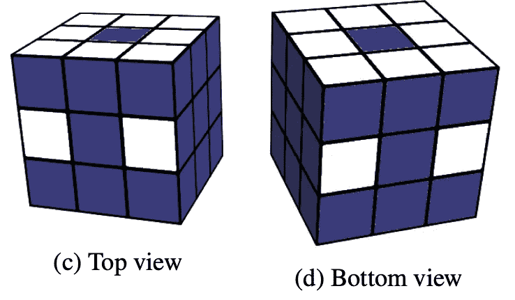

Stickers we need to track in the cube are marked with white

在这里，我们用白色标记了需要跟踪的立方体贴纸，其余的贴纸(蓝色)是多余的，没有必要跟踪它们。如你所知，3x3 魔方由三种类型的魔方组成:8 个带三个贴纸的角魔方、12 个带两个贴纸的边魔方和 6 个带一个贴纸的中间魔方。

乍一看可能不明显，但是根本不需要跟踪中心立方体，因为它们不能改变它们的相对位置，只能旋转。因此，就中心立方体而言，我们只需要就*立方体对齐*达成一致并坚持下去。例如，在我的实现中，白色边总是在顶部，前面是红色，左边是绿色等等。这使得我们的状态*旋转不变*，这基本上意味着，立方体作为一个整体的所有可能的旋转都被认为是相同的状态。

好的，中间的立方体没有被追踪，这就是为什么在上面的图中它们都用蓝色标记。其余的呢？显然，每一种特定的立方体(角或边)都有其独特的贴纸颜色组合。例如，在我的方向上组装的立方体(白色在上面，红色在前面，等等)具有面向我们的以下颜色的左上角立方体:绿色、白色和红色。没有其他颜色的转角立方体(如有疑问，请检查)。侧面立方体也是如此。

因此，要找到某个特定立方体的位置，我们只需要知道它的一个标签的位置。这类贴纸的选择完全是随意的，但是一旦选定，就需要坚持这个。如上图所示，我们从上侧跟踪八个标签，从下侧跟踪八个标签，另外四个侧标签，两个在前侧，两个在后侧。这给了我们总共 20 个要跟踪的标签。

现在，张量维度中的“24”从何而来。我们总共有 20 个不同的标签要跟踪，但是由于立方体的变换，它们会出现在哪个位置呢？这取决于我们追踪的立方体的种类。让我们从角立方体开始。总共有 8 个角立方体，立方体变换可以以任何顺序重新洗牌。因此，任何特定的立方体都可能出现在 8 个可能的角落中。此外，立方体的每个角都可以旋转，因此，我们的“绿、白、红”立方体可以有三种可能的方向:

*   白色在上面，绿色在左边，红色在前面，
*   绿色在上面，红色在左边，白色在前面，
*   红色在上面，白色在左边，绿色在前面。

因此，为了精确指示*角立方体*的位置和方向，我们有 8×3=24 种不同的组合。

在 12 个侧面立方体的情况下，它们只有两个贴纸，因此只有两种可能的方向，这又给了我们 24 种组合，但它们是通过不同的计算获得的
:12×2 = 24。最后，我们有 20 个立方体要跟踪，8 个角和 12 个边，每个有 24 个位置
它可能结束。

将此类数据输入神经网络的一个非常流行的选项是*一键编码*，此时对象的具体位置为 1，其他位置
用 0 填充。这给了我们状态的最终表示，它是一个 20×24 的张量。

从冗余的角度来看，这种表示更接近于总的状态空间，可能组合的数量等于 24 个⁰ ≈ 4.02 × 10 个⁷.它仍然比立方体状态空间大(可以说是*显著*大，10⁸因子很多)，但是它比每个标签的所有颜色的编码要好。这种冗余来自立方体变换的微妙特性，例如，不可能旋转一个角的立方体(或翻转一个边的立方体)*而让所有其他的*保持在它们的位置上。

数学性质远远超出了本文的范围，如果你感兴趣，我可以推荐亚历山大·弗雷和大卫·辛马斯特的精彩著作《立方数学手册》。

细心的读者可能会注意到，立方体状态的张量表示有一个显著的缺点:内存效率低。事实上，通过将状态保持为 20 × 24 的浮点张量，我们浪费了 4 × 20 × 24 = 1920 字节的内存，这是一个很大的数字，因为在训练过程中需要保持大约数千个状态，在立方体求解过程中需要保持数百万个状态(您很快就会知道)。为了克服这一点，在我的实现中，我使用了两种表示法*:张量 1 用于神经网络输入，另一种更紧凑的表示法需要更长时间地存储不同的状态。这种紧凑状态被保存为一堆列表，对角立方体和边立方体的排列及其方向进行编码。这种表示法不仅内存效率高得多(160 字节)，而且转换实现也方便得多。*

*具体细节可以在[这个模块](https://github.com/Shmuma/rl/blob/master/articles/01_rubic/libcube/cubes/cube3x3.py#L11)中找到，紧凑状态在`State` namedtuple 中实现，神经网络表示由函数`encode_inplace`产生。*

# *培训过程*

*现在我们知道了立方体的状态是如何在 20 × 24 张量中编码的，我们来谈谈神经网络的架构以及它是如何被训练的。*

## *神经网络架构*

*图中显示了网络架构。*

*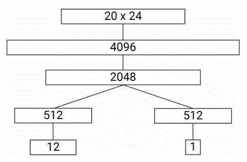*

*作为输入，它接受已经熟悉的立方体状态表示为
20 × 24 张量，并产生两个输出:*

*   ***策略**，这是一个 12 个数字的向量，代表我们行动的概率分布，*
*   ***值**，单个标量估计通过状态的“良好度”。值的具体含义将在后面讨论。*

*在输入和输出之间，网络有几个 ELU 激活的全连接层。在我的实现中，架构与论文中的完全相同，在这里可以找到。*

## *培养*

*这个网络非常简单明了:策略告诉我们应该对状态应用什么样的转换，值估计状态有多好。但是一个大问题仍然存在:如何训练网络？*

*本文提出的训练方法被称为“自动教学迭代”或简称为 ADI，它具有惊人的简单结构。我们从目标状态(组装好的立方体)开始，应用一些预定义长度的随机转换序列 *N* 。这给了我们一系列的 *N* 状态。对于该序列中的每个状态 *s* ,我们执行以下程序:*

*   *对状态 *s* 应用每一个可能的转换(总共 12 个)，*
*   *将这 12 个状态传递给我们当前的神经网络，要求**值**输出。这为 *s* 的每个子状态提供了 12 个值。*
*   *状态 *s* 的目标值计算为 vᵢ = maxₐ(v(sᵢ,a)+R(A(sᵢ,a))，其中 *A(s，a)* 是动作 *a* 应用于状态 *s* 后的状态，如果 *s* 是目标状态，则 *R(s)* 等于 1，否则为-1。*
*   *使用相同的公式来计算状态的目标策略，但是我们取 arg max:pᵢ=argmaxₐ(v(sᵢ,a)+r(a(sᵢ,a))).这只是意味着我们的目标策略将在子状态的最大值位置有 1，在所有其他位置有 0。*

*这一过程显示在取自论文的图中。x₁…x₀的扰码序列被生成，其中立方体 xᵢ被展开显示。对于这个州 xᵢ，我们通过应用上面的公式为扩展的州的策略和值头制定目标。*

*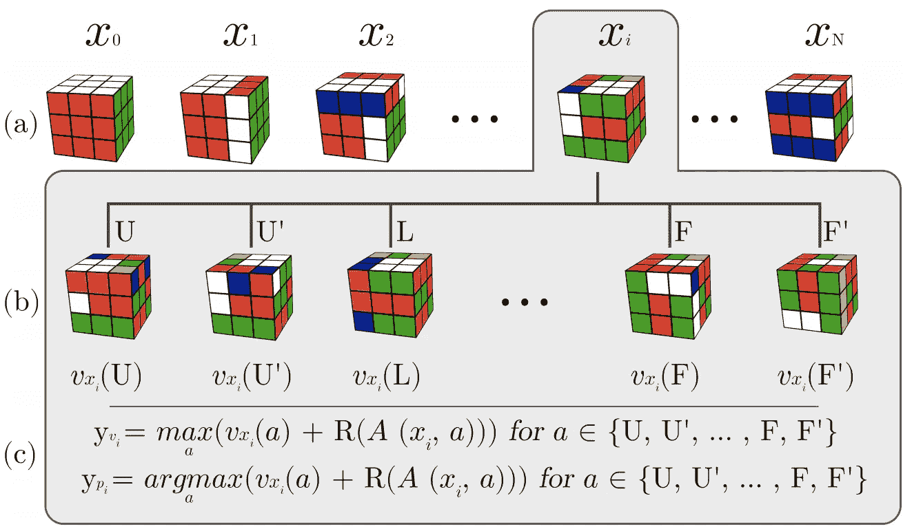*

*使用这个过程，我们可以生成我们想要的任何数量的训练数据。*

## *模型应用*

*好的，假设我们已经使用刚才描述的过程训练了模型。我们应该如何用它来解决混乱的立方体？从网络结构来看，您可能会想到一个显而易见(但不幸的是，不是很成功)的方法:*

1.  *向模型提供我们想要求解的立方体的当前状态，*
2.  *从策略头获取要执行的最大动作(或从结果分布中取样)，*
3.  *将操作应用于多维数据集，*
4.  *重复该过程，直到达到已解决的状态。*

*直觉上，这种方法应该是可行的，但是实际上，它有一个严重的问题:行不通。主要原因是我们的模型质量。由于状态空间的大小和神经网络的性质，不可能训练神经网络始终返回任何输入状态的精确最优动作。我们的模型向我们展示了探索的有希望的方向，而不是告诉我们做什么来获得解决的状态。这些方向可以让我们更接近解决方案，但有时它们可能会产生误导，只是因为这个特定的状态在训练期间从未被看到过(不要忘记，它们有 4.33 × 10 个⁹，即使 GPU 的训练速度为每秒几十万个状态，经过一个月的训练，我们有机会看到状态空间的微小部分，大约 0.00000005%。因此，必须使用更复杂的方法。*

*有一类非常流行的方法，叫做“蒙特卡罗树搜索”，简称 MCTS。这些方法有很多变体，
但总体思想很简单，可以通过与众所周知的强力搜索方法进行比较来描述，如“广度优先搜索”(BFS)或
“深度优先搜索”(DFS)。在 BFS 和 DFS 中，我们通过尝试所有可能的动作并探索这些动作所得到的所有状态，来对我们的状态空间进行彻底的搜索。正如你所看到的，这种行为是上述过程的另一个极端(当我们有东西告诉我们在每个状态下去哪里)。*

*MCTS 提供了介于这两个极端之间的东西:我们想要执行搜索，并且我们有一些我们应该去的地方的信息，但是这些信息可能是不可靠的、嘈杂的或者在某些情况下是错误的。但有时，这些信息可以向我们展示有希望的方向，从而加快搜索过程。*

*正如我所提到的，MCTS 是一个方法家族，在细节和特征上各不相同。在这篇论文中，我们使用了一种叫做 UCT 的方法。该方法在树上操作，其中节点是状态，边是连接这些状态的动作。在大多数情况下，整棵树是巨大的，所以，我们并不试图构建整棵树，只是它的一小部分。在开始时，我们从由单个节点组成的树开始，这是我们的当前状态。*

*在 MCTS 的每一步，我们沿着树走，探索树中的一些路径，我们可以面对两种选择:*

*   *我们目前的节点是叶节点(我们还没有探索这个方向)，*
*   *当前节点位于树的中间，并且有子节点。*

*在叶节点的情况下，我们通过对状态应用所有可能的动作来“扩展”它。正在检查所有结果状态是否是目标状态(如果已经找到了已求解立方体的目标状态，我们的搜索就完成了)。叶状态被传递给模型，并且来自值和策略头的输出被存储以备后用。*

*如果节点不是叶节点，我们知道它的子节点(可到达状态),并从网络获得值和策略输出。所以，我们需要决定走哪条路(换句话说，哪个行动更有希望探索)。这个决定不是一个微不足道的决定，事实上，它是强化学习方法的基石，被称为“探索-利用问题”。一方面，我们的网络政策告诉我们该做什么。但如果是错的呢？这可以通过探索周围的状态来解决，但是我们不想一直探索(因为状态空间是巨大的)。所以，我们应该保持平衡，它直接影响搜索过程的性能和结果。*

*为了解决这个问题，对于每个状态，我们为每个可能的动作(有 12 个)保留一个计数器，每次在搜索过程中选择了
动作，计数器就会增加。为了决定跟随特定的动作，我们使用这个计数器，采取的动作越多，将来被选择的可能性就越小。*

*此外，模型返回的值也用于此决策。该值被跟踪为当前
州的值和其子州的值的最大值。这允许从父状态中看到最有希望的路径(从模型的角度来看)。*

*总的来说，通过使用以下公式来选择非叶树要遵循的动作:*

*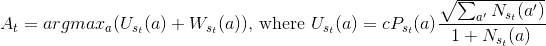*

*这里 *N(s，a)* 是在状态 *s* 中选择了 *a* 的次数， *P(s，a)* 是模型为状态 *s* 返回的策略， *W(s，a)* 是模型为分支 *a* 下 *s* 的所有子状态返回的最大值。*

*抱歉公式格式怪异，Medium 不支持 LaTeX。在文章的最后，你可以下载这篇文章的 PDF 版本，里面有正确的乳胶配方。*

*这个过程会一直重复，直到找到解决方案或者我们的时间预算用完。为了加速这个过程，MCTS 经常以并行的方式实现，在这种方式下，多个搜索由多个线程执行。在这种情况下，可以从 *A(t)* 中减去一些额外的损失，以防止多个线程探索树的相同路径。*

*求解过程的最后一步是，一旦我们到达目标状态，如何从 MCTS 树中得到解。论文作者
试验了两种方法:*

*   ***天真**:一旦我们面对了目标状态，我们就用根状态的路径作为解决方案，*
*   ***:到达目标状态后，对 MCTS 树进行 BFS，寻找从根到该状态的最短路径。***

***根据作者的说法，第二种方法比天真的版本找到了更短的解决方案，这并不奇怪，因为 MCTS 过程
的随机性质可以在解决方案中引入循环。***

# ***纸质结果***

***论文发表的最终结果相当可观。在这台带有三个 GPU 的机器上经过 44 小时的训练后，网络已经学会了如何在与人类精心制作的求解器相同的水平上(有时甚至更好)求解立方体。最终模型已经与之前描述的两个解算器进行了比较: **Kociemba** 两阶段解算器和 **Korf** IDA*。本文提出的方法命名为 **DeepCube** 。***

***为了比较方法的效率，对所有方法提出了 640 个随机置乱的立方体。争夺的深度是 1000 步。求解的时间限制是 1 小时，DeepCube 和 Kociemba 求解器都能够在限制内求解所有的立方体。Kociemba 求解器非常快，它的中值求解时间仅为一秒，但由于手动规则，它的解并不总是最短的。DeepCube 方法花费的时间要多得多，平均时间约为 10 分钟，但能够匹配 Kociemba 解决方案的长度，或在 55%的情况下找到更好的解决方案。从我个人的角度来看，55%并不足以说明 NNs 明显更好，但是，至少它没有更差。下图取自论文，显示了所有解算器的长度
分布。正如你所看到的，Korf solver 没有在 1000 个 scramble 测试案例中进行比较，因为求解立方体需要很长时间。为了比较 DeepCube 与 Korf 求解器的性能，创建了更简单的 15 步加扰测试集。***

***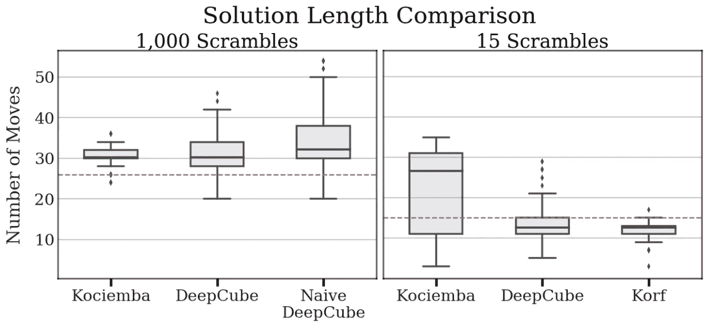***

# ***实施大纲***

***好了，现在让我们切换到代码，这里的[可用](https://github.com/Shmuma/rl/tree/master/articles/01_rubic)。在这一节中，我将简要介绍我的实现和关键的设计决策，但在此之前，我必须强调有关代码的要点，以建立正确的预期。***

*   ***我不是研究人员，所以，这段代码的最初目标只是重新实现本文的方法。不幸的是，这篇论文中关于所用的精确超参数的细节非常少，所以，我需要猜测和实验很多，但我的结果仍然与论文中发表的结果非常不同。***
*   ***同时，我试图用一种通用的方式来实现所有的东西，以简化进一步的实验。例如，关于立方体状态和转换的确切细节被抽象出来，这允许通过添加新的模块来实现更多类似于 3x3 立方体的谜题。在我的代码中，实现了两个立方体:2x2 和 3x3，但是任何具有固定可预测动作集的完全可观察环境都是可以实现和试验的。细节将在下一小节中给出。***
*   ***代码的清晰性和简单性被放在了性能的前面。当然，如果有可能在不引入太多开销的情况下提高性能，我会这样做。例如，通过将加扰立方体的生成和前向网络传递分开，训练过程加速了 5 倍。但是，如果性能要求将所有东西都重构为多 GPU 和多线程模式，我宁愿保持简单。一个非常生动的例子是 MCTS 进程，它通常被实现为一个共享树的多线程代码。它通常会获得数倍的速度提升，但需要进程间的微妙同步。所以，我的 MCTS 版本是串行的，只对批量搜索进行了微不足道的优化。***

***总体而言，该代码由以下部分组成:***

1.  *****立方体环境**，其定义了观察空间、可能的动作以及网络状态的精确表示。这部分在`[libcube/cubes](https://github.com/Shmuma/rl/tree/master/articles/01_rubic/libcube/cubes)` [模块](https://github.com/Shmuma/rl/tree/master/articles/01_rubic/libcube/cubes)中实现。***
2.  *****神经网络部分**，描述我们将要训练的模型、训练样本的生成和训练循环。它包括[训练工具](https://github.com/Shmuma/rl/blob/master/articles/01_rubic/train.py)和  `[libcube/model.py](https://github.com/Shmuma/rl/blob/master/articles/01_rubic/libcube/model.py)` [模块](https://github.com/Shmuma/rl/blob/master/articles/01_rubic/libcube/model.py)。***
3.  *****立方体的求解器**，包括[求解器工具](https://github.com/Shmuma/rl/blob/master/articles/01_rubic/solver.py)和`[libcube/mcts.py](https://github.com/Shmuma/rl/blob/master/articles/01_rubic/libcube/mcts.py)`。***
4.  *****各种工具**用于粘合其他部分，如带有超参数的配置文件和用于生成立方体问题集的工具。***

## ***多维数据集环境***

***正如我们已经看到的，组合优化问题是相当大和多样的。即使是立方体拼图的狭窄区域也有几十种变化。最受欢迎的是 2x2x2，3x3x3，4x4x4 拉比克魔方，Square-1，Pyraminx 和其他[吨](https://ruwix.com/twisty-puzzles/)。同时，本文提出的方法非常通用，不依赖于先验知识、动作数量和状态空间大小。对该问题的关键假设包括:***

*   ***环境的状态需要是完全可观测的，并且观测需要将状态彼此区分开来。当我们可以看到所有面的状态时，立方体就是这种情况，但对于扑克的大多数变体来说，例如，当我们看不到对手的牌时，这种情况就不成立。***
*   ***动作的数量需要是离散的和有限的。我们可以对立方体做的动作是有限的，但是如果我们的动作空间是“将方向盘旋转α ∈ [-120 …+120 ]”,我们在这里有不同的问题域。***
*   ***我们需要一个可靠的环境模型，换句话说，我们必须能够回答这样的问题“将动作 *a* 应用到状态 *s* 会有什么结果？''.否则，ADI 和 MCTS 都不适用。这是一个强烈的要求，对于大多数问题，我们没有这样的模型，或者它的输出非常嘈杂。另一方面，在像国际象棋或围棋这样的游戏中，我们有这样一个模型:游戏规则。***
*   ***此外，我们的域是确定性的，因为应用于相同状态的相同动作总是以相同的最终状态结束。我有一种感觉，即使我们有随机行为，方法也应该有效，但我可能是错的。***

***为了简化方法在不同于 3×3 立方体的域中的应用，所有具体的环境细节都被移动到单独的模块中，通过抽象接口`CubeEnv`与代码的其余部分进行通信
，抽象接口`CubeEnv`在这里可用[。每个环境都有一个名称，应该指定该名称来表示要使用的环境的具体类型。目前，实现了两种不同的环境:名为`cube3x3`的经典立方体 3x3x3 和名为`cube2x2`的较小立方体 2x2x2。](https://github.com/Shmuma/rl/blob/master/articles/01_rubic/libcube/cubes/_env.py)***

***如果你想实现你自己的立方体或者完全不同的环境，你所需要做的就是按照接口实现它，并注册它以供其余的代码使用。***

## ***培养***

***培训过程在工具`[train.py](https://github.com/Shmuma/rl/blob/master/articles/01_rubic/train.py)` 和模块`[libcube/model.py](https://github.com/Shmuma/rl/blob/master/articles/01_rubic/libcube/model.py)`中实施。为了简化实验并使其可重复，所有训练参数都在单独的 ini 文件中指定，该文件指定了以下训练选项:***

*   ***要使用的环境名称，目前有`cube2x2`和`cube3x3`，***
*   ***运行的名称，用于张量板名称和目录中以保存模型，***
*   ***将使用 ADI 中的什么目标值计算方法。我已经实现了其中的两个:一个是在论文中描述的，我的修改，从我的实验来看，有更稳定的收敛，***
*   ***训练参数:批量大小、CUDA 的使用、学习速率、LR 衰减和其他。***

***你可以在 repo 的 `[ini](https://github.com/Shmuma/rl/tree/master/articles/01_rubic/ini)` [文件夹中找到我实验的例子。
在训练期间，参数的张量板度量被写入`runs`文件夹。具有最佳损失值的模型被保存在`saves`目录中。](https://github.com/Shmuma/rl/tree/master/articles/01_rubic/ini)***

## ***搜索过程***

***训练的结果是具有网络权重的模型文件。这些文件可用于使用 MCTS 解决立方体问题，这在工具`[solver.py](https://github.com/Shmuma/rl/blob/master/articles/01_rubic/solver.py)`和模块`[libcube/mcts.py](https://github.com/Shmuma/rl/blob/master/articles/01_rubic/libcube/mcts.py)`中实现。***

***规划求解工具非常灵活，可用于多种模式:***

1.  ***解决一个以逗号分隔的动作索引列表形式给出的单个被打乱的立方体，在`-p`选项中传递。例如`-p 1,6,1`是通过应用第二个动作，然后第七个动作，最后再次应用第二个动作来加扰的立方体。动作的具体含义是环境特定的，通过`-e`选项传递。您可以在多维数据集环境模块中找到带有索引的操作。例如，立方体 2x2 的动作`1,6,1`意味着`L,R',L`变换。***
2.  ***从文本文件中读取排列(每行一个立方体)并解决它们。文件名通过`-i`选项传递。文件夹`[cubes_tests](https://github.com/Shmuma/rl/tree/master/articles/01_rubic/cubes_tests)`中有几个示例问题。您可以使用`[gen_cubes.py](https://github.com/Shmuma/rl/blob/master/articles/01_rubic/gen_cubes.py)` 工具生成自己的问题集。***
3.  ***生成给定深度的随机扰码并求解***
4.  ***运行一系列越来越复杂(加扰深度)的测试，解决它们并将结果写入 csv 文件。该模式通过传递`-o`选项启用，对于评估训练模型的质量非常有用。但是这可能需要很多时间来完成。可选地，产生具有那些测试结果的图。***

***在所有情况下，您都需要使用`-e`选项传递环境名称，并使用模型的权重(`-m`选项)传递文件。此外，还有其他参数，允许调整 MCTS 选项和时间或搜索步骤的限制。***

# ***实验结果***

***正如我已经提到的，我不是一名研究人员，所以，这项工作的最初目标是重新实现论文中的方法，并对其进行试验。但是，该论文没有提供关于该方法的非常重要的方面的细节，如训练超参数，在训练期间立方体被打乱的深度，获得的收敛性等。为了了解细节，我给论文作者发了一封电子邮件，但从未收到他们的回复。***

***因此，需要进行大量的实验，但我的结果仍然与论文中发表的结果大相径庭。首先，原始方法的训练收敛性很不稳定。即使学习率很小，批量很大，训练最终也会出现偏差，因为价值损失部分会呈指数增长。这种行为的例子如下图所示。***

***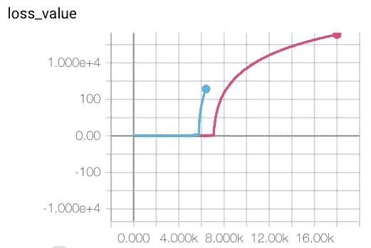******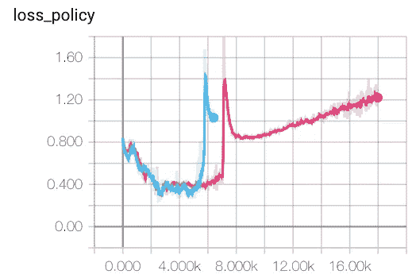***

***经过几次实验，我得出结论，这种行为是方法中提出的错误价值目标的结果。
的确，在公式 vᵢ = maxₐ(v(s，a) + R(A(s，a)))中，网络返回的值 *v(s，a)* 总是加到实际奖励 *R(s)* 中，即使对于目标状态也是如此。这样，网络返回的实际值可以是:-100，10⁶或 3.1415。这对于神经网络训练来说不是很好的情况，特别是对于 MSE 值目标。***

***为了检查这一点，我修改了目标值计算的方法，为目标状态指定零目标:***

***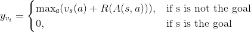***

***通过指定 param `value_targets_method=zero_goal_value`，而不是默认的`value_targets_method=paper`，可以在 ini 文件中启用该目标。***

***通过这个简单的修改，训练过程更快地收敛到由网络的值头返回的稳定值。下图显示了收敛的示例。***

***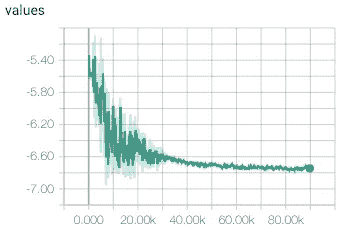******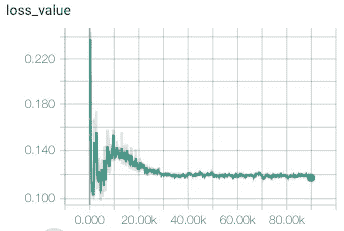******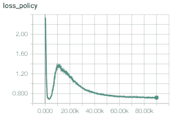***

## ***立方体 2x2***

***在论文中，作者报告了在一台带有三个 Titan XP GPUs 的机器上进行 44 小时的训练。在训练期间，他们的模型已经看到了 80 亿个立方体状态。这些数字对应于每秒大约 50000 个立方体的训练速度。我的实现在单个 GTX 1080Ti 上显示 15000 立方/秒，这是可比较的。所以，要在单个 GPU 上重复训练过程，我们需要等待差不多 6 天，这对于实验和超参数调优来说不太实用。***

***为了解决这个问题，我实现了一个简单得多的 2x2 立方体环境，训练只需要一个小时。为了重现我的训练，repo 中有两个 ini 文件:***

*   ***`cube2x2-paper-d200.ini`采用价值目标法阐述、***
*   ***`cube2x2-zero-goal-d200.ini`对于目标状态，目标值设置为零。***

***两种配置都使用 10k 状态的批次和 200 的加扰深度。训练参数是相同的。***

***训练结束后，使用两种配置，生产了两个模型
(两者都存储在[repo](https://github.com/Shmuma/rl/tree/master/articles/01_rubic/models/cube2x2)):***

*   ***账面方法:亏损 0.18184，***
*   ***零目标法:亏损 0.014547。***

***我的实验(使用`solver.py`工具)表明，损失较低的模型有更高的成功率来解决增加深度的随机排列的立方体。两种模型的结果如图所示。***

***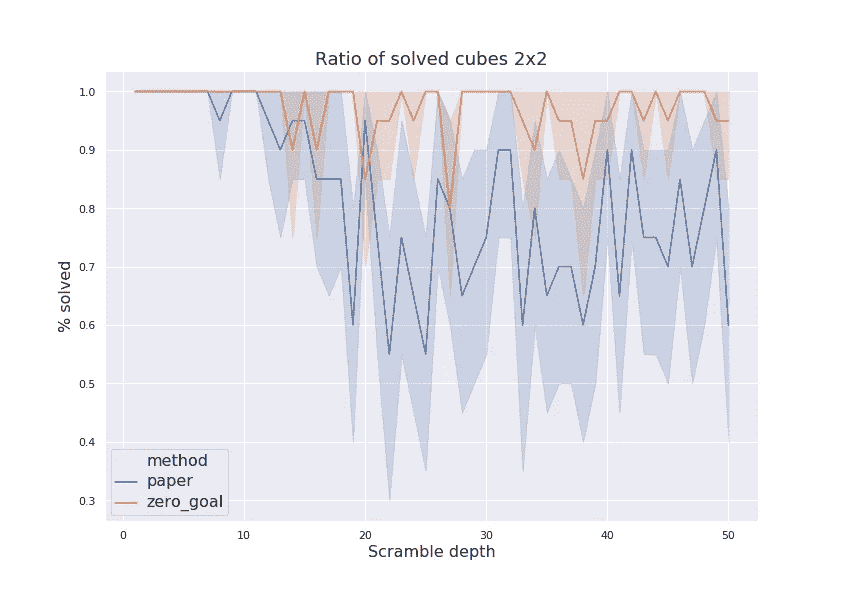***

***下一个要比较的参数是求解过程中完成的 MCTS 步数。如下图所示，零目标模型通常在较少的步骤中找到解决方案。换句话说，它学到的政策更好。***

***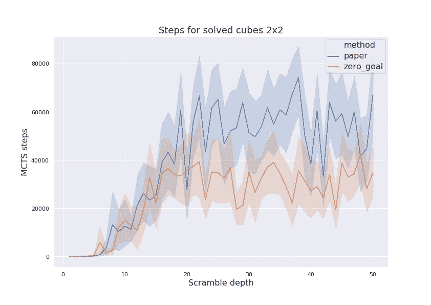***

***最后，让我们检查找到的解决方案的长度。在下图中，绘制了原始解和 BFS 解的长度。从这些图中可以看出，原始解的长度比 BFS 发现的解长得多(10 倍)。这种差异可能是可以改进的未调谐 MCTS 参数的指示。“零目标”模型比“纸上”模型显示更长的解决方案，因为前者根本找不到更长的解决方案。***

***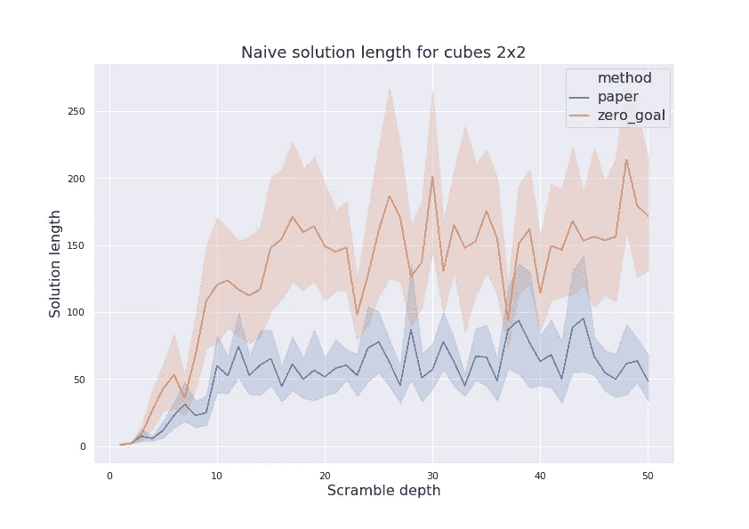******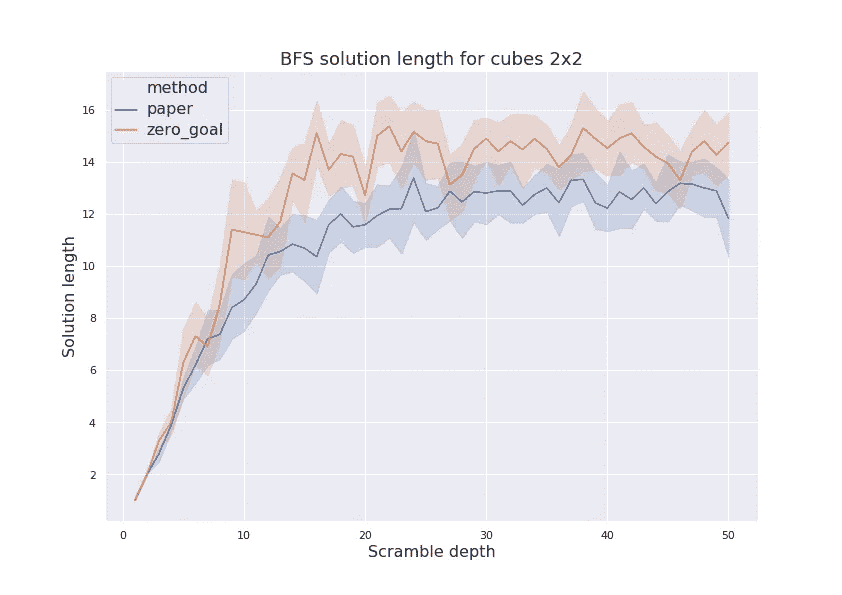***

*****立方体 3x3*****

***3x3 立方体模型的训练要繁重得多，所以，可能我在这里只是触及了表面。但是即使是我有限的实验也表明
对训练方法的零目标修改极大地提高了训练的稳定性和最终的模型质量。但是现在训练需要大约 20 个小时，所以，进行大量的实验需要时间和耐心。***

***我的结果并不像论文中报道的那么好:我能得到的最好的模型可以解决 12…15 的立方体，但是对于更复杂的问题总是失败。或许，这些数字可以通过更多的 CPU 内核+并行 MCTS 来提高。为了获得数据，搜索过程被限制在 10 分钟内，并且对于每个加扰深度，产生五个随机加扰。***

***下图显示了论文中提出的方法与目标值为零的修改版本的解决率的比较。***

***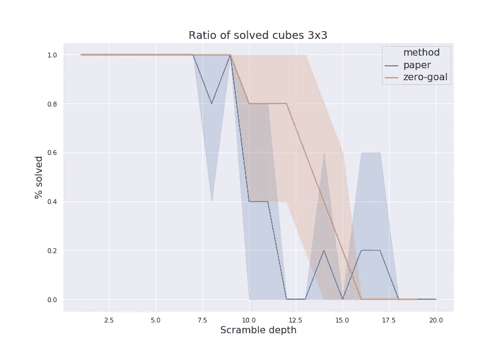***

***最后的数字显示了找到的最优解的长度。这里有两个有趣的问题值得注意。首先，“零目标”方法在 10…15 加扰深度范围内找到的解的长度**大于加扰深度**。这意味着模型未能找到用于生成测试问题的加扰序列，但仍然发现了一些更长的方法。另一件事是，对于深度范围 12…18，“paper”方法找到了比加扰序列短的解决方案。这可能是因为生成了退化的测试序列。***

***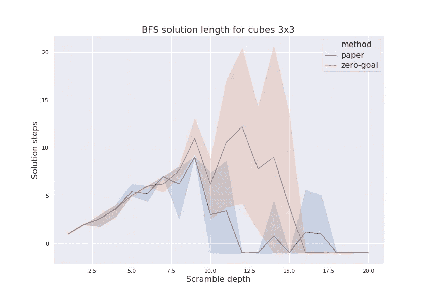***

# ***进一步的改进和实验***

***有很多方向和事情可以尝试，使结果更好。我突然想到:***

*   ***更多的投入和网络工程。立方体是一个复杂的东西，因此，简单的前馈神经网络可能不是最好的模型。网络可能会从卷积中受益匪浅。***
*   ***训练过程中的振荡和不稳定性可能是步骤间相关性的常见 RL 问题的信号。通常的方法是*目标网络*，当我们使用旧版本的网络来获得引导值时。***
*   ***优先重放缓冲器可能有助于训练速度。***
*   ***我的实验表明，样本加权(与加扰深度成反比)有助于获得更好的策略，知道如何解决
    轻微加扰的立方体，但可能会减慢更深层状态的学习。或许，这种权重可以被调整，以使其在以后的训练阶段不那么咄咄逼人。***
*   ***熵损失可以被加入到训练中来规范我们的政策。***
*   ***立方体 2x2 模型没有考虑到立方体没有中心立方体，因此，整个立方体可以旋转。这对于 2x2 来说可能不是很重要，因为状态空间很小，但是同样的观察对于 4x4 立方体来说将是至关重要的。***
*   ***当然，需要更多的参数调整来获得更好的训练和 MCTS 参数。***

***感谢你阅读这篇文章！我将很高兴在评论中听到你的意见。[本文的 PDF 版本](https://www.dropbox.com/s/5e0202qtv5ynw3u/01_rubick_cube.pdf)也有。***

## ***来自 DDI 的相关故事:***

*** [## 数据科学和软件工程哪个更有前途？

### 大约一个月前，当我坐在咖啡馆里为一个客户开发网站时，我发现了这个女人…

medium.com](https://medium.com/datadriveninvestor/which-is-more-promising-data-science-or-software-engineering-7e425e9ec4f4)  [## 用 7 个步骤解释深度学习

### 和猫一起

medium.com](https://medium.com/datadriveninvestor/deep-learning-explained-in-7-steps-9ae09471721a)***