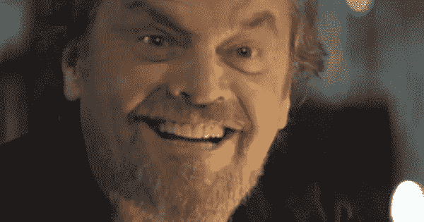

# 强化学习:走向基于情绪的行为系统

> 原文：<https://medium.datadriveninvestor.com/reinforcement-learning-towards-an-emotion-based-behavior-system-73e833c1ba75?source=collection_archive---------5----------------------->

本文介绍了一个基于情感的行为系统的概念，它适用于包括机器人和视频游戏角色在内的具身智能体。此处提供伴随视频:[https://www.youtube.com/watch?v=y_ZLmpLML_4](https://www.youtube.com/watch?v=y_ZLmpLML_4)

[*亚伦·克鲁明斯*](mailto: aaron.krumins@gmail.com) *是 AI 相关软件的自由开发者。*

随着机器人、视频游戏角色和其他人工智能的创造者努力追求更高程度的真实性，理解情感在人类和动物行为中的作用将变得越来越重要。

情绪通常被认为是向他人传达我们内心状态的一种方式。然而，一群神经科学家最近的工作揭示了情绪在战略决策中发挥的复杂作用，特别是向我们自己发出信号，表明我们对可用行动的感受(Antonio R. Damasio，2005)。这种“躯体标记假说”认为，情绪对于指导人类决策至关重要，在对应于强化学习类型的快速直觉决策过程中至关重要。因此，一个更现实、更逼真的决策系统，无论是机器人、视频游戏 NPC 还是其他化身代理，都必须对情绪以及它们如何与代理的决策系统交互做出全面的说明。

关于强化学习范式，考虑一下大脑在知道给一个习得的策略和一个随机的策略多少权重时的困难？像“我对目前的工作有多满意，或者寻求与新公司结盟会不会更好？”很少有容易量化的解决方案。当我们问自己这些困难的问题时，我们可能会从我们的情绪中寻找一些方向，一些直觉会指引我们正确的方向。许多神经科学家现在认为，我们的情绪可能在一定程度上是为了指导这样的决定而进化的，以此向我们自己发出信号，表明我们对我们可以采取的行动的可能结果有多么自信。因此，情绪可能在强化学习范式中有其进化起源。代尔夫特大学的研究人员 Joost Broekens、Elmer Jacobs 和 Catholijn M. Jonker 已经在开发快乐、痛苦、希望和恐惧的数学结构方面取得了重大进展(Joost Broekens，2015 年)。这些情感方程为精心制作一个行为系统提供了一个起点，这个行为系统基于在人类和其他动物身上看到的*功能等同的*情感。

情绪的一个好处是，它允许我们沿着一个梯度比较决策。当我对我可以采取的行动感到非常强烈的恐惧时，我的直觉强化学习系统会发出信号，表明对该特定行动的坏结果有高度的信心。如果决定是采取一种开发行为还是一种探索行为，这种感觉的梯度也可以引导一个人做出有更好结果的选择。如果我对现有的选择没有任何强烈的情绪，也许探索性的选择会比开发性的选择更好。这一逻辑已经被几项强化学习研究证实，这些研究表明，配备有测量其自身“情绪不确定性”的方法的 RL 算法比使用简单的ε-贪婪方法来进行探索-开发权衡的算法表现得更好。因此，除了向我们自己发出关于不同策略的积极或消极联系的信号，情绪可能是指导我们探索-开发权衡的机制的一部分。最后，情绪也可以在系统 1 直觉决策和系统 2 基于模型的推理之间的转换中发挥作用。也就是说，当我们质疑自己的情绪，发现我们对可供选择的特定选择真的没有任何强烈的“直觉”时，我们可能会决定从系统 1 切换到系统 2 决策。也就是说，我们可能会从快速的情绪决策转变为使用成本收益分析等模型，费力地总结各种选择的利弊。虽然这里概述的行为系统不包括基于模型和无模型强化学习之间的这种切换机制，但希望未来的版本会这样做。

在这个基于情绪的行为系统的概述中，我们将对实现进行一个高层次的浏览，该实现目前在虚幻引擎 4 游戏开发平台中可用，并可从 [UE4 市场](https://www.unrealengine.com/marketplace/artificial-intelligence-emotions)获得。虽然对强化学习和 Q 学习的详细理解并不是利用这个人工智能情感系统所必需的，但这将是非常有用的。更重要的是，整个情绪蓝图是建立在目前虚幻市场上可用的 Q 学习实现之上的，因此熟悉这些蓝图可能会有助于理解情绪行为系统。我不会详细介绍 Q 学习的核心逻辑，它可以从 [Q 学习包](https://www.unrealengine.com/marketplace/artificial-intelligence-q-learning)中获得，但是，我会尝试弄清楚 Q 学习与 AI 情感系统交互的元素。

强化学习应用于人工智能情感系统的一个重要方面是，代理将他们的时间分配给两种活动——探索和利用。在探索过程中，代理收集有关其环境的信息，并对状态动作对进行价值判断，在这种情况下，通过一个称为 Q 学习算法的方程。在探索了一定的时间后，它使用已经积累的关于状态动作对的值判断来确定在开发阶段的最佳动作过程。在勘探/开发权衡的标题下，在勘探和开发之间转换的机制和比率已经成为许多研究的主题。在这里的人工智能情感系统中，控制转换的机制是智能体情感状态的函数，即智能体对**不确定性**的感觉。

**将情绪状态映射到强化学习信号**

强化学习为代理提供了一种基于过去的经验和未来的期望对状态动作对进行价值判断的方法。然后，代理可以使用这些价值判断来确定战略上有利的决策。为了进行这样的值评估，代理使用误差信号，该误差信号对应于状态动作对的期望值和状态动作对发生后的实际值之间的差。期望是基于过去的经验，而新的数据是由当前的经验提供的。因此，代理人基于其当前的经验不断更新期望，然后利用这些来展望未来并做出新的期望。形成这些期望的机制是下面给出的 Q 学习算法，因为它与情绪系统有关:

Q(状态，动作)= R(状态，动作)+ Gamma * Max[Q(下一个状态，所有动作)]

其中 Q(S，A)是来自 Q 表的状态动作对，R(S，A)是来自奖励表的状态动作对，gamma 是未来的贴现率，Max[Q(下一个状态，所有动作)]是一个预测项，它捕捉未来一步的最佳状态动作对的期望值。代理人因此向前看，以决定如何评价现在。这反过来允许它使用逆向归纳法将未来收到的一些奖励分配给将它带到目标状态的状态动作对，从而想出一种为这些中间步骤赋值的方法。

如果我们假设情绪直接对应于价值判断和环境刺激，我们可以将情绪状态映射到强化学习信号，并进而使用这些情绪状态来帮助指导剥削探索权衡。这是一个双向系统。在这种情况下，我们将使用 Q-learning 算法来创建对**快乐、痛苦、希望、恐惧、满意、沮丧和不确定**的情绪的映射。代尔夫特大学的[研究已经验证了类似的设计，表明这种方法复制了人类情绪的心理和行为动态。虽然人类拥有比这里提供的更广泛的情感，但希望这将为未来增加人工智能情感系统提供一个有用的起点。](https://pdfs.semanticscholar.org/22db/ceee742c019455dfc1a65397fe1b8dee1f3a.pdf)

**建模快乐与痛苦**

快乐和悲伤是人类婴儿最先出现的情绪，很可能在许多其他哺乳动物中也有相似的推论。我们对快乐和痛苦的定义是基于由 Ortony，Clore 和 Collins 首创的 OCC 情绪模型(Ortony et al. 1988)。在 OCC 模型中，快乐被体验为一件令人满意的事情带来的快乐，而痛苦被体验为一件令人不快的事情带来的不快。从 Q 学习的角度来看，这些是有用的定义，因为我们已经有了被分类为“奖励”和“惩罚”的状态动作对(当在环境中遇到的奖励是负的时)。)

虽然简单地将快乐作为环境中任何奖励的一个函数很有诱惑力，比如拿起一个弹药包或获得一个健康奖励，但情况要复杂得多。快乐不仅与代理人对奖励的体验有关，还与其对奖励的期望有关。正如法国人所说，“爱情中最精彩的部分是上楼的第一步”。很多时候，我们可能更喜欢对回报的期待，而不是回报本身。快乐也关键取决于我们来自的前一个状态。如果我处于一个高价值状态，然后转到一个稍低的价值状态，这可能会与从一个极低价值状态转到这个第二好的位置有很大的不同。也就是说——快乐也是我如何评价我之前状态的一个函数。最后，我们知道奖励重复得太频繁，会失去它的光彩。也就是说，我们习惯了奖励，而每次我们得到奖励时，它产生的快乐越来越少。综上所述，我们可以从数学上将其概念化为:

Joy =(来自环境的回报+我们对该回报的期望值-我们对之前状态的期望值)*一个不确定性项，表示我们对当前状态行动对将产生回报的信心水平。我们越不确定，它带给我们的快乐就越多。

现在，结合 Q 学习，我们可以用 Q 学习的等价物来替换上面 joy 等式中的几个术语:

Joy = (R(状态，动作)+ Q(状态，动作)-Q(前一状态动作对的状态，动作)*意外项

人们如何计算意外项并没有一致的意见。对于这里介绍的人工智能情感系统，我使用了当前 SA 对的先前误差的平均值。随着这种误差的平均值随着重复试验而降低，代理人对 SA 对的结果变得更加“自信”,因此从随之而来的任何奖励中获得的快乐减少。

到目前为止，我们还没有提到痛苦，它实际上不需要额外的计算，因为它和快乐是完全一样的，但当快乐方程的结果是负的时就会发生。这可能是因为代理人在环境中遇到了负奖励(也称为惩罚)，或者它已经从高 Q 值状态移动到相对较低的状态。

**模拟希望和恐惧**

在快乐和痛苦之后，希望和恐惧是人类婴儿接下来要表现的情绪。如果我们假设希望和恐惧需要预期积极和消极的结果，那么从概念的角度来看，这种出现的顺序是有意义的。为了预测希望或恐惧，一个人必须首先对将要发生的快乐或痛苦的结果有一些概念。希望和恐惧分别是对奖励和惩罚的预期。OCC 的情绪模型将希望定义为由期望事件的前景产生的快乐，将恐惧定义为由不期望事件的前景产生的不快。就像快乐和痛苦一样，希望和恐惧是一枚硬币的两面。从 Q 学习的角度来看，它们也更容易计算。希望是一个状态动作对在完成之前的期望值，而恐惧是一个状态动作对在被认为有负面结果(惩罚)时的期望值。带着希望和恐惧，我们展望未来，期待着预期的结果，基于我们以前的经验，这正是强化学习的目的。因此，这是强化学习框架的自然结果，该框架使用期望来形成价值判断。从数学上讲，希望和恐惧可以从 Q 学习算法中推导出来:

希望= Q(状态，行动)在问题中的 Q(状态，行动)完成之前

恐惧= Q(状态，行动)在 Q(状态，行动)完成之前，当 Q(S，A)为负时

与快乐和痛苦不同，希望和恐惧不会习惯，而是会重新绽放，无论这种经历重复多少次。并不是额头上的一滴水让一个人发疯。在中国的水火炬中，我们可以习惯于几乎任何快乐或痛苦的感觉。更确切地说，是对下一滴水的预期让一个人发疯。我们不习惯于恐惧或希望。然而，恐惧倾向于自我消除，因为代理人将选择性地避免将来导致它的这种状态动作对，而希望是自我增强的，因为代理人将一次又一次地寻找有希望的经历。

**建模不确定性**

包括人类在内的许多哺乳动物都会表达不确定感。虽然它不是 OCC 模型中定义的一种独特的情绪，但作为一个工作定义，我们可以将其描述为对决策结果的信心或缺乏信心的感觉。在这里介绍的人工智能情感系统中，它表现为我们对一个状态动作对的结果的预测的置信度。因此，我们可能充满希望和确定，或充满希望和不确定，或恐惧和不确定，或恐惧和确定。从这个意义上说，它给我们的预测增添了色彩，给了它们一个置信度。这不同于对应于状态动作对的预期 Q 值的希望或恐惧的值。

对于人工智能情感系统来说，不确定性有两种计算方式。一方面，我们对特定国家行动对的结果有一定程度的把握。它是我们预测国家行动对结果的历史准确度的函数。在这种情况下，我们取历史误差的平均值，并对最近的误差取平均值。虽然这个不确定性术语可以用来为我们的希望和恐惧计算增加另一个维度，但我们却用它来模拟快乐和痛苦的习惯化。也就是说，快乐和痛苦会随着我们对其结果的确定程度而消散。我对积极的结果越有把握，它给我的快乐就越少。考虑一下老虎机——正是这种不确定性让支付的快乐变得如此值得。如果每次我玩独臂大盗的时候，我都能非常确定地预测接下来会发生什么，这个游戏就会变得很无聊。总而言之:

局部不确定性=(特定 Q(S，A)历史误差的平均值+该 Q(S，A)的最近误差)/ 2

不确定性建模的第二种方式是作为一个术语，它说明了代理人对整个环境的不确定性的总体感觉，代理人在这个环境中进行战略决策。一个人在某个特定的行动中可以感受到很高的总体信心水平，但仍然对自己做出好决策的总体能力感到不确定。他们的全球信心可能很高，但他们的本地信心可能很低，反之亦然。对不确定性的第二次计算是代理迄今为止经历的所有预测误差的平均值。因此，它反映了代理的专业知识的总体感觉。正是这个术语作为一个反馈信号对于指导主体的 Q 学习策略，即探索/利用的权衡是至关重要的。在每个状态动作对之后，代理人必须决定是进行探索性移动还是开发性移动，我们可以将这个决定与他们的全局不确定性水平联系起来。不确定性越多，代理人探索的就越多。它越确定，它花在开发上的时间就越多。因此，情绪系统反馈到 Q 学习算法中，引导它向有利的方向发展。许多[研究](https://arxiv.org/ftp/arxiv/papers/1609/1609.01468.pdf)都采用了类似的方法，证明了这种情绪反馈系统的优势。出于我们的目的，我们将全球不确定性建模为:

全局不确定性=(到目前为止所有 Q(S，A)误差的总和/状态动作事件数)/最大误差程度* 100。

我们除以最大误差程度来标准化我们的结果，然后乘以 100 得到一个介于 1 和 100 之间的百分比。

然后，我们可以通过从 100 中减去该全局不确定性值来设置利用阈值，并使用随机数生成器和条件> =语句来控制代理在探索和利用之间移动的频率。

利用阈值= 100 —全球不确定性水平(所有误差的平均值)

**建模满意度和挫折感**

在对满足感和挫折感建模时，我们稍微偏离了 OCC 的情感定义。虽然在 OCC 模型中，满足和它的对立面“恐惧被证实”被认为是希望和恐惧的不同类型，但我相信它们与快乐和痛苦有更多的共同点。换句话说，满足和挫折是快乐和痛苦的必然结果，只是它们发生在强化学习的开发阶段，而不是探索阶段。也就是说，当我们根据过去的经验做出战略决策时，结果要么是令人满意的，要么是令人沮丧的。这与我们采取探索性行动形成对比——在新事物上掷骰子，结果不是快乐就是痛苦。

为了理解这背后的直觉，回想一下你第一次骑自行车的时候，当你第一次成功踩下踏板时，那种恐惧变成了兴奋。根据这里使用的定义，这种情绪是快乐，因为这种行为是探索性的，没有先例。将这与在自行车上成功跑了一两圈后的感觉进行对比。在每一次成功的插曲后，人们会感到*满足*，因为行动不再是探索性的，而是依靠过去的经验来指导行为。它现在有一个先例，我们正在利用这个先例作出剥削性的决定，导致满意或沮丧。就我们如何体验满足和挫折而言，在所有其他方面，它们与快乐和痛苦相似。这两种情绪都主要取决于我们之前所处的状态，这种感觉在特定情况下重复的频率，以及我们对这种状态动作对的预期值。

虽然这与以前的一些满意和沮丧的定义有很大的不同，但我相信这是一个明智的定义，并导致人工智能的情感更容易识别和直观。

**部署情绪行为系统的一些注意事项**

AI 情感系统在这里部署的背景是一个与样本谜题匹配的[游戏，其中 NPC 学习到它必须在灯亮的同时激活游戏环境中的一个开关，以便在另一个位置接收“食物奖励”。类似的谜题已经被广泛用于探索工具性和联想性学习能力的动物学习实验中。关键点是，代理人必须学会预测，它只能在特定的情况下采取行动来获得奖励，在这种情况下，当灯亮着，它首先触摸到一个开关，由圆锥指示，然后前进到一个金色球体指示的食物碗。绿灯熄灭时采取的相同行动不会产生奖励。情绪是在它从与这个环境的互动中获得回报的背景下表现出来的。](https://en.wikipedia.org/wiki/Match-to-sample_task)

在这个例子中，我们需要一个 8 乘 8 的数组用于奖励表和 Q 表。每个表中的第一个值是指代理可能处于的 8 种状态之一，由 3 个球体和 1 个圆锥体给出。这 4 种状态中的每一种都可以在灯亮或关的情况下存在，所以在数字上这等同于 8 种不同的状态。第二个值指的是代理从该状态开始采取的动作，换句话说，就是 NPC 下一步要去的位置。

因此，如果代理处于状态 4(圆锥)并随后移动到状态 7(食物碗)，它将引用 R(4，7)和 Q(4，7)分别为 reward 和 Q 表给出的状态-动作对。请记住，Q 表将根据 Q 学习算法在匹配样本任务期间更新，而奖励表在游戏期间保持不变。除了一个奖励状态动作对，即 R(4，7)之外，奖励表用值 0 初始化。Q 表用全 0 初始化。

**代理动态**

配备了人工智能情感系统的代理最初将花时间专门探索他们的环境，即采取随机行动。他们在发现环境中的任何奖励或惩罚之前的情绪是中性的，如中性表情符号所代表的。在偶然发现奖励后，在这种情况下，在锥体激活后的食物碗，代理的不确定感将迅速减少，它将开始利用它的新发现的知识，往返于食物碗。这种最初的不确定性的快速下降代表了由游戏中几个中性状态动作对的成功预测所产生的错误信心。相对于光线、锥体和喂食碗，代理人对环境的奖赏结构还没有强烈的感觉。因此，这段时间之后通常会有一个短暂的不确定性增加的时期，因为代理人会对食物碗、灯、锥体组合做出几个不正确的预测。这种短暂的不确定性峰值慢慢减弱，随着代理人做出越来越正确的开发性预测，这种不确定性逐渐趋向于零。尽管失去了所有的满足或快乐，希望仍将存在。

虽然使用情感系统的代理通常会比使用其他探索/开发转换方法的代理更快地收敛到环境的全局解决方案，但这是以中介迷信为代价的。在这种情况下，你可能会注意到代理将一些不必要的行为纳入其开发策略，而没有意识到它们是“迷信”。因为探索永远不会完全归零，这些最终会被淘汰。这也与人类决策的数据相一致。想想运动员赛前的仪式，包括穿一双幸运的袜子。

人们会注意到，代理人通常会在前往食物碗后立即表现出沮丧或苦恼，即使它通过立即返回锥体以再次激活食物碗而“正确地”行动。这是因为代理人正从一个高价值回报状态行进到一个相对较低的价值状态，产生了苦恼。这在直觉上是有意义的。在一次高峰体验之后，当人们从先前体验的高潮中“下来”时，通常会体验到更大的沮丧或厌倦感。其中一些可能归因于我们的情绪与强化学习系统的交互方式。

一段时间后，代理人将完全习惯于从食物碗中获得的满足感，并停止表现出任何情绪，即使它继续做出“正确的”开发决策。

在一个以惩罚为基础的环境中，事情会有些不同。通过给奖励表中的状态动作对一个负值，我们可以创造一种情境，在这种情境中，代理人感到痛苦和恐惧，但很快学会避免这种动作。随着进一步探索，不确定性减少，它将默认留在角落里，因为它知道留在一个地方确保它永远不会受到惩罚。

欢迎提出问题、评论或批评。