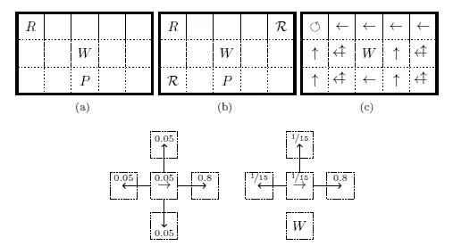
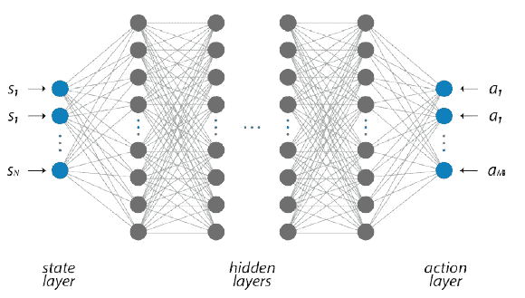
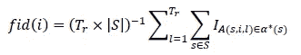
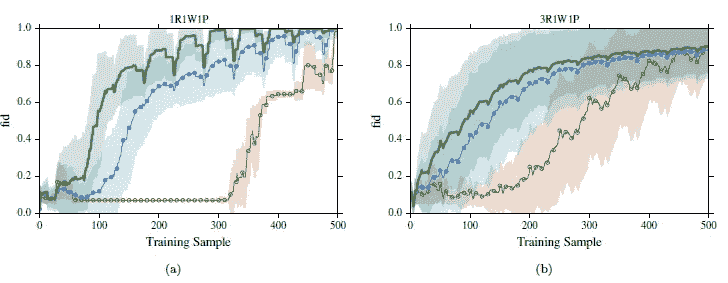

# 使用量子玻尔兹曼机器的强化学习

> 原文：<https://medium.datadriveninvestor.com/reinforcement-learning-using-quantum-boltzmann-machines-7949855d3dd?source=collection_archive---------0----------------------->

在这篇文章中，我们将涵盖第三篇论文，它讨论了使用量子玻尔兹曼机器进行强化学习。

在以前的文章中，我们解释了玻尔兹曼机器、强化学习和量子计算。如果你还没有读过它们，这里的是第一个的链接。如果你访问我的个人资料，你也会发现其他人。它们是有序的。

 [## 准备在 2019 年改变世界的技术-数据驱动的投资者

### 很难想象一项技术会像去年的区块链一样受到如此多的关注，但是……

www.datadriveninvestor.com](https://www.datadriveninvestor.com/2019/01/17/the-technologies-poised-to-change-the-world-in-2019/) 

原文可以在[这里](https://arxiv.org/pdf/1612.05695.pdf)找到。

在这篇论文中，他们**模拟了量子退火**，以证明在小问题中使用量子玻尔兹曼机器进行强化学习比使用经典机器更有好处。

如前所述，在之前的[文章](https://medium.com/@agus.bignu97/bayesian-networks-and-boltzmann-machines-in-reinforcement-learning-c4cd0c55f2e2?source=---------4------------------)中，我们谈到了强化学习和一种适用于执行 RL 任务的受限玻尔兹曼机器的算法。我们将涵盖一个类似的算法，但应用于 QBM。

有人提到，DBM 是一个更好的候选人来执行学习任务的强化比 RBM。优势之一是，根据研究，DBM 比 RBM 有更大的能力来模拟更高层次的关系。这可能是因为它们比 RBM 有更多的隐藏层和神经元。

在量子退火炉中实现的 DBM 的设计的一个重要优点是在其量子设计中量子位的接近和耦合类似于 D 波系统的计算机。这表明在不久的将来可以做出这些设计。这就是为什么我们没有在量子退火器中建造玻尔兹曼机器，而是假设网络本身就是未来量子退火器的天然连接结构。然后，使用数值方法，他们试图理解它在强化学习中的适用性。

通过这种方式，假设 DBM 的量子设计类似于 D-Wave 计算机的量子位结构，并使用 SQA 优化类似于伊辛模型的哈密顿量，他们继续将这种类型的技术应用于强化学习中的问题。

提出的一个问题是在一个网格中寻找最优路径。这是一个 2D 棋盘，类似于国际象棋，有 r 行和 c 列，我们的代理人可以在空间的四个方向(上、下、右和左)自由移动，见图 1。

Figure 1: 3x5 grid. W represents a wall, R represents a reward and P represents a penalty. Image taken from [1].

在图 1 中，您可以看到提到的网格。每个方框代表系统的一种状态，并包含一个值。可以是中性的，可以是奖励值(客观)，可以是惩罚，也可以是障碍。在图 1 (a)和(b)中，示出了网格的两个例子，并且在(a)的网格的解决方案中。

因此，该算法的主要目标是找到最适合问题解决方案的策略π。每个方框都有一个数值，正如前面所说，可以执行的动作有:𝑎∈ {↑，↓，↓，→，↺}.在建立的模型中，中性值为 100，奖励为 200，惩罚为 0。一个人在一种状态下必须考虑要采取的最佳行动，以达到预期的目标。后者正是前面提到的强化学习算法所关注的。研究了不同的算法，然后比较了每种算法获得的策略。

所用的算法非常相似，但应用于不同的玻尔兹曼机器:RBM、DBM 和 QBM。在第一部分中，它是在下一篇文章中介绍的算法，第二部分是在如图 2 所示的结构中实现的，其中输入层是状态，输出层是要采取的动作。

Figure 2: Deep Boltzmann Machine (DBM). Obtained from [1].

为了算法的比较，使用了保真度测量。在表达式(1)中，s 表示系统的状态集合，Tr 表示它们训练算法的次数，A(s，I，l)表示训练 l 中的指定动作，并且状态 s 和α*(𝑠的训练 I 的例子是最优动作集合。

(1)

在实验中，每个算法被执行 1440 次，并且对于每次执行，产生𝑇𝑠 = 500 个训练样本。在下图中，显示了由每个算法生成的策略的保真度的一些图形，以解决两个 3x5 网格。

Figure 3: comparison of the training results (fidelity curves) of the RBM-RL, DBM-RL and QBM-RL algorithms. Image is taken from [1].

在图 3 (a)中，算法在图 2 (a)的网格上执行。在图 3 (b)中，算法在图 2 (b)的网格上执行。从图像中可以清楚地看出，量子算法(其采样是使用 SQA 完成的)比经典算法要好很多。另一方面，正如我们在开始时说的，我们可以看到 DBM RL 大大超过 RBM RL，使 DBM 成为强化学习任务的更好候选。

在论文中，他们提到，随着网格的大小变得更大，RBM-RL 不再表现良好，但 DBM-RL 继续训练良好(数字类似于图表中的数字)。

应该提到的是，在 DBM-RL 算法中，使用了两种优化方法:模拟退火和 SQA。关于算法的结构，DBM-RL 与上面提到的文章中介绍的算法相同，但是具有更多数量的节点和层。另一方面，QBM-RL 与 DBM-RL 相同，但 D 波量子计算机的哈密顿量被优化(类似于伊辛模型)，参见算法转到[1]。

# 结论

在前三篇文章中，我们涵盖了三篇不同的论文，这些论文展示了量子计算在机器学习任务中的潜力。这三个问题的结构称为变分算法。

我们将在接下来的文章中更多地讨论这类算法。

敬请期待！

# 参考

[1] Daniel Crawford，Anna Levit，Navid Ghadermarzy，Jaspreet S. Oberoi 和 Pooya Ronagh，使用量子玻尔兹曼机器进行强化学习，[arXiv:1612.05695](https://arxiv.org/abs/1612.05695)[quant-ph]