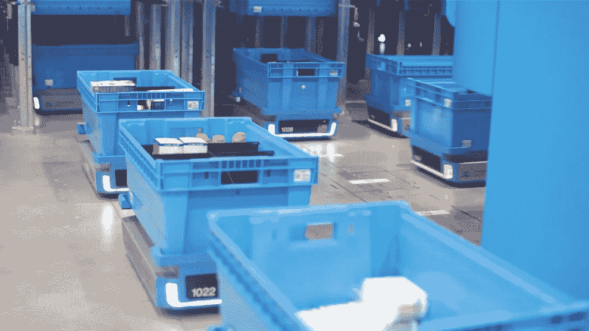
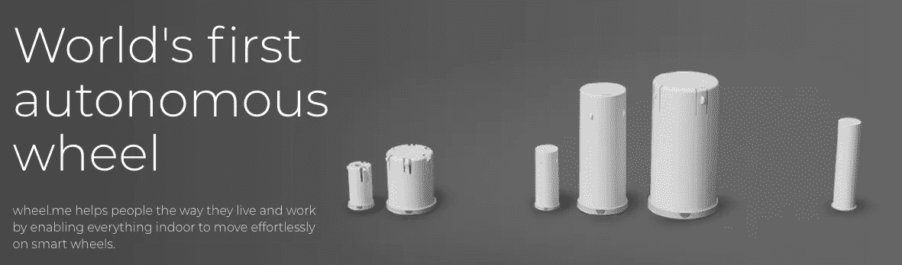
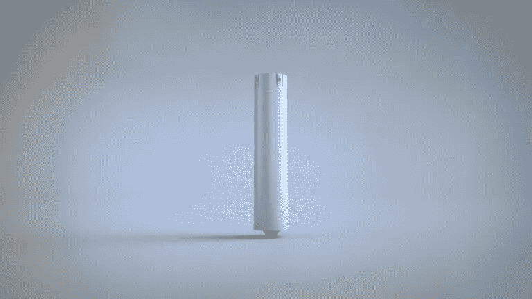

# 自主地重新发明轮子

> 原文：<https://medium.datadriveninvestor.com/reinventing-the-wheel-autonomously-40dbfbf9ba59?source=collection_archive---------18----------------------->

当我写这篇文章时，沃尔玛已经迎来了假日季，它的“早期交易”将于今晚午夜(黑色星期五前五周)上线。根据德勤的最新调查，由于超过一半的美国消费者喜欢电子商务而不是实体店，近 40%的人计划在万圣节前开始核对圣诞老人的清单。72%的互联网客户的一大驱动力是免费送货，这导致了整个大陆仓库的招聘和技术繁荣。

美国的物流是经济中增长最快的私营部门之一，在供应链、运输和分销投资方面产生了超过[1.6 万亿](https://www.wsj.com/articles/logistics-spending-jumped-11-4-on-strong-economic-growth-11560862800)美元的支出(接近 GDP 的 10%)。仅仓储管理系统(WMS)一项就占了 50 亿美元，这是由于网络履行需求的增长。ABI 研究公司在它的 [WMS 报告](https://www.abiresearch.com/press/e-commerce-explosion-will-generate-us5-billion-warehouse-management-system-market-revenue-and-57000-new-warehouses-globally-2025/)中指出:“电子商务市场的持续增长和客户期望的不断提高给仓库带来了巨大的压力，要求他们更快、更灵活地交付货物。这推动了对仓库设施、自动化技术和仓库管理系统的投资，以协调和优化运营。”

与 WMS 的增长几乎平行的是风险资本对这一类别的投资。今天早些时候，Fabric(以前的 Commonsense Robotics) [宣布](https://techcrunch.com/2019/10/23/fabric-raises-110-million-series-b-to-expand-its-network-of-automated-fulfillment-centers-in-the-u-s/)完成了 1.36 亿美元的 B 轮融资，此前一年筹集了 2000 万美元。该公司拥有一个部署“微履行中心”的平台，使用其专有的人工智能漫游车将货物在配送中心周围移动到人类员工手中。Fabric 首席商务官 Steve Hornyak 表示:“它(Fabric)使那些没有资源或基础设施来自行建立全新履行业务的零售商能够获得世界级的物流解决方案，从而实现有利可图的按需履行。”

 [## 模式和机器人:复杂的现实|数据驱动的投资者

### 哈耶克的名著《复杂现象理论》(哈耶克，1964)深入探讨了复杂性的话题，并断言…

www.datadriveninvestor.com](https://www.datadriveninvestor.com/2019/03/04/patterns-and-robotics-a-complex-reality/) 

这是一个受欢迎的消息，因为美国 40 万个仓库中有一部分是自动化的；2016 年估计只有 10%是全机械化的。一个很大的障碍是升级这些大型设施的成本，这些设施可能有三个足球场长，或者根据平方英尺的大小，需要 200 万至 2000 万美元的机器人。面料虽然便于专业零售，但仍然为市场颠覆敞开大门，特别是那些利用现有流程来控制自动化的创新者。

每个仓库都使用托盘在其设施内堆叠和移动货物，全球现有超过 20 亿个托盘，每年新增 5 亿个。随着更加环保的可重复使用塑料材料的采用，全球托盘市场预计将在未来五年内逐步增长至 250 亿美元。鉴于分销经理每天都在购买或租赁托盘，向现有存储平台添加廉价技术的价值主张可能会改变行业的游戏规则。这个想法是上周在纽约大学的[无尽前沿实验室](https://endlessfrontierlabs.com/)由 [wheel.me](https://wheel.me/) 的创始人 Atle Timenes 首次向我提出的。Timenes 给我留下了深刻的印象，他讲述了他的北欧初创公司如何计划重新发明一项有 5500 年历史的发明——轮子。

在与 Timenes 的进一步交谈中，他解释了顿悟的起源，“我们的旅程始于发明家 Rolf Libakken(他的联合创始人)在很短的时间内帮助他的家人搬家数次。移动重物时，一个明显的问题是，“为什么这些东西没有轮子？”发明了一种机械“点击轮”,很像圆珠笔的原理，也是 wheel.me 的第一个商业产品。“这种点拨轮脚轮发明于 2013 年，可以为任何静态物体添加手动滚动运动。几年后，Timenes 和他的团队升级了他们的专利解决方案，将电机、传动装置、电池和视觉传感器塞进了他们的圆柱形套筒中。与其他收费高达数千美元的机器人解决方案不同，wheel.me 提供每个轮子 10 欧元的适度月费。“wheel.me Genius”产品的月租费包括访问其仪表板的费用，该仪表板使非技术经理能够同步他们所有的车轮运动。从云中发送和接收定位和导航数据。该系统可以在 Wi-Fi 或本地网络上运行。为后端/云解决方案添加了数据科学功能，并采用了支持群体的技术 wheel.me 可以对大量对象执行协调移动，”Timenes 描述道。

wheel.me Genius 的总市场机会是巨大的，每月超过 1700 亿美元，因为每个托盘将包含 8 个脚轮。这位奥斯陆机器人专家解释道:“自动化正在迅速改变企业的面貌。尽管如此，早期采用可能导致影响财务、质量、安全和流程的风险。wheel.me Genius 降低了采用自动化技术的门槛，因为它的成本低了几个数量级，并且根据室内移动即服务模式收费，因此回报和投资回报(RoI)极具吸引力。”我向 Timenes 询问他计划如何与使用自动导向车(AGV)和自主移动机器人(AMRs)的大型竞争对手竞争，他反驳道:“现有的解决方案需要频繁的人工干预来装载/卸载和管理被提升、拖动或推动的物体。wheel.me 发现，已经安装了轮子(或者很容易安装轮子)的物体需要一个“轮子上的设备”(AGV 或 AMR)才能移动它们，这是违反直觉的。”他继续说道:“与颠覆性创新的经典描述一致，我们认为目前自动化室内移动和材料处理解决方案的供应商正处于一个为高端市场量身定制的性能轨迹上。基于传统的性能参数(功率、速度和提升能力)，wheel.me Genius 最初可能不如现有的竞争对手有吸引力，但他们会添加新的性能参数来完全改变竞争对手，在这种情况下，可以灵活地使任何物体智能并设置为自主运动，并且成本低几个数量级。”让任何物体变得智能可以包括任何有轮子的东西，从活动椅到停车系统到制造设备，再到(当然)数十亿个托盘。

天美时的乐观是基于斯堪的纳维亚机器人生态系统的日益重要性，该生态系统在今年夏天因一系列重大收购而成为头条新闻。6 月，美国私募股权公司 Thomas H. Lee 以 17 亿美元收购了 [AutoStore](https://www.businesswire.com/news/home/20190619005791/en/Thomas-H.-Lee-Partners-Announces-Acquisition-AutoStore) 。这家北欧公司被认为是机电物流领域的领导者之一，在 28 个国家拥有 11，000 台机器人。几个月后，总部位于丹麦的蓝海机器人公司收购了美国远程呈现领导者 [Beam 技术公司](https://www.therobotreport.com/beam-telepresence-robot-suitable-technologies-bought-blue-ocean/)。北欧有着自动化成功故事的历史，通用机器人公司和 MiR(移动工业机器人)成立，这两家公司今天都由上市公司 [Teradyne](http://www.teradyne.com/) 所有。哥本哈根的风险投资公司北欧之眼(Nordic Eye)是当地创业经济的主要支持者之一。用该公司首席执行官迈克尔·坦德鲁普的话说，“我第一次来这里的时候，我以为我可能会和一个结果是机器人的人握手！但是展出所有东西都是武装机器人。我其实有点失望。但我可以看到，这些协作部门正在将机器人技术从大型汽车原始设备制造商带入每家公司都能负担得起的领域。”本着我与 Timenes 讨论的精神，我相信没有什么比自动轮更有用(也更实惠)了。