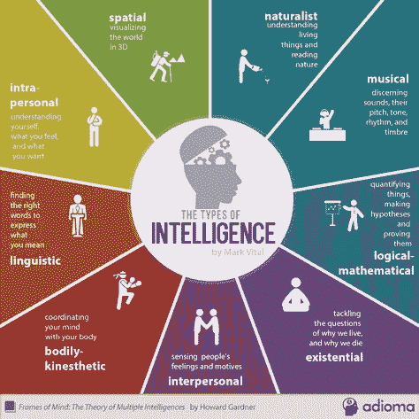
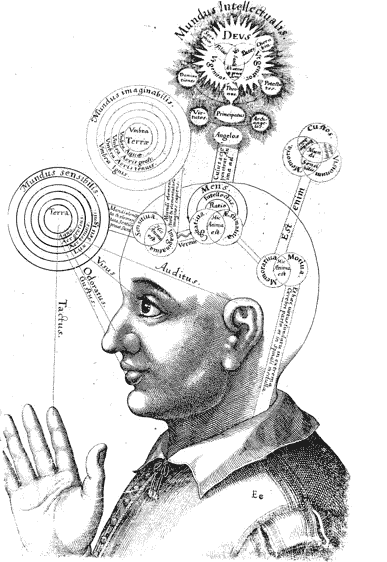
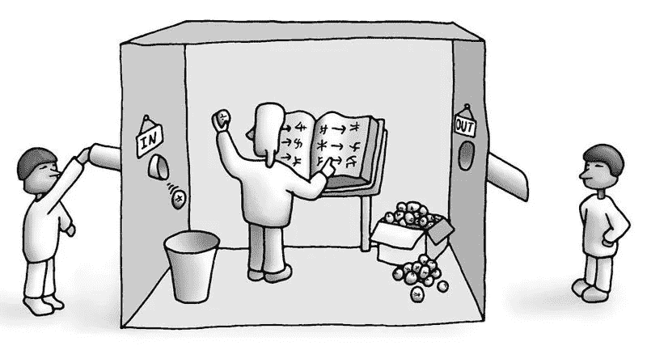
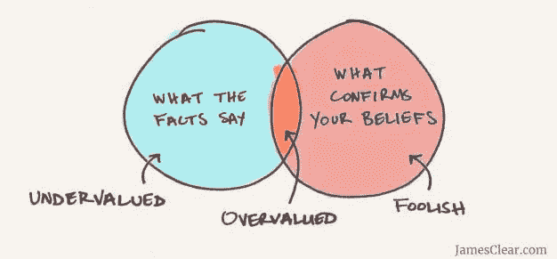

# 透明的可靠人工智能

> 原文：<https://medium.datadriveninvestor.com/reliable-artificial-intelligence-through-transparency-1954362aad01?source=collection_archive---------14----------------------->

介绍

1945 年，Vannevar Bush 在一篇重要的开创性文章*中，引入了“扩展人类经验”的概念，宣布了通过技术(memex 设备)共享学术知识的可能性。*

如今，人工智能是许多领域和背景中的热门话题。其中一个讨论点是关于 AI 后果和可靠性。但剩下的是，直到今天，人工智能系统是什么:计算系统。*我们用意识思维做的事情与任何可以通过计算实现的事情非常不同。*

为了以对人类有价值的方式使用人工智能，我们必须从系统透明性开始，建立信任关系。

什么是智能？(还有意识？)

《词汇词典》(2006)将智力定义为*“运用记忆、知识、经验、理解、推理、想象和判断来解决问题和适应新情况的能力。”*

尽管有很长的研究历史，智力仍然没有一个标准的定义，智力有许多定义，包括并侧重于特定的能力。即使我们只关注心理学的观点，我们也能看到不同的观点。

《实验心理学条约》( Pierre Oléron，让·皮亚杰，Barbel Inhelder e Pierre Gréco)涵盖了智力的多个方面，谈到了认知模式、包容、逻辑、直觉、行为方面、创造性、抽象等等。智力是同化的，它将所有给定的经验数据整合到它的框架中。。。]" J .皮亚杰

加德纳提出了多元智能理论，他认为所有人都有不同的智能。他还建议增加存在智能，即概念化或对人类存在敏感的能力。

*Figure 1: The Theory of Multiple Intelligence by Howard Gardner*

因此，智力可以用多种方式和多种能力来描述。然而，是否存在超越这些能力的东西呢？

Gadner 认为存在智能是一种特定的能力，但将这种能力扩展到每一个行动和感知，作为意愿或理解能力，它包含了智能的整体。这是人类**意识**超越智力。

我把它定义为你实现你想实现的任何目标的技能

根据斯腾伯格和罗杰·彭罗斯对智力的定义，智力需要对两种消极因素的理解或意识。感知)和主动(es。决定)方面。关于我们对世界的有意识体验的一个例子是对时间流逝的感知以及一首新歌的创作。

*Figure 2: Representation of consciousness from the seventeenth century by Robert Fludd, an English Paracelsian physician*

机器限制

在计算机科学中有多个关于意识领域。一些人认为这是一个随着技术发展而出现的特征，另一些人认为意识可能来自量子理论。但是有些物理学家和哲学家认为人类行为中有些东西是无法计算的。

*“无论是自顶向下还是自底向上，任何计算系统都有基本限制。”*【1】

正如彭罗斯在《T4》的《心灵的阴影》中所强调的，这并不意味着机器意识是不可获得的，而是它不在计算模型中。彭罗斯提出的是一种新的非计算行为，这并不意味着超越科学的东西，而是用当今的计算无法实现的东西。

*Figure 3: experiment: The Chinese Room*

考虑到机器的局限性，人类愿意决定机器必须如何行动。因此，人必须是决定如何使用机器能力的出发点。

只有让人们意识到机器的局限性和人的作用，这才有可能。需要一种信任关系来创建一种场景，在这种场景中，人们可以真正有价值地使用人工智能。

以人为中心的设计和透明度

如今，人们更多地关注数据和算法，而不是人的角色。识别人工智能系统中的**偏差**对于构建可靠且对人类有用的人工智能系统至关重要。

数据可能包含隐含的种族或性别偏见。这种偏见使得用户更难获得信任。同时，重要的是要认识到好的知识，并保持在特定领域有帮助的偏见。为了消除或引导偏见，用户和领域专家应该参与系统开发。

*Figure 4: Bias confirmation*

为信任而设计意味着我们对用户和系统如何工作的了解是透明的，如果需要，允许用户在一定范围内修改他们的数据。这样做，用户的有意识反馈可以改善机器学习。

利益相关者**参与**人工智能系统开发允许数据**清晰和控制**，打开“黑匣子”以理解计算结果和管理输入数据，创建利益相关者和开发者能够管理的透明机制。

*展示系统是什么，它是如何工作的，这是走向人们* ***信任*** *使用并最终改进系统的第一步。*【5】

通过澄清人工智能系统的领域和能力，我们可以让人们认为人工智能系统是支持，而不是取代他们的思维。这是研究人员和开发人员改变目标的思维转变，从人类开始，而不是从技术可能性和性能开始。

结论

随着新技术的出现，信任是决定其成功的一个重要因素，考虑到不清楚和放大的消息的数量，这对于人工智能来说尤其如此。

因此，在人工智能设计过程中，设计师必须分析人机交互以扭转这种趋势，并通过**可访问性**和**透明性**来**“扩展人类经验】**提供获取知识的新方式。

文献学

[1] [心灵的阴影对缺失的意识科学的研究，罗杰·彭罗斯](https://altexploit.files.wordpress.com/2017/07/roger-penrose-shadows-of-the-mind_-a-search-for-the-missing-science-of-consciousness-oxford-university-press-1994.pdf)

[2] [人工智能问责的艺术责任透明，为价值观而设计，2018](http://designforvalues.tudelft.nl/2018/the-art-of-ai-accountability-responsibility-transparency/)

[3] [人为因素是消除人工智能偏见的根本](https://www.chathamhouse.org/expert/comment/human-factor-essential-eliminating-bias-artificial-intelligence)

【4】[正如我们可能认为的，布什·万尼瓦尔，1945](http://worrydream.com/refs/Bush%20-%20As%20We%20May%20Think%20(Life%20Magazine%209-10-1945).pdf)

[5] [设计给人工智能带来什么，数据科学奖，布莱恩·罗默](https://towardsdatascience.com/what-design-brings-to-ai-b44bb3be181e)

[6] [智力定义集锦，谢恩·莱格、马库斯·赫特，2006](http://www.vetta.org/documents/A-Collection-of-Definitions-of-Intelligence.pdf)

[7]特拉塔托·迪·斯皮洛吉亚·佩利梅勒，L'intelligenza，皮埃尔·奥伦，让·皮亚杰，巴尔贝尔·因赫勒德和皮埃尔·格雷科

## 来自 DDI 的相关故事:

 [## 数据科学和软件工程哪个更有前途？

### 大约一个月前，当我坐在咖啡馆里为一个客户开发网站时，我发现了这个女人…

medium.com](https://medium.com/datadriveninvestor/which-is-more-promising-data-science-or-software-engineering-7e425e9ec4f4)  [## 用 7 个步骤解释深度学习

### 和猫一起

medium.com](https://medium.com/datadriveninvestor/deep-learning-explained-in-7-steps-9ae09471721a)