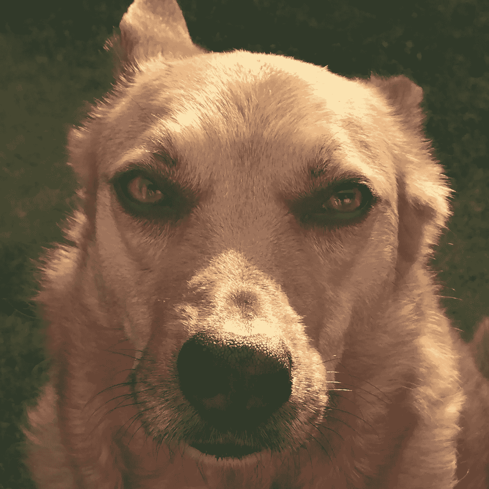

# 提醒我——我们到底为什么要这样做

> 原文：<https://medium.datadriveninvestor.com/remind-me-why-on-earth-did-we-do-this-f4f3fd4653a7?source=collection_archive---------14----------------------->

九年前，我们有了第一只狗。几个月后，这似乎是一个巨大的错误。

她是一只漂亮的杂交牧羊犬，我们从救助中心把它带回家的。每个见到她的人都会提到她美丽的眼睛…她充分利用了这一点。

最初几个月，一切都令人兴奋。

“早餐？！哦，哇——有史以来最好的事情！”

“去散步吗？哦，哇——有史以来最好的东西！”

“饼干？你开玩笑吧！最好的事情！”

在她看来，我们不会做错事。

带她去散步很有趣。我们要玩。她和其他狗一起到处跑。她追逐松鼠。我们和其他业主聊了聊。

每天都是。

每周都是。

每个月。

直到最后…出去散步似乎没那么有趣了。事实上，这感觉像是一件苦差事。

与其他业主的对话变成了点头致意。没什么新东西可说。

这只是“我们不得不做的事情”…每一天。

养狗吗？—我们在想什么？！这是一个疯狂的想法吗？

然后有一只新的狗出现在我们每天的林地散步。一只小狗。充满活力。带着不可抑制的能量四处跳跃。

这个可爱的快乐包提醒了我们最初几个月的感受。

为什么它现在看起来像一件苦差事？发生了什么变化？

只有一件事——这已经成了例行公事……几乎是机械的。

我们已经忘了当初为什么想要这条狗。

这就像是一个警钟，一种觉悟——我们有自由和选择去享受和我们可爱的宠物在一起的时光。当我们每天在树林中散步时，我们可以看到季节的变化。我们听啄木鸟。我们瞥见了鹿(速度太快，狗根本无法靠近)。

和日出！神奇。

这些东西一直都在那里…藏在显眼的地方。我们只需要“醒来”,记起我们当初为什么想要这条狗。

这看起来像是一个精神上的“诡计”,但并没有魔法——我们只需要记住我们的原因。

也许你也能感同身受？

当然，这不仅仅发生在狗身上——任何事情都会发生。

开始一段新的感情——开始时令人兴奋(希望是很长一段时间！)…然后(最终)，套路。

自己的事业也是如此。

那些令人兴奋、激动、紧张的最初几天、几周和几个月……最终变成了例行公事。

而且是套路害死生活。

是“例行公事”让我们变得“忙碌”…然而却没有开始时我们梦想的生活(或生活方式)。

赢得第一个客户令人激动。这是你可以创业的“证据”。

但是“例行公事”把它变成了一份工作…一份每天都很相似的工作。如果你不工作，你就没有报酬。

通常，这不是你创业时的想象。

也许不一定要这样继续下去？

也许我们可以改变常规？

也许记住我们创业的真正原因很重要？

这不仅仅是为了钱…是吗？

也许这也是关于自由的？

在这种情况下……会有什么阻碍呢？

现在是开始的好时机吗？

祝你们都 3f

克莉丝

(3f:财务安全、自由和成就感 3 个中的 2 个并不坏…但是“不坏”是所有可能的吗？)

 [## 新兴的宠物科技市场——数据驱动的投资者

### 在过去 15 年左右的时间里，花在宠物身上的钱翻了一倍多。仅在 2017 年，美国人就花费了超过 700 亿美元…

www.datadriveninvestor.com](https://www.datadriveninvestor.com/2019/02/21/the-emerging-pet-tech-market/)