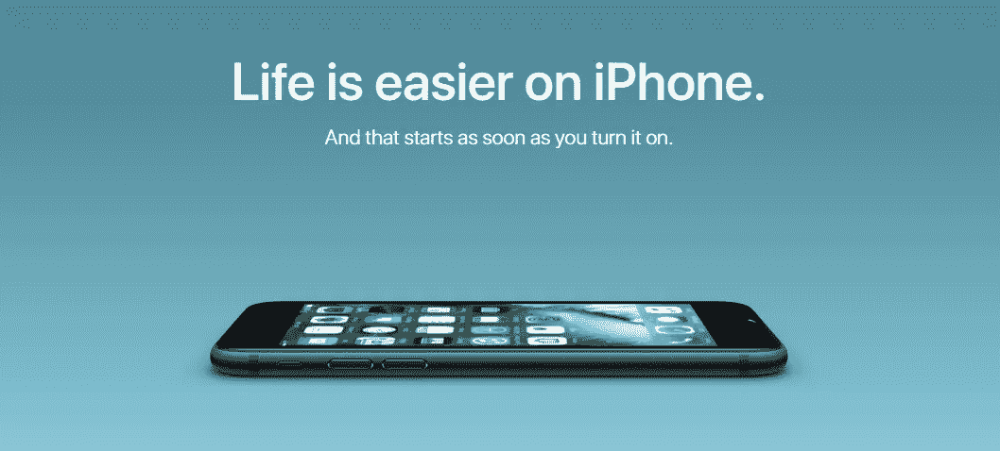

# 远程工作——据詹姆斯·邦德称

> 原文：<https://medium.datadriveninvestor.com/remote-work-according-to-james-bond-109bded0b8f6?source=collection_archive---------41----------------------->

## 如何在喝第一杯伯爵茶前造成伤害

Credit: [Eon Productions](https://www.eon.co.uk/)

你渴望在喝第一杯伯爵茶之前用你的笔记本电脑造成损害吗？还是[咖啡](https://magazine.crema.co/a-non-hipster-s-guide-to-brewing-amazing-hipster-filter-coffee-46a912e190ec)？或者你的果酱是什么？嗯，对你来说是个好消息— [远程工作正是你想要的](https://remoteyear.com/blog/what-is-remote-work)。

什么是远程工作？只要你有适当的技术，你就可以在家工作，在一个充满异国情调的小岛上工作(如果你有无线网络的话)，或者在你位于法国阿尔卑斯山中部的邪恶巢穴里工作。漂亮的[炸弹挖掘](https://www.urbandictionary.com/define.php?term=bomb%20diggity)，对吧？

在我看来，最棒的是你可以穿着睡衣工作。或者，最糟糕的情况是——如果你不得不进行视频通话——从腰部以上是商务，从腰部以下是派对。

*“远程工作真的能让你***完成多少事情？”*怀疑者问道。*

*很多。相信我。参考[詹姆斯·邦德](http://www.007.com/)中的 [Q](https://www.imdb.com/name/nm0924210/) 。还需要我多说吗？这个人显然是个天才，可以在滑雪缆车上达到疯狂的生产力水平。*

**

*Q in a ski lift, [**Spectre (2015)**](https://www.imdb.com/title/tt2379713/)**.***

*然而，即使你不是天才，你仍然可以穿着半睡衣完成大量工作。*

*目前，我(一个非天才)完全远程工作。我该怎么办？我做[文案](https://www.copyblogger.com/copywriting-101/)，还有社交媒体和[内容策略](https://contentmarketinginstitute.com/developing-a-strategy/)。*

**“文案？！但是你的语法太可怕了，”怀疑者回答道。**

*是啊，我知道。但是谁说完美的语法是吸引人的关键呢？没有人。看[苹果](https://www.apple.com/)。他们写作。像这样。*

**

*Credit: [Apple](https://www.apple.com/)*

*上面的内容对你来说像是完美的语法吗？不应该。因为它不是。*

*如果你是一名开发人员，你可以坐在沙滩上用你的笔记本电脑让 [*hella*](https://www.urbandictionary.com/define.php?term=hella) bank 工作。实际上，任何工作不需要协作体力劳动的个人都可以远程工作，包括营销人员、视频编辑、设计师、文案等。*

*现在，让我们来看看远程工作的好处。*

*   ***省钱哟。**由于不用支付租金或购买办公室，公司节省了资金。员工可以节省像汽油这样的旅行费用。*
*   *穿着睡衣。或者穿着半睡衣打视频电话。*
*   ***旅游机会增加。**这不就是大家想要的吗？[insta gram 上#digitalnomad](https://www.instagram.com/explore/tags/digitalnomad/?hl=en) 下有 180 万张照片。你想怎么做就怎么做。*
*   ***自由！既然你可以在任何地方工作，你就可以花更多的时间和你爱的人在一起。如果你决定在家工作，你甚至可以戴上面具。当然，如果你喜欢在外出时戴口罩，那就戴吧。***
*   ***生产率提高。这由你决定，但是省下的往返办公室的时间和精力可以用来完成更多的事情。***

**

*Credit: [Eon Productions](https://www.eon.co.uk/)*

*当然，偶尔可能不得不扣动扳机，也许是以参加像网络峰会这样的会议、团队静修或其他有利可图的活动的形式。但是每隔一段时间到野外去体验一些危险和魅力是很好的，对吗？*