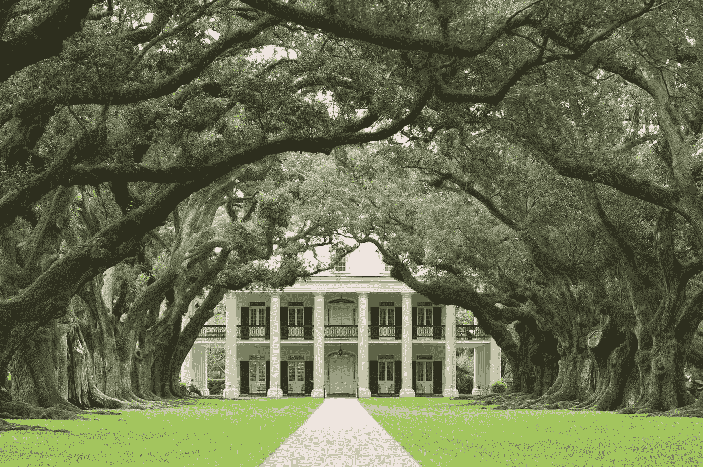
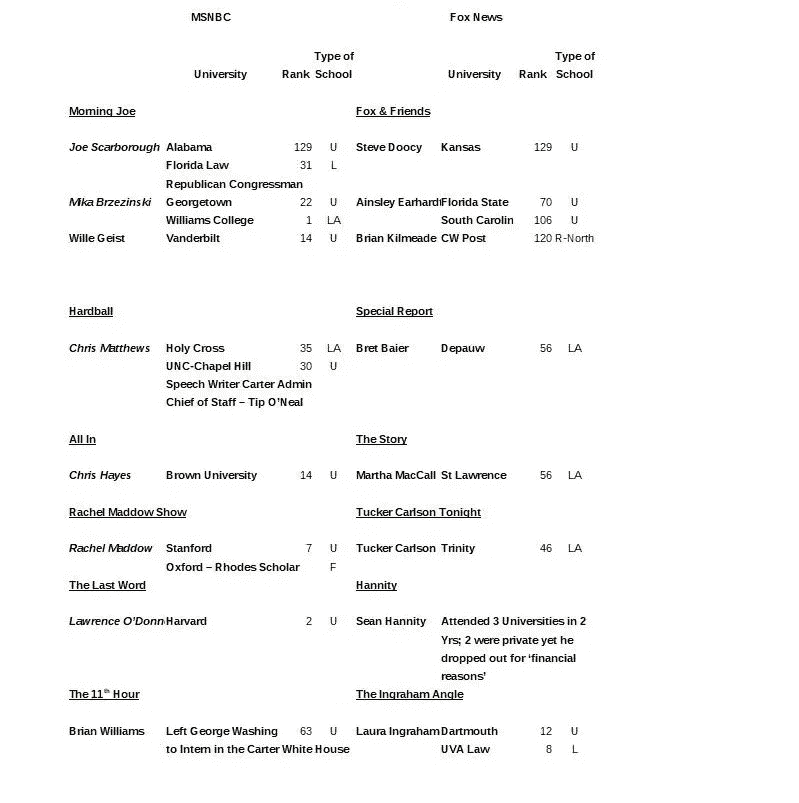
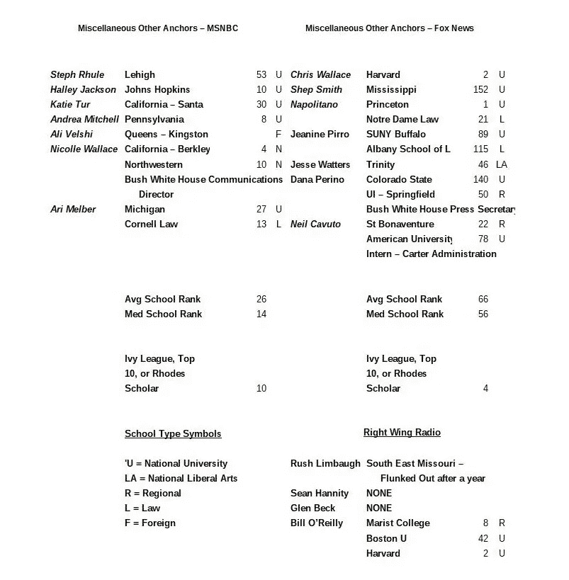

# 来自特朗普国家的报道:“新闻”如何帮助南方的特朗普

> 原文：<https://medium.datadriveninvestor.com/report-from-trump-country-how-the-news-helps-trump-in-the-south-64ef8a3367bf?source=collection_archive---------9----------------------->

这些维护特朗普世界观的极右翼电视和广播人物是谁？

Photo by [Ian Wagg](https://unsplash.com/@iwagg?utm_source=medium&utm_medium=referral) on [Unsplash](https://unsplash.com?utm_source=medium&utm_medium=referral)

这个故事是关于我观察到的特朗普南部选民的。我是一个在南方出生和长大的白人男性。这个故事讲述了我对“南方特朗普支持者”的注意，以及为什么这些人是特朗普的支持者。这些是一般性的观察。有很多南方白人鄙视川普。我们只是人数不够。

# 南方白人特朗普支持者分析

特朗普的选民并不是单一类型的。从我的经验来看，每个白人种族主义者都是特朗普的选民。这些人不会做像焚烧十字架这样明显的事情。这些人认为“黑人”很懒，靠政府生活，因此，靠他们缴纳的税款生活。他们还认为“黑人”是暴力罪犯。这些人在“混合公司”中不表达他们的种族主义者的观点。他们是隐蔽的种族主义者。过去，即使周围只有其他白人，这些人也不太喜欢表达自己的观点。自 2015 年特朗普开始加大他的荒谬言论以来，我注意到对非洲裔美国人和移民的蔑视超过了我一生中的任何时候。这种类型的特朗普支持者只有在特朗普开始向非洲裔美国人支付赔款时才会转而反对他。

 [## 保护主义、政治和经济动荡|数据驱动的投资者

### 美国股市昨日出现 400 多点的大幅反转，为未来的事情发出了警告信号。市场…

www.datadriveninvestor.com](https://www.datadriveninvestor.com/2018/06/28/protectionism-politics-economic-turmoil/) 

一般来说，南方特朗普的支持者都是非大学学历的白人。过去，这些人通过富有的虚构人物生活，就像老电视剧《达拉斯》(Dallas)中描绘的那样。如今，他们通过“成为共和党人”过着替代财富的生活。对这些人来说，共和党是富裕白人的政党。作为共和党人，他们是“俱乐部”的一部分。另一方面，对这些人来说，民主党是穷人和“黑人”的政党。民主党是那些想要在生活中“搭便车”的人的政党。这些人不想让他们缴纳的税款去帮助“那些懒人”。这些人只有在当地‘上层阶级’共和党人反对特朗普的情况下才会反对特朗普。他们不会投票给民主党人；他们就是不投票。

受过大学教育的南部特朗普支持者通常是白人企业主。这些人认为他们在特朗普的计划中有经济利益。如果经济出现明显恶化，这些人会转向特朗普。由于这些人“确信”减税和放松管制是处理经济的方式，温和的衰退可能不足以让这些人反对特朗普。这些人害怕高税收和监管。

特朗普选民担心民主党会试图从他们手中夺走他们的枪。特朗普的支持者害怕很多东西。他们认为移民会抢走他们的工作。他们认为“全球化者”正在向海外输出他们的工作。这些人中只有一部分人看右翼电视。如果他们观看一个右翼频道，即福克斯新闻频道，他们会确信他们一直是正确的，因为危险的商队正接近边境，意图入侵美洲。那些不看这些“新闻”频道的人要么从看新闻的朋友那里得到消息，要么从电台谈话节目中听到消息。一些人通过脸书获得消息。

# 特朗普的支持者和媒体

这些人把他们所谓的“主流媒体”视为没有常识的知识分子，因此不知道他们在说什么。通常，这些特朗普的支持者容易受到阴谋论的影响。他们认为‘主流媒体’提供假新闻，试图伤害特朗普，拿走他们的枪。这些人可以联系到他们在右翼电台和右翼电视上听到的内容。这些特朗普的支持者听到这些右翼媒体人物，认为他们正在证实这些人一直知道的事情。

这些右翼媒体人物和他们在自己的城镇里认识的人是同一类型的。有些人物被他们的观众崇拜。他们听这些人的，因为他们认同他们。我听过肖恩·哈尼蒂电台的部分节目。它以一首乡村歌曲开始。汉尼提一直住在我的家乡阿拉巴马州。他理解他的观众。阿拉巴马州的人们听他说话，毫无疑问地相信他所说的一切。不管有多荒谬，如果汉尼提说出来，那就是福音。

我经常在车里听右翼电台。我喜欢看政治光谱的另一面在说什么。我一直很惊讶，这些家伙不能做出一个从 A 点开始到 B 点的逻辑论证，而不采取某种毫无意义的疯狂循环。当我注意到 Hannity 和 Rush Limbaugh 引用了一个 1952 年的法令，关于一个我不记得的事情时，我决定检查一下，看看这些人是不是律师。我不相信特定的法令仍然像法典中的许多法令一样具有法律效力。这时我发现两个人都没有大学学位。

在继续之前，我要指出，我不是在谈论那些只相信减税、放松管制、自由贸易等的传统保守派。这些人就是不同意我。然而，他们通常提出一个连贯的论点。我说的是那些“疯子”,他们会说出各种各样有争议的愚蠢的话。这些“疯子”是极右分子。这些人似乎只是为了评级目的或为了支持特朗普的宣传目的，试图创造最荒谬的故事。最新的一种说法是“主流媒体”试图制造经济衰退，当然这是假新闻。最令人愤慨的是，AOC 想要拆除美国的每一栋建筑，重建每一栋建筑，同时禁止所有的航空旅行。

即使所有的宣传都针对这些人，大多数特朗普的支持者表示，他们不喜欢特朗普的推文。有些东西让这些人意识不到他的推特上的特朗普是真正的特朗普。这是人们在集会上看到的同一个特朗普。这就是我们在电视上看到最多的特朗普。这些特朗普的支持者不愿意相信他们投票给特朗普是错误的。极右翼消除了他们的恐惧。他们被告知，总统正在做他被选举出来要做的事情，他只是因为假新闻才显得疯狂。

如果特朗普是来自*大西洋*的航空公司飞行员，这些南方特朗普的支持者应该正在阅读[。这是一篇非常好的文章，讲述了如果特朗普担任任何其他职位，并开始自称为“天选之子”、“以色列之王”，或开始谈论“购买格陵兰岛”，会发生什么当然，我们还必须记住，特朗普取消了丹麦之行，因为他们不会与他谈论购买格陵兰岛的问题。前面提到的文章提出了一个问题，如果一名飞行员在你飞行的时候通过扬声器开始说这些话，你会有什么感觉？在任何其他行业，特朗普早就被撤职了。像往常一样，极端右翼媒体在那里向特朗普的支持者保证，特朗普很好，也许购买格陵兰岛是一个好主意。](https://www.theatlantic.com/notes/2019/08/if-trump-were-airline-pilot/596575/)

我决定看看几个右翼人士的教育和经验证书，以努力找出他们是否愚蠢，或者他们是否有意误导人民。我的结论是，在大多数情况下，这些右翼媒体人士就像他们的观察者/听众一样无知。有一些明显的例外。MSNBC 和福克斯新闻频道的教育/政治经历见下表。

All data for this table is from Wikipedia and US News & World Report

在上表中，斜体的名字是我听过的公开反对特朗普的名字。在表格的 MSNBC 一侧，注意只有威利·艾斯特没有用斜体显示。我几乎每天早上都会看《早间秀》。我不记得威利·艾斯特曾经说过任何人的坏话。威利似乎试图保持中立。MSNBC 的其他所有人都公开反对川普。他们是共和党人还是民主党人并不重要。你可以称之为对一个明显不合适的总统的“偏见”。很难理解有人会做出支持特朗普行为的严肃而明智的论点。作为题外话，请注意，乔斯卡伯勒和我共享同一所母校。我们的母校排名不是很高，但它有一支很棒的足球队！至于新闻和政治观点，我更喜欢看那些比我聪明的人。

我并不总是同意 MSNBC 评论员的观点，但我确实很重视他们的观点。**看福克斯新闻频道和听右翼电台的人似乎只想听到他们自己的观点被证实。这些人不希望他们的观点受到质疑。因为他们自己的观点被证实了，他们让自己接受了这些人提出的更极端的观点。**

看看表格中福克斯新闻频道的那一面，注意那些上过顶尖大学的人的名字都是斜体的，只有一个例外。克里斯·华莱士和安德鲁·纳波利塔诺确实偶尔会发表反对特朗普的言论。这两位记者都有常春藤联盟的学位。这些评论家采取了新闻诚信的立场。

劳拉·英格拉哈姆(Laura Ingraham)是教育程度最高的评论员不是特朗普的宣传者这一普遍规律的例外。英格拉哈姆女士显然很聪明。然而，她有不进行严肃辩论的历史。我第一次意识到英格拉哈姆女士是在我开车经过伯明翰的时候，当时我正在收听电台访谈节目。她在宣传她的书，《T4》和《奥巴马日记》这本书的封面看起来很讽刺。当我在广播里听到她的时候，她正在宣传这本书是真的。我怀疑“每个人都应该知道她在开玩笑。”没有免责声明，她的听众是那种会相信的人。亚马逊上的一位书评人这样评价她的书:'*我是里根共和党人，但这种废话不应该被当真。内容充其量是可笑的，前提是彻头彻尾的可笑，语气幼稚。我从未读过这本书。在收音机上，我记得，她刚刚发现了一个书里没有的新章节。这与米歇尔·奥巴马发表的令人发指的言论有关，这些言论完全不符合我们所知的这位前第一夫人的性格。*

英格拉哈姆女士写了一本完全是谎言的书。她在某种程度上免受诽谤，因为它可能属于讽刺作品的保护范围。由于奥巴马夫妇的善良，她可能更容易免受诽谤。《奥巴马日记》和周六夜现场的讽刺小品的不同之处在于，T2 的周六夜现场的讽刺小品显然是讽刺性的。所有人都知道亚历克·鲍德温不是唐纳德·川普。英格拉哈姆女士写的东西绝对和俄罗斯机器人在社交媒体上提供的假新闻一样令人发指。奥巴马的日记可以和[披萨门](https://en.wikipedia.org/wiki/Pizzagate_conspiracy_theory)阴谋归为一类。显然，正是这本书使劳拉·英格拉哈姆一举成名。现在，这个人是黄金时间福克斯新闻频道的个性。这是新闻学吗？这是一个已经表明她愿意编造事情的人。不幸的是，她并不是福克斯新闻频道唯一一个会瞎编的人。肖恩·哈尼蒂也属于这一类。

我不能谈论福克斯新闻频道的其他人。我唯一熟悉的另一个是塔克·卡尔森。许多年前，当他在 CNN 时，他看起来就像是另一个共和党人。他看起来不像汉尼提、英格拉哈姆、拉什·林堡等绝对疯狂的人。我听说过卡尔森的坏话，但没有亲眼目睹。

# 结论

创建福克斯新闻频道是为了向公众提供共和党的宣传。参见*滚石*的艾尔斯、尼克松和“让共和党上电视新闻”的计划。这是一篇非常好的文章，详细描述了罗杰·艾尔斯提供共和党宣传的历史。罗杰·艾尔斯是福克斯新闻频道的先驱，他为当地电视频道的新闻节目提供共和党的宣传。拥有一个提供片面观点的网络是合法的。不应该。直到 20 世纪 80 年代末，公平原则被废除，它才算合法。此后不久，拉什·林堡和后来的福克斯新闻频道出现了。伴随着这些单一的意见出口，华盛顿陷入了僵局。

这种片面新闻现象的真正危险直到 2010 年才显现出来。那一年，福克斯新闻频道积极报道了“茶党运动”这个所谓的爱国茶党与最初的茶党毫无共同之处。最初的茶党运动是关于“没有代表权的税收”。然而，这些 21 世纪茶党的伪装者不仅得到了充分的代表，而且通常来自国会中“代表过多”的地区，即较小的州。人们真的不知道他们在抗议什么。他们不想要奥巴马医改，但许多人喜欢患者保护与平价医疗法案。许多人不知道这是一回事。他们不想让他们的税收去帮助“那些懒惰的人”和外国人，但是这些人中的大多数并不是那些纳税多的人。

我不相信没有福克斯新闻频道的积极支持，茶党运动就不会成功。茶党是福克斯新闻频道第一次帮助人们形成一个反对许多福克斯新闻频道观众利益的激进运动。福克斯新闻频道为川普创造了条件。没有福克斯新闻频道，川普可能永远不会当选。曾经的茶党现在变成了特朗普党。如果不是福克斯新闻频道，川普现在可能已经下台了。

时至今日，我认识的大多数关注极右翼电台和收看福克斯新闻频道的人都认为穆勒的报告证明川普没有任何不当行为。他们都害怕即将入侵美国的“大篷车”。他们怀疑民主党人想把无神论强加给他们。他们认为民主党人试图使圣诞节在政治上不正确。我可以列举出这些福克斯新闻频道观众更多荒谬的想法。或许这样的清单会在另一个故事里。

认为拥有单一观点的媒体渠道是正常的想法需要在左翼和右翼都结束。在追求收视率的过程中，这样一个单一的意见出口总是需要变得越来越离谱，以保持相关性。结果是在我们的社会规范中出现了极端主义的空间。最起码，出格的评论需要规范。否则，我们的国家将继续分裂。