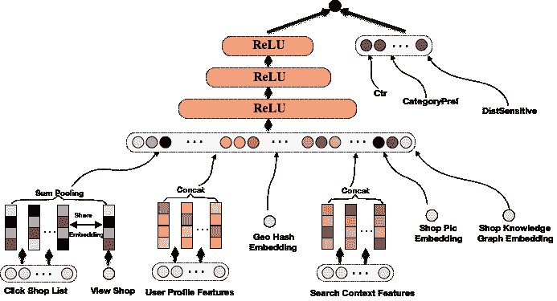

# 用数据科学的方式表示电子商务网站的用户和产品。

> 原文：<https://medium.datadriveninvestor.com/represent-users-and-products-in-a-data-science-way-for-e-commerce-website-22d7dbc24c33?source=collection_archive---------6----------------------->

了解客户是电子商务网站成功的关键，而使用数据驱动的方法是更好地了解客户需求的最佳方式之一，从而为客户提供更好的购物体验。所以关键问题来了:如何用数据科学的方式来代表客户？在其他方面，如何使用客户数据来代表客户，并在机器学习/深度学习模型中喂养他们？一个好的客户代表可以应用在很多地方:

*   客户细分
*   客户终身价值
*   预测模型，如 CTR 预测、CV 预测、流失率预测，甚至其他用例，如购物车放弃率降低等。

这些应用程序可以用于搜索、推荐、电子邮件营销、特别优惠等团队。知道了好处之后，问题是，怎么做？

正如我们所知，计算机只能理解数字，因此我们需要一个向量来显示客户的人口统计特征、品牌偏好、购物历史、类别亲和力等。所以我建议将向量的不同部分连接起来，作为最终的表示。

表示总是可以通过 AB 测试来改进，作为开始，这里是我关于如何构建第一个版本表示的初步想法，包括:

1.  最近 10 款 PDP 产品的嵌入
2.  最近 3 次购买产品的嵌入
3.  最近 5 次嵌入添加到购物车产品
4.  来自用户搜索术语的嵌入
5.  用户配置文件功能

*   帐户创建时间
*   上次登录时间
*   去年登录的次数
*   上个月登录的次数
*   性别
*   地理信息
*   最后一次购买的金额
*   终生平均购买价格为美元
*   评论数量
*   设备类型

structure of representation of customers

上一部分提到的产品嵌入是另一个要考虑的事情，这里我建议混合使用基于内容的特性和客户参与特性。

(1)文字特征:来自项目标题和描述中的自由文字。首先训练一个项目类别分类器，将文本映射到类别，然后提取这个分类器的顶层作为文本项目表示。该分类器是卷积神经网络架构的变体，使用在网站上预先训练的 word2vec 模型。

(2)图像特征:通过训练模型从其图像预测项目标题而生成。标题通过上面提到的 word2vec 模型投射到单词嵌入中。使用标题而不是类别对图像进行分类。损失:预测标题嵌入和真实标题嵌入的 MSE。

(3)来自*2vec 的基于行为的项目表征:word2vec 背后的关键原理是这样一个概念，即一个词的意义可以从它的上下文中推断出来——它周围倾向于什么词。更抽象地说，文本实际上只是一个单词序列，一个单词的意思可以从序列中该单词前后的单词中提取出来。因此，在线用户活动的时间序列为从上下文推断含义提供了同样的机会。也就是说，**随着用户对不同内容的浏览和交互，可以从**前后用户所交互的内容来推断出一段内容的抽象品质。这允许我们基于购物者经常按顺序购买相关商品的假设，应用词向量模型来学习产品的嵌入。用户的购买顺序也可能反映了购物者的品味——喜欢商品 A 的购物者也倾向于喜欢商品 B，并且对两者都感兴趣。就像**单词嵌入**革新了自然语言处理一样，条目嵌入也革新了推荐。我相信当应用这种技术时，我们肯定能看到 CTR/CVR 的巨大提升。