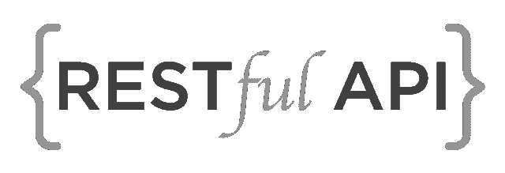
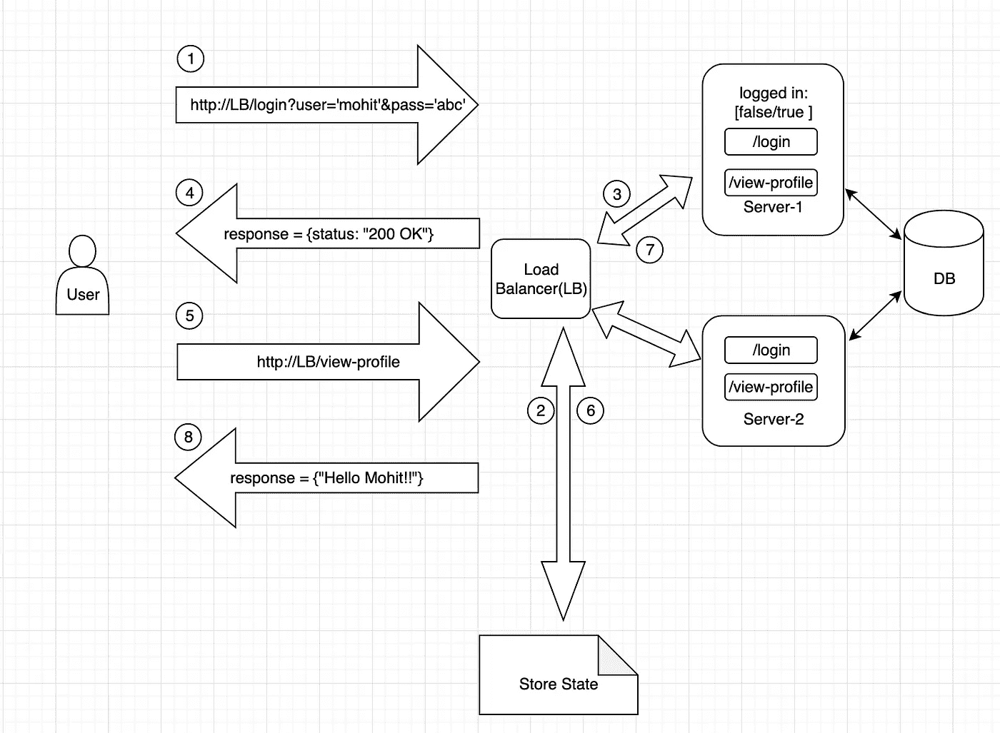
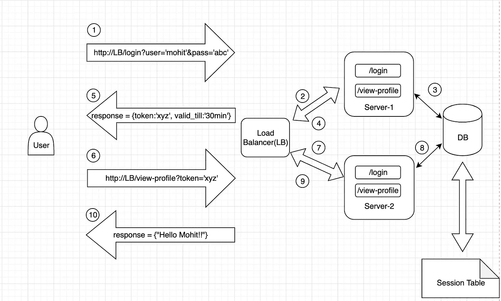
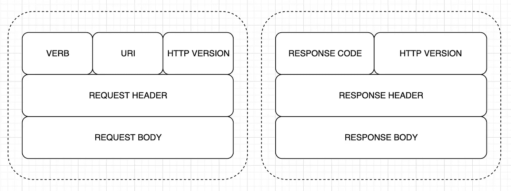

# 表述性状态转移(RESTful) Web 服务

> 原文：<https://medium.datadriveninvestor.com/representational-state-transfer-restful-web-services-61105d5a67f5?source=collection_archive---------2----------------------->

# 网络服务

> 用最通俗的术语来说，web 服务是通过 WWW/HTTP 进行通信的客户机和服务器应用程序。

现在客户机和服务器都可以用不同的语言编写，运行在完全不同的平台和框架上。比如服务器可以用 Java 写，客户端可以用 Ruby 写。那么，它们是如何相互交流的呢？

 [## 雅虎财经 API |数据驱动投资者的 6 种替代方案

### 长期以来，雅虎金融 API 一直是许多数据驱动型投资者的可靠工具。许多人依赖于他们的…

www.datadriveninvestor.com](https://www.datadriveninvestor.com/2019/02/25/6-alternatives-to-the-yahoo-finance-api/) 

这就是 web 服务的用武之地。Web 服务通过使用诸如 HTML、XML、WSDL 和 SOAP 之类的开放标准，为客户机和服务器之间的互操作提供了一种标准方法。

例如，通过 Web 服务，Windows 服务器可以与 Linux 服务器进行交互，或者通过万维网(WWW)向计算机桌面、笔记本电脑或智能手机以及其他移动设备提供应用程序。

# Web 服务的类型

1.  **大型网络服务**使用遵循简单对象访问协议(SOAP)标准的 XML 消息，SOAP 是一种定义消息架构和消息格式的 XML 语言。
2.  **RESTful Web 服务**是一种设计网络应用的架构风格。它依赖于**无状态**、**客户机-服务器架构**，通常是 HTTP。在 REST 架构风格中，客户机和服务器通过使用标准化的接口和协议来交换资源的表示。它将服务器对象视为可以创建或销毁的资源。

# 有状态与无状态系统

**无状态系统:**无状态系统可以看作是一个黑匣子，在任何时间点，输出的值只取决于输入的值。

从并行编程的角度来看，如果实现得当，无状态系统可以由多个线程/任务同时执行，而不会出现任何并发问题。

**有状态系统**:有状态系统可以看作是一个盒子，在任何时间点，输出值都依赖于输入值和内部状态值。

因此，基本上，一个有状态的系统就像一个具有“记忆”的状态机，因为相同的一组输入值可以根据系统接收到的先前输入生成不同的输出。

一个有状态的系统需要多个执行线程以独占的方式访问和更新系统的内部状态，因此需要一个序列化[同步]点。

让我们借助一个基本的认证序列来理解有状态和无状态架构。假设一个用户想在某个网站上查看他的个人资料。

**有状态系统:**

1.  用户发送 [http://IP_of_LoadBalancer？用户='mohit' &密码='abc'](http://IP_of_LoadBalancer?user='mohit'&password='abc') 。这个请求发送到负载平衡器。
2.  状态存储数据库维护会话密钥，并用于确保来自同一用户的请求到达同一服务器。因此，负载平衡器第一次创建了一个条目，类似于“来自用户的所有请求都应该发送到 server-1(假设)”。负载平衡器选择服务器，并将登录请求仅重定向到 server-1。
3.  Server-1 接收请求，通过查询 DB 来验证凭证，如果用户确实是他所说的那个人，那么 server-1 将 logged_in 标志标记为 true。所以 logged_in 实际上是在维护状态。Server-1 将请求发送回负载平衡器
4.  负载平衡器将响应返回给用户。
5.  现在用户发送[http://IP _ of _ Load Balancer/view-profile](http://IP_of_LoadBalancer/view-profile)到负载平衡器
6.  负载平衡器从状态存储中获取哪个服务器将处理来自用户的请求。(即 server-1)并将请求重定向到它。
7.  服务器 1 收到请求。此外，因为 logged_in 标志被标记为 true，所以 server-1 可以从 DB 获取所请求的内容，并用响应来响应负载平衡器。
8.  负载平衡器将响应发送回用户。

**劣势:**

但是，如果所选的服务器在请求过程中出现故障，会发生什么情况呢？显然，没有其他服务器能够处理这个请求，因为它们不知道用户的状态。因此用户必须再次登录。

假设你在一个电子商务网站上购买一些产品，并将你想买的产品放入购物车。突然，处理你的请求的服务器关闭了。然后呢？您不仅需要再次登录，还需要再次将相同的产品添加到购物车中。

**无状态系统:**

1.  用户发送 [http://IP_of_LoadBalancer？用户='mohit' &密码='abc'](http://IP_of_LoadBalancer?user='mohit'&password='abc') 。这个请求发送到负载平衡器。
2.  负载平衡器根据某种选择策略选择一个服务器(server-1 ),并将请求发送到该服务器。
3.  Server-1 在数据库的会话表中创建一个会话条目，并生成一些令牌。
4.  Server-1 获取通常也有效的令牌，并将响应返回给负载平衡器。
5.  负载平衡器将响应返回给用户。{状态:“200 OK”，响应:{ token:“XYZ”，有效期至:“30 分钟”}}
6.  现在用户再次发送请求 [http://IP_of_loadBalancer？token='xyz'](http://IP_of_loadBalancer?token='xyz')
7.  负载平衡器接收请求，并再次基于某种选择策略(比如说 server-2)。
8.  Server-2 通过查询数据库的会话表来验证令牌
9.  如果令牌有效，server-2 会将请求的响应发送回负载平衡器
10.  负载平衡器然后将响应发送回用户

一个好的测试是考虑交互是否能在服务器重启后继续存在。

RESTful 实现的关键要素

1.  **资源**:数据和功能被认为是资源，使用统一资源标识符(URIs，也称为端点)来访问。通过使用一组简单的、定义良好的操作(称为请求动词)对资源进行操作。
2.  **请求动词** :
    GET:从指定的资源中检索数据。
    PUT:更新指定的资源。POST:向服务器提交新的资源。
    DELETE:从服务器中删除已经存在的资源
    HEAD:与 get 相同，但不返回主体。
    选项:返回支持的 HTTP 方法。
    补丁:更新部分资源。
3.  **请求头**:随请求一起发送的附加指令。这些可能定义所需的响应类型或授权头。
4.  **请求体**:随请求一起发送的数据。
5.  **响应体**:从服务器接收的数据。
6.  **响应状态码** :
    *2xx 成功* : 200 OK，201 创建
    *3xx 重定向* : 301 永久移动，304 未修改，307 临时重定向
    *4xx 客户端错误* : 400 错误请求，401 未授权，403 禁止，404 未找到，405 方法不允许，408 请求超时
    *5xx*

感谢阅读！！