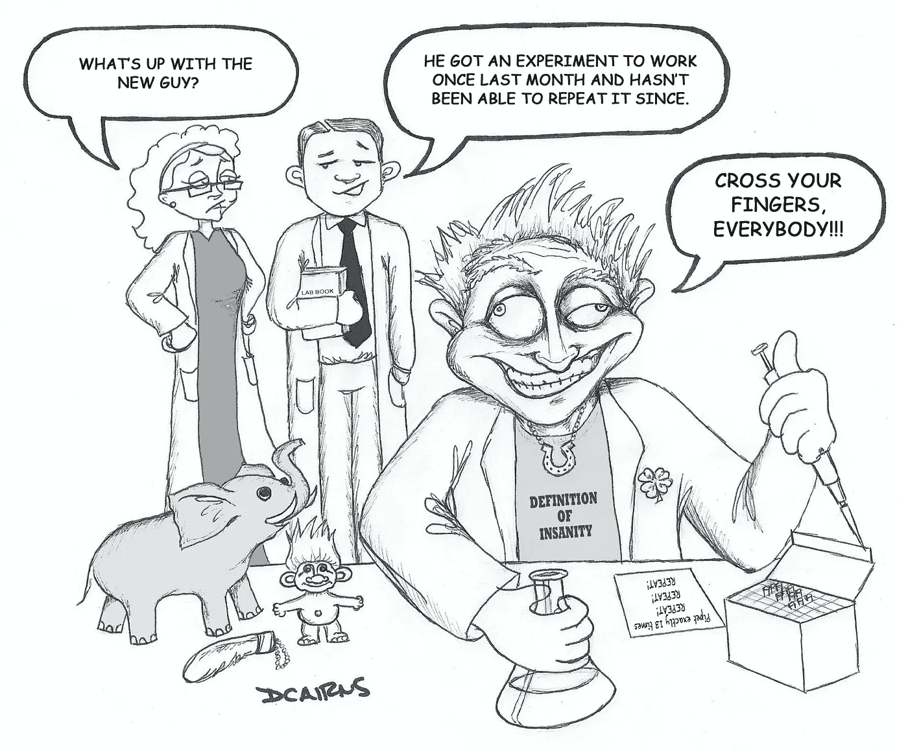

# 再现性和数据

> 原文：<https://medium.datadriveninvestor.com/reproducibility-and-data-cf5eac6e54d3?source=collection_archive---------14----------------------->

/via [https://www.digital-science.com/blog/guest/digital-science-doodles-lab-life-and-experimental-reproducibility/](https://www.digital-science.com/blog/guest/digital-science-doodles-lab-life-and-experimental-reproducibility/)

***TL；DR →*** *如果您没有在使用数据时对其进行版本控制，那么数据的版本控制并不意味着失败*

我以前写过机器学习中的[再现性危机](https://dieswaytoofast.blogspot.com/2018/03/reproducibility-and-machine-learning.html)。无需深入血淋淋的细节(只需阅读 [the post](https://dieswaytoofast.blogspot.com/2018/03/reproducibility-and-machine-learning.html) 即可)，该领域是一场完美风暴，它来自于巨大的——甚至是海量的——数据集、需要永远运行的作业、这些作业中的流水线式工作流、并行运行的工作流以及糟糕的版本控制。

“版本控制差→这个是这里的杀手锏。虽然你可能(可能！承认吧，你没有！)对您的单个模型和数据集进行版本控制，您最终不可避免地会 ***而不是*** 做的是版本控制*您所有的*调整。毕竟，只调整服务器上的一些数据比再次复制所有资产更容易。或者，在一个循环中生成一堆作业，稍微修改一下参数，看看会有什么效果，这样会更快。

让我们假设你实际上正在版本化一切——就像我们一样。事情是这样的，*即使你对所有的东西都进行版本控制，你仍然会出错！*

最近，一个大型数据集让我陷入了困惑，我至今仍对自己感到愤怒。问题中的数据集是美国公众可获得的房产信息，除了图片之类的普通东西，还包括一个非常大的文件，其中包含每处房产的名称、地址和交易记录(出售日期和价格)。好东西，对各种深度学习项目都有用。例如

*   针对康涅狄格州的属性的随机子集进行训练，并针对同一州的其他属性检查结果。(当然，使用 PRNG 来选择“随机”子集，这样就可以重现相同的子集😜)
*   对照康涅狄格州的房产进行训练，并与德克萨斯州的房产进行比较。(仅使用康涅狄格州和德克萨斯州的数据)
*   预测一处房产是否会被出售，基于同一个社区的其他房产的估价。(使用 id 和交易日期作为预测目标)

这是相当简单的东西。然而,*然而,*,我们还是一头栽进了再现性的障碍中。对我来说很好的模型对我的同事来说会吐得到处都是，反之亦然。
我们检查了通常的东西——检查我们是否使用了相同版本的数据集，相同的 PRNG 种子，等等。并且，在经历了许多不必要的痛苦和折磨后，发现这个问题很重要。

*Excel* ？
对，Excel。你看，前面提到的*巨大的*文件并不是你在 *vi* 中可以乱搞的那种东西。因此，在测试我们的模型时，我们会将结果与我们在 Excel 中看到的进行比较，结果甚至都不接近😖。直到我们意识到 Excel 会很高兴地为您设置日期格式。当它这样做时，它会将其切换到您的语言环境。比如你看到 1995 年 3 月 8 日，那是 3 月 8 日吗？还是 8 月 3 日？(拥有一个跨国团队*真的*在这里没有帮助……)

Comprehensive map of countries that only use MMDDYY

就这样。只有一件小事 Excel 帮我们自动格式化了日期，成功地节省了大约一周的调试时间。是的，这完全是我们自己的错。

所有这些背后的要点是，这一步——在 *Excel* 中打开数据集——是如此默认的行为，以至于我们想都没想过。与此同时，Excel 可能会愉快地做以下事情:

1.  *格式化数据*。不仅仅是约会。货币，数字格式，哦，还有很多
2.  *转换数据。*你知道，当 *Excel* 决定某件事是个日期，突然 **3.2** 变成了**3 月 2 日**？
3.  *编码数据*。存储数据的默认字符集是什么？ *UTF-8* ？ *UTF-16* ？Excel 通常会在后台进行静默转换。耶！

如果你没有注意，这是*确切地说是*那种导致再现性噩梦的问题，因为这发生在你将数据从版本控制中取出*之后。是的，如果您在 Excel 中处理数据并将其签入，您现在会有其他人试图弄清楚这是如何工作的(例如，他们有不同的系统默认值，导致他们的“ *Excel* ”步骤给出不同的结果！)*

所以是的，要小心。非常非常小心。一般来说，再现性已经够难了——不要让它变得更难！*确保你的数据在使用时是最新版本的。*

**(* [*这篇文章也出现在我的博客上*](https://dieswaytoofast.blogspot.com/2018/09/reproducibility-anddata.html) *)**