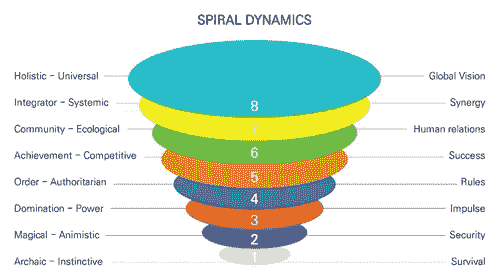
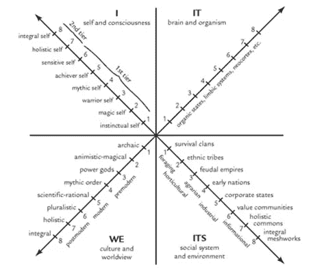

# 自我可持续区块链的要求，第 7 部分

> 原文：<https://medium.datadriveninvestor.com/requirements-for-self-sustainable-blockchain-part-7-3cd1ff49829f?source=collection_archive---------16----------------------->

[使用螺旋动力学确认，AQAL]

我一直在写一系列文章，讨论为什么自我可持续性对于区块链平台和加密货币是必要的，以及在一个主网中自我可持续性的良好属性。这是这个系列的最后一个。
— — — — — —

1.  介绍

在本系列的前两部分中，AI-DPoC 和 CONFIRM 都是作为一种实现自我可持续性的手段而引入的，这是 EcoVerse 生态系统的目标。AI-DPoC 将解决的传统区块链加密货币的问题如下:

不公平的财富分配

性能差

去中心化意识形态的抽象。

在本系列的第 6 部分，作为创建更先进的区块链加密货币生态系统的 EcoVerse 愿景的一部分，我们介绍了 AI-DPoC 以及我们解决这些问题的策略:

建立加密货币的日常使用环境

dApp 生态系统的相互合作与平衡增长

实施自我维持的治理机制

CONFIRM 是为实施这三项任务而引入的。这是一种设计基于激励相容机制的方法。由于 EcoVerse 追求 Ubuntu“双赢”经济，这将有助于 dApp 生态系统实现长期增长。

2.CONFIRM 的组件

2.1.机制设计理论

在进一步讨论 CONFIRM 之前，有必要了解机制设计和激励兼容性。首先我们将谈论机制设计。当一个没有太多信息的游戏开发者设计一个与拥有大量信息的经济实体对抗的游戏时，机制设计指的是设计者如何设计一种方法来确保游戏的结果对他有利。这里的区别在于，如果博弈论感兴趣的是当游戏规则被提供时，个人做什么，而机制设计理论关注的是如何设定游戏规则。机制设计理论假设人们会优先考虑自己的利益，因此它最好地解释了如何设计政策或制度来最小化利益冲突并实现社会期望的目标。

有很多例子可以说明这一点。假设有一个蛋糕和两个人，A 和 b。如何公平地分配蛋糕？一种方法是，A 有权把蛋糕切成两半，B 有权选择第一块。b 会对这种方法感到满意，并且结果是公平的。换句话说，通过设计政策的实施程序和方法，机制设计方法能够实现特定的预期结果。

Another example of mechanism design comes from the Chinese idiom “three in the morning, four in the evening” **朝三暮四**: In this Chinese folktale, a man, who must reduce how much he feeds his monkeys, uses a trick of speech to convince them to be satisfied with less food. While this story is usually referenced as a means to deceive a foolish group of people, I think it can be used as a good example of mechanism design. Mechanism design produces a desired policy without force, in which stakeholders are allowed to choose their own implementation methods and achieve their goals. As such, mechanism design plays a very important role in helping a social system function well.

2.2.激励兼容性

机制设计的基本前提是要尊重个人的激励，这样一个社会才能有效运转，但现实中成员很难达成共识。即使是简单系统的设计，也必须考虑许多变量，如个人的个人情况。如果一个设计是基于一个人的虚假报告，根本性的问题就会出现。因此，一个健康运转的经济体系“激励相容”至关重要，因为它为人们诚实举报和行事提供了激励。

除了经济制度，激励相容必须体现在投票、拍卖、合同等设计方案中，这样人们才会自愿参与。这样，机制设计对于激励相容是最优的。

2.3.螺旋动力学和 AQAL

如前所述，机制设计的核心是设计和实施一个优化激励兼容性的系统。但这里必须说一下欲望的问题:激励最终是为了满足人的欲望。考虑到这一点，EcoVerse 团队认为只关注技术而忽视人类欲望的加密货币项目是无用的。

*革命者常常忘记*，或者*不喜欢*去*认*，认为*一个人想要*，*使革命脱离*的*欲望*，*不本分*德勒兹和瓜塔里在《反俄狄浦斯》中写的这些话，被用作 EcoVerse 宣言的开场白。因此，EcoVerse 项目旨在开发一个区块链系统，从一开始就通过加密货币优化人类欲望的实现。只有这样，成员们才能通过自愿参与，形成一个可自我维持的网络。

人类的欲望和人口一样多样化。没有办法 100%满足每一个欲望。然而，如果要对这些欲望进行分类，就有可能设计出对每一种欲望都最优化的共同激励。通过使用大数据分析和人工智能工具，可以实现针对每个个体优化的激励设计。EcoVerse dApp 生态系统中的所有 dApp 将通过 EcoVerse dApp World 平台上提供的激励设计和支持系统，为所有用户提供优化的激励策展服务。随着用户选择自己的激励，它将提高用户满意度，导致积极参与，并最终创建一个可持续的生态系统。

CONFIRM 是一种基于激励设计系统的 dApp 业务支持模式，旨在满足每个人的个性化需求。这些优化激励基于以下理论:

“95%的思想、情感和学习发生在潜意识中——也就是说，在我们没有意识到的情况下”，无意识是营销的一个来源。哈佛商学院荣誉退休教授杰拉尔德·萨尔特曼

设计一个针对广泛需求优化的激励首先需要处理欲望的起源和发展，以及发展的无意识行为和奖励心理。在这个过程中，为了增强激励兼容性，设计必须包含影响行为、感觉和判断的无意识机制。通过这种方式，CONFIRM 根据卡尔·荣格对社会心理学、进化心理学和深度心理学以及行为经济学的研究，通过对无意识的逻辑系统和组成部分进行分类，被纳入到设计中。设计中还反映了人类行为和由此产生的奖励心理如何根据遗传的人类类型和随后的认知发展阶段而不同。

人类类型的分类将基于卡尔荣格的类型学，并通过参考九型图、MBTI 和人类设计来增加普遍性和准确性。积分理论的螺旋动力学值 Meme 和 AQAL 被相应地应用，使用这些学到的行为和世界观。根据 Clare Graves 教授的研究，Don Beck 博士和 Chris Cowan 博士在 20 世纪 90 年代创建的螺旋动力学价值模因理论被用作建立一个系统的方法，该系统可以识别根据个人和群体的发展过程和水平形成的世界观和价值观。利用这一理论，CONFIRM 将能够理解个人和群体的愿望和价值观是如何运作的，并将设计出最能满足这些需求的激励措施。即使存在价值和欲望的冲突，也可以用这个理论模型来解决问题。例如，它可以扩大导致会议或冲突等问题的狭隘判断标准。例如，它可以拓宽可能导致虐待和冲突等问题的狭隘判断标准。

[The right side represents each level’s core desire or motivation. The left side represents each level’s social state as reflected in its world view]

AQAL (All Quadrants All Level)是 Ken Wilber 积分理论的核心，应用于个体和群体行为、文化和系统领域的互动机制，包括个体行为的心理因素(如人类类型、认知发展水平)。

AQAL 是一个 AQ 和 AL 的复合词，显示了所有意识领域和层次。

*   AQ 揭示了宇宙的四个象限，包括可见和不可见的物体和群体。
*   AL 代表意识和无意识，欲望的层次，发展线和条件，每个步骤/层次的特征。

[The stage of development of human consciousness seen in 4 quadrants (Ken Wilber, “A Theory of Everything” p.70)]

通过应用螺旋动力学价值模因和 AQAL 理论，EcoVerse dApp 生态系统能够通过为个人和团体的行为设计适当的激励机制，实现可持续发展——用户的自愿参与。

2.4.CONFIRM 和 dApp 业务模式支持

EcoVerse dApp 生态系统将利用 CONFIRM 作为框架，最大限度地发挥 dApp 全球商业模式之间的协同作用。MECE(互斥集体穷举)方法的应用将有助于在任何领域选择 dApp World 商业模式，而 AQAL 确保商业模式不会重复或遗漏。将设计数据库挖掘和共享，以促进商业模式之间的交流和合作。例如，将绿色迷因的非营利(公共利益)商业模式医疗保健与橙色迷因的盈利性商业模式礼宾服务联系起来，创造了一个商誉和礼宾服务的共享经济模式。虽然这些模式在短期内可能不会盈利，但参与率的提高和持续的活动将为整个生态系统创造长期利益。

[dApp World Framework]

总之，CONFIRM 基于荣格心理学、螺旋动力学价值模因理论和 AQAL 理论，将成为 EcoVerse dApp 生态系统发展的驱动力，通过最大限度地融合所有参与者的愿望，确保长期的自我可持续性。

本文由韩文原文翻译而来，可在 Steemit 网站查看:[https://steemit.com/ecoverse/@nicklee002/7](https://steemit.com/ecoverse/@nicklee002/7)

参考

[1]永旺·尼克·李。自我可持续区块链的要求，第 1 部分。https://bit.ly/2KDiV0D

[2]永旺·尼克·李。自我可持续区块链的要求，第 2 部分。【https://bit.ly/2RrkXne 

[3]永旺·尼克·李。自我可持续区块链的要求，第 3 部分。[https://bit.ly/2PPgZUy](https://bit.ly/2PPgZUy)。

[4]永焕·尼克·李。自我可持续区块链的要求，第 4 部分。[https://bit.ly/2PI6tlL](https://bit.ly/2PI6tlL)。

[5]永焕·尼克·李。自我可持续区块链的要求，第 5 部分。[https://bit.ly/2A75zVs](https://bit.ly/2A75zVs)

[6]永旺·尼克·李。自我可持续区块链的要求，第 6 部分。[https://bit.ly/2TwxFlV](https://bit.ly/2TwxFlV)

[7] EcoVerse 白皮书。https://ecoverseglobal.io/17。