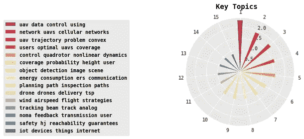
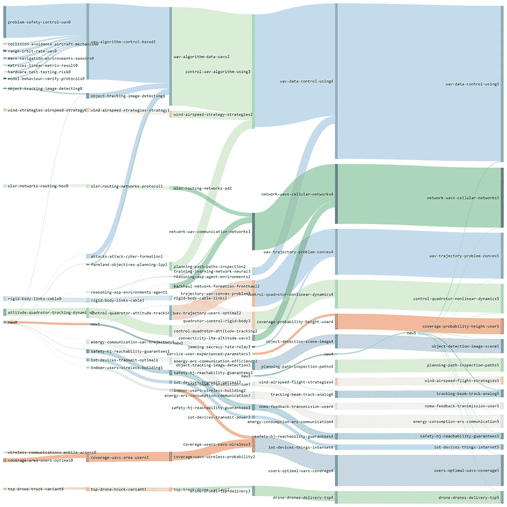
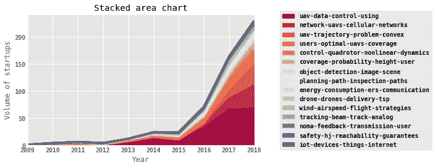
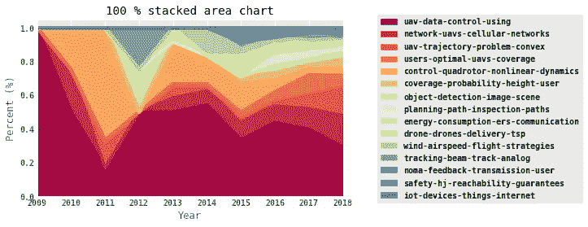
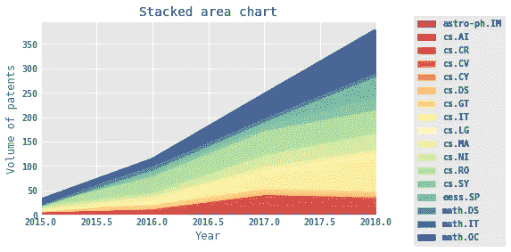
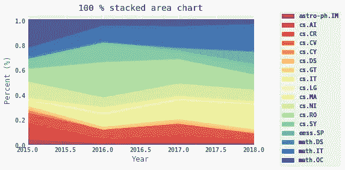

# 无人机研究前沿:人工智能叙事

> 原文：<https://medium.datadriveninvestor.com/research-frontiers-in-uav-an-ai-narrative-f802c35571f?source=collection_archive---------18----------------------->

无人机(UAV)技术的研究前景/主题，包括下面的图表和叙述，是由具有人工智能(AI)的机器自动生成的。要了解这种自动生成背后的技术，请阅读我之前关于清理生活的博客([人工智能清理生活](https://medium.com/datadriveninvestor/ai-to-de-clutter-life-fc9c11d84776))，其他具体应用请参见[“人工智能可以清理在线市场中的群体智慧”](https://medium.com/datadriveninvestor/ai-can-de-clutter-crowd-wisdom-in-online-marketplaces-329e251ed3de)

从这一行开始，一切都是由代码和人工智能自动生成的。

**无人机研究论文分析**

机器分析了 2006 年 9 月 25 日 19:06:59 至 2018 年 9 月 20 日 21:23:00 之间提交的 547 篇论文

注意:由于自上次提交文件以来，今年还有 102 天 00:00:00 小时，图表将在 2018 年显示下降

**存储库中包含 15 个主题**

已提交论文的主题列表按降序排列为
1 无人机-数据-控制-使用
2 网络-无人机-蜂窝-网络
3 无人机-轨迹-问题-凸
4 用户-最优-无人机-覆盖
5 控制-四旋翼飞行器-非线性-动力学
6 覆盖-概率-高度-用户
7 物体-探测-图像-场景
8 能耗-ers-通信
9 规划-路径-检查-路径

话题是如何演变的？

提交论文的前 4 个主题是
1 问题-安全-控制-无人机
2 姿态-四旋翼飞行器-跟踪-动力学
3 olsr-网络-路由-特设
4 刚体-链路-电缆

今天提交论文的前 4 个主题是
1 无人机-数据-控制-使用
2 网络-无人机-蜂窝-网络
3 无人机-轨迹-问题-凸
4 用户-最佳-无人机-覆盖

在谈话流程中，是否有人们应该注意的关键话题？

*   主题:问题-安全-控制-无人机-在 0 / 6 块中发现，当时很突出，但后来合并或分裂了
*   主题:UAV-算法-数据-UAV——在 2 / 6 块中发现，当时很突出，但后来合并或分裂了
*   主题:控制-无人机-算法-使用-在 3 / 6 块中发现，当时很突出，但后来合并或分裂了

让我们来看看对话中的趋势

*   无人机-数据控制-使用-正在持续上升
*   网络——无人机——蜂窝网络——正在持续上升

**部分话题排名有明显变化**

*   网络——无人机——蜂窝网络在这段时间内显著提高了它的地位
*   无人机-轨迹-问题-凸体在这段时间内显著改善了它的位置
*   用户最佳无人机覆盖范围显著提高了其在该时间段内的地位
*   覆盖范围-概率-高度-用户在该时间段内显著提高了其地位

**排名前 5 的作者是:** 1 张睿
2 梅鲁安·德巴
3 李泰英
4 路易斯·a·达希尔瓦
5 罗兰·西格瓦特

**排名前 5 的研究领域是:** 1 cs。RO(机器人学)
2 数学。IT(信息论)
3 cs。
IT(信息论)4 cs。系统及控制。NI(网络和互联网架构)

让我们看看研究领域的趋势
注意:随着没有公司受让人的文件被丢弃，图表形状可能会改变

*   cs。它——一直呈上升趋势
*   cs。RO —持续上升趋势
*   cs。SY——持续上升趋势
*   数学。它——一直呈上升趋势

Refer arXiv.org for abbreviations

一些主题已经显著改变了它们的排名

*   哎呀。SP(信号处理)在这段时间内显著提高了它的地位

Refer arXiv.org for abbreviations

机器让您先睹为快，了解这 4 个主题是什么:

2 网络-无人机-蜂窝-网络
——————
蜂窝连接的无人机必然会作为新的空中移动用户
融入未来的蜂窝网络。为无人机提供蜂窝连接将实现从在线视频流到医疗交付的无数应用。然而，为了使无人机能够实现可靠的
无线连接和安全操作，需要解决各种
挑战，如干扰管理、移动性
管理和切换、网络物理攻击和认证。在本文中，目标是揭示在基于无人机的投送系统、基于无人机的实时多媒体流和基于无人机的智能交通系统中出现的无线和安全挑战。为了应对这些挑战，引入了基于人工神经网络(ANN)的解决方案。所介绍的方法使得 UAV 能够自适应地利用无线系统资源，同时实时地保证安全操作。初步模拟结果显示了所介绍的解决方案对于上述每个蜂窝连接无人机应用用例的好处。

1 无人机-数据-控制-使用
————
将无人机降落在地面标记上是一个公开的
问题，尽管研究界做出了努力。以前的尝试主要集中在手工制作的几何特征的分析和外部传感器的使用，以便允许车辆接近着陆垫。在
这篇文章中，我们提出了一种基于深度强化学习的方法，即
只需要从下视相机拍摄的低分辨率图像，就可以识别标记的位置，并将无人机降落在其上。所提出的方法基于深度 Q 网络(dqn)的层次结构，其被用作朝向标记导航的高级控制策略。我们实现了不同的技术解决方案，比如 vanilla 和 double DQNs 的组合，以及分区缓冲区重放。使用领域随机化，我们在统一的纹理上训练车辆，并且我们在各种各样的模拟和真实世界环境上测试它。整体性能可与最先进的算法和人类飞行员相媲美。

3 无人机-轨迹-问题-凸
————
本文研究了一种新型的无人机
与地面无线通信系统的频谱共享场景。我们
认为，认知/辅助无人机发射机与地面辅助接收机(SR)通信，存在多个在同一频带上运行的主要地面通信链路。我们通过轨迹设计开发无人机的可控机动性，以改善认知无人机通信性能，同时控制每个主接收机(PRs)的同信道干扰。特别是，我们通过联合优化 UAV 轨迹和发射功率分配，使在有限的任务/通信周期内从 UAV 到 SR 的平均可实现速率最大化，服从 UAV 的最大速度、初始/最终位置和平均发射功率的约束，以及在每个 pr 处施加的一组干扰温度(it)约束，以保护它们的通信。然而，关节轨迹和功率优化问题是非凸的，因此很难得到最优解。为了解决这个问题，我们提出了一个有效的算法，通过应用交替优化和连续凸逼近(SCA)技术来确保获得局部最优解。数值结果表明，与基准方案相比，我们提出的联合无人机轨迹和功率控制方案显著提高了认知无人机通信系统的可达速率。

4 用户-最优-无人机-覆盖
——————
无人机可以在蜂窝网络瘫痪时作为空中无线基站
。先前对基于无人机的无线覆盖的研究通常考虑空对地路径损耗模型，该模型假设用户在户外并且他们位于 2D 平面上。在本文中，我们建议在蜂窝网络中断的灾难情况下(如地震或洪水)，使用单个无人机为高层建筑内的室内用户提供无线覆盖。我们假设室内用户的位置均匀分布在每一层，我们提出了一种粒子群优化算法来寻找一种有效的无人机 3D 放置方式，使
最小化覆盖室内用户所需的总发射功率。

—文件结束—

> 数据掌握着真理。代码+AI 可以解锁。在人工智能的世界里，数据很重要，情报也很重要。

注意:有兴趣获得定制报告(市场分析/专利(例如[区块链](https://medium.com/datadriveninvestor/blockchain-patent-analysis-auto-performed-narrated-by-ai-7c7fc21513d8) )/研究)或在其组织/产品中实施上述知识产权的公司可以通过 [Linkedin](https://www.linkedin.com/in/harshaangeri/) 联系