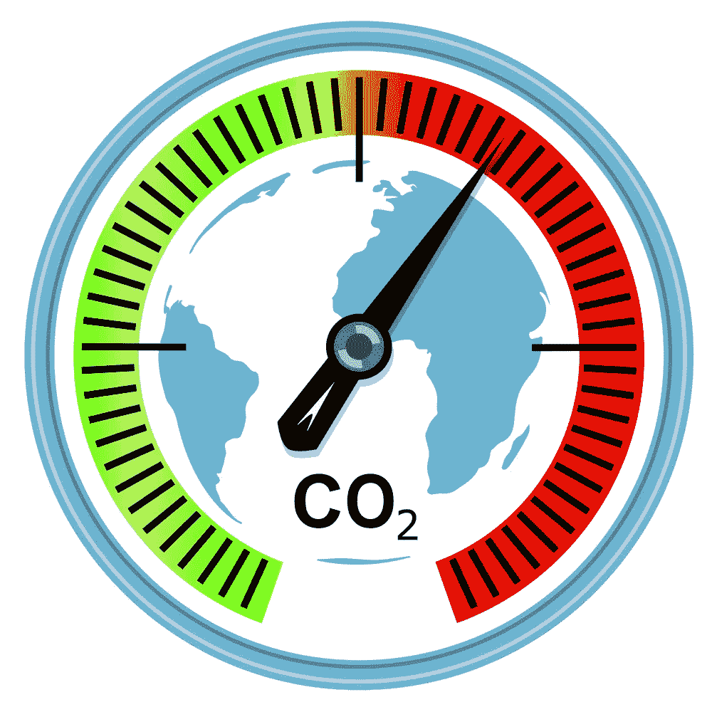

# 欧盟的责任投资和字母汤

> 原文：<https://medium.datadriveninvestor.com/responsible-investing-and-alphabet-soup-in-the-eu-b8a3de715c44?source=collection_archive---------6----------------------->

*越过缩写词，你会看到越来越有价值的工作，它们将影响我们如何投资，以及我们如何应对气候变化*

关于气候变化的巴黎协定于 2015 年 12 月签署，签署国同意将全球气温上升控制在 2 摄氏度以下(高于工业化前的水平)。今年夏天，一系列野火，以及新闻中对气候变化的持续报道，意味着这个问题理所当然地获得了更多的公众关注。然而，如果没有金融部门，实现 2 摄氏度的目标是不可能的。

在欧洲一级，欧洲联盟(欧盟)正在研究如何将可持续性考虑纳入其金融政策框架，以便为可持续增长筹集资金。作为这一过程的一部分，它已经向可持续金融高级专家组(HLEG)征求建议，该专家组于 1 月 31 日在[发表了他们的最终报告。这份报告为欧洲金融政策的大规模变革播下了种子，并因此在欧洲投资中更多地使用 ESG 因素。](https://ec.europa.eu/info/publications/180131-sustainable-finance-report_en)

ESG 是什么？为什么重要？下一步是什么？继续读下去，你会发现的。

**ESG——是什么？**

环境、社会和治理因素可被视为投资决策过程的一部分。这可以在机构或个人层面上进行。联合国支持的负责任投资原则(PRI)是致力于理解环境、社会和公司治理因素对投资影响的主要团体之一。

它拥有来自 50 多个国家的 1，750 多个签署方，代表约 70 万亿美元，并正在积极帮助其签署方将这些环境、社会和公司治理因素纳入其自身的投资和所有权决策。PRI [注意到](https://www.unpri.org/about/what-is-responsible-investment)ESG 因素的例子数不胜数且不断变化。它们包括:

环境(E):气候变化；温室气体(GHG)排放；资源枯竭:包括水、废物和污染；森林开伐

社会:工作条件，包括奴役和童工；当地社区，包括土著社区；冲突；健康和安全；员工关系和多元化

治理(G):高管薪酬；贿赂和腐败；政治游说和捐款；董事会的多样性和结构；税收策略

**ESG —为什么重要？**

作为公司报告流程的一部分，提供准确、可比和易于理解的非财务数据，可以让投资者从更广阔的角度了解公司的业绩。因此，长期投资者可以看到哪些公司在同行中表现良好，但更重要的是，他们还可以看到哪些公司以可持续的方式表现。

增加透明度对投资者来说是一件好事，对相关公司来说也是如此，因为那些以可持续和负责任的方式行事的公司会得到回报。全球标准正在发展，现在还为时尚早，但势头正在形成，而且不仅仅是在欧洲。仅举一个例子，在过去的 10 年里，制作可持续发展报告的中国公司从 19 家增加到 3000 多家。

**ESG —下一步是什么:**

3 月 8 日，欧盟委员会(EC)的行动计划[发布](https://ec.europa.eu/info/publications/180308-action-plan-sustainable-growth_en)，旨在动员绿色投资，将可持续性融入金融体系的方方面面。该计划的要素包括可持续资产/活动的统一欧盟分类系统/分类法，以及澄清资产管理公司和机构投资者在投资过程中如何考虑可持续性的义务的提案。

欧盟提出了绿色债券和投资基金的标准和标签，以及降低某些气候友好型投资的资本要求。欧盟委员会已经提议将环境、社会和公司治理因素纳入欧洲监管机构(ESAs)的职权范围。它还就机构投资者和资产管理公司在可持续性方面的责任进行了公开咨询。

如果我们想生活在一个更安全、更清洁、更环保的世界，同时也想获得投资回报，那么我希望你们会同意，欧盟的 HLEG 报告应该受到欢迎，欧盟委员会、esa 和 PRI 即将开展的工作也应该受到欢迎，因为我们关注的是 ESG。

*原载于 2018 年 8 月 9 日*[*www.datadriveninvestor.com*](http://www.datadriveninvestor.com/2018/08/09/responsible-investing-and-alphabet-soup-in-the-eu/amp/)*。*

