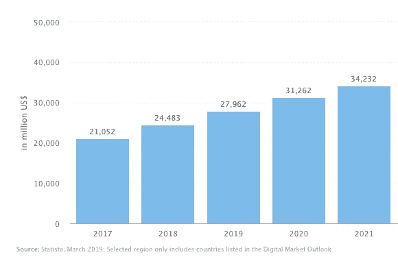

# 多亏了聊天机器人，餐馆的效率正在飞速提高

> 原文：<https://medium.datadriveninvestor.com/restaurant-efficiency-is-skyrocketing-thanks-to-chatbots-2006fd1e9c26?source=collection_archive---------9----------------------->

以下是聊天机器人数字化客户互动的三种方式。

[Awesome GIF via Giphy](https://giphy.com/gifs/tacobell-taco-tacos-bell-l0NwI1oBNxYfoRRny)

根据 Statista 的数据，到 2023 年，餐厅到消费者交付领域的平均年增长率将达到 8.7%，到 2023 年市场规模将达到 390.25 亿美元。为了利用这种增长，像[多米诺骨牌](https://www.chatbotguide.org/dominospizza-bot)这样的餐馆正在实施聊天机器人。

[via Statista](https://www.statista.com/outlook/375/101/restaurant-to-consumer-delivery/asia#market-revenue)

聊天机器人通过数字化与客户的互动和自动化曾经手动的点菜过程，帮助餐馆全面提高效率。顾客不再需要打电话订座、排队或等待工作人员点餐。

 [## 对话式人工智能的兴起将如何影响世界数据驱动的投资者

### 从不同的专业服务，保险，教育，金融，旅游，电信，到建筑，银行，和…

www.datadriveninvestor.com](https://www.datadriveninvestor.com/2019/02/07/how-the-rise-of-conversational-ai-will-impact-the-world/) 

尽管如此，这里有三种聊天机器人可以通过提高餐厅的效率来使餐厅受益的方式。

# 聊天机器人提高了餐馆顾客点餐的速度

聊天机器人给餐馆带来的第一个好处是减少了每位顾客点餐的时间。第一步，餐厅顾客首先需要与收银员或服务员交谈，让他们知道他们想要点什么，第二步，工作人员必须将他们的订单输入 POS，第三步，订单信息被发送到厨房。或者，聊天机器人允许餐馆顾客直接在手机上选择他们想吃的或想喝的，并将订单信息直接发送到厨房准备。聊天机器人将在餐馆点餐的步骤从三步减少到两步，提高了顾客点餐的速度。

# 聊天机器人提高了餐馆订单的准确性

我们都有过这样的经历:当我们告诉服务员我们午餐想要某个菜单项目时，却收到了完全不同的东西。这种沟通失误是意料之中的，时有发生，我们毕竟是人。然而，通过聊天机器人而不是人类来跟踪客户订单，可以完全避免这种误解。聊天机器人不会忘记订单或者写错。因此，聊天机器人通过提高客户订单的准确性来提高餐厅的效率。

## 聊天机器人减少了支付所需的时间

传统上，在餐馆付账是一个漫长的过程。首先，你必须引起服务员的注意，接下来你需要检查账单以确保它是正确的，然后在交出你的信用卡进行收费之前，你必须等待服务员拿着你的信用卡回来，最后你在账单上签字。这是一个太多的步骤和大量的时间浪费。

聊天机器人通过移动支付消除了等待时间。顾客现在可以通过手机无缝支付。因此，通过聊天机器人进行数字支付提高了餐厅的效率。

让我们希望聊天机器人成为餐馆的标准，而不是规则的例外，这样我们就不必等待很长时间才能完成我们的订单。