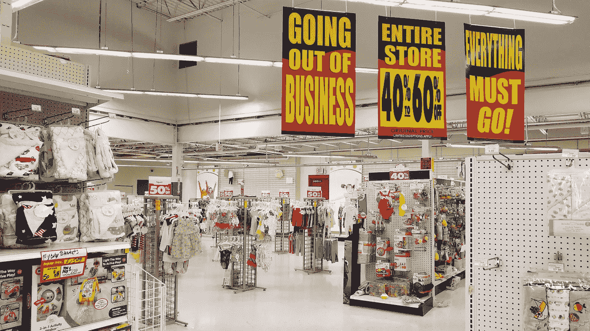
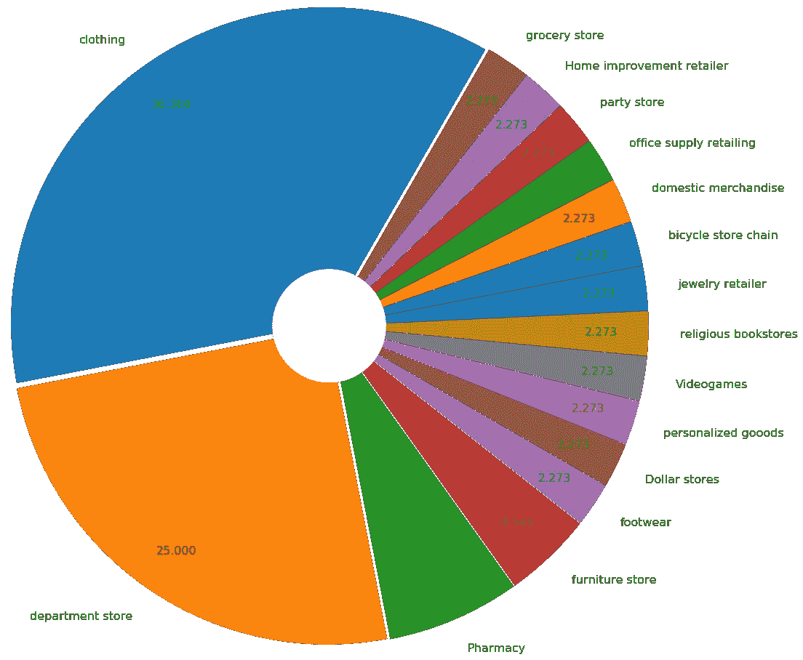
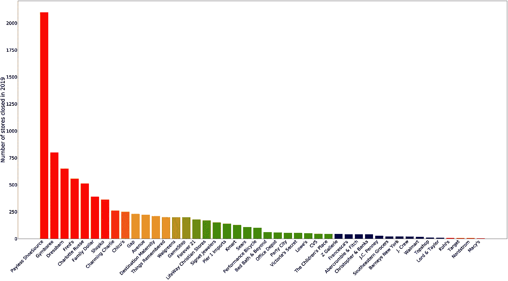

# 2019 年零售启示录

> 原文：<https://medium.datadriveninvestor.com/retail-apocalypse-in-2019-5421e84050db?source=collection_archive---------5----------------------->

Image courtesy — [https://www.flickr.com/](https://www.flickr.com/photos/140641142@N05/41656577195/in/photolist-26t3R7c-KdSzvP-26JTnqG-255Vn4C-KGJjZd-JbHs42-27oTKZC-KGJRVm-27L85Uw-KxXvW1-28SP2s6-KGJR15-28LE8Ar-J2NXfn-26j76w2-24W3W9q-255V8BY-24W3Eth-255V7V7-255UXaA-26j6XUZ-27L8n2w-KxXwxm-27L8fNQ-27L88rf-27QHY6g-26JTowE-26JTS4o-JbH1Vr-2a5sH9o-N2gTCd-26t46tP-27oTLeL-JbHq64-255VfEA-27L8igA-27L8bR1-255VjWw-2a9J1UZ-255VhoL-27L81Xy-27oTLqY-2a9Hf6F-255VmzG-KdStdD-2a5sGL9-JbHr4M-2a9J1rV-27uUBVD-255V5N1)

如果你打算开一家销售消费品的实体店，你可能需要再考虑一下。随着数字化和在线购物唾手可得，去商店的选择看起来更加耗时和不方便。你可能会问，如果是这样的话，好市多是如何实现十亿美元利润的？对此我有一个答案——看看好市多的商业模式。它不会试图用不同类别中的一系列选项来混淆你。相反，它做的是定性过滤的工作，你只需要去挑选该类别中的可用商品，相信它是一个体面的价格范围内最合理的选择，让你为你在这里购买的会员资格感到自豪。在这些时候，像市场领导者亚马逊一样在网上开展零售业务实际上是一个更好的主意，亚马逊在 2019 年的净利润约为 50 亿美元(约为好市多的 5 倍)，仅占其全球在线销售额(不包括 AWS)。此外，请注意，亚马逊不仅仅是一个在线零售商，它还是一个实现销售的平台。它的专有产品很少，大多数销售的产品只是在这个平台上销售。亚马逊的在线业务主要集中在服务方面。然而，零售市场已经非常紧张，自 2010 年以来，大多数散户投资者的利润微不足道。

在这篇文章中，我分析了 2019 年所有店铺关闭的数据。其中之一，洛德&泰勒早在 1826 年就开始了。这背后的动机是通过探索 2019 年零售商店关闭数据集来洞察零售市场的未来。我从下面的文章([https://moneywise.com/a/retailers-closing-stores-in-2019](https://moneywise.com/a/retailers-closing-stores-in-2019))中创建了这个数据。

Visualizing the density distribution of store closures across various industry categories

更不用说，服装行业正经历着近年来最高水平的停工。主要原因是网上有各种工具，可以方便地评估哪件衣服最适合你。举个例子，过去孕妇会去买孕妇装，但随着生活节奏变得如此之快，在大多数情况下，她们几乎没有时间去买孕妇装。宁愿去网上。其次，我认为随着时尚潮流的不断变化，消费者最终会购买许多不必要的服装和配饰。很少有衣服适合/可以被接受到只穿一次，比如在特殊场合、旅行、家庭活动等场合穿的衣服。这导致了服装租赁行业的浪潮，如出租跑道，Le 手提包，Swap.com 等。人们租名牌服装和配饰，穿几次，然后继续下一个设计/品牌。最后，服装空间过于拥挤。在商业中，有时我们忘记意识到当车道变得太窄而无法通过时，结果是所有的企业都受到影响，竞争开始追逐天空。最终，这些商店在濒临破产或宣布破产时被迫关闭。

 [## 一个企业在肚子上移动:如何照顾直觉|数据驱动的投资者

### 事实证明，直觉不仅仅是一种感觉。科学很清楚:你的直觉比你知道的更多…

www.datadriveninvestor.com](https://www.datadriveninvestor.com/2018/11/09/a-business-moves-on-its-stomach-how-to-make-allowances-for-gut-feelings/) 

即使是第二大类商店——百货商店，也有类似的情况。在这个网络世界里有如此多的百货商店，以和你在网上买的一样的价格去购物是没有意义的，而且不要忘记容易退货的政策。此外，在线购物使数据分析师和科学家更容易理解消费者购买模式、库存管理和产品推荐，从而提升在线销售。

但是，如果你仍然相信实体零售店，提供像 Zara 和 Costco 这样的个性化服务是更安全的选择。还记得几十年前，我们常常去裁缝店缝制衣服，去定制珠宝店买耳环、戒指等等..相反，今天，如果你去一家时尚零售店，很容易被这么多的选择搞糊涂，浪费比实际需要多得多的时间。有趣的是，不仅地球是圆的，消费者的消费模式也是循环的，除了随着技术的进步做同样的事情。比如一个不起眼的裁缝店变成了个性化的设计师店；理发店变成了豪华的沙龙，但本质还是一样的。下图为 2019 年各门店关闭的具体数量。

Count of stores closed in 2019 for the corresponding names on the X-axis

一旦我们过渡到机器时代，同样，这也是由超高速指数增长的数据量推动的信息时代。因此，今天要明白的一件大事是，仅仅在全球各地开设实体店不会有多大帮助。相反，要以最具战略性的方式让销售者和消费者最终看到自己的成功。