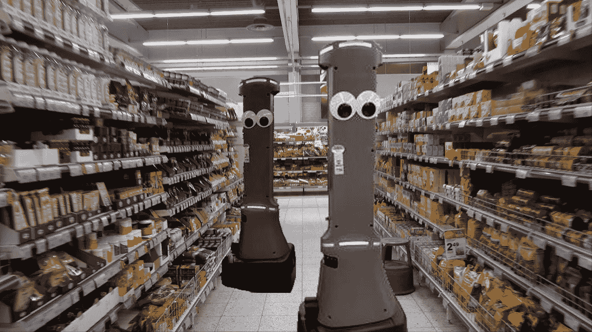

# 零售业员工:机器人马蒂来抢你的工作了

> 原文：<https://medium.datadriveninvestor.com/retail-industry-employees-marty-the-robot-is-coming-for-your-job-cd3313ea7f73?source=collection_archive---------3----------------------->

Badger Technologies

如果你在任何 Stop & Shop、Giant 或 Martin 的杂货店工作或购物，你可能已经见过 Marty，这是一个看起来傻乎乎的自主机器人，它在过道里巡逻，执行库存，寻找破裂的哈密瓜和破裂的鸡蛋纸盒，并向它的人类主人报告。

你很容易就能找到马蒂。他/她/它是一个有轮子的黑色底座上的灰色机器人，有彩色的 led 灯条，一个姓名标签，和两只不起作用但可爱的眼睛。不过，不要被愚弄了；马蒂能很好地“看见”你。它配备了八个摄像头以及“激光雷达”接近传感器，以防止它撞到货架和购物车以及站立不稳的老人。当机器人在商店里走动时，它的摄像头会连续扫描地板，寻找任何可能导致有人滑倒的东西。

 [## 2019 年即将改变世界的技术|数据驱动的投资者

### 很难想象一项技术会像去年的区块链一样受到如此多的关注，但是……

www.datadriveninvestor.com](https://www.datadriveninvestor.com/2019/01/17/the-technologies-poised-to-change-the-world-in-2019/) 

在零售商努力应对网上送货的成本和来自非超市竞争的压力之际，马蒂预示着食品杂货业的未来。

总部位于荷兰的母公司 Ahold Delhaize USA 并不是唯一一家学习爱上机器人的公司。根据 Juniper Research 的数据，全球零售商在人工技术上的投资估计为 36 亿美元，预计到 2023 年将达到 120 亿美元。

来自[波沙·诺瓦机器人](http://www.bossanova.com/)的巡回机器人现在在 50 家沃尔玛商店巡逻，收集信息，确保价格是最新的，货架标签是准确的，识别缺货商品，跟踪现在放在顶层货架上的积压商品，以减少库存补充的幕后旅行。

这个机器人将人工智能和机器学习结合在一起，每天扫描一次百货商店，每天访问两次食品和消耗品。沃尔玛预计最终将在其所有 4500 家门店推出机器人。

沃尔玛还在部署 Brain Corp 的 BrainOS 平台，使该公司遍布美国的 100 多台商用地板擦洗机实现自动化。BrainOS 驱动的地板擦洗器允许商店员工在最初的培训骑行中快速绘制路线，然后按下一个按钮即可激活自主地板清洁。机器人使用多个传感器来扫描周围的人和障碍物。沃尔玛预计，到 2019 年 1 月 31 日财年结束时，商店中将有 360 台 BrainOS 驱动的机器。

[Ocada](https://www.theverge.com/2018/5/8/17331250/automated-warehouses-jobs-ocado-andover-amazon) ，一家英国网上超市，近年来因设计高度自动化的仓库并向其他杂货连锁店销售该技术而闻名。当 Ocado 在英格兰的 Andover 运营全面启动和运行时，每周将能够处理 350 万件商品或约 65，000 份订单。

## 机器人马蒂能比人类做好哪些工作？

马蒂的制造商[獾科技](https://www.jabil.com/insights/blog-main/autonomous-robots-retails-new-secret-weapon.html)的蒂姆·罗兰认为，在零售环境中，机器人至少能做或者很快能做四件事，比人类做得更好、更快、更便宜:

1.  **了解什么缺货**。“在杂货零售环境中，8%的库存没有正确放置、定价或缺货，这相当于对他们的收入造成大约 4%的影响。今天，这在杂货店被接受，因为还没有更好的方法来获取数据。但一个自主机器人可以通过传感器和摄像头分析货架，并以一致的方式报告这些数据，这样库存就可以得到补充。
2.  **保证价格诚信**。“当顾客来到收银台准备购买时，POS 上的价格与货架上的价格不符，这就相当于生产力和时间的损失，更不用说负面的顾客体验了。此外，如果零售商正在开展促销活动，他们需要确保正确展示促销活动，以鼓励购物者购买更多商品。同样，当出现价格诚信问题时，零售商会面临收入损失。”
3.  **确认产品展示**。“产品设置是零售商面临的另一个挑战。他们在营销方面投入大量资金来研究和决定产品将如何在商店内摆放……货架图合规性确保零售商能够更接近他们的最终目标:增加销售额、提高整体盈利能力和留住回头客。货架分配对产品销售有着巨大的影响，如果没有遵守你制定的最大化销售的计划，它会对你的商店产生重大影响。”
4.  **识别危险情况。**提示，马蒂，开始这篇文章的清洁工机器人。事实是，Marty 也可以执行前三项任务，但公司选择不强调这些任务，可能是因为它们对员工更具威胁性。如果 Marty 看到看起来像危险的东西，它会通过说“小心，检测到危险”来警告周围的顾客，并向在电视屏幕上监控商店的人(在这种情况下，位于低工资的菲律宾)发送电子警报，以确定他们是否需要警告商店经理。

就像这个以及未来几年将出现的数以千计的自动化和机器人故事一样，一个粗鲁但重要的问题是:如果机器做所有的工作，人类做什么？我们还没有一个好的答案。也许这就是为什么每篇宣布自动化突破的新闻稿似乎都包含一些强制性的含糊其辞的声明，大意是“它们不是取代员工，而是解放员工，让他们更多地与客户互动，并承担其他工作。”

我们只能希望“其他工作”不是坐在菲律宾过热的仓库里看宾夕法尼亚州斯克兰顿一家杂货店的闭路电视。看是否有人掉了一盒鸡蛋。