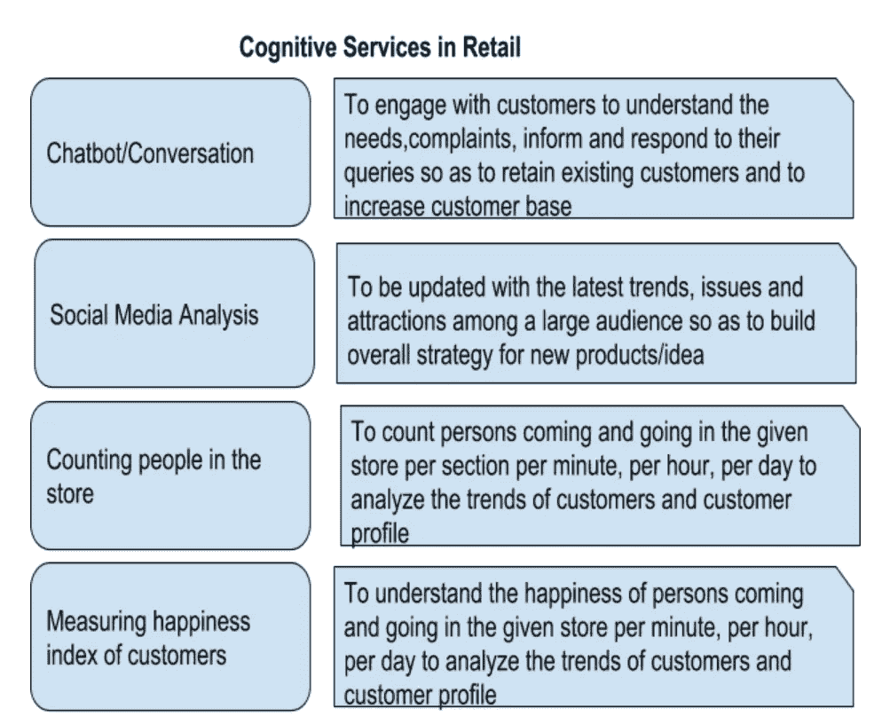
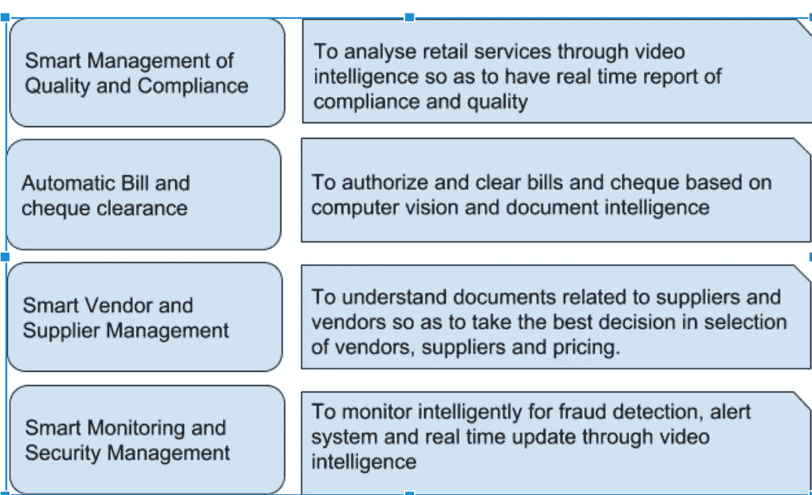
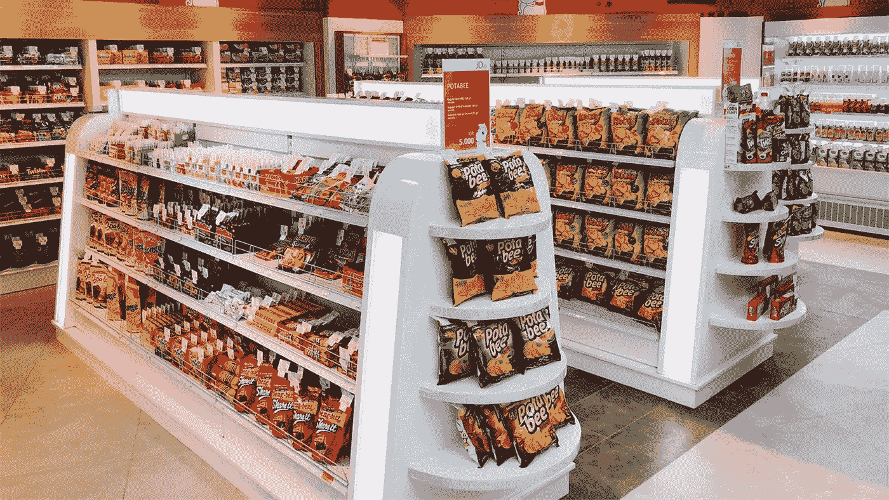

# 零售部门:认知计算应用

> 原文：<https://medium.datadriveninvestor.com/retail-sector-cognitive-computing-applications-56e5fa579d7a?source=collection_archive---------21----------------------->

零售部门在使用认知计算和人工智能应用方面一直非常积极。由于他们一直专注于留住客户和获得客户，他们已经使用聊天机器人、社交媒体分析和其他应用程序很长时间了。他们最近一直在使用视频智能来统计人数、衡量客户的幸福感、安全自动化和足迹跟踪。他们在自动化发票管理、供应商管理和库存管理方面也很积极。

不占用你太多的时间，我们可以看看在零售部门使用的主要认知服务。

我希望零售业在未来将通过最新的认知服务不断增强愉快的客户体验并获得新客户。

