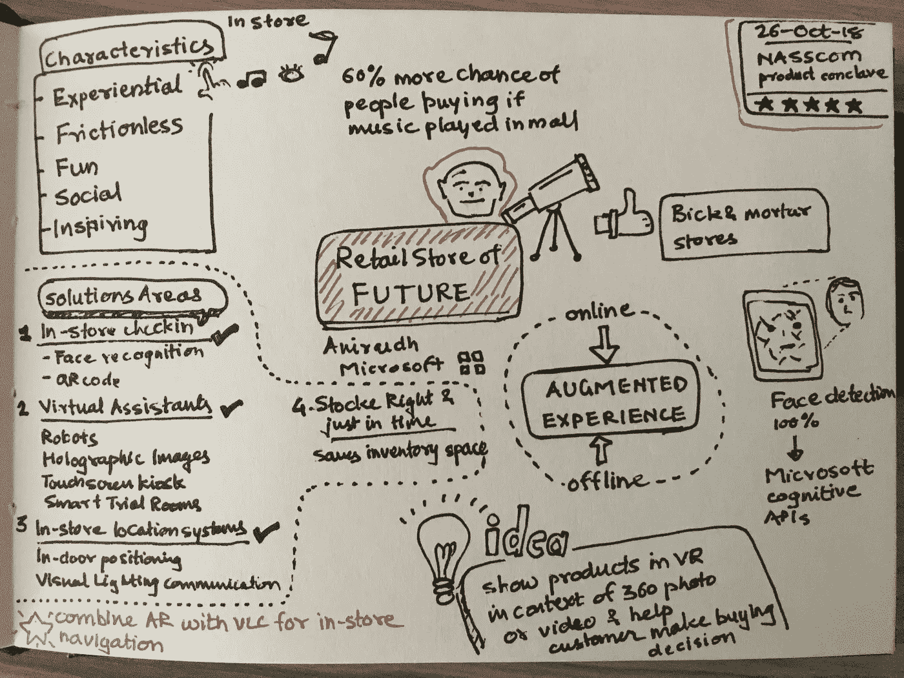

# 未来的零售店

> 原文：<https://medium.datadriveninvestor.com/retail-stores-of-the-future-37279f8b2238?source=collection_archive---------33----------------------->

[Aniruddha Deswandikar](https://www.linkedin.com/in/anideswandikar/) 在印度班加罗尔举行的 2018 年 NASSCOM 产品秘密会议上的讲话摘要。

Retail Store of Future

尽管网上购物风靡全球，零售实体店依然存在。然而，这种体验将会改变，以适应消费者不断变化的需求和生活方式。在这些实体店中将会看到数字生活的延伸。

产品展示方式发生了巨大的转变，围绕一系列产品的定制环境的创建，显示价格的数字显示器，自助结账柜台，减少店内仓库存储的库存管理。

> 如果商店里播放音乐，人们购买的几率会增加 60%

未来的零售店应该具有以下特征

*   **体验式**——它将允许买家在虚拟购买之前体验商品。无论是服装、家具、装饰、汽车还是食物！
*   **无摩擦**——如今的买家从进店到支付最后一笔款项并把它带回家，没有一个无缝的购物体验。购房体验仅限于手机应用。然而，店内购买有更多的好处。
*   乐趣——不仅仅是购买。购买者倾向于享受经历不同选择并最终做出选择的过程。让这个过程变得有趣会让购买过程变得愉快和难忘。降低相对认知负荷、轻松找到产品信息、定制产品是让产品变得有趣的可靠方法。
*   **社交** —社交体验让人们获得认可和地位提升。如今，人们通过点击照片/视频并将其发布到社交媒体来分享他们的购买之旅。未来的零售商店这些将被嵌入产品和摊位本身。
*   **鼓舞人心** —购买一件产品会提升购买者的主人翁意识。然而，购买过程本身应该激励购买者为自己做出正确的选择。

[回到未来的超市](https://news.microsoft.com/europe/features/supermarket-of-the-future/)让我们一窥未来的美好。