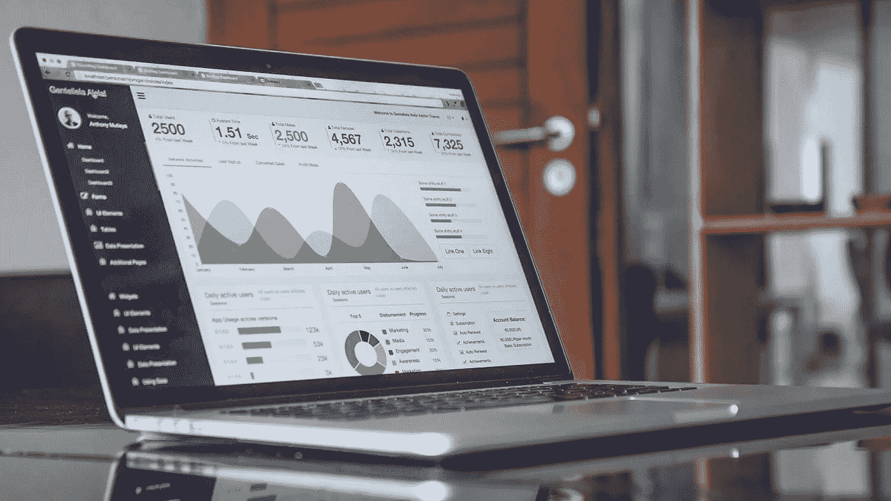

# 想要快速增加销售额的零售商应该更多地利用他们的数据。

> 原文：<https://medium.datadriveninvestor.com/retailers-who-want-quick-wins-that-increase-sales-should-do-more-with-their-data-4c8d71da34d2?source=collection_archive---------11----------------------->

在过去的 20 年里，我与一些领先的零售商合作过，他们拥有相当好的数据和分析、出色的流程和聪明的团队。像这样的零售商还能看到人工智能和高级分析的价值吗？
我认为答案是肯定的，因为通过使用人工智能解决方案，零售商可以利用他们已经拥有的数据做更多事情。

人工智能数据分析解决方案有几个机会将零售商的销售和盈利能力提升到一个新的水平:

**1。从现有数据中挖掘更多机会** :
**a.** 零售商记录并处理供应商在商店提出的索赔，但他们真的会分析这些数据吗？他们是否知道索赔增加是因为供应商的表现，还是因为商店试图弥补不良收缩率或损坏率？他们会知道索赔量最近有所增加吗？他们会监控趋势并对商店和地区进行基准测试吗？
**b.** 运营和损失预防团队正在监控 POS 退款中的客户和收银员欺诈，但他们是否在衡量客户退货对损坏和缩水的影响？他们是否有对这些数据点进行三角关联的实践？
**c.** 库存受到严密监控，以确保准确性，但零售商是否使用他们通过周期盘点和库存调整收集的数据来预测收缩？
**d.** SKU 级别的销售信息可供运营和商务团队使用，但是否用于检测和预测货架可用性和订单完整性？

**2。** **提高您团队的效率和效力** :
**a.** 拓宽使用数据的范围，但坚持在需要时也能快速方便地访问 SKU 级视图。
**b.** 自动定位并向商场和总部员工推送机会。
**c.** 关注高风险，使用排名和优先级机制支持决策和资源分配。
**d.** 保留并传播“本地”知识和最佳实践。
**e .形式化并记录洞察后的后续行动。**

****3。把你的行动集中在数据告诉你的事情上:**
a .你发现库存行为异常？你发现了周期盘点趋势的异常？始终检查它是否也有可能影响利润(通过销售增长、收缩/损害减少)并采取预防措施。
b .确定贵组织中可能对销售、缩水和损失有直接影响的最佳实践。当您发现不合规时，这些最佳实践必须是您在审计、培训和一般意识活动中的重中之重。**

****改善这三个关键领域将为可持续的绩效改善、销售和利润增长建立能力。****

## **来自 DDI 的相关故事:**

** [## 成为数据科学家所需的 8 项技能——数据驱动型投资者

### 数字吓不倒你？没有什么比一张漂亮的 excel 表更令人满意的了？你会说几种语言…

www.datadriveninvestor.com](https://www.datadriveninvestor.com/2019/02/07/8-skills-you-need-to-become-a-data-scientist/)  [## 为什么数据将改变投资管理——数据驱动的投资者

### 有人称之为“新石油”虽然它与黑金没有什么相似之处，但它的不断商品化…

www.datadriveninvestor.com](https://www.datadriveninvestor.com/2019/01/25/why-data-will-transform-investment-management/)**