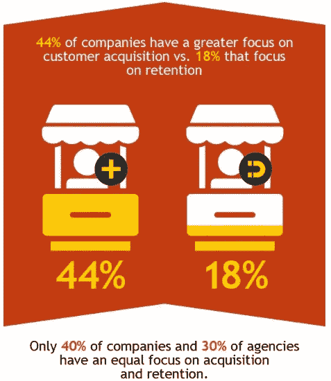

# 在财富大转移期间留住或吸引千禧一代客户

> 原文：<https://medium.datadriveninvestor.com/retaining-or-attracting-millennial-clients-during-the-great-wealth-transfer-b5f3a090a731?source=collection_archive---------6----------------------->

## **理财顾问应对财富大转移的 5 种方法**

The Great Wealth Transfer, Millennials & Financial Advisors Image by [Nattanan Kanchanaprat](https://pixabay.com/users/nattanan23-6312362/?utm_source=link-attribution&utm_medium=referral&utm_campaign=image&utm_content=2696234) from [Pixabay](https://pixabay.com/?utm_source=link-attribution&utm_medium=referral&utm_campaign=image&utm_content=2696234)

1946 年至 1964 年出生的婴儿潮一代是历史上最富裕的一代，目前控制着美国家庭财富的 54%。在接下来的十年里，一场巨大的财富转移创造了*大财富转移*，这将见证财富向年轻一代的转移。其中很大一部分将流向千禧一代(大约出生于 1981 年至 1996 年之间)，报告显示，其中 45%至 80%的人将解雇他们的父母或祖父母的资产经理。

与此同时，越来越多的金融科技公司在该行业站稳了脚跟，并从传统资产管理公司那里吸引了那些精通技术的千禧一代。机器人顾问或自动化财务顾问在过去几年中有了显著的增长，提供了更低的费用、更低的最低投资和便利性。

**赌注很高——*美国有***[***61.8 万名千禧一代百万富翁***](http://blog.coldwellbankerluxury.com/wp-content/uploads/2019/10/CBGL-Millennial-Report_SEP19_FINAL-4a.1-1.pdf) ***，到 2030 年，他们将拥有比现在多五倍的财富。***

在财富大转移期间，估计有 68 万亿美元的财富将易手。然而，许多财富管理公司仍在试图理解新兴的金融科技、机器人顾问，以及财富转移对精通科技的一代人的未来影响。等待“发生什么”而不启动保留策略可能会导致错过数万亿美元的潜在未来投资。

**客户获取与保留**

**Acquisition Vs. Retention — The Great Wealth Transfer & Millennials** *[Image credit: Invesp]*

俗话说，吸引一个新客户的成本是留住一个现有客户的五倍。在预测分析、人工智能进步、机器学习和个性化策略可以帮助增加消费者支出的现代世界中，这一点仍然成立吗？根据最近的[营销指标](http://www.marketmetrics.com/)报告，向现有客户销售的成功率是 60–70 %,向新客户销售的成功率只有 5–20%。统计数据显示，在留住人才方面投资仍有巨大的价值。然而**、**根据 Cerulli 的报告，*美国高净值和超高净值市场 2018* ，不到 60%的 HNW 业务与客户的配偶建立了关系，近一半(45%)只与客户的子女有过有限的互动。

 [## 分散金融的出现|数据驱动的投资者

### 当前的全球金融体系为拥有资源、知识和财富的人创造了巨大的财富

www.datadriveninvestor.com](https://www.datadriveninvestor.com/2019/03/14/the-emergence-of-decentralized-finance/) 

对于在 Myspace 上长大、推动了 YouTube 运动并在智能手机上管理他们整个生活的一代人，你该如何准备？

你不要去伪‘woke ness’；你需要了解他们是谁，他们代表什么，知道如何将你的品牌融入他们的思维空间，同时提供他们正在寻找的数字和教育工具。

千禧一代:

*   更有可能受到同龄人或影响者的影响
*   希望以数字化方式交付服务
*   对传统金融体系持怀疑态度
*   对加密货币等另类投资感兴趣
*   想要没有利益冲突的独立建议
*   对接受金融教育感兴趣
*   想要透明
*   想要道德和对社会负责的投资选择

## **理财顾问**为财富大转移做准备的 5 种方法****

****

**The Great Wealth Transfer — Financial Advisors & Millennial Clients Image by [Gerd Altmann](https://pixabay.com/users/geralt-9301/?utm_source=link-attribution&utm_medium=referral&utm_campaign=image&utm_content=507811) from [Pixabay](https://pixabay.com/?utm_source=link-attribution&utm_medium=referral&utm_campaign=image&utm_content=507811)**

1.  ****拥抱机器人——混合方法****

**说说你对千禧一代想要有限的人际互动的看法，这一点在他们更喜欢发短信而不是打电话中显而易见。然而，报告显示，当涉及到复杂的财务建议时，他们仍然希望与人类顾问交谈。主动理财经理可以利用机器人顾问平台使用的复杂算法来提高生产率、降低成本，并有更多的空闲时间来更有机地建立顾问-客户关系。**

**金融科技平台可以帮助金融专业人士成为科技顾问，拥有超高的竞争地位，并帮助建立更强的价值主张。**

> **“财务顾问应该积极看待技术进步。它可以提供更低的费用，更快的交易，更多的流动性，以及更多的投资机会，而不需要顾问付出太多的努力。我不认为这是顾问的一个支点，而是一个过渡，那些学习和拥抱有意义的技术的人，将为他们的客户看到积极的结果。”**
> 
> **[**马特·欣克利，**](https://www.linkedin.com/in/matthewhinkley/) 首席执行官，[液相线](https://liquidus.io/)**

****2。数字化文档管理工作流程****

**媒体充斥着网络攻击和数据泄露的新闻。然而，根据信息专员办公室(UK，2017/18)最近的一份报告，人为错误仍然是敏感数据泄露的主要原因，信息被发送到错误的收件人(电子邮件和传真)，文件丢失或被盗是大多数报告的事件。**

**基于云的文档管理(DM)系统允许文档的数字化，而不仅仅是存储。更先进的基于云的文档平台整合了大部分(如果不是全部的话)以数字化方式进行的纸质流程的功能。从可审计的跟踪、电子签名到高度直观的搜索功能，再到数字提醒，文档工作流的安全自动化允许在世界任何地方通过云进行文档协作。**

****

**Document Management Systems — Digital Vaults Image by [Gerd Altmann](https://pixabay.com/users/geralt-9301/?utm_source=link-attribution&utm_medium=referral&utm_campaign=image&utm_content=2688911) from [Pixabay](https://pixabay.com/?utm_source=link-attribution&utm_medium=referral&utm_campaign=image&utm_content=2688911)**

**基于云的智能文档管理系统的实施提供了许多好处，包括:**

**降低成本**

**。减少存储空间**

**增强安全性**

**快速检索——人工智能驱动的搜索能力**

**保持对所有文档的可审计跟踪的合规性**

****数字金库——将文档管理提升一个档次****

**对更好的客户体验、更高的安全性和更多协作功能的需求不断增加，这促使传统遗留系统中的用户重新思考云中的文档管理。因此，他们正在集成数字保险库解决方案，以方便客户、顾问和其他专业人员之间的加密文档管理。**

> **“管理多代同堂家庭的文件管理系统为希望避免财富转移流失的财富顾问创造了优势，”领先的行业顾问布拉德·罗森伯格说。“通过从一开始就提供一个共享的、品牌化的、可信的文档库，几代人都可以接触到财富顾问提供的多层次服务，从而建立信任和忠诚度。当女家长去世后，年轻一代可以在一个环境中访问文件和服务，并拥有一个他们已经整合的品牌，继续与顾问或家族办公室的关系。”**

****3。将数字素养作为优先事项****

**云计算、人工智能、机器学习、物联网等的广泛应用。加快了数字工具融入大多数企业日常运营的步伐。这些创新数字工具的大部分采用是为了利用实施它们所带来的经济优势。然而，技术的转变也带来了挑战，尤其是对于那些仍在传统文化中经营的企业。**

**知道如何发送电子邮件、用 Word 写信和扫描文件并不被认为是数字素养，尤其是在试图与数字素养的客户群竞争时。企业必须通过实施数字扫盲计划，投资于为这些技术集成准备劳动力。一个在新兴技术方面教育员工的计划，如过程自动化、大数据、机器学习、物联网等。这为员工的特定角色提供了重要的实际应用。**

****

**ESG Investing Principles & The Great Wealth Transfer Image by [Mystic Art Design](https://pixabay.com/users/Mysticsartdesign-322497/?utm_source=link-attribution&utm_medium=referral&utm_campaign=image&utm_content=480985) from [Pixabay](https://pixabay.com/?utm_source=link-attribution&utm_medium=referral&utm_campaign=image&utm_content=480985)**

****4。将 ESG 原则融入投资者的投资组合****

**千禧一代正在推动对可持续投资的需求，他们更愿意投资于符合其价值观的机会。负责任投资协会的一项 2016 s 研究发现，千禧一代比老一代更有可能考虑负责任的投资，包括将环境、社会和公司治理(ESG)因素融入他们的投资组合。**

**为他们提供 ESG 投资选择和教育机会，将大大有助于留住未来的继承人，并吸引新的千禧一代客户。**

****5。将继承人转变为客户****

**统计数据显示，大部分高净值家庭未能成功地将资产从一代转移到下一代。通过与未来继承人建立关系来为即将到来的代际财富转移做准备至关重要，当前客户需要成为这一战略性代际财富转移战略的一部分。**

**根据[加拿大皇家银行对 1235 名美国受访者的财富转移报告](https://www.rbcwealthmanagement.com/ca/en/wealth-transfer)，54%的人说他们有遗嘱，但只有 30%的人有完整的财富转移计划。**

**加拿大皇家银行报告主要结论:**

*   **从祖父母那里继承财富的平均年龄是 29 岁，从父母那里继承财富的平均年龄是 44 岁**
*   **四分之三的人在继承遗产前与他们的资助人交谈过，他们知道他们将得到多少，但除此之外几乎一无所知**

**为了在*财富大转移*期间阻止资产损失，顾问们需要开始建立关系并获得信任，方法是现在就开始了解大家庭成员，并对他们的财务前景进行教育。当你努力理解每个人的需求时，寻求提供价值，你将定位于跨代管理一个家庭的资产。**

**随着我们进入并经历*财富大转移*，看看总是颠覆者的千禧一代如何改变金融服务业的格局将是一件有趣的事情。至于财务顾问，将是那些开始建立有机关系并接受强大数字战略的人，这种战略允许下一代接触点将成为明显的赢家。**

**奥黛丽·奈斯比特**

**[奥黛丽·奈斯比特在 Linkedin 上](https://www.linkedin.com/in/audrey-nesbitt-mba-pmp-0388a52a/)**

**[@ audreynesbit 11 在推特上](https://twitter.com/AudreyNesbitt11)**