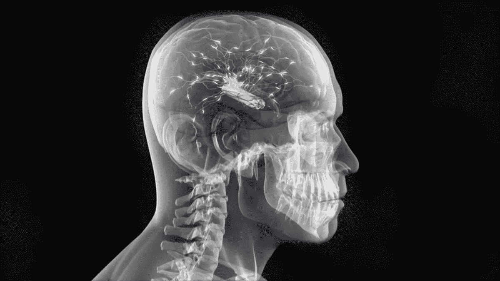

# 反思技术:个人的冒险。~前言~

> 原文：<https://medium.datadriveninvestor.com/rethink-technology-a-personal-odyssey-preface-61868a6b82bd?source=collection_archive---------10----------------------->

# 汤姆·马霍

这是我对一本即将出版的书的介绍，取材于我与硅谷“高科技”40 年的爱恨情仇。在过去的一个世纪里，自然科学和生命科学向我们展示了整个宇宙中显而易见的相互联系:巨大的存在之网。不幸的是，我们的技术在很大程度上仍然基于楔形，将我们与自然、彼此、甚至我们自己分隔开来:存在的大链条。急于建立一个虚拟的，人为的，数字墙来进一步隔离我们的自然只会让事情变得更糟。如果技术是我们利用自然力量为自己谋利的方式，那么是时候重新思考整个技术企业了。因为未来十年将会重新定义人类。*我们现在甚至还没有一个公认的定义，来定义什么是人类。*

“我们已经安排了一个全球文明，其最关键的要素深深依赖于科学和技术。我们还把事情安排得几乎没人懂科技。这是导致灾难的原因。我们可能会暂时逃脱惩罚，但这种无知和权力的易燃混合物迟早会在我们面前爆炸。”—卡尔·萨根,《魔鬼出没的世界》( 1995)

Homo habilis (tool-maker). One million years ago

我将为卡尔·萨根的担忧添加另一种成分。大约 90%的科学家和技术专家今天都在努力创造更大的能力。但是，历史上敦促我们负责任地行动的最伟大的智慧教师中，大约 90%已经去世 1500 多年了。

Homo singularity (on the verge of what?) Ten years from now

虽然我们的时代仍有一些回响:在驾驭了空间、风、潮汐和引力之后，我们将驾驭爱的能量的那一天终将到来。到那一天，人类将在世界历史上第二次发现火。——皮埃尔·德沙尔丹

Homo caritas? One million years from now.

几年前，我在一次由麻省理工学院人工智能实验室和波士顿神学院联盟(包括哈佛大学在内的神学院联盟)联合主办的会议上发言。

那天早上在麻省理工学院，我前面的演讲者是一位著名的天体物理学家，他的演讲呼应了诺贝尔奖获得者史蒂芬·温伯格关于终极理论的*梦想中的结论:对自然基本法则的探索* : “宇宙越是看起来可以理解，它也就越是看起来毫无意义。”

我对这个问题有不同的看法。如果宇宙是无意义的，那么为什么会有像我们一样的有意识的存在来观察无意义呢？那是没有意义的。

当我们在讲台上交换位置时，我问前一位发言者他戴的是不是结婚戒指。“是的，它是。”

“你有孩子吗？”我问。“你爱他们吗？”

“当然，我爱我的妻子和孩子，”他回答道。

“他们给你的生活带来快乐？”

“他们当然有。”

“好的。但你却发现宇宙毫无意义？这是怎么回事？”

“我意识到了这种明显的脱节，”他说。"总有一天，我会对此给予更多的思考."

宜早不宜迟，是开始的好时机。

有了先进的技术，我们淹没在数据和信息中，但是，由于缺乏所有这些数据的意义或价值的基本概念，我们急于获取更多的数据，不为别的，只是为了更快地获取更多的数据。

一个电子每秒钟可以绕地球八圈。而最快的人跑一英里几乎需要四分钟。我们再也跟不上我们的创造力了。

所以，现在的想法是，让我们承认这一点，并与我们的技术融合，成为一个超级智能生物的种族，这样我们就可以走得更快。

甚至有人提出，随着我们智力的提高，我们可能会及时成为宇宙的操作系统。(这些思想领袖有没有走出他们的技术泡沫，先看看我们自己的星球是怎样的？)

按照目前的速度，我们将在未来十年看到比过去一个世纪更深刻的变化。

开发思维-机器网格、生物有机体的 3D 打印、设计婴儿以及将我们的记忆上传到机器从而获得永生的能力的工作正在进行中。(这是只有非常富有的人才能负担得起的，他们可能希望确保他们的继承人无法接触到电源线。)

我们甚至可能创造出不再需要我们的智能、自发电的机器，尽管当你不在这里赚钱的时候，为什么要投资这样一个计划呢？

没有人知道未来十年可能发生什么，这让我们很难为未来做好准备。但如果我们继续目前的轨迹，只关注创新本身和新的投资机会，我们将看起来不像上帝，而更像是走向悬崖的旅鼠。

我们为设计了各种各样的*手段，却几乎没有考虑过*到底是为了什么？*或者*怎么来了？**

是的，我们可以创造一个虚拟现实。但是我们可以没有任何道德感地这样做吗？如果是这样，在这种情况下什么是美德？人工智能(AI)中是否有正宗诚信(AI)的一席之地？

我们正以极快的速度前进，几乎不去想在哪里或为什么，给我们自己、我们的社区和这个星球造成了几乎无法承受的压力。

这是最大的矛盾。最后，医疗保健开始拥抱数字技术，希望控制医疗保健成本的上升。但是，在某种程度上，工作场所、教室和高速公路上由数字引发的压力会导致更多的疾病，我们会得到什么呢？

现在很明显，数字革命的赢家是一小群拥有前所未有的财富、权力和影响力的投资者和企业家。但是除了少数名人 CEO，我们甚至不知道他们的名字。然而他们能数清我们头上的头发。

卡尔·萨根明智地呼吁公众更多地了解这些事情。这对我们现在的情况来说是足够的，但还不够。

近半个世纪以来，我一直在撰写关于技术的文章，其中大部分时间都在观察和参与硅谷的数字革命，我所看到的足以让我相信，我们必须重新思考我们为什么要研究科学和技术。

在没有反科学的情况下发展科学，在没有道德责任感的情况下发展技术能力，我们建造并在具有精确瞄准能力的洲际导弹上部署了成千上万枚核弹头。为了偿还他的债务，我们把公共领域——公共卫生、教育、基础设施——搞得一团糟。这不是意外。

我们拥有上帝般的力量，却没有上帝般的正义感和仁慈，也没有任何限制和方向。

所以(咽)，是时候进行一次范式转变了。

对于发生在 16 世纪的科学革命和 18 世纪的工业/技术革命来说，有必要根据古代卷轴，打破教会对思想和言论的控制。社会必须走过宗教裁判所的恐怖和宗教改革的血腥，以确保言论自由和科学探究。

但是为了促进这一点，科学家和神职人员同意将宇宙一分为二，在人类的想象中创造了一个双宇宙。自然和超自然是分离的，各自成为一个独立的筒仓。展望未来，科学家和技术专家将只与自然和物理打交道。神职人员与超自然和形而上学。

从那时起，科学家不能对他们的发现表示敬畏，也不允许质疑事物的“为什么”，比如为什么存在。

不鼓励工程师质疑他们的产品被客户、赞助商或政府使用的目的，只要求他们满足技术规格、技术规范。

这一切的荒谬之处在于纳粹种族灭绝者在纽伦堡使用的辩护:“我们只是服从命令！”令人难以置信的是，在经历了上个世纪的种种暴行之后，这仍然是*名副其实的*防御。

自那以后，我们在许多领域取得了惊人的进步，但与此同时，对错问题变得越来越无关紧要。以至于现在甚至对错这个概念本身都受到了质疑。当所有的价值都被接受为同等价值时，那么任何东西还有价值吗？

这种技术能力与道德或社会责任的脱钩是不可持续的。即使是现在，我们的很多技术都在修复早期技术带来的意想不到的后果，比如汽车尾气对环境的破坏。

我们即将到来的能力将让我们重塑人类进化的方向，未来，人类进化可能会更多地受到“智能设计”的指导，而不是传统的自然选择。

这种分歧在医学实践中最为明显，尽管现在这种情况开始改变。医生的培训是如此以科学为导向——学习抗生素、骨骼扫描和核磁共振成像——以至于几乎没有时间去研究生命的最终意义和目的。为此，我们有神职人员，他们使用诸如*超越、拯救*和*启蒙*这样的术语。内科医生和牧师不能协调他们的治疗，因为他们没有共同语言。

几年前，我为《T4》《纽约时报》的一个全国联合医疗建议专栏代笔。我在当地大学生物医学图书馆进行了几个月的研究，之后我告诉图书馆长，我手头所有的描述如何治愈创伤的书籍、期刊和专著给我留下了深刻的印象。

但是，我问她，探索为什么我们有治疗艺术的书在哪里？检验生命有价值，应该延长的假设的书在哪里？她说这样的问题不是医生培训的一部分。我问为什么不。她问我是否想取消我的图书馆特权。

我说不，随它去吧。尽管如此，有趣的是我们称内科医生为*医生——意思是老师而不是治疗者——然而这种训练排除了终极意义的问题；生命有没有值得保存的内在价值？当然“原始”文化是这样认为的，因为萨满祭司和治疗师是同一个。*

正是这样的经历让我越来越意识到我们现在都生活在认知失调中。

(而且我真的*讨厌*认知失调。我去了一所天主教高中，那里的 ROTC 是核心课程的一部分。在 ROTC，每天一小时，我们学习如何杀人。在接下来的一个小时的宗教课上，我们被告知杀人是错误的。四年来每天如此，我能感觉到我的大脑变成了燕麦粥。那时我下定决心，我再也不会发现自己一只脚在逆流而上的船上，一只脚在顺流而下的船上。因为最终，这样一个人，或者社会，将会被撕成两半。)

那么，在我们从自然跃进一个勇敢的新的数字世界之前，我从哪里开始建议我们重新思考整个技术概念呢？在这个新的数字世界里，可能没有重来或 B 计划。

20 世纪 70 年代初，在看到文字处理允许的功能后，我被新数字技术的前景迷住了。那时我已经在打字机上写了好几部小说，而重大的重写意味着要重新打整整 300 页的手稿。文字处理对作家来说是天赐良机。我认为这种数字骗术越多越好。

(禅的时刻:我们看到文字处理背后的工程技术。想一想把一条铅放在一根木棍中间，制造出像铅笔这样基本的东西需要什么技巧。那是高科技低科技。)

20 世纪五六十年代，我在中西部长大，1970 年，我搬到英国，在伦敦电影学院学习。回到美国后，我在圣保罗明尼阿波利斯成为了一名纪录片制作人。

1974 年，经济出现了一个小问题，被称为“滞胀”，这意味着那些曾拿出六位数预算来制作公共事务社会纪录片的公司，现在拿出五位数预算来制作工业电影。

那年春天，双城的一家大型电脑公司 Univac 邀请我投标为他们制作一部电影。

在我们的第一次会议上，QA 的高级副总裁向我解释说，这部电影的目的是“向为我们提供 DRAMs 和 SRAMs 的主要芯片供应商展示六项适马和 ISO 9000 合规性的重要性，从而提高可交付产品的 QA。”或大意如此的话。

我不知道他在说什么，更糟糕的是，我不知道这和我之前接触过的任何东西有什么联系:在家里，在课堂上，在教堂里，在社区里。并不是他或者公司反驳了历史或者文学或者思想的价值。但是这些事情与任何关于生产动态随机存取存储器的质量保证的讨论都无关。

我告诉这位高管，他应该找一个了解他业务的电影制作人。“没有，”他说。“但你看，你知道你的业务，我们知道我们的，我们会做到这一点。”

为了让公司运转起来，他向我敞开了公司的大门，所以我可以探索公司业务的所有领域，以便在电影中恰当地反映出来。我看到了 Univac 当时在做的早期研究，研究现在的消费产品:计算机生成的音乐、艺术、语音识别、语音合成、地图绘制、机器智能、人工智能软件……

为了完善我的教育，并学习一些关于半导体业务的知识，Univac 把我送到英特尔，一家位于加利福尼亚州圣克拉拉的年轻半导体公司，接受为期一周的在职培训。到那个夏天结束时，我可能已经获得了一个外行人所能获得的最好的计算机(Univac)和半导体(Intel)教育。

我的时机无可挑剔。英特尔最近推出了第一款微处理器“芯片上的计算机”，这可以说是自印刷机以来最重要的发明。就像古腾堡的设备一样，重要的不是这个东西本身，而是它所带来的触及生活方方面面的无数应用。

1974 年，电子数字革命正如火如荼地进行着，它需要许多人能够将技术规范转化为投资者、员工、消费者、政府监管者等可以理解的文字或图像。

那年夏天，尼克松总统面临弹劾，我了解了 mega 和 giga 微米和纳米。

像 20 世纪 60 年代的许多大学生一样，我对计算机有一种文科偏见。在那些校园抗议的日子里，一张流行的海报上写着:*不要弯曲、折叠、旋转或残害学生:*点击电脑打孔卡上的指令。

因此，当我在 Univac 的联系人告诉我，他公司的计算机最终将使医疗保健更实惠、航空旅行更安全、教育更普及时，我印象非常深刻。

那年夏天，当我读到一本名为《T2:禅宗和摩托车保养艺术:价值观探究》的新书时，我的印象更加深刻。原来作者罗伯特·m·皮尔西格当时也是 Univac 的一名科技作家。

还有一些事情增强了我对该行业良好意愿的信心。早些年，我接受不同公司的任务，采访他们的创始人，当时即将退休的早期行业先驱:威廉·休利特、威廉姆·肖克利、弗雷德·特曼、普雷斯珀·埃克特以及其他一些鲜为人知的人。

这些人敏锐地意识到他们生活的更大的世界，以及他们的工作在实验室之外的影响。在第二次世界大战和随后的冷战期间，他们看到了他们的技术进步如何帮助盟军赢得了对纳粹的伟大的道德讨伐，并将苏联将死。

他们工作的质量和可靠性关系到人类文明的未来。他们的日常现实不是虚拟的或人为的；他们没有设计游戏让孩子们在应该在外面玩耍的时候呆在室内；而且他们肯定不会浪费时间去设计微处理器驱动的网球鞋。

不幸的是，我在 20 世纪 70 年代中期与电子工程师和计算机科学家的早期接触给我带来了从未实现的期望。这位 Univac 高管所期望的改善医疗保健、教育和航空旅行的目标从未实现。事实上，正是这些服务——以及其他许多有益于公共利益的服务——现在已经年久失修。

几年后，我搬到了旧金山湾区，在当时被称为硅谷的地方工作。令我惊讶和失望的是，在我参与并帮助传播数字革命的几十年中，我再也没有听到过表示 T3 或 T5 的 T4 价值观的 T2。

我没有发现资源来帮助我找到我的人文背景和我的技术工作场所之间的一些联系，而是亲眼看到了追赶戈登·摩尔 1965 年技术能力增长定律的狂热是如何让我们失去做出深思熟虑的决定或考虑我们努力的后果的能力的。

在圣克拉拉山谷拔地而起的新的高科技办公园区中尤其如此，直到最近，这里还被称为“心之欢乐谷”自我强加的上市时间期限鼓励了同事之间的敌意(称为“建设性对抗”)，而免费的现场美食晚餐让工程师们吃得好，工作效率高，不会因回家与家人团聚而分心。这一切都太多了。路过一间会议室，听到一名男子坐在暗处，对另一名员工的待遇哭泣，这种情况并不少见。然后是自杀事件…

自从 20 世纪 90 年代初引入互联网以来，生态系统进入了超高速运转。不可思议的财富的可能性创造了不可思议的胡说八道。我见过一些商业宣传，归结到核心信息就是:

**新公司的商业/社会使命声明**

**让世界变得更美好；**

这样做能赚几十亿美元；

**不一定按照那个顺序。**

现在喝可乐喝得太多了。我遇到的那些穿着白色短袖衬衫、戴着笔套的老工程师，对清晰和精确非常执着。他们今天会用“棒极了”、“充满激情”和“思想领导力”这样的词来堵嘴。在他们看来，治愈癌症是了不起的，但是准时出席会议是“满足期望”，而不是了不起。

近年来，我听了许多新的商业推销，我惊讶于有这么多的解决方案在寻找真正的问题来解决。我们真的需要让监控更加无处不在，或者让无人机武器更加精确吗？

如此多的创新和投资被浪费在琐碎和致命的事情上，而有如此多的真正的人类问题没有得到解决和/或不适合数字解决方案。(而且，明确地说，我知道数字技术正在做许多好的、必要的、有益的工作。不幸的是，它通常不会像壮观和火焰熄灭那样曝光。)

公众狂热地拥抱数字生活方式，这让我有些困惑:

o 科技行业并不“干净”圣克拉拉县的地下水曾经是一个繁荣的农业区，多年前沉积的化学物质产生了大量的癌症羽状物。没有丑陋的烟囱；只是难看的下水道。

o 这个行业在让消费者感觉自己很愚蠢方面做得非常出色，就像《傻瓜的窗户》一样。但是当消费者被要求点击启动以关机时，他或她并不是虚拟的。

o 一些海外制造工厂的工作条件比狄更斯描述的任何黑暗、邪恶的工厂都要糟糕。

o 人类制造的问题——战争、饥荒、气候变化——现在是如此令人沮丧和棘手，数字产业已经想出了一种方法来实现无罪恶感的分心:通过创建虚拟、增强和人工的数字世界，这样我们就不必看到我们对自然世界做了什么。(顺便忘了大自然总是最后才蝙蝠。)

o 三十年前，互联网还是一件新奇的事物。今天，它是人类文明的中枢神经系统，许多东西都依赖于它。如果它下跌哪怕一天(这并非不可想象)，全球混乱将是灾难性的。至少，任何家庭或企业依赖于持续在线能力的人都应该准备一周的食物、水、现金和其他物资。以防万一…(这不是一个激进的想法。这也是提供给生活在地震带的人们的建议，比如旧金山湾区。)

o 急于将一切都与物联网(IoT)挂钩是极端鲁莽的。我来细数一下。a)给烤面包机添加“智能”并不会让面包味道更好。b)任何链接到网络的东西都是可以被黑客攻击的。c)所需的能量将是惊人的。

从商业角度来看，物联网是最终的财源。卖一个电子芯片放在世界上所有的东西上，让它变得“聪明”我明白了。很高兴见到你。

但潜在的假设是，通过积累足够的数据，我们可以比自然更好地管理地球。所以，我回到我最初的观点:我们淹没在数据中，但渴望知识或智慧，或者只是简单、老式的常识或谦逊。也许在中西部长大让我对此看得更清楚。

在这本书里，我想做的是重新考虑和反思技术本身的概念，而不仅仅是数字技术。

并不总是这样。在 2500 年前的古典时代，人们通过“科学”来了解自然的真相。他们承诺“技术”让*做出*漂亮的东西，让*做*好事。

当然，那时自然也被用于更致命的目的，比如建造战争机器或者用锁链锁住臣民。但至少在理论上，科学技术在当时被理解为*达到*真善美的目的*的手段*:古代世界的三位一体。我们不仅失去了这一点，我们甚至没有意识到有这样的东西可以失去。

这本书是为那些希望重新设想和重新设计服务于人类和人道目的的工具的人而写的，目的是将温和和同情带回他们的个人和集体生活。

根据我小时候在学校、教堂、家里和社区里学到的东西，我相信技术的正确目的——事实上，所有人类事业的正确目的——是帮助我们在最真实的意义上快乐和平静。历史上最聪明的男人和女人都同意，通往真正幸福的道路是过一种适度、同情和善良的生活。

相反，在高度发达的技术社会中，我们在很大程度上将个人主义凌驾于公共利益之上。正如何西阿所预言的，我们种下了风，收获了旋风:焦虑、忧虑、沮丧的个体；无权无势的群体被他们全能的统治者专横地对立起来；20 年后可能无法居住的星球。

是时候让草根阶层重新思考我们为什么以及如何使用我们的工具，而不仅仅是电子、数字工具了。这一努力肯定不会自上而下地得到授权。事实上，它在每一步都会受到那些“控制权力杠杆”的人的挑战。强大的人声称依靠*创新*繁荣，但他们对创新的定义仅限于维持和扩大他们对我们生活的控制，同时让我们相信我们是“自由的”我们没有。

在广义画笔中，这里的材料考虑了三个方面:

第一部分是技术简史，随着时间的推移，人类学会了如何利用我们的肌肉、感官、大脑和意识来取得越来越大的成果。在古代，既定的目标是实现自我认知。现在往往只是为了早点发大财，趁年轻套现。

第二部分检验新科学揭示了什么。直到 20 世纪，我们曾经认为知识的光谱是一条直线:一边从物理延伸到化学；到生物；医学；心理学；社会科学；法学，文科；美术；哲学，并最终走向另一端的神学。

但是越来越多的自然和生命科学揭示了知识的光谱不是一条直线，而是弯曲的。它会向后弯曲。

这样，如果你足够深入地研究物理学，你最终会面对神学的基本问题:*为什么？同样，如果你现在对神学研究得足够深入，你会来到神秘的量子领域，在那里日常生活的公认现实被颠覆了。*

物理学和形而上学相遇的地方，自然和超自然合二为一的地方，就是意识。

在上个世纪，科学揭示了我们生活在一个宇宙中；一种存在。可能还有一个*意识*宇宙。它不是一个分为物理和形而上学的双行诗；自然的和超自然的。那些古老的划分是我们原始思维的产物，而不是事物的本来面目。他们该走了。

正如我们越来越了解的那样，新的科学发现表明*每件事情*都与*每件事情*相关联，宇宙事实上可能是全息的——每个部分包含整体——或者甚至可能是一个单一的波形。如果是这样的话，那么基于贪婪、收益和自我膨胀的有害的、陈旧的、破坏性的心态和生活方式可能最终会被消灭，或者至少会被超越。

第三部分重新思考这些来自科学的新见解如何要求我们重新思考我们工具的设计和使用如何促进或阻碍我们在宇宙中的归属感。

如果这些科学上的新概念随着时间的推移被反复证实，那么我们需要重新想象我们使用的工具，这些工具是基于科学揭示的自然原理。

我们的许多工具都是楔形的:矛、斧、箭、子弹、导弹。同样，我们的许多神也是楔形的:“你是我的选民，所有其他的神都是假的，尤其是女性的。”在很大程度上，我们对上帝和工具的理解是相辅相成的，正如巴别塔的故事所描述的那样(创世纪 11:1-9)。

巴别塔的人们用他们的工程技术建造了一座塔来寻找和了解上帝。这不是上帝的计划，所以他给那些人带来了痛苦:语言的混乱和由此产生的社会不和谐。

即使在全球电信时代，语言的混乱仍然伴随着我们，因为它们促进了虚假新闻和煽动性帖子的传播，为了第三方的利益而使彼此对立。

基于这样的故事，我们在历史上花了很多时间制造工具来征服和统治有时令人恐惧的自然世界，并获得对那些与我们不同的人的权力和权威。

如果这是“好书”里的信息，我不想看“坏书”

令人欣慰的是，我们越来越善于听到大自然向我们呼喊:不存在伟大的存在链，每一个环节都拥有对下面环节的生杀大权。相反，我们存在于一个巨大的存在之网中；每个节点对整体至关重要。

现在，我们需要做得更好，将这些互联性的见解融入到我们设计和使用的工具中，以体现我们自己、彼此和自然之间的互联性。

第三部分沿着这些思路提供了一些建议，但它肯定不是这个主题的最后定论；勉强算是第一个。这没关系，有时仅仅是框架问题就足够了。

对于我们和我们的后代来说，时间已经不多了，他们需要将冷静和同情重新融入我们的工具和技术中，并将技术知识与自我知识重新联系起来，将技术能力与道德和社会责任重新联系起来，以从事奥地利诗人赖内·马利亚·里尔克所说的“世界的伟大工作”

因此，履行*塔木德的戒律，*在许多其他的智慧传统中回响:*“不要被世界的巨大悲痛所吓倒。伸张正义，现在。爱怜悯，现在。谦虚地走，现在*。你没有义务完成这项工作，但也不能随意放弃。”

2018，汤姆·马霍

插图的版权归原版权所有者所有。