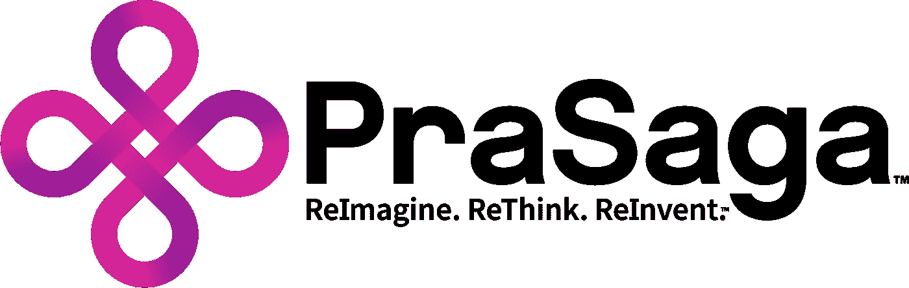

# 如果我们重新审视账户的概念，让所有区块链账户都变得智能，会怎么样？

> 原文：<https://medium.datadriveninvestor.com/rethinking-the-blockchain-account-concept-e974382e291f?source=collection_archive---------7----------------------->

**重新思考区块链账户概念**

比特币引入了去中心化、基于共识的账本概念，以及如何用它来代表一种加密货币。比特币使用简单的脚本语言来实现分类账概念的管理，实现分类账条目(即账户)之间的加密货币交换。

以太坊通过将简单的脚本语言概括为图灵完全语言，同时使用“gas”的概念来解决图灵完全语言中固有的非终止性问题，从而增加了去中心化的、基于共识的分类帐概念。

 [## 正在改变行业的 5 个真实世界区块链应用——数据驱动的投资者

### 除非你一直生活在岩石下，否则我相信你现在已经听说过区块链了。而区块链…

www.datadriveninvestor.com](https://www.datadriveninvestor.com/2019/02/13/5-real-world-blockchain-applications/) 

我想每个人都会同意这两个概念在世界范围内产生了惊人的影响。尽管这些概念很伟大，可能是历史上的一个分水岭，但我们认为区块链技术还有另一个进化阶段，这将进一步增加它的采用。

为了解释我们的新技术概念，让我们从区块链技术和更好理解的电子表格(例如 MS Excel、Google Sheets)之间的一个简化的、有点不精确的类比开始。

**电子表格类比**

如果我们将比特币视为单个(虚拟)电子表格，我们可以将每个账户视为电子表格中的一行。账户之间的比特币转账是行与行之间的转账。付费脚本散列(“P2SH”)可以被认为具有与个人帐户的行上的个人单元格相关联的脚本。因为这是一个虚拟电子表格，一个有用的特性是行数基本上是无限的。这意味着用户可以创建任意多的帐户，从概念上讲，虚拟电子表格中的行数是任意的。我要指出的是，除了与比特币个人转账相关的 P2SH 之外，账户存储状态的概念不是比特币的一部分。

以太坊引入了智能合约的概念。如果比特币是一个单一的虚拟电子表格，我们可以认为以太坊智能合约引入了多个虚拟电子表格。每个智能合同都是自己的虚拟电子表格。令牌智能合约(即 ERC 20)具有包含账户和每个账户拥有的令牌量的数组。因此，每个令牌智能合约都可以被认为是每个帐户都有一行以及相关的令牌计数。由于代币智能合约由区块链上的个人账户代表，并且账户基本上是无限的，所以在以太坊区块链上可以有无限数量的个人智能合约账户，代表独特类型的代币。应当理解，每个智能合约本质上都是独立的、孤立的。也就是说，尽管一个智能协定可以显式调用另一个智能协定，特别是作为库调用，但没有共享代码的通用方法。要在以太坊上创建新的令牌或其他数据表示，必须注册新的智能合约。

总之，从账户的角度来看，比特币将账户作为一个单一的全球虚拟电子表格的条目引入。以太坊推出了智能合约账户，支持多个虚拟电子表格，而普通账户继续更像比特币账户。

如果我们重新审视客户的概念，让所有客户都变得智能，会怎么样？

在以太坊中，智能合约有与之相关的状态数据。如果每个帐户都有与之相关联的状态会怎样？

如果一个帐户可以在其状态中创建和包含任意对象，那会怎样？

如果使用面向对象的范例，这些对象的代码来自类，并且这些类在区块链上注册一次，然后被帐户重用，会怎么样？

如果支持面向对象的继承概念，使得对象是类的实例，而类又可以从祖先类继承大部分代码，那会怎么样呢？

**分歧**

拥有对象而不仅仅是本地令牌的帐户会有什么后果？

在不需要注册新代码的情况下创建(实例化)新对象会有什么后果？

一旦在区块链上注册的新类成为所有用户可以立即使用的区块链的基本组成部分，会有什么影响？

考虑到这些，我们需要提出我们希望使用区块链的新方法:

作为区块链的用户，我希望能够在我的区块链账户上创建新的资产，并能够出售它们。同样，我希望能够购买其他资产并转售。我希望能够在市场和交易所以及个人对个人(即钱包对钱包)进行此类交易。

由于我无法提前知道我可能购买或出售的资产类型，所以我希望所有资产之间有一些共性，但支持每种类型资产的独特功能。我希望我的帐户支持所有资产，不管是什么类型，我希望我的钱包能够支持所有资产，不管是什么类型。作为用户和资产所有者，我不想了解或接触软件代码。我确实想确保管理我的资产的代码是有效的，但是我不想看到或接触这些代码，就像我不想看到或接触运行我的手机或笔记本电脑的代码一样。事实证明，在计算机科学中，我们用面向对象的概念和类继承解决了这个问题。

如果帐户可以有任意的资产对象与之相关联，并且这些对象是包含管理资产的代码的类的实例，那么我们可以向用户交付这些功能。这是帐户拥有对象、对象作为类的实例以及类作为区块链上代码的主要概念的结果。

**saga chain 账户模型**

SagaChainAccount 模型概括了比特币中首次引入的账户概念，并扩展到包括以太坊的智能合约账户，以包括状态数据在内的所有账户条目，而不仅仅是智能合约。在 SagaChain 上，每个帐户条目现在都包括一个状态哈希，而不仅仅是智能合同帐户。本质上，这让每一个账户都变得“聪明”。现在，每个帐户都可以包含代表资产的对象。此外，通过面向对象的继承，所有资产对象可以从父类(例如，资产类)继承公共行为。复杂的关系可以很容易地由每个对象实例的状态信息来表示，这些信息是在每个帐户的状态信息中捕获的。因为帐户本质上是无限的，所以可以有无限数量的帐户包含存储在区块链上的可继承类的对象实例和代码。

回到我作为用户永远不需要接触或明确了解代码的愿望，通过继承的魔力，我可以通过向我拥有的帐户发送事务，引用我想要创建的对象的类型，简单地创建已知类型(即类)的新资产对象。此外，我可以通过发送引用这些对象的事务来买卖这些资产对象。我不需要作为用户了解比特币的 Forth 脚本语言，或者以太坊的 Solidity 智能合约语言。

Prasaga SagaChain 通过引入以下配套技术，创造了这种新的区块链、代币和资产所有权方法:

SagaChain 可扩展区块链对象模型(SagaOS)

可扩展智能对象资产(“XSOA”)类

SagaChain 可扩展分片共识协议

要了解更多关于 Prasaga 的专利技术，请通过我们在 prasaga.com 的网站联系我们