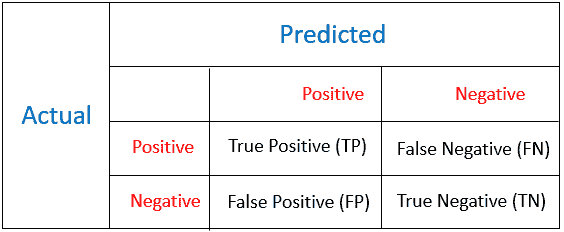

# 重新思考欺诈检测的正确指标

> 原文：<https://medium.datadriveninvestor.com/rethinking-the-right-metrics-for-fraud-detection-4edfb629c423?source=collection_archive---------1----------------------->

[](http://www.track.datadriveninvestor.com/1B9E)

精确度、召回率、F1 分数可能不会真正起作用…

本文将介绍传统的二元分类指标，为什么它们不起作用，新的成本函数，以及使用 sklearn 和 TensorFlow 在逻辑回归和 DNN 中实现新的损失函数。


## 介绍

欺诈检测在许多行业中扮演着越来越重要的角色:保险、银行、零售、电子商务等等。捕获更多欺诈行为并为企业节省更多资金的能力是我们评估欺诈检测模型性能的标准。然而，要将其转化为数据科学问题，特别是有监督的机器学习问题，人们在建立模型时也会选择错误的指标。

在传统的二元分类问题中，我们试图最小化损失函数，如 Log-Loss，或者最大化度量，如 F1-score，accuracy 或 AUC 等。这对于数据科学来说是完全正确的，但对于现实世界的业务问题来说却不正确。

[](https://www.datadriveninvestor.com/2019/03/03/editors-pick-5-machine-learning-books/) [## DDI 编辑推荐:5 本让你从新手变成专家的机器学习书籍|数据驱动…

### 机器学习行业的蓬勃发展重新引起了人们对人工智能的兴趣

www.datadriveninvestor.com](https://www.datadriveninvestor.com/2019/03/03/editors-pick-5-machine-learning-books/) 

首先，由于不平衡的数据集，准确性不起作用。在欺诈检测问题中，通常，我们有 99%以上的非欺诈数据和不到 1%的欺诈数据。所以如果我们把所有的数据点作为一个正常类来预测，我们至少会得到 99%的正确率。这就是所谓的准确性悖论。

其次，F1、AUC 和 log-loss 也不起作用。为什么？在深入探讨原因之前，让我们回顾一下这些指标的定义。如果您已经熟悉它们，请随意跳过这一部分。

## 传统指标概述

当该模型对二元分类问题做出决策时，它将基于测试独立特征来预测它是正面的还是负面的，换句话说，是欺诈还是非欺诈。

鉴于这一事实，该模型可以正确预测。如果它预测是肯定的，我们称之为**真肯定(TP)** 。如果它预测否定给定它的否定，我们称之为**真否定(TN)** 。但是，模型会出错:**第一类错误和第二类错误**。

**第一类错误，也称为假阳性(FP)** ，是在给定数据为阴性的情况下，错误地识别为阳性的数据数量。

**第二类错误，也称为假阴性(FN)** ，是在给定数据为阳性的情况下，错误识别为阴性的数据数量。



还有其他情况:模型在全部真阳性中正确预测阳性，称为**召回或灵敏度或 TPR(真阳性率)**，模型在全部真阴性中正确预测阴性，称为**特异性或 TNR(真阴性率)**模型在全部被识别为阳性的项目中正确预测阳性，称为**精度。**

F1 分数是精确度和召回率的组合-2 *精确度*召回率/(精确度+召回率)，而精确度是正确分类的总项目数(TP+TN) / (TN+TP + FP+FN)。

AUC 是当我们随机选取一个阳性病例和一个阴性病例时，根据分类器，阳性病例的级别高于阴性病例的概率由 AUC 给出。数学上等于 ROC 曲线下的面积。请注意，AUC 独立于为分类设置的阈值，因为它只考虑每个预测的等级，而不考虑其绝对值。

## **新的成本函数**

现在让我们回到这个问题:为什么他们不能很好地进行欺诈检测。因为他们认为每个错误的代价都是一样的。在现实世界中，这完全不是真的。例如，客户 A 进行交易，系统预测这是一个欺诈订单，然后取消订单。公司的成本是客户 A 与公司联系交易时的客户服务费。客户 B 进行了欺诈交易，系统批准了该交易。那么成本就是银行和订单价值的拖欠款项。

考虑到这一点，对于不同的预测产出，我们会有不同的成本。

对于真正的正面，该模型预测这是一个欺诈行为，因为它确实是一个欺诈行为，我们正确地取消了订单，该公司将没有成本或只有管理费。

对于真正的否定，该模型预测这是一个好订单，如果它真的是一个好订单，我们将批准它，没有成本发生。($0)

对于假阳性，该模型预测这是一个欺诈，因为它是一个好订单，我们将需要支付客户服务费(以及失去客户的潜在成本)。

对于假阴性，模型预测这是一个好订单，因为它是一个欺诈，我们错误地批准了订单，并需要支付退款，同时损失订单金额。(**示例相关**)

因此，为了评估模型在成本方面的性能，我们需要使用以下公式计算所有输出的总成本:


我们可以通过将成本除以 max_cost 得到一个比率(cost _ ratio ), max _ cost 是当我们预测所有事情都为负时的成本(批准所有订单！).现在，我们的目标是最小化成本比率。

## **修改逻辑回归中的损失函数**

记住逻辑回归的标准损失函数是对数损失，它同等地惩罚假阴性和假阳性。

```
import scipy as sp
def logloss(act, pred):  
    """ Vectorised computation of logloss """      epsilon = 1e-15  
    pred = sp.maximum(epsilon, pred)  
    pred = sp.minimum(1-epsilon, pred)  

    ll = sum(   act*sp.log(pred) +   
                sp.subtract(1,act)*sp.log(sp.subtract(1,pred)))  
    ll = ll * -1.0/len(act)  
    return ll
```

在我们新的代价函数中，我们需要不同地惩罚假阴性和假阳性。


```
import scipy as spcost_fp = x
cost_fn = df['order_amount']
cost_tp = x
cost_tn = 0 def logloss(act, pred):  
    """ Vectorised computation of logloss """ epsilon = 1e-15  
    pred = sp.maximum(epsilon, pred)  
    pred = sp.minimum(1-epsilon, pred)  

    ll = sum(   
      act*(sp.log(pred)*cost_fn+sp.log(sp.subtract(1,pred))*cost_tp) 
+   sp.subtract(1,act)*(cost_fp*sp.log(sp.subtract(1,pred))+sp.log(pred)*cost_tn)  

    ll = ll * -1.0/len(act)  

    return ll
```

## 修改 DNN 模型 Keras 张量流中的损失函数

在 Keras 中，损失函数**必须只接受两个参数** : `y_true`和`y_pred`，它们分别是目标张量和模型输出张量。但是如果我们希望我们的损失/度量依赖于这两个之外的其他张量呢？我们可以使用[函数闭包](https://en.wikipedia.org/wiki/Closure_(computer_programming))，在这里我们创建一个返回`y_true`和`y_pred.`函数的函数

```
# Build a model
inputs = Input(shape=(128,))
layer1 = Dense(64, activation='relu')(inputs)
layer2 = Dense(64, activation='relu')(layer1)predictions = Dense(10, activation='sigmoid')(layer2)
model = Model(inputs=inputs, outputs=predictions) # Define custom loss
def custom_loss(cost_FP, cost_TP, cost_TN, cost_FN):
    def loss(y_true,y_pred):
          cost = y_true * K.log(y_pred)*cost_FN 
               + y_true * K.log(1-y_pred)*cost_TP
               + (1-y_true) * K.log(1-y_pred) * cost_FP
               + (1-y_true) * K.log(y_pred) * cost_TN)
        return -K.mean(cost,axis=-1) return loss# Compile the model
model.compile(optimizer='adam',                      loss=custom_loss(cost_FP, cost_TP, cost_TN, cost_FN))# train
model.fit(data, labels)
```

**参考:**

[](https://towardsdatascience.com/advanced-keras-constructing-complex-custom-losses-and-metrics-c07ca130a618) [## 高级 Keras —构建复杂的定制损失和指标

### 在 Keras 中构建多参数自定义损失和指标的简单技巧

towardsdatascience.com](https://towardsdatascience.com/advanced-keras-constructing-complex-custom-losses-and-metrics-c07ca130a618) [](https://medium.com/usf-msds/choosing-the-right-metric-for-evaluating-machine-learning-models-part-2-86d5649a5428) [## 为评估机器学习模型选择正确的度量标准—第 2 部分

### 本系列的第二部分关注分类标准

medium.com](https://medium.com/usf-msds/choosing-the-right-metric-for-evaluating-machine-learning-models-part-2-86d5649a5428)