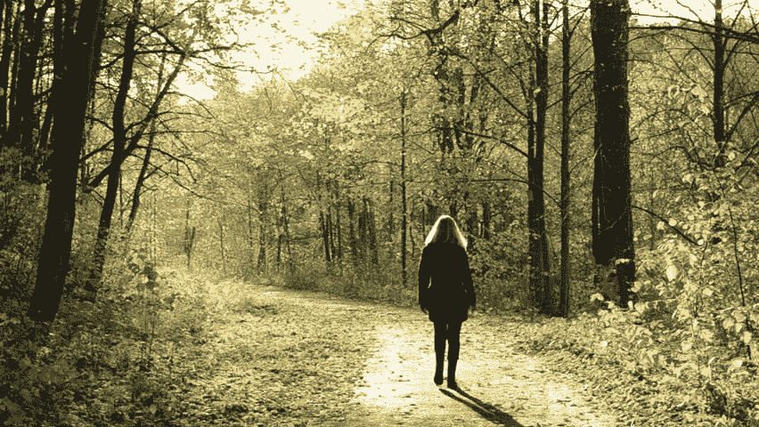

# 后退才能前进

> 原文：<https://medium.datadriveninvestor.com/retreat-to-move-forward-148e8e01229c?source=collection_archive---------15----------------------->

我们已经 110%忙了。我们怎么可能找到两天时间离开，或从我们的生活中撤退？这肯定只是自我放纵吧？即使我们能解决这个问题，我们怎么撤退？默默？靠我们自己？在托尼·罗宾斯的活动中，是在一个小团体中还是和 1000 多人一起？我们怎么知道这对我们有什么好处？为什么我们本能地对那些“撤退”的人感到嫉妒

在商业世界，静修，或者更普遍的说法是“异地”，由来已久。一个从日复一日的救火工作中抽身出来，进行更具战略性的思考和提前计划的机会。我工作过的最有效率的公司每年都会这样做两次。这个想法是从“工作”中抽出时间来做“生意”。那么，为什么我们不把它应用到我们的生活中呢？致力于我们自己而不是总是在我们自己身上？

当我们被电子邮件、工作、家庭和朋友的需求所吞噬时，很难在匆忙中做出重大决定。你自己也很难做出重大决定，很难清晰地做出好的决定或改变。当我们刚刚度过每一天时，很难制定计划，很难找出是什么让我们感到不安、焦虑和有点“不在状态”。

所有这些都让我强烈建议你每年至少花一到两天时间锻炼自己一次。在《爱的艺术》一书中，埃里希·弗洛姆认为“只有对自己有信心的人才能对他人忠诚”。本质上，他是在指出，除非你爱自己，先照顾好自己，否则从长远来看，你不可能为他人服务。

没有你，就没有别人；在你的社区中没有关系或影响。继续闭关还显得自我放纵吗？不。这似乎是绝对必要的。有空并向他人展示意味着先把自己的事情处理好。

我刚刚结束了为六位创始人首席执行官举办的 24 小时务虚会。整个经历对团队和我来说都是难以置信的强大。让我震惊的是看着他们如此迅速地结合在一起，并以我无法预料的方式互相帮助。虽然我提供了结构、一些知识和持续的挑战，但大部分影响来自团队内部。在整个静修期间，他们分成不同的小组，他们都发现这短暂的经历改变了他们的生活。我们着眼于定义我们的生活目标，提高我们自己的表现(围绕饮食、睡眠、锻炼和精神状态)，最后是我们生活中的关键关系。

一开始，每个人都上交了手机，这让气氛变得更加紧张。24 小时的技术休息确保了每个人都以一种他们已经忘记的方式在场。完全不妥协。

虽然我毫不怀疑静默、个人或大团体静修有巨大的价值，但不知何故，我并没有准备好与一个主持人一起工作的小团体的力量。我已经在 1-2-1 的环境中指导过一些参与者，很快就发现他们从团队中获得了在我们的会议中无法获得的见解。个人和团队工作的结合非常引人注目。

这不是塞给我的退路。这是一个撤退的句号。甚至和朋友或你的狗一起散步三个小时也是一种撤退的形式。创造和占据空间让我们的思想和身体有足够的空间去解决隐藏在日常生活中的棘手问题。事先做些准备真的有助于充分利用你的撤退时间。以下是我们在务虚会上提出的问题。

对你来说什么感觉是现实的？半天，一个通宵？你一个人还是和朋友一起？是别人组织的还是你组织的？重要的是你拿出你的日记——现在——划出一些时间并承诺撤退。给自己一份创造你想要的未来的礼物。

爱德华

最初发表于[这里。](https://edhaddon.com/2018/11/12/retreat-to-move-forward/)