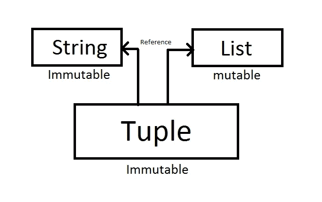

# 深度 Python 元组

> 原文：<https://medium.datadriveninvestor.com/reveal-the-secret-of-pythons-tuple-628b4950ecfb?source=collection_archive---------16----------------------->

## 深入 python 元组


“black and gray laptop computer turned on” by [Markus Spiske](https://unsplash.com/@markusspiske?utm_source=medium&utm_medium=referral) on [Unsplash](https://unsplash.com?utm_source=medium&utm_medium=referral)

# 内容:

1.  介绍
2.  优势
3.  基本操作
4.  魔法
5.  如何用元组提升性能
6.  结论

# **简介**

Tuple 是被归类为**序列**的 python 数据类型之一，它由逗号分隔的对象组成，如字符串、数字、列表甚至另一个 tuple。元组是 [**不可变的**](https://docs.python.org/3/glossary.html#term-immutable) ，这是它与链表的区别。以下是创建元组的一些示例:

```
# Example 1
>>> x = ("1", 2, [3])
>>> print(x)
('1', 2, [3])
>>> type(x)
tuple# Example 2
>>> a = "1"
>>> b = 2
>>> c = [3]
>>> y = a, b, c
>>> print(y)
('1', 2, [3])
>>> type(y)
tuple# Example 3 - trick for create a tuple that consists only one object.
>>> a = "1"
>>> y = (a)
>>> type(y)
str
>>> a = "1"
>>> y = (a,)
>>> type(y)
tuple
>>> print(y) # When you print it will show the comma
('1',)
>>> print(y[1]) # But when you want to get the blank after comma, it will throw an error. So don't worry, it still consists of one object.
**IndexError**: tuple index out of range
>>> len(y)
1
```

# **优点**

*   元组[可以比列表更快**赋值。你可以自己证明。**](http://zwmiller.com/blogs/python_data_structure_speed.html)

```
>>> from dis import dis
>>> def createList():
        x=[1, 2, 3, 4, 5, 6, 7, 8, 9, 10]
        y=x[5]
>>> def createTuple():
        x=(1, 2, 3, 4, 5, 6, 7, 8, 9, 10)
        y=x[5]
>>> dis(createList)
  2           0 LOAD_CONST               1 (1)
              2 LOAD_CONST               2 (2)
              4 LOAD_CONST               3 (3)
              6 LOAD_CONST               4 (4)
              8 LOAD_CONST               5 (5)
             10 LOAD_CONST               6 (6)
             12 LOAD_CONST               7 (7)
             14 LOAD_CONST               8 (8)
             16 LOAD_CONST               9 (9)
             18 LOAD_CONST              10 (10)
             20 BUILD_LIST              10
             22 STORE_FAST               0 (x)

  3          24 LOAD_FAST                0 (x)
             26 LOAD_CONST               5 (5)
             28 BINARY_SUBSCR
             30 STORE_FAST               1 (y)
             32 LOAD_CONST               0 (None)
             34 RETURN_VALUE
>>> dis(createTuple)
  6           0 LOAD_CONST              11 ((1, 2, ... , 9, 10))
              2 STORE_FAST               0 (x)

  7           4 LOAD_FAST                0 (x)
              6 LOAD_CONST               5 (5)
              8 BINARY_SUBSCR
             10 STORE_FAST               1 (y)
             12 LOAD_CONST               0 (None)
             14 RETURN_VALUE
```

*   Can **在字典中指定为关键字**。看起来不是优势，对吗？稍后我将向您展示实现。
*   **写保护**(绝对，元组不可变)。
*   使用 [**比列表少记忆**](https://hype.codes/why-tuples-use-less-space-memory-lists-python) 。因为，元组是**固定大小**，列表是**可变大小**。

```
>>> [1].__sizeof__()
48
>>> (1).__sizeof__()
28
>>> [1, 2, 3, 4 ,5 ,6, 7, 8, 9, 10].__sizeof__()
120
>>> (1, 2, 3, 4 ,5 ,6, 7, 8, 9, 10).__sizeof__()
104
```

# 基本操作

*   **访问数值**

我们可以通过直接使用它们的**索引**或**切片**来访问这些值。基本上我们只是在方括号内玩索引值。索引将从零开始，以 n-1 结束，其中 n 是元组的长度。通过切片访问会有所不同，因为它使用了这种格式 *"var[from:until+1]"* 。下面是访问元组中的值的一些示例:

```
>>> x = (1, 2, 3, 4, 5)
>>> x[0] # access first item
1
>>> x[len[x]-1] # access last item
5
>>> x[0:] # access all item from beginning
(1, 2, 3, 4, 5)
>>> x[3:] # access all item from index 3 (remember that index start from zero)
(4, 5)
>>> x[1:3] # we want to access from index 1 to 2.
(2, 3)
>>> x[:3] # we want to access from beginning to index 2
(1, 2, 3)
```

*   **串联**

我们可以连接元组。等等，什么！？元组是不可变的吧？答案是肯定的。元组是不可变的，当我们连接两个或多个元组时，它将具有不同的 id。这意味着，**我们创建一个新元组**，它包含元组 A +元组 b。

```
>>> a = (1, 2, 3)
>>> id(a) # the id can be different from yours
85656488
>>> b = (4, 5, 6)
>>> id(b)
85657496
>>> c = a + b 
>>> id(c)
7966832
>>> print(c)
(1, 2, 3, 4, 5, 6)
```

> 剧透警告:我们将在**魔法**部分看到更多关于 id 的内容。

*   **乘**

乘法意味着我们将元组的**复制 n 次**。当你有一个由字符串组成的元组(“A”)。然后乘以二会使元组包含(“A”、“A”)。这个概念与串联是一样的，它将创建一个新的元组。下面是元组相乘的例子:

```
>>> x = ("A",)
>>> x = x * 2
>>> print(x)
('A', 'A')
```

*   **删除元组**

因为它是不可变的，所以我们**不能删除元组中的项目**。我们能做的就是**删除整个元组**。要删除一个元组，只需使用“del”。这里举个例子:

```
>>> x = ("A", "B")
>>> del x[0]
**TypeError**: 'tuple' object doesn't support item deletion
>>> del x
>>> print(x) # variable x is gone :D
**NameError**: name 'x' is not defined
```

*   **“是”和“==”的区别**

有一些比较元组的方法。第一个是使用“is”，它将**通过 id** 比较元组。当一个元组有**相同的 id** 时，它也必须有**相同的条目**。然后第二个是“==”，这只**按项比较元组**。当元组有相同的项时，返回 true，**相同的项并不意味着**有**相同的 id** 。我会试着向你展示不同之处:

```
>>> print((1, 2) == (1, 2))
True
>>> print((1, 2) is (1, 2))
False
>>> x = (1, 2)
>>> y = x
>>> print(x is y and x == y)
True
```

*   **使用“in”检查一个项目是否存在**

如何在 tuple 中找到一个条目？那么用“在”就是答案。这将试图判断一个**元组是否包含一些值**。这里举个例子:

```
>>> x = (1, 2)
>>> print(1 in x)
True
>>> print("1" in x)
False
>>> print(3 in x)
False
>>> print((1 and 2) in x)
True
>>> print((1 or 4) in x)
True
>>> print((1 and 3) in x)
False
```

*   **返回元组中项目的最大值或最小值**

求最大值或最小值怎么样？我们可以在这里很容易地做到这一点，与最大或最小。这里举个例子:

```
>>> max((1, 2))
2
>>> min((1, 2))
1
>>> max((1, 2.1))
2.1
>>> max(("1", 2))
**TypeError**: '>' not supported between instances of 'int' and 'str'
```

> 注意:你必须有一个具有**值**的**元组**，它们具有**相同的数据类型**，你不能比较数字和字符串。

*   **对元组中的项目进行排序**

那么，怎么排序呢？这是可以轻易实现的吗？是的。借助“排序”的力量，我们可以很容易地**排序元组**中的值**升序**或**降序**。**默认排序类型为升序**，当我们想降序排序时，添加“reverse=True”。

```
>>> sorted(("1","3","2"), reverse=True)
['3', '2', '1']
>>> sorted(("1","3","2"))
['1', '2', '3']
>>> sorted((1, "2", "3"))
**TypeError**: '<' not supported between instances of 'str' and 'int'
```

> 注意:规则与最大值或最小值相同

# 魔法

让魔法开始吧:

```
>>> x = ("1", 2, [3])
>>> print(x)
('1', 2, [3])
>>> y = x[2]
>>> y.append(4)
>>> y.append(5)
>>> y.append(6)
>>> print(x)
('1', 2, [3, 4, 5, 6])
```

啊哈！它变了。元组是不可变的，但它是唯一的结构。它的**由对象 id 引用**组成，如果被引用的对象是可变的，那么该对象可以被改变。请检查下面的代码和图像，看看它是如何工作的:

```
>>> x = ("1", 2, [3])
>>> print(id(x))
85100512
>>> print(id(x[2]))
85133000
>>> y = x[2]
>>> print(id(y))
85133000
>>> y.append(4)
>>> print(y)
85133000
>>> print(x)
('1', 2, [3, 4])
>>> print(id(x))
85100512
```



Tuple is consists of object id references

进一步阅读，请看卢西亚诺·拉马尔霍的这篇好文章。

# 如何用元组提升性能

那么，tuple 如何提升性能呢？我给你举一个例子。因为它是不可变的，所以它可以被设置为字典的键，对吗？那么，如果我使用那个**字典作为缓存**会怎么样呢？这里举个例子:

```
>>> import time>>> def complex_function(a, b):
        key = (a, b)
        if key not in cache:
            # pretend like complicated code
            time.sleep(5)
            cache.update({key: a+b})
        return cache[key]>>> cache = {}>>> start = time.time()
>>> print(complex_function(5,1))
6
>>> end = time.time()
>>> print(end - start)
5.001500129699707
>>> start = time.time()
>>> print(complex_function(5,1))
6
>>> end = time.time()
>>> print(end - start)
0.0030002593994140625
>>> print(cache)
{(5, 1): 6}
```

当一个函数被调用时，我们可以保存输入参数和结果。如果我们用相同的参数调用这个函数，它将直接从字典中得到结果。所以，我们**不需要重新计算同样的结果**。

# 结论

Tuple 可能是一种简单且被遗忘的 python 数据类型。但是，它有很多很棒的特点。所以，让我们开始使用和发现更多。如果你想读我关于变量的文章，那么去[这里](https://medium.com/datadriveninvestor/python-variables-and-data-types-bea73c9fbf9d)。如果这篇文章对你有帮助，请随时问我。