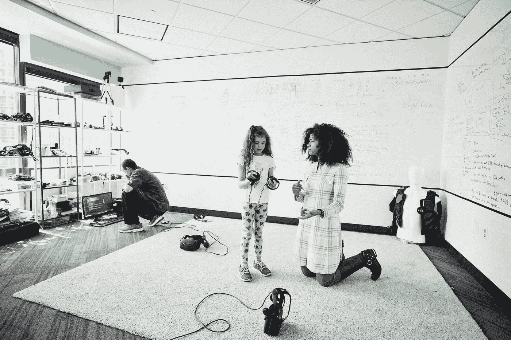
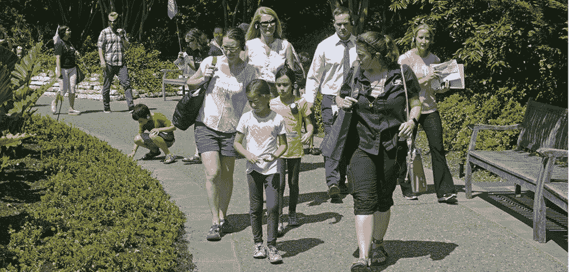

# 作为成人学习者陶醉于 STEM 教育

> 原文：<https://medium.datadriveninvestor.com/reveling-in-stem-education-as-an-adult-learner-24b27e880fe0?source=collection_archive---------0----------------------->

## 享受在任何年龄建立你的知识库

Image: Getty ID# 750415461 / Man Fixing Drone

*作者:* [*安德鲁·b·劳普*](https://medium.com/u/d8c8d333927a?source=post_page-----24b27e880fe0--------------------------------)*/*[*@ stem CEO*](https://twitter.com/stemceo)

为了让今天的学生为明天的世界做好准备，实用的科学、技术、工程和数学(STEM)技能至关重要。

有许多人正在努力工作，为我们的年轻人提供他们在 STEM 事业中取得成功所需要的东西。然而，对于那些自己没有经历过良好教育的人来说，这可能很困难。

 [## 教科书行业如何最终被颠覆，并将继续改变-数据驱动…

### 就此而言，教科书产业在美国乃至全世界都有着悠久的历史。事实上，他们已经…

www.datadriveninvestor.com](https://www.datadriveninvestor.com/2018/09/25/how-the-textbook-industry-has-finally-been-disrupted-and-will-continue-to-change/) 

有很多原因可以解释为什么其他方面有能力的成年人在数学和科学等科目上感到落后。如果你曾经说过这样一句话，“我不是一个学数学的人”，你肯定不是一个人。你可能只学到了一种解决数学问题的方法，你的科学课可能已经塞满了要记忆的东西，但实验和解决现实世界问题的内容很少。

Image: Getty ID# 1035176072 / Engineer Teaching Young Girl How To Code

如果这种过时的教学形式让你感到厌烦，或者更糟糕的是，如果它没有帮助你保留重要的 STEM 技能，你可以原谅。但是，如果你第一次错过了高质量的 STEM 教育，你也不必勉强接受知识空白。有很多方法可以让你在成年后继续学习，并且在学习的过程中获得乐趣。

**迈出一大步**

学习新的东西永远不会太晚，但是一个有工作和家庭责任的成年人为什么要花时间去学习更多的 STEM 课程呢？

Image: Getty ID# 508065709 / Adult Learning STEM

终身学习已经被证明可以减少由衰老引起的认知能力下降。虽然研究对究竟哪种类型的“大脑训练”可以预防或减缓阿尔茨海默病有些矛盾，但随着年龄的增长，保持活跃的思维忙于新的任务是保持敏锐的重要方法。“使用它或失去它”规则意味着花时间学习高等数学或钻研你感兴趣的科学话题是保持这些神经元活跃的好方法。

提升你的 STEM 技能也能让你在这些领域指导年轻人。继续探索这些学科的父母和祖父母将树立求知欲和乐于实验的榜样，这将对下一代学习者产生积极的影响。分享对 STEM 的热情并自在地讨论它是让幼儿保持兴趣并保持敏锐的一个重要方法。

Image: Dallas Arboretum / Student Lead walkSTEM Tour June 8th, 2018 (with permission / Koshi Dhingra)

师友关系可以超越家庭。任何对教学感兴趣的成年人都可以带着他们新学到的知识成立一个课外俱乐部，进行一次 [STEM walk](https://www.youtube.com/watch?v=culWmp5fecU) 或者客串一下，谈谈你在附近学校的现在或以前的职业。当你与下一代思想家、发明家和企业家分享你的兴趣时，你永远不知道你会激发谁的想象力。

**成年人如何学习**

当你寻找机会学习更多关于 STEM 的知识时，重要的是要记住成人的学习方式与儿童不同。成年人的大脑已经发育完成，因此吸收新信息需要不同的神经过程。成年人的大脑需要从现有的模式或思维模式和新想法中提取联系，而不是建立新的神经通路。这意味着当新信息与他们当前的经历和兴趣相关时，成年人会学得最好。在这方面，STEM 非常适合成人学习，因为动手实验可以让你在日常生活中实践科学想法。

Image: Getty ID# 168619592 / Neuron 3D Biomedical Illustration

成人在学习中也需要灵活性，以使新课程适应他们繁忙的生活。允许你在方便的时候登录并学习的异步在线课程是理想的。对于成年学习者来说，感受到老师的尊重和乐于尝试新事物也很重要。虽然孩子们不介意在学习时从自行车上摔下来，但成年人通常对失败的想法感到不安，尤其是在公共场合。寻找为成年人设计的学习机会，这样当你尝试新事物时，你会有一个让你自我感觉良好的环境。当你在周围环境中感到自在时，就更容易保持开放的学习态度。

**追求任何年龄的 STEM**

无论你处于人生的哪个阶段，都有很多方法可以重新回到 STEM。尝试这些想法开始吧:

*   为了休闲和知识而坚持阅读:有时开始阅读所需要的只是接触有趣的材料。尝试订阅高质量的出版物，这样你就有很多资源在手边。你也可以使用 RSS 聚合器，比如 Feedspot 或者 Paper.li 来为你获取内容。
*   面对面的成人教育课程:许多社区提供感兴趣主题的日间和夜间课程，包括编码训练营。你当地的社区大学也是一个开始寻找实践课程的好地方，这些课程将提供合法的技能来增强你的 STEM 知识库。这些课程通常不贵，旨在让成人的学习变得有趣和社会化

Image: Getty ID# 1070179830 / Young Woman Working On Her Laptop

*   开放教育资源(OERs):网上有数以千计的课程计划、游戏和视频，涉及每一个可以想象的 STEM 主题。在海马上搜索视频，或者在 OER 公地上寻找预制的课程。这也是为你生活中对 STEM 好奇的孩子寻找丰富素材的好方法。
*   大规模开放在线课程(MOOCs):这些在线课程涵盖了广泛的主题。信息可能通过文本、视频或录制的讲座传递，并且经常会有评估来检查您的理解。一些著名的选择是 EdX，Coursera 和 Khan Academy。许多是免费的或者相对便宜，大多数可以按照你自己的进度完成。

如果你正在寻找一种低调的方式来尝试 STEM 学习，这家[加州组织](https://www.turnto23.com/news/made-in-kern-county/made-in-kern-county-insect-lore)制作了蝴蝶生长工具包，里面有毛毛虫，当它们从蛹中出来时，你可以喂养、培育并惊奇地观察它们。蝴蝶是重要的授粉者，和它们一起工作可以[促进你的心理健康](https://www.environment.sa.gov.au/goodliving/posts/2018/12/benefits-of-butterflies)。

Image: Getty ID# 177795929 / Painted Lady (Vanessa cardui)

即使是最简单的体验自然的行为，也是开始将健康剂量的 STEM 添加到日常生活中的一种极好的方式——而且它不需要电池。

本文原载于 2019 年 4 月 19 日的*福布斯社区之声*。

[安德鲁·b·劳普](https://medium.com/u/d8c8d333927a?source=post_page-----24b27e880fe0--------------------------------)是创始人/执行董事 [@stemdotorg](https://twitter.com/stemdotorg) 。*“通过健全的政策&实践使科学、技术、工程和数学(STEM)教育民主化……”*

*最初发布:*[*https://www . Forbes . com/sites/Forbes tech Council/2019/04/19/reveling-in-stem-education-as-a-adult-learner/# 95 CCB 8 e 3c 9 e 7*](https://www.forbes.com/sites/forbestechcouncil/2019/04/19/reveling-in-stem-education-as-an-adult-learner/#95ccb8e3c9e7)