# 风险投资中基于收入的融资:对全垒打平均得分的研究

> 原文：<https://medium.datadriveninvestor.com/revenue-based-financing-in-vc-a-study-on-playing-averages-over-home-runs-b0091c984fa3?source=collection_archive---------8----------------------->

2019 年开始的一场有趣的辩论来自于[纽约时报](https://www.nytimes.com/2019/01/11/technology/start-ups-rejecting-venture-capital.html)，它讨论了创业公司越来越拒绝从风险投资中融资的概念的趋势。这种观念认为，这种投资伴随着实现快速超增长和筹集比实际需要更多资金的公开压力，这被奇妙地称为*“鹅肝效应”*

> “过早扩展:在预期需求而非需求驱动的增长中增长。” *—吉姆·皮特科*

这种厌恶有其优点:初创公司基因组报告(Startup Genome Report)对初创公司失败进行了最全面的事后分析[研究](https://s3.amazonaws.com/startupcompass-public/StartupGenomeReport2_Why_Startups_Fail_v2.pdf)，发现在 3200 家初创公司中，过早的规模化是那些失败的主要原因。74%的高增长创业公司由于扩张过快而倒闭，而那些倒闭的公司也获得了比初始阶段所需资金多 2 到 3 倍的投资。

就我个人而言，我不相信追求将种子资本投资到风险创业公司会突然被证明是一种欺骗；如果说有什么不同的话，那么[谈判动态](https://avc.com/2019/01/cause-or-effect/)在最近几年变得更加公平了。投资者期待一定程度的回报是正常的，企业家应该面对现实，即他们有众所周知的食物放在桌子上。**教育和管理预期是关键**每当筹资者向我寻求建议时，我都会告诉他们学习[风险投资法估值公式](http://billpayne.com/2011/02/05/startup-valuations-the-venture-capital-method.html)以帮助他们生动地看到放在他们头上的目标。

但是，如果熟悉正在滋生蔑视，我们能做些什么呢？

# 基于收入的融资是更公平的选择吗？

NYT 的文章指出，基于收入的融资是对需要筹集初始种子资金，但希望自己规划企业未来道路的创始人的一种补救措施。一些为此受到关注的投资者是 [Indie.vc](http://www.indie.vc/) 和 [Earnest Capital](https://earnestcapital.com/) ，后者使用一种被称为[海豹突击队](https://medium.com/swlh/the-cost-of-raising-earnest-a-review-of-earnest-capitals-shared-earnings-agreement-seal-2cf68c099ddc)的票据形式。

此类投资的条款概述如下:

1.  不是贷款，而是一种必须偿还的债务。
2.  这种负债可以在某个事件发生时转化为直接权益，比如未来的一轮融资。
3.  回报被规定为原始投资的**上限倍数**(例如，50，000 美元的投资，上限为 3 倍，总回报义务为 150，000 美元)。回报开始于未来的某个日期，并根据损益表指标的百分比而变化。
4.  一旦偿还，投资者**可以**获得与初始投资成比例的剩余股权。

我发现这是一个有趣的概念，似乎没有任何隐藏的意图，也不是任何可以被愤世嫉俗者视为慈善/营销噱头的东西。我明白，像这样投资的人可能是出于更高的目的，而不仅仅是为了寻求回报，但为了让这种投资更受欢迎，外行和公正的人需要相信它的回报潜力。

这就是我想在这篇文章中做的，通过回答以下问题:

1.  在风险投资中，有没有一种玩转平均值的方法？
2.  基于收入的融资回报如何？
3.  基于收入的融资会导致不同的投资组合行为动态吗？

# 段塞流百分比和启动回报

当我[讨论](https://www.toptal.com/finance/venture-capital-consultants/venture-capital-portfolio-strategy)风险投资组合策略时，三个核心主题是:1)在评估新概念时逆势而为，2)孤立地对待每一项投资，3)在开始成功的项目上孤注一掷。我现在想重温一下这个话题，从投资组合管理的角度更深入地挖掘，看看是否有可能在更广泛的投资选择中获得有吸引力的投资组合回报。

如果我们回到著名的相关性风险投资[数据](https://www.sethlevine.com/archives/2014/08/venture-outcomes-are-even-more-skewed-than-you-think.html)，我们可以看看一个假设的风险投资组合将如何发挥，如果一个人投资倍，并收到预期的结果。

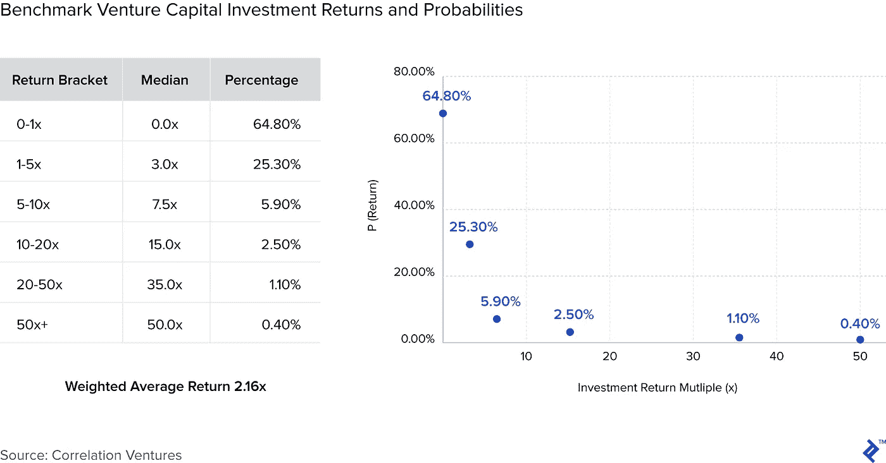

为了澄清这一点，我做了以下假设 1)忽略管理费 2)使用多个括号中的中间值 3)假设它是一个指数，我们可以进行分数投资，4)以保守的 50 倍结束厚尾(风险回报的上行理论上是无限的:谷歌向一些早期投资者购买了 [10，000 倍](http://venturehacks.com/articles/history-of-investors)的回报)。

该基金(“基准”)的多重回报(“ [DPI](http://www.allenlatta.com/allens-blog/lp-corner-fund-performance-metrics-multiples-tvpi-dpi-and-rvpi) ”)为 2.16 倍，是原始投资资本的两倍和变化。就风险投资基金对投资者的整体回报而言，一般来说， [3x](https://techcrunch.com/2017/06/01/the-meeting-that-showed-me-the-truth-about-vcs/) 和/或 20%的内部收益率被视为一个值得尊敬的目标。在我们的案例中，保守的 50 倍“独角兽支架”权重在总体回报上有 20 个基点的增量。因此，如果其他变量保持不变，要让这个投资组合达到 3 倍，就需要 260 倍的回报。

看看基准投资组合，它的表现已经低于预期的退出回报倍数，但在时间价值的基础上，它仍然可以满足 20%的障碍，前提是它能更快地实现回报(如果我们假设所有回报都发生在同一年)。

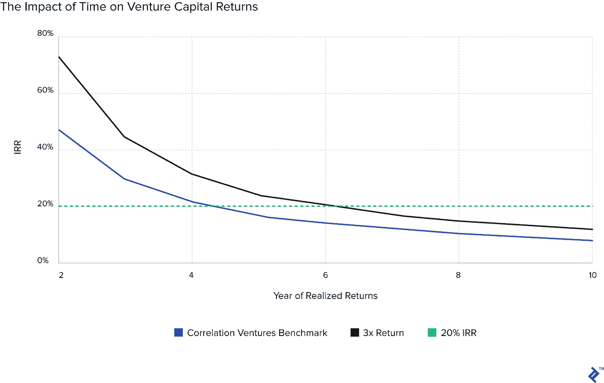

我们的基准需要四年才能达到 20%的 IRR 目标，这比目标 3 倍的投资组合少两年。这个时间压力因素说明了为什么企业家会受到投资者的压力。基金有一个有限的法定寿命(大多数长达 10 年)，在这个时间跨度内，投资需要以更快的轨迹增长，以增加其基于多倍的估值，然后被出售，或上市，以实现流动性。

> “时间是你的敌人:投资组合公司总是需要两倍的资金和两倍的时间退出。初创公司很少能按计划达到里程碑，烧钱的速度总是比预期的要快。 *—摩哂陀·拉姆辛哈尼*

这是一个狭窄的窗口，如果延长，可能会导致尴尬的局面，即不得不将流动性差的证券转移给有限合伙人，在二级市场折价出售，或者以一个仪式性的价格出售给初创公司。

## 那么如果你玩平均数会发生什么？

随着初创公司[的失败率](https://www.cbinsights.com/research/venture-capital-funnel-2/)徘徊在⅔关口附近，试图通过小打小闹来获得 3 倍的总回报被认为是不切实际的。投资者有一种天生的本能和雄心，试图获得巨大的成功，事实上，一旦投资完成，它的命运就不在他们手中了。下面的矩阵展示了寻找独角兽的必要性，以获得可观的投资组合回报——如果 70%的投资失败，你需要其余投资的 10 倍才能达到 3 倍的总回报。

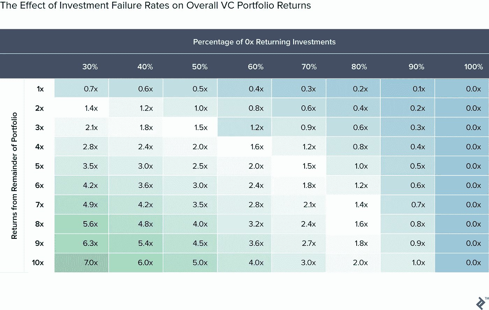

继续(永无止境的)棒球隐喻，在后期风险投资(广义上称为成长型股票)中，追求投资组合更全面回报的“[百分比](https://en.wikipedia.org/wiki/Slugging_percentage)”更有可能。此时，船很大，处于巡航控制状态；让它偏离轨道，是一件很难搞砸的事情。随后，由于风险降低，这一阶段的回报具有较小的倍数范围，但回报方差较小，最重要的是失败率较低(29%)。

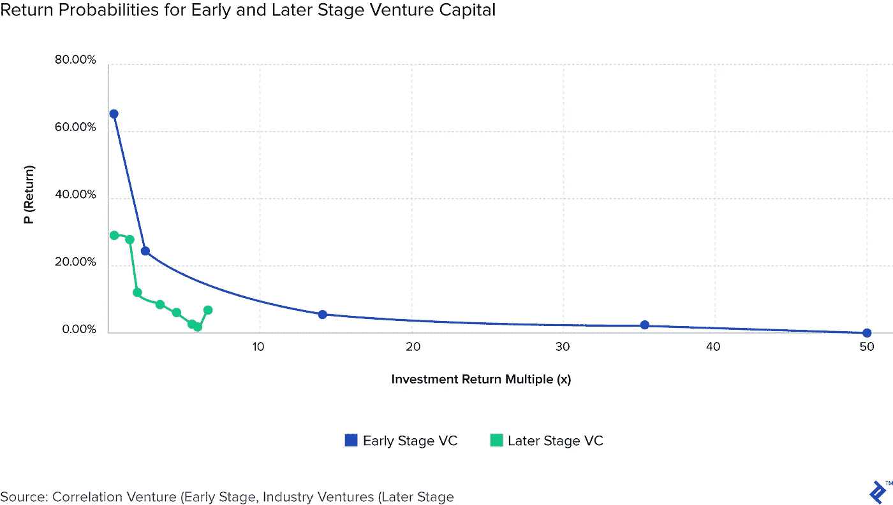

所以，如果你以后投资风险较低的资产，玩平均线是可能的。然而，在早期风险资本投资中，初创公司的结果是如此不稳定，以至于**如果说大多数投资者会说，专注于寻找一只 50 倍以上的独角兽比管理所有幸存者获得 7 倍的混合回报更容易，这并不荒谬。**

故障率高是症结所在。我们如何缓解这种情况？

# 基于收入的融资能提供有吸引力的回报吗？

使用我对 Indie.vc 基于收入的融资结构的开源[法律](https://github.com/indievc/terms/blob/master/term_sheet_v3.md)规则的解释，它展示了以下潜在结果的决策树。与只有一个节点的传统风险投资不同，这种基于收入的模式会产生不同的财务场景，取决于初创公司是否筹集了额外的融资轮次。

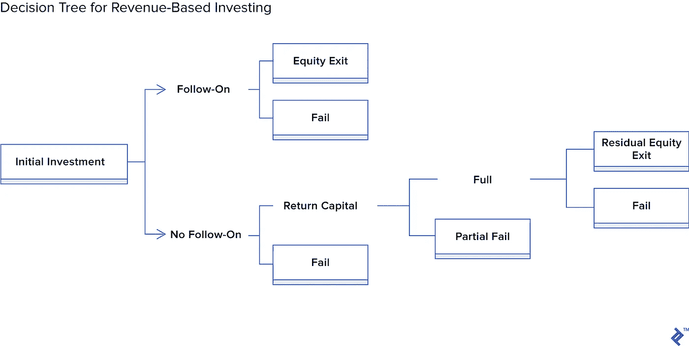

这很有趣，因为我们有三个潜在的财务回报来源:

1.  从转换为股权的投资中退出(首次公开募股/M&A)。
2.  未转换为股权的投资的本金偿付上限。
3.  剩余权益头寸(初始资本的 10%)保留在已偿还本金的企业中。

现在，理论已经讲过了，让我们看看这在现实中会如何发生。

## 创业公司连这个都负担得起吗？！

基于收入的融资只有在被投资企业有能力偿还的情况下才会奏效。偿还高达 3 倍投资的前景可能令人望而生畏，这可能被视为自由现金流的机会成本使用。因此，只有当初创企业已经有能力盈利，有足够长的宽限期来获得一些喘息空间，并且还款“削减”不算过高时，这种融资才会真正发挥作用。

当我向业内的一些朋友提到这一点时，我得到了一些笑声，大部分是这样的:“一个初创公司怎么能偿还 3 倍的投资呢？!"这或许更多地说明了我们所处的时代，在这个时代，创造收入已经被视为一种罕见的事情。

这里有一些数学计算在起作用，由于回报预期和收入是其中的一个重要决定因素，初始投资**必须**与当前 ARR 成可接受的比例。下面的公式详细说明了全部回报方案，求解将提供何时可以实现全部回报的初步估计: *(m =宽限期结束)*

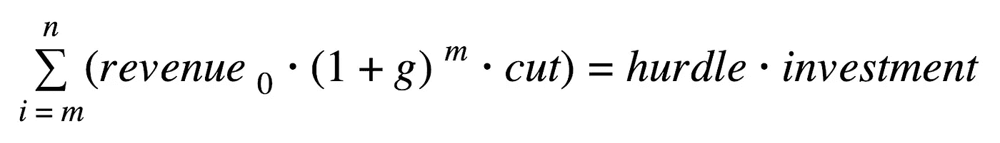

为了更好地形象化回报，我[基于以下假设为](https://www.toptal.com/finance/venture-capital-consultants)设计了一些场景:

1.  投资 150，000 美元，基于 3 倍的 0 年 ARR 50，000 美元。
2.  24 个月的宽限期。
3.  退货障碍为 3 倍，因此总退货责任为 45 万美元。
4.  根据本 VentureBeat 调查的[显示，Y1 收入增长 120 %, Y2 增长 82%,此后增长 60%。](https://venturebeat.com/2016/09/18/heres-how-founders-are-projecting-their-startups-growth-rate/)
5.  月收入还款“下调”幅度分别为 5%、7.5%和 10%。

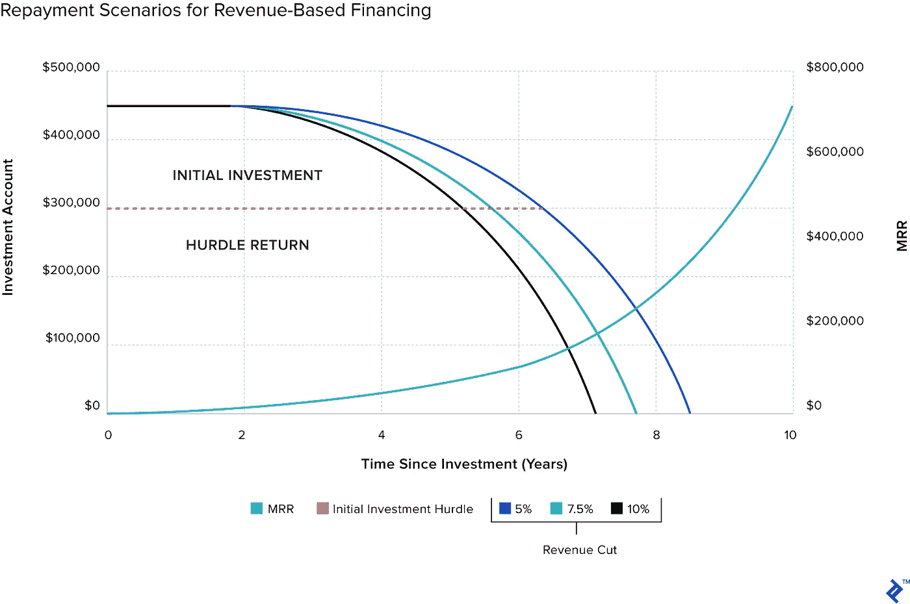

如您所见，在这种情况下，投资在大约八年的中间时间框架内轻松收回，在 5%或 10%的削减范围之间有大约一年的增量。这是一个保守的设想，但其时间范围在封闭式基金的生命周期内。

如果有什么不同的话，这显示了收入和复利的力量，最初的 MRR 为 4167 美元，到十年时达到了 72 万美元。这不仅显示了在这样的条件下偿还 45 万美元是多么容易，也显示了一个小企业如何能够成长为一个利润丰厚的企业，只需要一点时间和耐心。宽限期也是完全一致的，因为在最初的两年里，收入增长的全部复合效应尚未生效，因此在这里收费削减将有一个非实质性的影响。

## 回报是如何累积的？

我们已经看到了**你如何从基于收入的融资中赚钱，但是现在让我们看看**你能做什么**。**

通过使用决策树结果上的关联风险投资回报数据，我们可以为基于收入的融资建立一个回报场景模型，以将其与“基准”进行比较在这种情况下，我使用 3 倍作为回报上限，48%作为直接转换为股权的比率，因为[筹集了第二轮](https://www.cbinsights.com/research/venture-capital-funnel-2/)。

最初的结果很有趣:

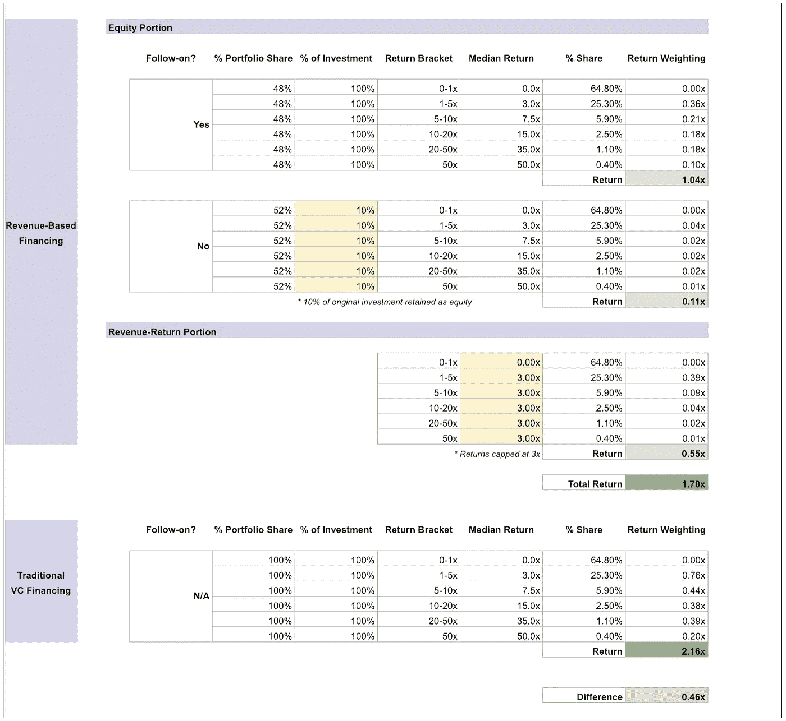

在这种情况下，基于收入的投资组合的回报率为 1.70 倍，比基准回报率低 0.46 倍。这是意料之中的，因为短缺归因于投资组合的收入回报方面的回报上限。在投资组合的这一方，唯一超过 3 倍的上涨是本金偿还后剩余的 10%剩余股票头寸。

从这些回报的时间价值来看，基于收入的融资有一条更平坦的曲线，在尾部收敛于基准，这是因为从偿还的本金部分获得了更早的现金流入。使用还款上限作为一个变量来寻找基准的“盈亏平衡”几乎没有意义，因为递增的上限将有效地“最大化”投资组合的较低回报等级。如果有什么不同的话，3x 已经是最优的了，因为它保证了除了失败之外的一切都有偿还能力。

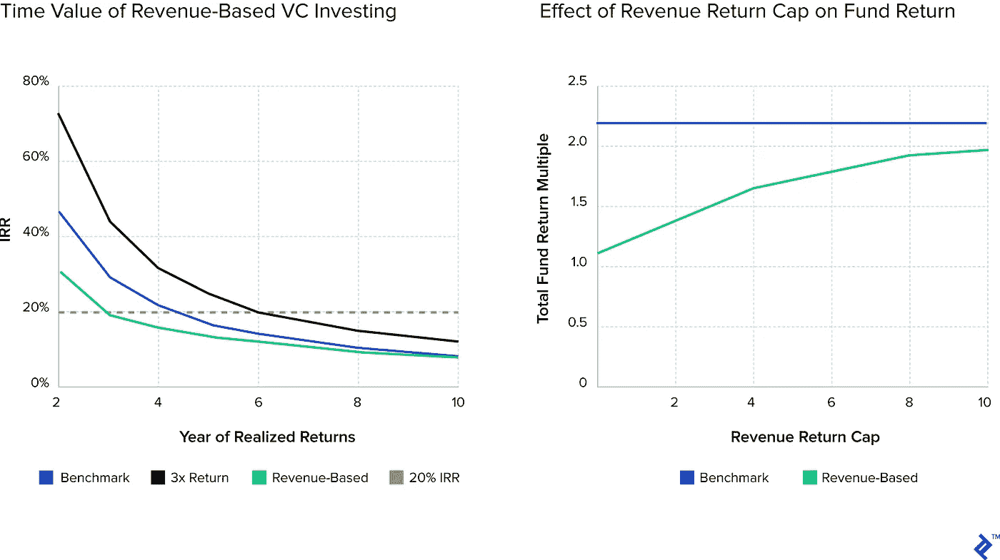

这给了我们定量的角度，得出的结论是基于收入的回报理论上低于传统的风险投资风格。**但这也留下了一个难题，那就是这里有一个有趣的货币时间价值部分，以及不同类型投资结果的毋庸置疑的潜力。**

## 什么因素会提高这些回报？

关于基于收入的融资的特征，有一些已知的未知因素可能有助于降低 0x 交易的失败率。由于收回投资的交易上限，减少失败交易的数量显然是确保投资组合回报最大化的重点领域。

## 1.资本循环

一些风险投资基金被允许将已实现的回报重新配置到新的投资中，以获得更多的回报。在封闭式“传统”基金的情况下，这种机会的窗口可能会很窄，因为现金流入只来自 IPO 或 M&A，通常需要一段时间才能发生。

如我们所见，对于基于收入的融资结构，由于本金偿还计划，有更多的现金流入情景。一旦这些开始发生，基金经理将经历定期的资本流入，尽管是零零碎碎的数量。

让这笔钱再次发挥作用的潜力是显而易见的。如果我们回到基于收益的基金的基本情景，其回报的 0.55 倍来自本金偿还。再次对这笔资本进行再投资将复制 1.7 倍的乘数效应，因此将收益重新纳入漏斗将为整个投资组合带来额外的 0.93 倍回报，使其总回报达到 2.63 倍

## 2.投资组合混合

抱着不要寻找下一个优步/Airbnb/WeWork 的想法进行投资，实际上可能会让投资者接触到一个尚未开发且不受欢迎的可行企业领域。

我经常远程工作，与在电子商务、咨询和 SaaS 等领域拥有成功的远程微型企业的企业家们不期而遇。他们可能不希望超高速增长，但业务通常从一开始就产生现金流，通过更合理的预期、MVP 和更精简的运营相结合。

提供投资线索的量化数据是很棘手的，因为从设计上来说，没有筹集到太多资金的自我可持续企业往往不会寻求关注。但是，如果我们观察主要的初创企业垂直市场，并绘制融资水平中值与收入中值的图表，我们可以找到一些线索。让我们看一看，清除离群值。

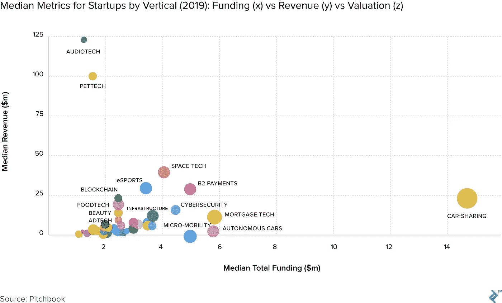

看到汽车共享独自存在并不奇怪，但宠物技术是一个利润惊人的行业！如果我们深入到轴的底部，特别是那些筹集资金不到 200 万美元，但收入中位数超过 100 万美元的公司，我们就可以开始了解哪些部门可能在这里发挥作用。

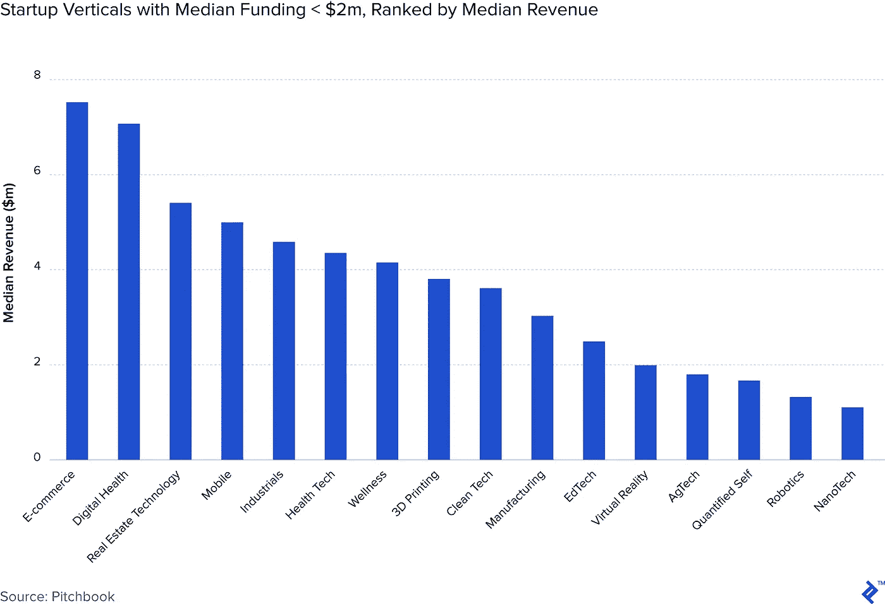

这是一组非常不同的垂直行业，其中一些可以被归类为初创企业的“中坚力量”，而其他一些，如纳米技术，则更适合。如果我可以从这个选择中得出一些结论，那就是这些垂直市场具有**重复购买潜力**、**巨大的市场规模**，并且更倾向于**必需品而非奢侈品**。

## 3.不同的概率

如前所述，对那些能够货比三家、挑选投资者的企业家来说，谈判筹码普遍增加。利用不同的渠道、集中英特尔资源更容易，对于那些已经有执行记录和/或可见影响力的人来说，他们通常可以拥有自己的蛋糕并吃掉它。

任何给予创业者更多灵活性和选择的融资模式，比如基于收入的融资，都将开始出现在他们的雷达上。从理论上讲，这可能会让一位合适的基金经理排在最佳交易的前列。如果您将这些 A+操作符与不寻求超增长的更精简/有条不紊的类型混合在一起，您可能会得到一个非常有趣的投资组合动态。

> “Indie.vc 三年前成立时，每周都会收到两三份申请，大多来自被拒绝的风险投资。现在，它每周收到多达 10 份申请，大多来自能够筹集风险资本但不想这么做的公司

这类群体的投资回报多条曲线可能符合更正态的结果分布。我没有这方面的数据，但这是一个有价值的假设。作为思考的食粮:在我们基于收入的融资组合的基本情景中，如果 0–1 倍和 1–5 倍情景的概率互换，并且所有其他假设保持不变，整个投资组合的回报将达到令人垂涎的 3 倍。

## 以这种方式投资的挑战是什么？

从操作上来说，运营一个基于收入的投资工具需要更多的收款和会计方面的实际操作。显然，它不会像传统的贷款账簿那样运作，不会有实物托收代理等等。据我所知，还款处理得很温和，欠款处理得更像是介入并提供帮助的黄灯，而不是打电话给法警的指令。但是，尽管如此，以这种方式投资将使基金的现金流更加多样化，这将需要管理一些更重的运营负担。

就基金的定位和生存能力而言，对有限合伙人来说，这也可能是一种硬推销。对于门外汉来说，他们可能会把这种投资框定为慈善或无雄心壮志，但两者都不是真的。因此，需要明确阐述为什么这种投资是有吸引力的细分目标。因此我写了这篇文章。

此外，在冷酷无情的现实生活中，总有一些人在寻找捷径，一些企业家可能会试图在基于收入的融资中套利他们的嵌入式看跌期权。可以说，一只穿着帽衫的狼可以在一个可持续的商业计划的前提下饲养，这个商业计划很快就会消失，一旦资金得到保证，它就会重新成为一个更注重超增长的商业计划。

在为正在筹集可转换票据的初创公司提供咨询时，我经常会遇到这样的问题:“因为这是债务，我能不能以后再还，不让它转换？”当面对漏洞与道德高地的两难境地时，通过因果报应和名誉的不成文法则，从长远来看，真正有所回报的总是后者。

## 差异化和重组:这可能适合哪些投资者？

基于收入的融资为新经理或受不同观点驱动的经理提供了一个开拓新市场的机会。我认为这可能适用于以下几种投资者:

1.  **新的风险投资者**拥有通才的行业视角，没有“名人效应”他们达成热门交易的能力将由价格(支付更多)和/或速度(运气是其中很大的一部分)来决定。对他们来说，基于收入的融资可能是一个更有吸引力的竞争优势。
2.  **成立了风险投资基金**，它们希望尝试较小的二级基金形式，以配置不同的投资主题。这可能会让他们有更广阔的视野，并有机会向不同类型的公司学习。
3.  **企业投资者**更多地是为了寻找新产品/客户渠道，而不是纯粹的资本收益，他们可以通过这种方式投资，以避免吓到初创公司和联合投资者，让他们担心自己会插手。
4.  **对计划结果和可量化影响不满意的政府/超国家资助项目**
5.  **社会影响基金**将赋予所有权视为其使命的核心宗旨

# 一首献给朋友、家人和傻瓜的颂歌

所以，请注意，风险投资组合策略仍然是一场本垒打游戏，而且看起来不会改变。如果有什么不同的话，这种扭曲看起来会随着更大的交易和更大的资金而进一步扭曲。

然而，这种文化疏远了价值链中的某些部分，这些部分希望建立商业上可行的企业，但不希望采用冒着过早扩大规模风险的超增长模式。由于缺乏风险投资的替代资金，许多企业家最终选择了一些他们最终会后悔的事情。

经常被人诟病的“[朋友、家人和傻瓜](http://www.smarta.com/advice/business-finance/start-up-finance/friends-family-and-fools/)”回合已经为几代人服务了一个目的，那就是纯粹基于信任/血统的纽带，为风险企业提供初始种子资本。有些人通过不附带利息的非正式贷款做到这一点，更不用说任何股权增值了。在企业家眼中，这种慷慨和坚忍的标志往往会使偿还财务义务变得更加重要，而不是向花别人钱的“要么成长，要么回家”型投资者提供回报。

或许，基于收入的融资是两者之间的一个令人愉快的中间地带，其目标是可观的财务回报和回归自主的激励？

*原载于*[*www.toptal.com*](https://www.toptal.com/finance/venture-capital-consultants/revenue-based-financing)*。*