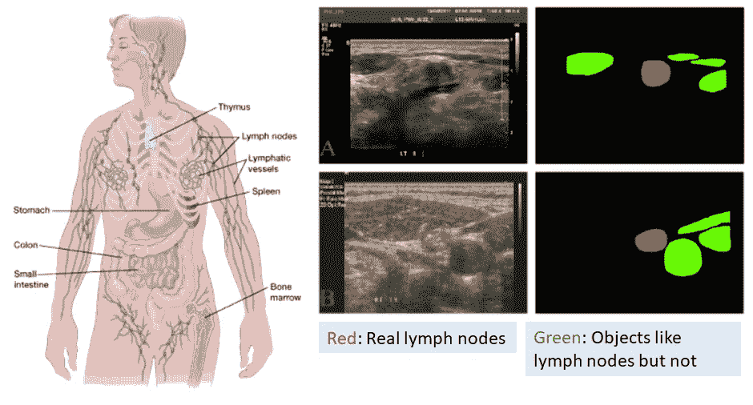
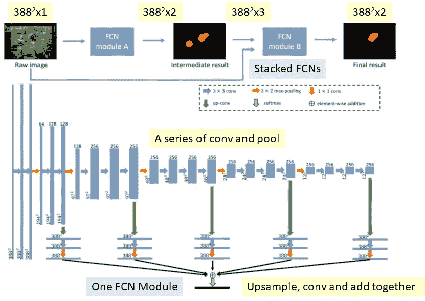
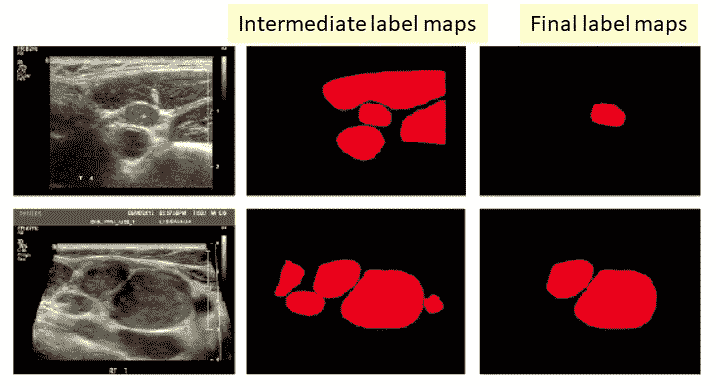
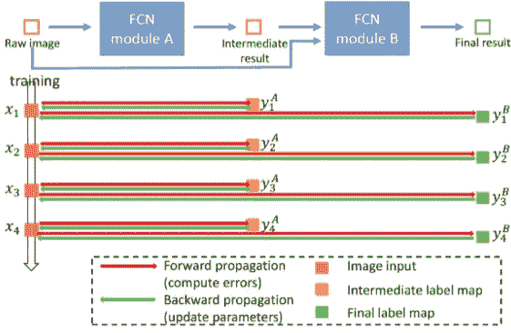
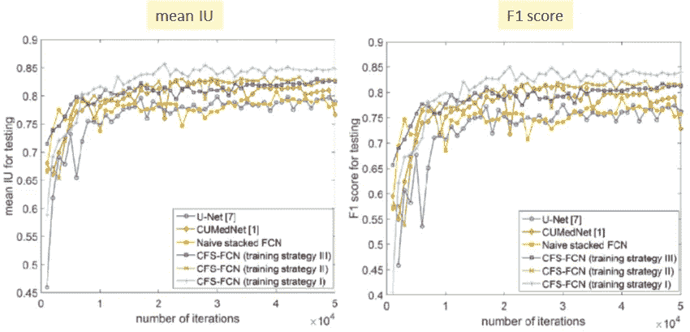
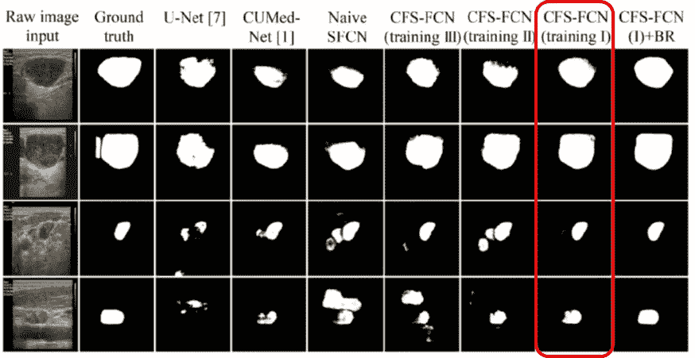

# 综述:CFS-FCN(生物医学图像分割)

> 原文：<https://medium.datadriveninvestor.com/review-cfs-fcn-biomedical-image-segmentation-ae4c9c75bea6?source=collection_archive---------4----------------------->

T 本次， **CFS-FCN(由粗到细堆叠全卷积网)**被简要回顾，用于**分割超声图像中的淋巴结**。

> 你可能会问:“读生物医学图像分割是不是太狭隘了？”
> 
> 然而，我们可以学习它的技术，并将其应用于不同的行业。比方说，**质量控制/自动检测/施工/制造过程中的自动机器人**，或者我们能想到的任何其他东西。**这些活动涉及定量诊断。如果我们能使它自动化，就能以更高的精度节省成本。**

这是 **2016 BIBM** 的一篇论文。它**优于两种最先进的方法，**[***cumed vision 1***](https://medium.com/datadriveninvestor/review-cumedvision1-fully-convolutional-network-biomedical-image-segmentation-5434280d6e6)**和**[***U-Net***](https://towardsdatascience.com/review-u-net-biomedical-image-segmentation-d02bf06ca760)。它还有**中间标签的概念，有助于分段**。( [Sik-Ho Tsang](https://medium.com/u/aff72a0c1243?source=post_page-----ae4c9c75bea6--------------------------------) @中)

# 淋巴结和超声波图像

**Lymph Nodes (green line) in Human Body (Left), Ultrasound images (Middle), Segmentation Results (Right)**

淋巴结对我们的免疫系统很重要。超声图像扫描是一种非侵入性扫描，在医院中很常见。基于超声图像，我们可以进行临床诊断、癌症分期、患者预后和治疗计划等。

# 涵盖哪些内容

1.  **由粗到细堆叠的 FCN**
2.  **中级标签和培训策略**
3.  **结果**

# **1。由粗到细堆叠的 FCN**

**Stacked FCNs (Top), One FCN Module (Bottom)**

## 1.1.堆叠 fcn

1.  首先，一幅 388×388×1(宽×高×彩色平面)灰度超声图像作为 FCN 模块 a 的输入
2.  FCN 模块 A 输出 388×388×2(宽×高×输出标签)的中间结果，其中它分割出真实的淋巴结和看起来像淋巴结但不是背景中的淋巴结的物体。
3.  然后，该输出与输入灰度超声图像(388×388×3)连接在一起，并输入到 FCN 模块 b
4.  FCN 模块 B 输出 388×388×2(宽×高×输出标签)的最终结果，其中仅分割真实的淋巴结。

## 1.2.FCN 模块

如上图所示的 FCN 模块，其实就是类似于*或者 [*CUMedVision1*](https://medium.com/datadriveninvestor/review-cumedvision1-fully-convolutional-network-biomedical-image-segmentation-5434280d6e6) 中的那个。*

1.  *一系列卷积和最大池来提取特征。*
2.  *max pooling 之前的每个层用于解采样、卷积，然后融合(元素相加)在一起，以获得每个 FCN 模块的结果。*

*除了输入到 fcn 的信道数量不同。对于 FCN 模块 A，它只有 1 个频道，而对于 FCN 模块 B，它有 3 个频道。*

# ***2。中级标签和培训策略***

## *2.1 中间标签*

**

***Input Images (Left, Intermediate Label Maps (Middle) and Final Label Maps (Right)***

*除了注释最终标签图，**我们还需要专家注释中间标签图**，以便进行 FCN 模块 a 的训练*

## *2.2.**培训策略***

**

***Training Strategy I***

*尝试不同的训练策略。*

***天真叠 FCN***

*   *在不使用中间标签图的情况下训练整个网络。*

***培训策略一***

*   *使用如上图所示的相同图像数据，同时交替训练 FCN A 和 FCN B。*
*   *两个模块在培训中相互影响。*

***培训策略二***

*   *使用中间标签地图训练 FA。*
*   *然后使用最终的标签映射来训练 FB。*

***训练策略三***

*   *使用中间标签地图训练 FA。*
*   *然后使用最终的标签地图修正 FA 和训练 FB。*

*正如我们所猜测的，训练策略 I 是这里最好的一个。*

# *3.结果*

## *3.1 数据集*

*   *80 幅超声波图像*
*   *使用双重交叉验证，其中 2 组被分开。*
*   *列车:设置 1；测试:第 2 组*
*   *列车:设置 2；测试:设置 1*
*   *并且计算平均 IU 和 F1 分数*

## *3.2 平均 IU 和 F1 分数*

**

***Mean IU (Left) and F1 Score (Right)***

*[*U-Net*](https://towardsdatascience.com/review-u-net-biomedical-image-segmentation-d02bf06ca760) 和天真叠 FCN 都有类似的表现。*

*CUMedNet(即 [*CUMedVision1*](https://medium.com/datadriveninvestor/review-cumedvision1-fully-convolutional-network-biomedical-image-segmentation-5434280d6e6) )、CFS-FCN(训练策略二)和 CFS-FCN(训练策略三)的表现差不多。*

*CFS-FCN(训练策略 I)在平均 IU 和 F1 得分方面表现最佳，这是每张图顶部的曲线。*

**

***Mean IU, F1 Score and Memory Cost***

***CFS-FCN(训练策略一)平均 IU 为 0.851，F1 分为 0.843。** **带 BR** (即边界细化填充凹陷处)，这是一个使其不是端到端学习的后处理步骤，获得**更好的平均 IU 0.860 和 F1 分 0.858。***

***由于堆叠了两个 FCN，CFS-FCN 需要双倍的 CUMedNet (CUMedVision1)** 内存。*

## ***3.3。**一些视觉分割结果*

**

***Some Visual Segmentation Results***

*虽然来自中间标签映射和最终标签映射的训练损失可以被组合，使得 FCN A 和 FCN B 可以被一起训练，**他们使用简单的思想，即他们只需要堆叠 FCN，并且获得了更好的结果。**因此，**他们不需要考虑新的 FCN 架构**来解决问题或改善结果。**但缺点是要准备中间标签图。**就标签数量而言，FCN CFS 需要双倍的标签数量(200%)。*

# *参考*

1.  *【2016 BIBM】【CFS-FCN】
    [用于超声图像中淋巴结分割的粗到细堆叠全卷积网](https://www.researchgate.net/publication/312561521_Coarse-to-Fine_Stacked_Fully_Convolutional_Nets_for_lymph_node_segmentation_in_ultrasound_images)*

# *我的相关评论*

*[ [优酷网](https://towardsdatascience.com/review-u-net-biomedical-image-segmentation-d02bf06ca760) ] [ [累计电视 1](https://medium.com/datadriveninvestor/review-cumedvision1-fully-convolutional-network-biomedical-image-segmentation-5434280d6e6) ] [ [累计电视 2](https://medium.com/datadriveninvestor/review-cumedvision2-dcan-winner-of-2015-miccai-gland-segmentation-challenge-contest-biomedical-878b5a443560) ] [ [FCN](https://towardsdatascience.com/review-fcn-semantic-segmentation-eb8c9b50d2d1) ] [ [解除网](https://towardsdatascience.com/review-deconvnet-unpooling-layer-semantic-segmentation-55cf8a6e380e) ]*

**