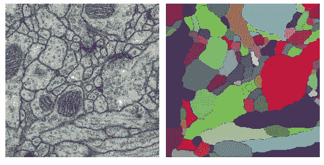
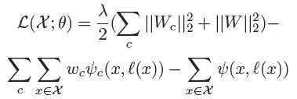
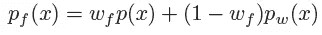
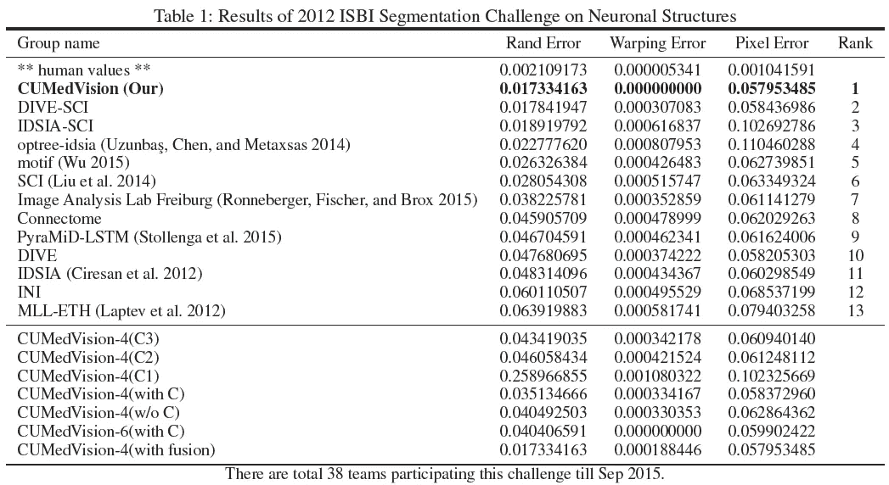
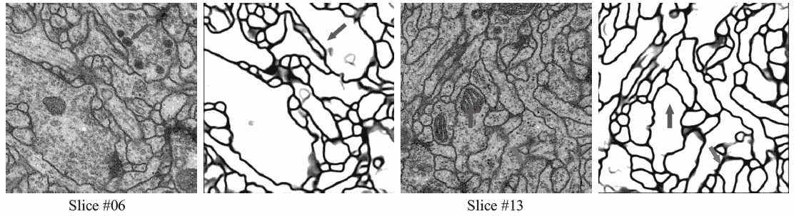

# 综述:CUMedVision1 —全卷积网络(生物医学图像分割)

> 原文：<https://medium.datadriveninvestor.com/review-cumedvision1-fully-convolutional-network-biomedical-image-segmentation-5434280d6e6?source=collection_archive---------5----------------------->

在这个故事里，回顾了 CUHK 的**、**。通过使用**全卷积网络(FCN)** ，CUMedvision1 在 **2012 ISBI 分段挑战**的基准数据集上大幅优于最先进的方法。

排行榜:[http://brainiac2.mit.edu/isbi_challenge/leaders-board](http://brainiac2.mit.edu/isbi_challenge/leaders-board)

在这个挑战中，**连续切片透射电子显微镜(ssTEM)图像**被分割。下面显示了一个示例:

**Input Image (Left), Segmentation Results (Right) (Individual components are denoted by different colors.)**

对于上图，我们**需要专家进行标注(或注释)**。这个过程**耗时又费钱**。如果能通过分割实现自动标注，可以节省时间和成本。

> 你可能会问:“读生物医学图像分割是不是太狭隘了？我不在这个领域工作，对我来说不是那么有用吗？”然而，我们可以学习它的技术，并将其应用于不同的行业。例如，在建造/制造/生产过程中的质量控制/自动检查/自动机器人。

CUHK 在深度学习领域非常活跃。并且这项工作已经发表在 **2016 AAAI** 上，被**引用超过 60 次，**在我写这个故事的时候，这对于这个领域来说是很高的了。([曾植和](https://medium.com/u/aff72a0c1243?source=post_page-----5434280d6e6--------------------------------) @中)

# 涵盖哪些内容

1.  **FCN 建筑**
2.  **损失函数**
3.  **边界细化**
4.  **结果**

# 1.FCN 建筑

**CUMedVision1 FCN Architecture**

1.  如上图所示，首先，我们有一个来自左边的输入图像。
2.  然后，输入图像通过具有卷积层和最大池层的**下采样路径**。该路径旨在**基于高级抽象信息对语义进行分类。**
3.  在汇集之前的某些层，特征图将通过**上采样路径**与卷积层和解卷积层。这条路径是为了**重建边界等精细细节。后向步长卷积用于上采样。我们可以在 C1、C2 和 C3 得到结果。**
4.  最后，它们被加在一起，这个熔丝图将具有 softmax。

**基本思路是**

1.  来自更高层的抽象信息有助于解决什么的问题。
2.  来自较低层的本地信息有助于解决在哪里的问题。

这种思想已经被许多其他深度学习框架所采用。

# **2。损失函数**

**Loss Function**

第一部分只是一个标准的正则项，使用 l2 范数来惩罚权重不要太大的值，即减少过拟合问题。

第二部分是 C1、C2 和 C3 的交叉熵损失项。

第三部分是最终输出的交叉熵损失项。

# 3.**边界细化**

**Boundary Refinement**

在通过 FCN 分割之后，分割边界有时会不连续。这是由于 FCN 末端的熔化。概率图 pw(x)与具有参数 wf 的二元轮廓 p(x)具有线性组合。并且这个 wf 通过最小化 rand 误差来确定。

这部分相对来说不那么重要，但我们可能会注意到，FCN 会议后可能需要边界细化。事实上，在 CUMedVision2 中，二进制等高线 p(x)在 FCN 中部用于训练。希望以后能覆盖。

# **4。结果**

**2012 ISBI Challenges Results**

需要测量的误差有 3 个(这 3 个误差在后面的比赛中已经淡出):

*   **Rand Error** :两个聚类或分割之间相似性的度量。对于 EM 分割评估，原始标签的零分量(地面实况的背景像素)被排除。
*   **扭曲误差**:惩罚拓扑不一致(对象分裂和合并)的分割度量。
*   **像素误差**:原始和结果标签之间的平方欧几里德距离。

## CUMedVision 版本

*   **CUMedVision-N** : N 表示 FCN 网络的数量。将对多个 fcn 的最终输出进行平均，以获得更好的结果。这种技术是一种已经使用多年的增强/集成技术。在深度学习中，比如 LeNet 和 AlexNet，他们也使用了这种技术。
*   **CUMedVision-4(C1)，CUMedVision-4(C2)，CUMedVision-4(C3):** 它们的误差普遍较高。
*   **CUMedVision-6(含 C):** 含 6 个 fcn，翘曲误差最小。
*   **CUMedVision-4(带融合):**通过融合 C1 到 C3 的结果，具有最小的 rand 误差和像素误差
*   **cumed vision-Ours**:cumed vision-4(带融合)和 CUMedVision-6(带 C)的最佳结果。

**推断时间** : **一张尺寸为 512×512 的测试图像**0.4 秒。

**Some Amazing Results: (Red: Inner parts look like boundary but not, Blue: Blurred but successfully segmented boundary)**

如果你读过 FCN 用于一般图像分割，你可能会发现 FCN 架构非常相似。CUMedVision1 已成功移植 FCN 网络用于生物医学图像分割。如果我们有一些任务需要自动分割，特别是二值分类，我们也可能会尝试这种解决方案。

# 参考

1.  【2016 AAAI】【cumed vision 1】
    [用于神经元结构分割的深度上下文网络](https://www.aaai.org/ocs/index.php/AAAI/AAAI16/paper/download/11789/11718)

# 我的评论

[ [莱内特](https://medium.com/@sh.tsang/paper-brief-review-of-lenet-1-lenet-4-lenet-5-boosted-lenet-4-image-classification-1f5f809dbf17) ] [ [阿列克斯内特](https://medium.com/coinmonks/paper-review-of-alexnet-caffenet-winner-in-ilsvrc-2012-image-classification-b93598314160) ] [ [FCN](https://towardsdatascience.com/review-fcn-semantic-segmentation-eb8c9b50d2d1) ]