# 综述:cumed vision 2/DCAN——2015 年 MICCAI 腺体分割挑战赛(生物医学图像分割)冠军

> 原文：<https://medium.datadriveninvestor.com/review-cumedvision2-dcan-winner-of-2015-miccai-gland-segmentation-challenge-contest-biomedical-878b5a443560?source=collection_archive---------1----------------------->

T 他的时代， **CUMedVision2** ，又名 **DCAN(深度轮廓感知网络)**，由 CUHK 点评。在本文中，一个**中间轮廓标签**也被用来辅助训练时的收敛，这是本文的一个重要概念。最后，CUMedVision2 已经**获得了 2015 年 MICCAI 腺体分割挑战大赛**。这是一篇 **2016 CVPR** 的论文，在我写这篇文章的时候有超过 **100 次引用**。( [Sik-Ho Tsang](https://medium.com/u/aff72a0c1243?source=post_page-----878b5a443560--------------------------------) @中)

排名:[https://warwick . AC . uk/fac/sci/DCS/research/TIA/glascontest/results/](https://warwick.ac.uk/fac/sci/dcs/research/tia/glascontest/results/)

> 你可能会问:“读生物医学图像分割是不是太狭隘了？我不在这个领域工作，对我来说不是那么有用吗？”
> 
> 然而，我们可以学习它的技术，并将其应用于不同的行业。例如，**建造/制造/生产过程中的质量控制/自动检测/自动机器人。这些活动涉及定量诊断。如果我们能使它自动化，就能以更高的精度节省成本。**

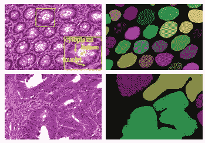

**Segmentation by Experts**

# 涵盖哪些内容

1.  **cumed vision 1 简要回顾**
2.  **CUMedVision2 网络架构**
3.  **其他一些细节**
4.  **结果**

# **1。CUMedVision1 的简要回顾**

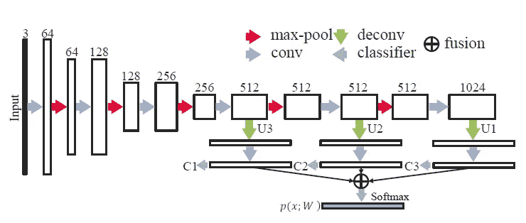

**CUMedVision1**

1.  如上图所示，首先，我们有一个来自左边的输入图像。
2.  然后，输入图像通过具有卷积层和最大池层的**下采样路径**。该路径旨在**基于高级抽象信息对语义进行分类。**
3.  在汇集之前的特定层，特征地图将通过**非采样路径**与卷积和反卷积层。这条路径是为了**重建边界等精细细节。后向步长卷积用于上采样。我们可以在 C1、C2 和 C3 得到结果。**
4.  接下来，他们被加在一起，这个融合图将有最大值。
5.  并且使用轮廓对分割结果进行后处理。

# 2.CUMedVision2 网络架构

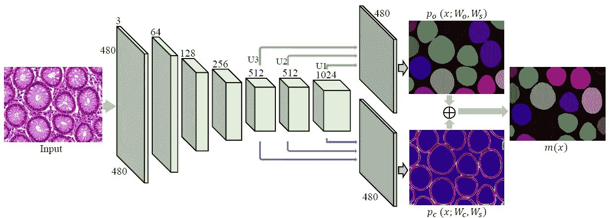

**CUMedVision2**

1.  在 CUMedVision2 中，经过 conv 和池化后，上采样路径实际上是 CUMedVision1 网络获得分割图， *po* 。
2.  下部路径是类似于上部路径的新的上采样路径。但相反，概率图是等高线图， *pc* 。这张等高线图是专家标注的。**通过在网络中添加这种中间标签，我们可以驱动网络内的权重更加关注腺体之间的边界/分离。这很重要，因为图像中有许多触摸腺体。如果把它们归为一个腺体，准确性会大大下降。**
3.  在得到 *po* 和 *pc* 之后，我们就可以得到 m(x)，这是根据以下规则得到的最终结果:

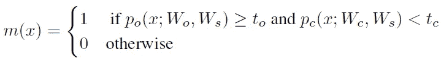

其中 to 和 tc 是阈值，根据经验设置为 0.5。

## **3。其他一些细节**

## 3.1 损失函数

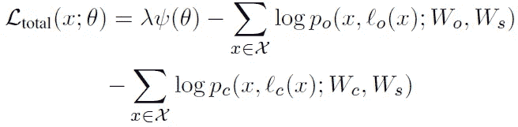

第一项:L2 正则化以减少过拟合。

第二项和第三项:概率图 *po* 和 *pc* 的对数损失。

## 3.2 培训

下采样路径由用 PASCAL VOC 数据集训练的 DeepLab 初始化。其他的由高斯初始化。对整个网络进行微调。

## 3.3 测试

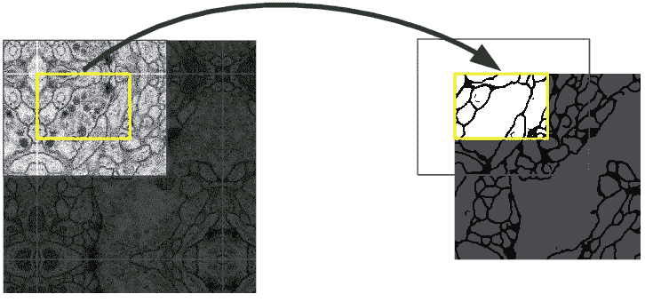

**Overlap-tile strategy**

**使用重叠平铺策略**进行测试，这意味着当图像太大时，对整个图像逐部分进行分割。

对融合后的分割结果进行**后处理步骤**，包括**用圆盘滤波器(半径为 3)平滑**、**填充孔洞**和**去除小区域**。最后，每个连接的组件都用唯一的值来标记，以表示一个分段的腺体。

# **4。结果**

测量三个度量: **F1 分数**、**对象级骰子指数**和**豪斯多夫距离**。

## **4.1 F1 分数**

用精确度 P 和召回率 r 衡量的分数。

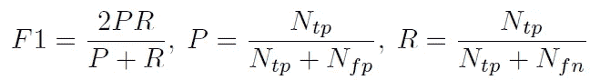

其中 Ntp、Nfp 和 Nfn 分别是真阳性、假阳性和假阴性数目。**超过 50%的重叠被定义为真阳性**。这就像物体检测问题。

## **4.2 对象级骰子指数**

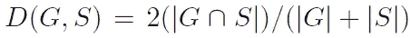

其中一组像素 G 被标注为基本事实对象，一组像素 S 被分割为腺体对象。并且:

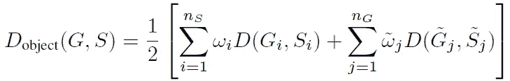

其中 Si 表示第 I 个分割对象，Gi 表示与 Si 最大程度重叠的基础事实对象，~Gj 表示第 j 个基础事实对象，~ Sj 表示最大程度重叠的分割对象~Gj、nS 和 nG 分别是分割对象和基础事实对象的总数。

因此，这个对象级骰子指数是**分段**的一个重要指标。

## **4.3 豪斯多夫距离**

用于测量**形状相似度**:

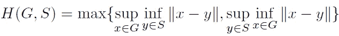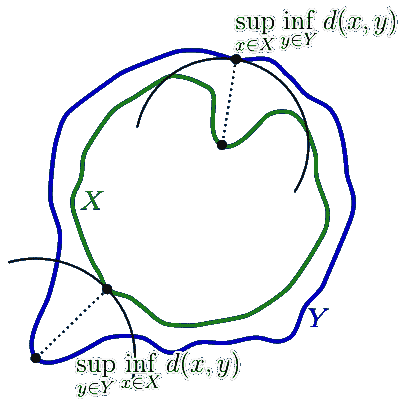

**Hausdorff distance conceptual diagram**

因此，Hausdorff 距离是为了获得方程中两个形状 G 和 S(或图中的 X 和 Y)之间的最大距离(定义如上)。**对象级 Hausdorff 距离**就像上面显示的对象级骰子指数一样使用。

以下是上述 3 项指标的结果:

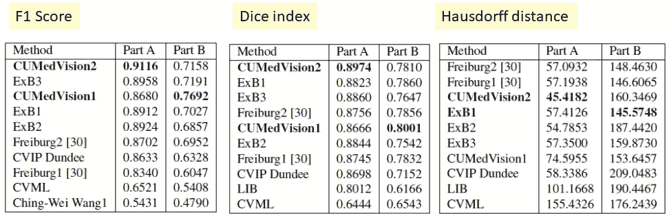

**MICCAI 2015 Results**

A 部分是良性(正常)腺体，而 B 部分是恶性(异常)腺体。CUMedVision2 在 F1 分数、骰子指数和 Hausdorff 距离(A 部分)方面获得了**排名第 1。**

**Sum Score and Final Ranking**

基于所有结果， **CUMedVision2 赢得了 MICCAI 2015 腺体分割挑战大赛。**一些可视化结果:

**Part A Results (Top: Input Image, Middle: No Contour Labels, Bottom: Have Contour Labels)**

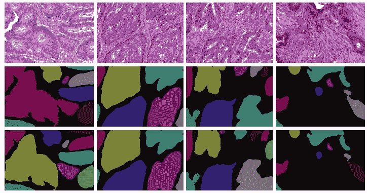

**Part B Results (Top: Input Image, Middle: No Contour Labels, Bottom: Have Contour Labels)**

如果我们得到了想要分割但很难分割的东西，一些参与反向传播的中间标签可能有助于分割。缺点是我们需要人力来为中间轮廓标签执行标记。但如果人力不成问题，这是提高分割精度的解决方案之一。

# **参考文献**

1.  【2016 CVPR】【cumed vision 2/DCAN】
    [DCAN:用于精确腺体分割的深度轮廓感知网络](https://arxiv.org/abs/1604.02677)

# 我的评论

[ [累积视野 1](https://medium.com/datadriveninvestor/review-cumedvision1-fully-convolutional-network-biomedical-image-segmentation-5434280d6e6) ] [ [FCN](https://towardsdatascience.com/review-fcn-semantic-segmentation-eb8c9b50d2d1) ]