# 综述:DRCN——深度递归卷积网络(超分辨率)

> 原文：<https://medium.datadriveninvestor.com/review-drcn-deeply-recursive-convolutional-network-super-resolution-f0a380f79b20?source=collection_archive---------2----------------------->

## 将递归深度提高到 16 层，不引入新参数，比 SRCNN 更好。

It 已经很久没有复习超分辨率相关的论文了。这一次，**【DRCN(深度递归卷积网络)**是短期回顾。事实上，《DRCN》的作者也是 [VDSR](https://towardsdatascience.com/review-vdsr-super-resolution-f8050d49362f) 的作者。 [VDSR](https://towardsdatascience.com/review-vdsr-super-resolution-f8050d49362f) 中 20 层 3×3 卷积相同大小相同数量的滤波器提醒他们这里有一个递归卷积。都发表在 **2016 CVPR** 上，DRCN 获得 **200 多篇引用**。( [Sik-Ho Tsang](https://medium.com/u/aff72a0c1243?source=post_page-----f0a380f79b20--------------------------------) @中)

# 概述

1.  **DRCN 基本款**
2.  **递归监控&跳过连接**
3.  **损失函数**
4.  **结果**

# 1.DRCN 基本模型

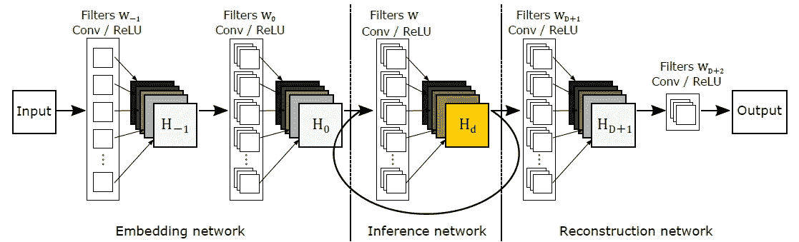

**DRCN Basic Model**

*   DRCN 由三个子网络组成:嵌入、推理和重构网络。

## **1.1。嵌入网络:*f1***

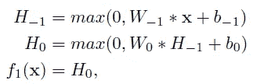

**Embedding Network**

*   它采用插值的低分辨率(LR)输入图像 *x* (灰度或 RGB)并将其表示为一组具有两个卷积的特征图 *H* 0。

## **1.2。推理网络:f2**

*   来自嵌入网络的输出特征映射经过单个递归层。每次递归都应用相同的卷积，后面跟一个 ReLU。

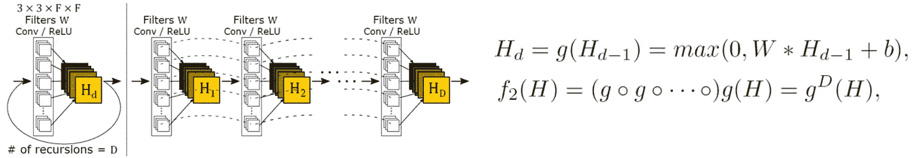

**Unfolding the Inference Network**

*   如果我们展开推理网络，它看起来如上。
*   *D* 使用共享参数执行卷积。因此，当添加更多的递归层时，参数的数量不会增加。
*   感受野随着每次递归而变宽。

## **1.3。重建网络:f3**

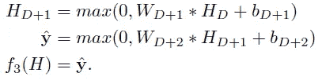

**Reconstruction Network**

*   它将推理网络(多通道)的输出特征图转换到原始图像空间，即高分辨率(HR)图像。

## 1.4.利弊

*   递归模型是**简单的**和**强大的**。
*   但是由于**消失梯度问题**，训练深度递归网络非常困难。

# **2。递归监控&跳过连接**

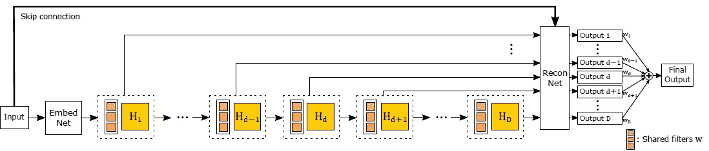

**DRCN with Recursive-Supervision & Skip Connection**

## 2.1.递归监督

*   由于使用了递归卷积，我们可以在任何递归中将特征图传递给重构网络。
*   在 DRCN，对于每次递归，中间特征图也被传输到重建网络，用于重建 HR 图像。
*   因此，如右上方所示，总共有 *D* 个输出。

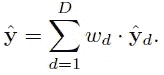

*   加权的所有输出的集合显著提高了性能。
*   沿着一个反向传播路径的消失/爆炸梯度的不利影响被减轻。
*   挑选最佳递归次数的重要性降低了。如果递归对于给定的任务来说太深，我们希望后期预测的权重较低，而早期预测的权重较高。

## 2.2.跳过连接

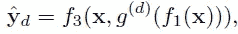

*   类似于 [VDSR](https://towardsdatascience.com/review-vdsr-super-resolution-f8050d49362f) ，从输入到重构网络增加了一个跳跃连接，如上图所示。
*   首先，节省了递归期间存储输入信号的网络容量。
*   第二，在目标预测期间可以使用输入信号的精确副本。
*   在超分辨率中，LR 和 HR 图像非常相似。在大多数地区，差异为零，只有少数位置具有非零值。这种特定领域的知识极大地改进了学习过程。
*   当然，它可以解决渐变消失的问题。

# 3.**损失函数**

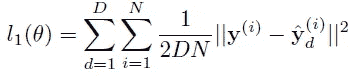

*   ***l*1-损耗**:使用递归监控的 D 输出和地面真实 HR 图像之间的 MSE。

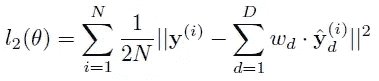

*   ***l*2-损失**:加权 D 输出和地面真实 HR 图像之间的 MSE。

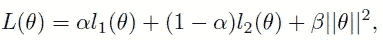

*   **最终损失函数**:l1-损失和*l*2-损失加重量衰减的加权和。

# 4.结果

*   **训练** : 91 张图片，使用泰坦 X GPU 大概需要 6 天。
*   **测试**:set 5、Set14、B100、Urban100 四个数据集。

## 4.1.递归次数

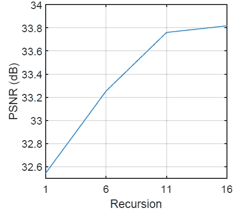

**Recursion versus Performance for the scale factor 3× on the dataset Set5**

*   测试了 1、6、11 和 16 次递归。
*   产生更大感受野和更多非线性的更多递归导致更好的性能。和 16 被选为最优。
*   当 16 递归 DRCN 展开时，从输入到输出的最长链经过 20 个卷积层(感受野为 41×41)。

## **4.2。单个输出与集合输出**

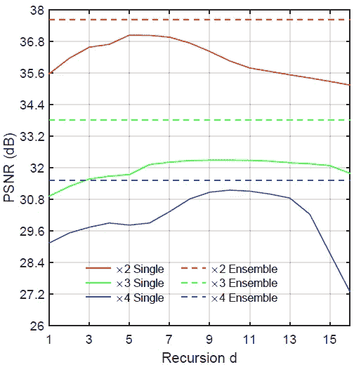

*   没有一个递归深度在所有比例因子上都是最佳的。
*   中间预测的集合显著提高了性能。

## 4.3.与最先进方法的比较

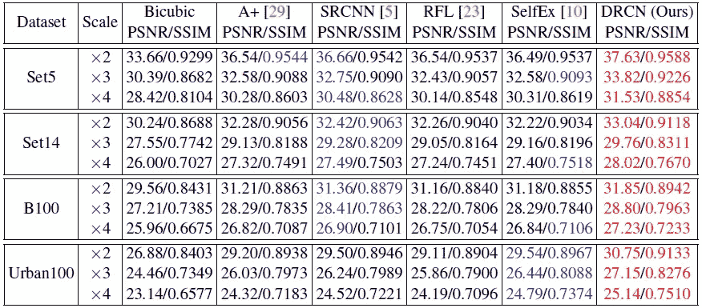

**Benchmark Results**

*   因为 A+和 RFL 仅使用中心部分进行评估，而不使用图像边界。上述 PSNR 和 SSIM 仅使用中心部分进行测量。
*   **DRCN 在所有比例因子和数据集上均优于**[**SRCNN**](https://medium.com/coinmonks/review-srcnn-super-resolution-3cb3a4f67a7c)**。**

## **4.4.定性结果**

**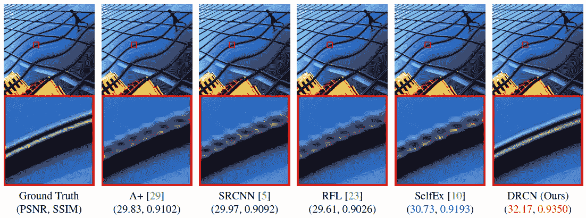****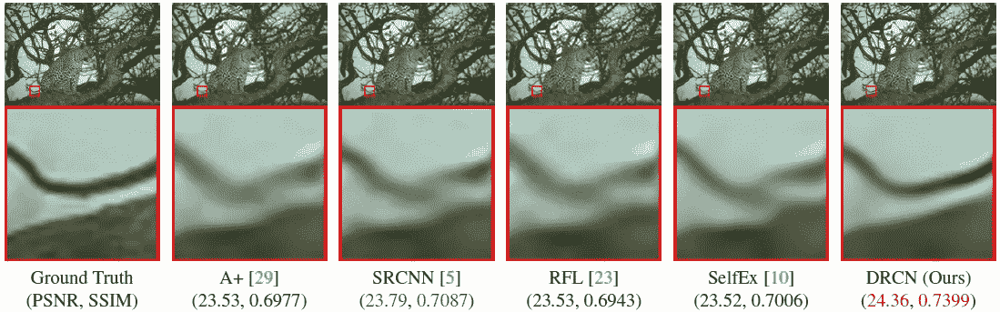****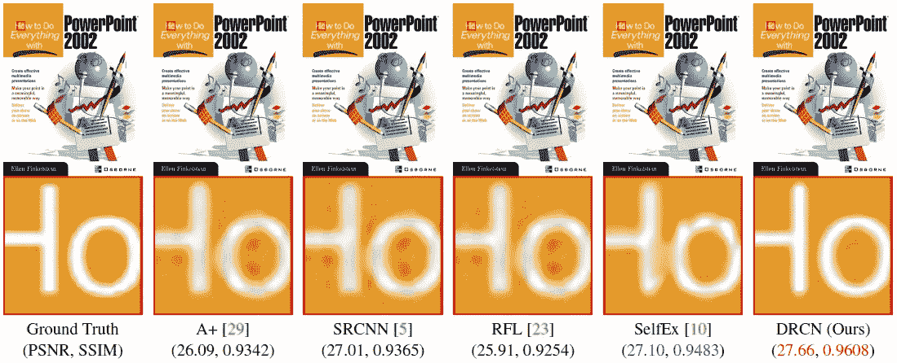****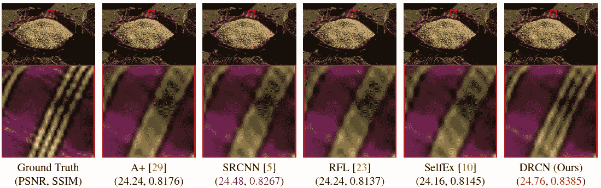**

**通过使用递归，可以在不添加任何额外参数的情况下添加更多的层，并且结果得到改善。**

## **参考**

**【2016 CVPR】【DRCN】
[用于图像超分辨率的深度递归卷积网络](https://arxiv.org/abs/1511.04491)**

## **我以前的评论**

**)(我)(们)(都)(不)(想)(到)(这)(些)(人)(,)(我)(们)(都)(不)(想)(要)(到)(这)(些)(人)(,)(但)(是)(这)(些)(人)(还)(不)(想)(到)(这)(些)(人)(,)(我)(们)(还)(不)(想)(到)(这)(些)(人)(,)(我)(们)(们)(还)(不)(想)(到)(这)(些)(人)(们)(,)(我)(们)(们)(还)(不)(想)(到)(这)(些)(人)(,)(我)(们)(们)(还)(没)(想)(到)(这)(些)(人)(,)(我)(们)(还)(没)(想)(到)(这)(里)(来)(。 )(我)(们)(都)(不)(想)(到)(这)(些)(人)(,)(我)(们)(都)(不)(想)(要)(到)(这)(里)(去)(,)(我)(们)(还)(不)(想)(到)(这)(些)(人)(,)(我)(们)(都)(不)(想)(要)(到)(这)(里)(去)(了)(,)(我)(们)(还)(不)(想)(到)(这)(些)(人)(,)(我)(们)(都)(不)(想)(到)(这)(里)(来)(。**

****物体检测** [过食](https://medium.com/coinmonks/review-of-overfeat-winner-of-ilsvrc-2013-localization-task-object-detection-a6f8b9044754)[R-CNN](https://medium.com/coinmonks/review-r-cnn-object-detection-b476aba290d1)[快 R-CNN](https://medium.com/coinmonks/review-fast-r-cnn-object-detection-a82e172e87ba)[快 R-CNN](https://towardsdatascience.com/review-faster-r-cnn-object-detection-f5685cb30202)[DeepID-Net](https://towardsdatascience.com/review-deepid-net-def-pooling-layer-object-detection-f72486f1a0f6)】[R-FCN](https://towardsdatascience.com/review-r-fcn-positive-sensitive-score-maps-object-detection-91cd2389345c)】[离子](https://towardsdatascience.com/review-ion-inside-outside-net-2nd-runner-up-in-2015-coco-detection-object-detection-da19993f4766)[多路径网](https://towardsdatascience.com/review-multipath-mpn-1st-runner-up-in-2015-coco-detection-segmentation-object-detection-ea9741e7c413)[NoC](https://medium.com/datadriveninvestor/review-noc-winner-in-2015-coco-ilsvrc-detection-object-detection-d5cc84e372a)**

****语义切分** [FCN](https://towardsdatascience.com/review-fcn-semantic-segmentation-eb8c9b50d2d1)[de convnet](https://towardsdatascience.com/review-deconvnet-unpooling-layer-semantic-segmentation-55cf8a6e380e)[deeplab v1&deeplab v2](https://towardsdatascience.com/review-deeplabv1-deeplabv2-atrous-convolution-semantic-segmentation-b51c5fbde92d)[parse net](https://medium.com/datadriveninvestor/review-parsenet-looking-wider-to-see-better-semantic-segmentation-aa6b6a380990)】[dilated net](https://towardsdatascience.com/review-dilated-convolution-semantic-segmentation-9d5a5bd768f5)[PSP net](https://towardsdatascience.com/review-pspnet-winner-in-ilsvrc-2016-semantic-segmentation-scene-parsing-e089e5df177d)[deeplab v3](https://towardsdatascience.com/review-deeplabv3-atrous-convolution-semantic-segmentation-6d818bfd1d74)**

****生物医学图像分割** [[cumed vision 1](https://medium.com/datadriveninvestor/review-cumedvision1-fully-convolutional-network-biomedical-image-segmentation-5434280d6e6)][[cumed vision 2/DCAN](https://medium.com/datadriveninvestor/review-cumedvision2-dcan-winner-of-2015-miccai-gland-segmentation-challenge-contest-biomedical-878b5a443560)][[U-Net](https://towardsdatascience.com/review-u-net-biomedical-image-segmentation-d02bf06ca760)][[CFS-FCN](https://medium.com/datadriveninvestor/review-cfs-fcn-biomedical-image-segmentation-ae4c9c75bea6)][[U-Net+ResNet](https://medium.com/datadriveninvestor/review-u-net-resnet-the-importance-of-long-short-skip-connections-biomedical-image-ccbf8061ff43)**

****实例分割** [ [深度遮罩](https://towardsdatascience.com/review-deepmask-instance-segmentation-30327a072339) ] [ [锐度遮罩](https://towardsdatascience.com/review-sharpmask-instance-segmentation-6509f7401a61) ] [ [多路径网](https://towardsdatascience.com/review-multipath-mpn-1st-runner-up-in-2015-coco-detection-segmentation-object-detection-ea9741e7c413)][[MNC](https://towardsdatascience.com/review-mnc-multi-task-network-cascade-winner-in-2015-coco-segmentation-instance-segmentation-42a9334e6a34)][[Instance fcn](https://towardsdatascience.com/review-instancefcn-instance-sensitive-score-maps-instance-segmentation-dbfe67d4ee92)][[FCIS](https://towardsdatascience.com/review-fcis-winner-in-2016-coco-segmentation-instance-segmentation-ee2d61f465e2)]**

****超分辨率
[[Sr CNN](https://medium.com/coinmonks/review-srcnn-super-resolution-3cb3a4f67a7c)][[fsr CNN](https://towardsdatascience.com/review-fsrcnn-super-resolution-80ca2ee14da4)][[VDSR](https://towardsdatascience.com/review-vdsr-super-resolution-f8050d49362f)][[ESPCN](https://medium.com/datadriveninvestor/review-espcn-real-time-sr-super-resolution-8dceca249350)][[红网](https://medium.com/datadriveninvestor/review-red-net-residual-encoder-decoder-network-denoising-super-resolution-cb6364ae161e) ]****

## **来自 DDI 的相关故事:**

** [## 用 7 个步骤解释深度学习

### 和猫一起

medium.com](https://medium.com/datadriveninvestor/deep-learning-explained-in-7-steps-9ae09471721a)  [## 数据科学和软件工程哪个更有前途？

### 大约一个月前，当我坐在咖啡馆里为一个客户开发网站时，我发现了这个女人…

medium.com](https://medium.com/datadriveninvestor/which-is-more-promising-data-science-or-software-engineering-7e425e9ec4f4)**