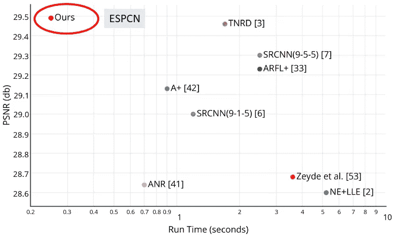
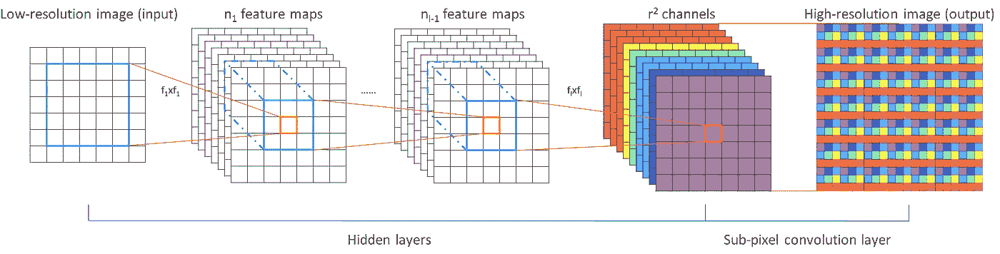
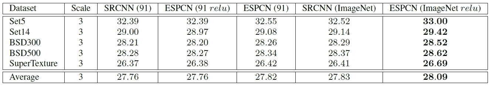
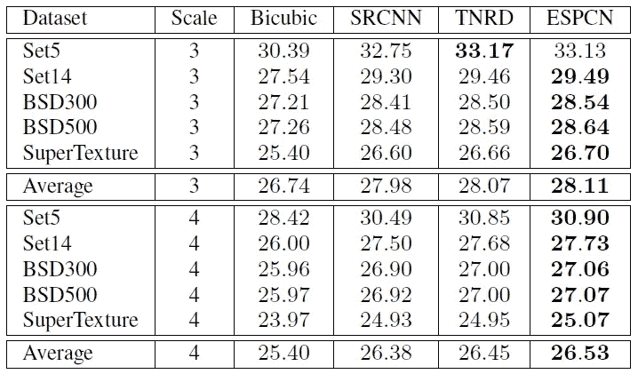
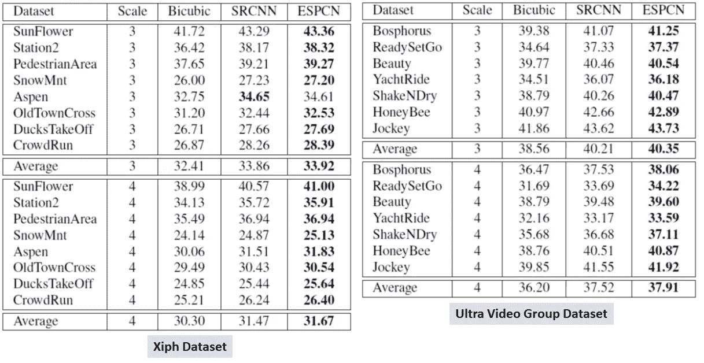
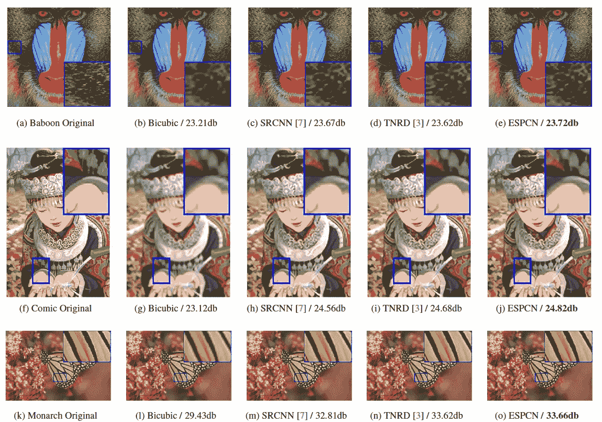
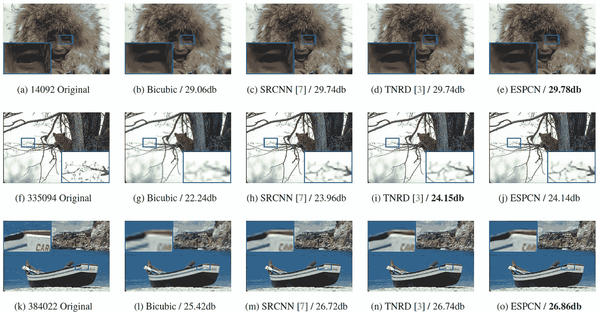

# 综述:ESPCN —实时超分辨率

> 原文：<https://medium.datadriveninvestor.com/review-espcn-real-time-sr-super-resolution-8dceca249350?source=collection_archive---------2----------------------->

在这个故事中，**伦敦帝国理工学院**的 **ESPCN** ，是一个简短的回顾。超分辨率(SR)是一类增强/增加图像分辨率的技术。在 ESPCN 中，低分辨率(LR)图像仅在最后阶段被放大为高分辨率(HR)图像。因此，因为使用了**小尺寸特征图**，所以可以减少**网络的计算量**。因此，可以实现实时性能。并发表在 **2016 CVPR** 上，引用 **400 余次**。( [Sik-Ho Tsang](https://medium.com/u/aff72a0c1243?source=post_page-----8dceca249350--------------------------------) @中)

> 有时，我们只得到一个很差的图像，我们想进行数字放大(放大)，但当放大时图像变得模糊。这是因为常规的插值或放大把一幅小图像变成一幅大图像，会得到很差的图像质量。使用 **ESPCN** ，我们可以从低分辨率(LR)图像中获得高质量的高分辨率(HR)图像。

**ESPCN (Ours) Is At The Left Top Corner Which Is Much Faster and Better Than SRCNN**

# 涵盖哪些内容

1.  **一些常规 SR 方法的问题**
2.  **ESPCN(高效亚像素卷积神经网络)**
3.  **结果**

# **1。一些常规 SR 方法的问题**

卷积神经网络(CNN)方法，例如 SRCNN、FSRCNN 和 VDSR

*   首先放大/上采样 LR 图像
*   然后执行卷积以获得 HR 图像

因为 LR 图像在最开始被上采样，所以所有的卷积将基于上采样的 LR 图像。因此，计算的数量增加了。

# **2。ESPCN(高效亚像素卷积神经网络)**

**FSPCN Network Architecture**

假设网络有 ***层*层**，

1.  对于**第一个 *L* -1 层**，输入的 LR 图像经过**f*L*×f*L***卷积，得到 *nl* -1 特征图。
2.  在最后一层，执行**高效子像素卷积**以在输出端取回 HR 图像。

具体来说， ***L* =3** 也就是说是浅网。

每层的参数为: **(f1，n1)=(5，64)** ， **(f2，n2)=(3，32)** ， **f3=3** 。

*   第一层:有 64 个过滤器，过滤器尺寸为 5×5。
*   第二层:有 32 个过滤器，过滤器尺寸为 3×3。
*   第三层:只有一个过滤器，过滤器尺寸为 3×3。这是因为对于 YUV 图像，只有 Y 被认为是人眼对亮度比色度更敏感。

# 3.结果

## 3.1 ReLU as 激活功能

**Results with ReLU as Activation Function**

*   在只有 91 幅图像用于训练的情况下，ESPCN 具有与 SRCNN 几乎相同的性能(27.76dB)。
*   使用 imagenet 图像进行训练，ESPCN 的性能(28.09dB)优于 SRCNN (27.83dB)。

## 3.2 Tanh 作为激活函数

**Results with Tanh as Activation Function**

*   使用 tanh 作为激活函数，对于放大因子 3，获得了 28.11 dB 的较高平均 PSNR。
*   对于放大因子 4，获得 26.53 dB 的 PSNR。
*   作者认为 **FSPCN 为上采样提供了更多的特征图，而 SRCNN 仅使用单个双三次插值对输入图像进行上采样。**

## 3.3 视频

由于 FSPCN 是一种非常快速的超分辨率方法，因为它是浅层网络，所以也测试视频。

**Video Dataset**

*   对于 Xiph 和 Ultra Video 组数据集，ESPCN 获得的 PSNR 始终比 SRCNN 稍高。
*   虽然质量很相似，但速度相差很大。
*   **高档因子为 3** ，SRCNN 每帧耗时 0.435s，而 **ESPCN 模型每帧仅需 0.038s**。
*   **由于放大系数为 4** ，SRCNN 每帧耗时 0.434s，而我们的 **ESPCN 模型每帧仅耗时 0.029s**。

## 3.4.视觉质量

**Some Visual Results for Set14**

**Some Visual Results for BSD500**

如此高的速度，大约每帧 0.029–0.038 秒，**超过每秒 26-33 帧(fps)** ，对于视频直播这种时间紧迫的任务来说**很有用。**

# 参考

【2016 CVPR】【ESPCN】
[使用高效亚像素卷积神经网络的实时单幅图像和视频超分辨率](https://arxiv.org/abs/1609.05158)

# 我的相关评论

[[Sr CNN](https://medium.com/coinmonks/review-srcnn-super-resolution-3cb3a4f67a7c)][[fsr CNN](https://towardsdatascience.com/review-fsrcnn-super-resolution-80ca2ee14da4)][[VDSR](https://towardsdatascience.com/review-vdsr-super-resolution-f8050d49362f)]