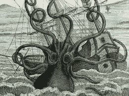
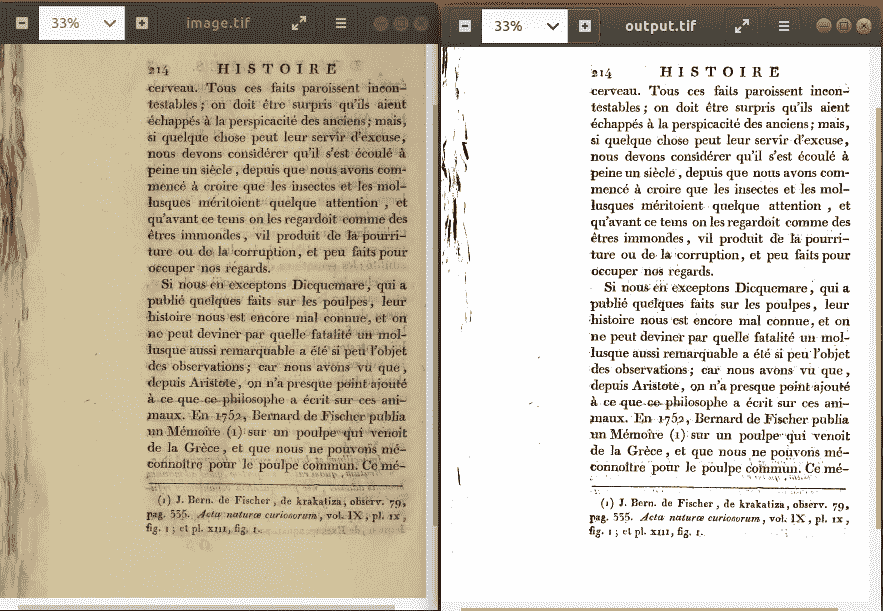
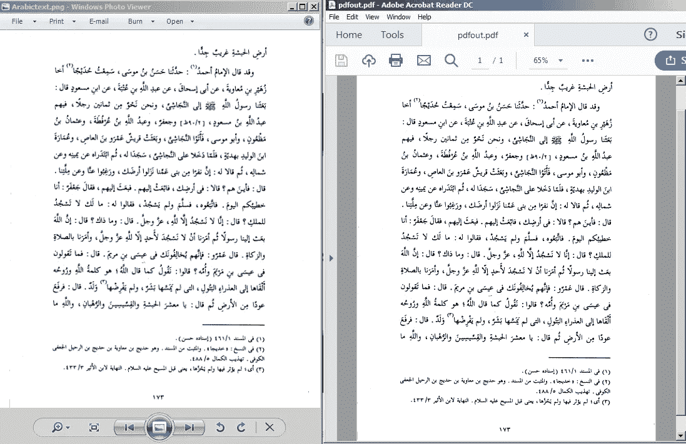
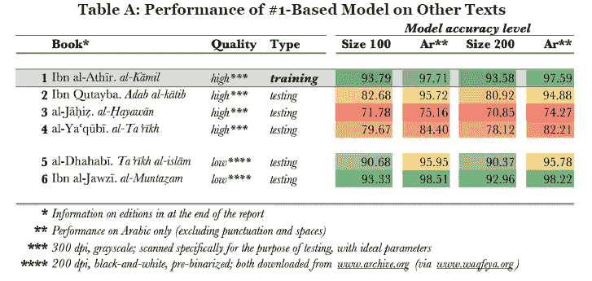

# 用于文本识别的 Tesseract 和北海巨妖 OCR 综述

> 原文：<https://medium.datadriveninvestor.com/review-for-tesseract-and-kraken-ocr-for-text-recognition-2e63c2adedd0?source=collection_archive---------0----------------------->

在这篇文章中，我想提供一个关于光学字符识别的宇宙魔方和北海巨妖的概述和比较。我将开始解释 OCR 如何工作，以及哪些技术进步正在与机器学习融合。机器学习已被用于大幅改善计算机视觉，人工智能的深度学习近年来进展非常快。计算机视觉在人工智能的实时领域有着大规模的应用。可以给出的一些例子是检测车牌、图像识别、运动检测、图像检索、图像恢复、文本检测、活体检测等。人工智能可以被设计成减少解决日常问题的努力，如手动转移遗产旧书文本供未来使用。

OpenCv

在 OCR 软件中，它的主要目的是使用不同的语言从书面文本字符中识别和捕获所有独特的单词。OCR 使用经过训练的语言模型来识别每个字符，并提供图像或 pdf 格式的文本输出。

在进行我的研究时，你知道宇宙魔方和北海巨妖是开源的，我注意到还有其他商业软件使用 OCR 进行文本提取。在我们讨论这两个应用之前，让我们先回顾一下什么是宇宙魔方和北海巨妖。

Tesseract

Tesseract 引擎最初是在 1985 年到 1994 年间作为专有软件在位于英国布里斯托尔[和科罗拉多州](https://en.wikipedia.org/wiki/Bristol,_England)[格里利](https://en.wikipedia.org/wiki/Greeley,_Colorado)的[惠普](https://en.wikipedia.org/wiki/Hewlett_Packard)实验室开发的，1996 年做了更多的修改以移植到 Windows，1998 年从 [C](https://en.wikipedia.org/wiki/C_(programming_language)) 移植到 [C++](https://en.wikipedia.org/wiki/C%2B%2B) 。Tesseract 第 4 版增加了基于 LSTM 的 OCR 引擎和许多其他语言和脚本的模型，使总数达到 116 种语言。

Kraken

北海巨妖是从 Ocropus 派生出来的开源 OCR 软件。它旨在纠正一些问题，同时保持(大部分)功能等效。北海巨妖是由莱比锡大学亚历山大·冯·洪堡数字人文讲座教授 Benjamin Kiessling 开发的。北海巨妖是结合了 CLSTM 神经网络库的无人维护的 ocropus 包的“分叉”。与更传统的 OCR 方法不同，北海巨妖依赖于一个神经网络——它模仿我们的学习方式——来识别整行文本图像中的字母，而不是首先尝试将行分割成词，然后将词分割成字母。

**魔方的要求**

许多 Linux 发行版都可以直接获得 Tesseract。这个包一般叫做**‘宇宙魔方’**或者**‘宇宙魔方-ocr’**。你可以在 Ubuntu 18.04 上安装最新版本的 Tesseract 4 及其开发工具，只需运行以下命令:

*   Python-tesseract 需要 python 2.6+或 python 3.x，我在本教程中使用了 python 2.7
*   你将需要 Python 图像库(PIL)(或者枕头叉)。在 Debian/Ubuntu 下，这是 python-imaging 或者 python3-imaging 的包。

**宇宙魔方的安装步骤**

*   sudo 安装 pytesseract
*   sudo 安装宇宙魔方-ocr
*   sudo 安装 libtesseract-dev

如果您想尝试，可以从页面底部的 git hub 链接下载不同的语言模型。我用阿拉伯语从图像中提取文本。

**tesseract-ocr-ara:阿拉伯语的 tesseract-ocr 语言文件**

我在这里没有提到北海巨妖的安装步骤，不知何故，在 linux 上安装和运行经过训练的语言模型更加复杂，尤其是在 windows 上非常困难。如果你要在你的系统上尝试北海巨妖，推荐使用 python 2.7，python 3.5 对我不起作用。

# 运行宇宙魔方

Tesseract 是一个命令行程序，目前还没有可用的 gui，所以首先在你的 Ubuntu 平台上打开一个终端。这些命令可以如下使用:

`tesseract imagename outputbase [-l lang] [-psm pagesegmode] [configfile...]`

因此，对名为“myscan.png”的图像进行 OCR 并将结果保存到“out.txt”的基本用法是:

`tesseract myscan.png out`

或者用德语做同样的事情:

`tesseract myscan.png out -l deu`

它甚至可以同时使用多种语言训练数据，例如英语和德语:
`tesseract myscan.png out -l eng+deu`

您也可以直接从 tesseract(版本> =3.03)创建可搜索的 pdf:

`tesseract myscan.png out pdf`

# 运行北海巨妖

使用默认参数识别图像上的文本，包括二值化和页面分割的先决步骤:

$ kraken -i image.tif image.txt 二进制化段 ocr

装载 RNN \u\u

处理⣻

要将二值化图像分割成按阅读顺序排序的行:

$ kraken -i bw.tif lines.json 段

一般来说，为了获得更好的 OCR 结果，您需要提高所提供图像的质量。通常情况下，最好使用至少 300 dpi 或更高的分辨率。OCR 将对图像进行预处理，并对文本识别的最佳输出进行二值化。

**将图像二值化**

使用 nlbin 算法和北海巨妖对一幅图像进行二值化:这将获取 tif 图像，并将其转换为 tiff。

$ kraken -i image.tif output.tif 二进制化

A sample binarization from old text book to digital conversation

**分割成线条**

使用行分段将文本转换为行。我使用 tesseract 来运行下面这个阿拉伯语示例文本的命令。

arabictext.png 宇宙魔方输出 pdf

这是 Ubuntu 终端处理检测到的字符的输出:

Tesseract 开源 OCR 引擎 v 4 . 0 . 0-beta 1 与 Leptonica
检测到 420 个音调符号

A sample segmentation from Arabic image to pdf conversion

对于这个样本，使用 pdf 转换是 100%准确的。在进行实际的 OCR 之前，Tesseract 在内部进行各种图像处理操作(使用 Leptonica 库)。它通常在这方面做得很好，但不可避免地会有不够好的情况，这可能会导致精度显著下降。当我使用相同的图像处理到文本文件，它没有处理同样高的准确性。

默认情况下，Tesseract 在分割图像时需要一页文本。如果您只想对一个小区域进行 OCR，请尝试不同的分段模式，使用— psm 参数。

**语言模型培训**

北海巨妖最重要的优势在于它的工作流程允许人们相对容易地训练新的模型，包括特定文本的模型。简而言之，训练的过程需要大约 800 行的转录(数量将根据字体的复杂性而变化),与这些行在印刷版本中出现的图像对齐。

Training accuracy matrix for Arabic books

**预期困难**

当前景文本从背景中(非常)清晰地分割出来时，镶嵌效果最好。在实践中，保证这些类型的分段是极具挑战性的。如果图像在背景上有噪声，有多种原因可能会使您无法从 Tesseract 获得高质量的输出。此外，如果文本没有正确对齐，会发生去扭曲过程，这些字符可能无法正确检测，因此无法捕获字符。

**结论:**

最大的缺点是宇宙魔方本身的局限性。当前景文本从背景中有非常清晰的分割时，镶嵌效果最好。这些分割需要尽可能高的分辨率(DPI)*和*输入图像中的字符在分割后不能出现“像素化”。

通过这篇文章，我们对开放代码 OCR 软件有了一些了解。如果你有兴趣了解更多，我在下面分享了资源链接。如果你喜欢并从这篇文章中学到了什么，请为它鼓掌。

如果你有任何问题，请给我发个短信给我联系:[https://www.linkedin.com/in/selcuk-algun-501900a/](https://www.linkedin.com/in/selcuk-algun-501900a/)

## **资源:**

[https://www.pyimagesearch.com/2017/07/10/using-tesseract-ocr-python/](https://www.pyimagesearch.com/2017/07/10/using-tesseract-ocr-python/)

[http://kraken.re/](http://kraken.re/)

[https://github.com/mittagessen/kraken](https://github.com/mittagessen/kraken)

[https://github.com/mittagessen/kraken-models/tree/master/clstm](https://github.com/mittagessen/kraken-models/tree/master/clstm)

[https://openphilology.github.io/nidaba/](https://openphilology.github.io/nidaba/)

[https://github.com/OpenArabic/OCR_GS_Data](https://github.com/OpenArabic/OCR_GS_Data)

[https://packages.ubuntu.com/bionic/tesseract-ocr-all](https://packages.ubuntu.com/bionic/tesseract-ocr-all)