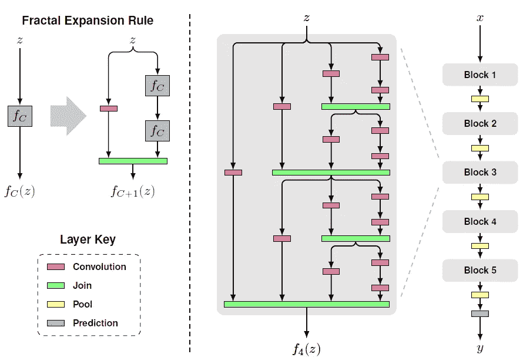
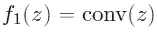
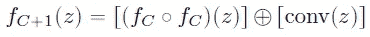
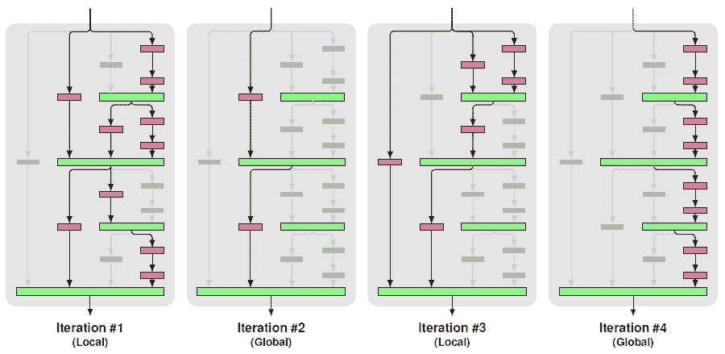
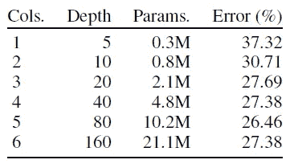
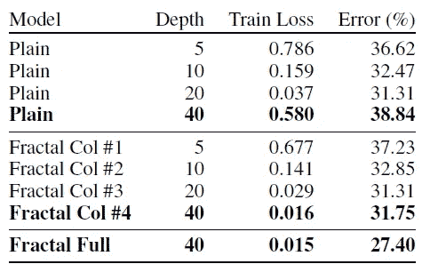
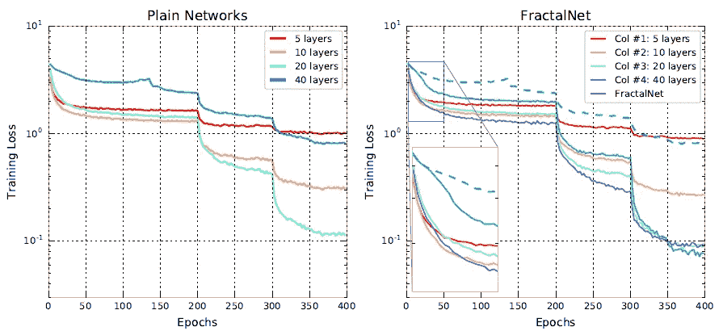
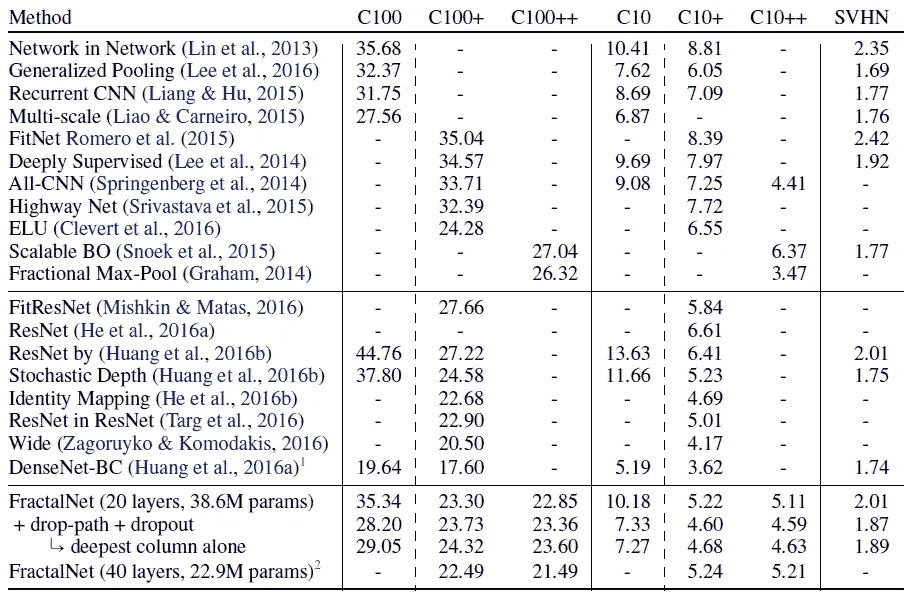
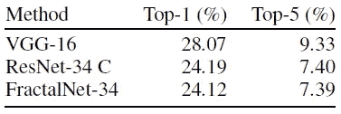

# 综述:分形网络(图像分类)

> 原文：<https://medium.datadriveninvestor.com/review-fractalnet-image-classification-c5bdd855a090?source=collection_archive---------0----------------------->

## 不使用残差的超深网络

在 2015 年， [ResNet](https://towardsdatascience.com/review-resnet-winner-of-ilsvrc-2015-image-classification-localization-detection-e39402bfa5d8) 发明后，随着无数冠军的获得，有大量的研究人员致力于如何改进 [ResNet](https://towardsdatascience.com/review-resnet-winner-of-ilsvrc-2015-image-classification-localization-detection-e39402bfa5d8) ，比如[预激活 ResNet](https://towardsdatascience.com/resnet-with-identity-mapping-over-1000-layers-reached-image-classification-bb50a42af03e) 、 [RiR](https://medium.com/@sh.tsang/review-rir-resnet-in-resnet-image-classification-be4c79fde8ba) 、 [RoR](https://towardsdatascience.com/review-ror-resnet-of-resnet-multilevel-resnet-image-classification-cd3b0fcc19bb) 、[随机深度](https://towardsdatascience.com/review-stochastic-depth-image-classification-a4e225807f4a)、 [WRN](https://towardsdatascience.com/review-wrns-wide-residual-networks-image-classification-d3feb3fb2004) 。相反，在本文中，我们将简要回顾一种非残差网络方法 **FractalNet** 。当 [VGGNet](https://medium.com/coinmonks/paper-review-of-vggnet-1st-runner-up-of-ilsvlc-2014-image-classification-d02355543a11) 从 16 层(VGG-16)到 19 层(VGG-19)开始退化的时候， **FractalNet 可以上到 40 层甚至 80 层**。并且发表在 **2017 ICLR** 上 **100 多篇引用**。( [Sik-Ho Tsang](https://medium.com/u/aff72a0c1243?source=post_page-----c5bdd855a090--------------------------------) @中)

# 涵盖哪些内容

1.  **分形网络架构**
2.  **作为规则化的丢弃路径**
3.  **消融研究**
4.  **结果**

# **1。分形网络架构**

**Fractal Architecture: A Simple Fractal Expansion (Left), Recursively Stacking of Fractal Expansion as One Block (Middle), 5 Blocks Cascaded as FractalNet (Right)**

对于基本情况，f1(z)是卷积层:

之后，递归分形是:

其中 C 是图中间的列数。块内最深路径处的卷积层数将具有 2^(C-1).在这种情况下， **C=4** ，因此，卷积层数是 2 =8 层。

对于**连接层**(绿色)，计算**元素平均值**。它不是串联或相加。

以图右侧的 5 个块( **B=5** )级联为 FractalNet，则整个网络内最深路径的卷积层数为 B×2^(C-1)，即 5×2 = **40 层**。

在两个块之间，进行 2×2 最大池化以减小特征图的大小。在每次卷积后使用批次范数和 ReLU。

# 2.**作为正则化的丢弃路径**

**Iterations of Alternative Local and Global Drop-Path**

有本地和全局丢弃路径:

*   **局部**:join**以固定的概率**丢弃每个输入，但确定至少有一个存活。
*   **全局** : **为整个网络选择一条路径**。

通过随机丢弃路径，就像噪声被注入到输入中，最终**正则化效果**达到**减少过拟合。**

# 3.消融研究

## 3.1.深度

**Number of Depths on CIFAR-100++**

深度为 80 的网络产生最佳性能。深度为 160 的网络存在过拟合问题。

## 3.2.分形结构的有效性

**Effectiveness of Fractal Structure on CIFAR-100++**

如果使用深度为 40 的平面网络，会发生过拟合，而分形结构仍然可以获得良好的性能，这表明分形网络可能不太容易过拟合。

## 3.3.学生-教师信息流

**Training Loss Against Epoches for Plain Network (Left) and FractalNet (Right)**

对于 40 层的平面网络，收敛速度很慢。

但是对于具有相同 40 层的 FractalNet 的 col #4，收敛速度快得多。作者声称还有其他栏目的帮助，即学生-教师信息流。

# 4.结果

## 4.1.CIFAR-10 (C10)，CIFAR-100 (C100)，SVHN(街景门牌号码)

**CIFAR-10, CIFAR-100, SVHN Results, (+: Data augmentation, ++: Heavy data augmentation)**

*   **在没有任何数据扩充的情况下，** FractalNet 获得了除 DenseNet-BC 之外最低的测试误差。特别是对于 C10 和 C100，FractalNet 的性能优于 ResNet。
*   **通过数据扩充，** **FractalNet 仍然可以胜过几乎所有的 ResNet 变体，除了针对 C10+和 C100+的 wide 变体(**[**【WRN】**](https://towardsdatascience.com/review-wrns-wide-residual-networks-image-classification-d3feb3fb2004)**)**)。
*   但是随着大量数据的增加(C10++和 C100++)，FractalNet 与 C10+或 C100+中的那些相比仍然不能有最好的结果。
*   而当时并发的 [DenseNet-BC](https://towardsdatascience.com/review-densenet-image-classification-b6631a8ef803) ，在所有任务上的表现都优于 FractalNet。但在本文中，主要目的是与 ResNet 进行比较，即非残差 vs 残差。

## 4.2.ImageNet

**ImageNet Results**

与 [ResNet-34 C](https://towardsdatascience.com/review-resnet-winner-of-ilsvrc-2015-image-classification-localization-detection-e39402bfa5d8) 相比，FractalNet-34 的结果稍好一些。

与非残差网络相比，FractalNet-34 大幅优于 [VGG-16](https://medium.com/coinmonks/paper-review-of-vggnet-1st-runner-up-of-ilsvlc-2014-image-classification-d02355543a11) 。

## 参考

【2017 ICLR】【分形网】
[分形网:无残差的超深度神经网络](https://arxiv.org/abs/1605.07648)

## 我对图像分类的相关综述

)(我)(们)(都)(不)(想)(要)(让)(这)(些)(人)(都)(有)(这)(些)(的)(情)(况)(,)(我)(们)(都)(不)(想)(会)(有)(什)(么)(情)(况)(,)(我)(们)(都)(不)(想)(会)(有)(什)(么)(情)(况)(,)(我)(们)(还)(没)(有)(什)(么)(情)(况)(,)(我)(们)(还)(有)(什)(么)(情)(况)(,)(我)(们)(还)(没)(有)(什)(么)(好)(的)(情)(感)(。 )(我)(们)(都)(不)(知)(道)(,)(我)(们)(都)(是)(很)(好)(的)(,)(我)(们)(都)(是)(很)(好)(的)(。