# 回顾:NoC—2015 年 COCO 和 ILSVRC 检测(目标检测)的获奖者

> 原文：<https://medium.datadriveninvestor.com/review-noc-winner-in-2015-coco-ilsvrc-detection-object-detection-d5cc84e372a?source=collection_archive---------8----------------------->

## NOC:将更快的 R-CNN 和残差网络与 Maxout 相结合，赢得了 2015 年 COCO & ILSVRC 检测挑战赛

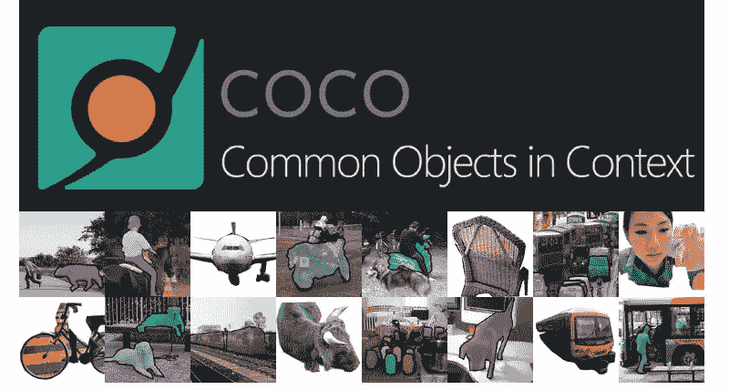

**MS COCO (**[**http://cocodataset.org/**](http://cocodataset.org/)**)**

在这个故事中， **NoCs** ，**网络上的卷积特征图**，由**中国科学技术大学**，**微软研究院**，**交通大学**，**脸书 AI 研究(FAIR)** 进行回顾。尽管网络中增加了有效的 [ResNet](https://towardsdatascience.com/review-resnet-winner-of-ilsvrc-2015-image-classification-localization-detection-e39402bfa5d8) 和[更快的 R-CNN](https://towardsdatascience.com/review-faster-r-cnn-object-detection-f5685cb30202) ，但 NOC 的设计是 ImageNet 和 2015 年可可小姐挑战赛第一名的重要元素。并发表在 **2017 TPAMI** 上，引用 **100 余次**。( [Sik-Ho Tsang](https://medium.com/u/aff72a0c1243?source=post_page-----d5cc84e372a--------------------------------) @中)

# 涵盖哪些内容？

1.  **什么是 NoC**
2.  **将 MLP 作为国家奥委会**
3.  **使用 ConvNet 作为 NoC**
4.  **规模选择的最大输出(从最大输出到最大输出 NoC)**
5.  **NoC 的其他分析**
6.  **结果 NoC 为** [**更快 R-CNN**](https://towardsdatascience.com/review-faster-r-cnn-object-detection-f5685cb30202) **同**[**ResNet**](https://towardsdatascience.com/review-resnet-winner-of-ilsvrc-2015-image-classification-localization-detection-e39402bfa5d8)**/**[**GoogLeNet**](https://medium.com/coinmonks/paper-review-of-googlenet-inception-v1-winner-of-ilsvlc-2014-image-classification-c2b3565a64e7)

# **1。什么是 NoC**

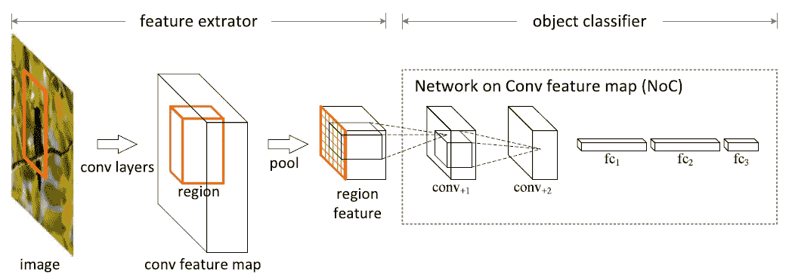

**Overview of NoC**

## 1.1.一种流行的目标检测策略

*   使用卷积图层提取与区域无关的特征
*   然后，执行 ROI 合并，随后是用于分类的区域式多层感知器(MLPs)或全连接(fc)层。
*   然而，这种策略在历史上是由预先训练的分类架构驱动的，类似于以 MLP 分类器结束的 [AlexNet](https://medium.com/coinmonks/paper-review-of-alexnet-caffenet-winner-in-ilsvrc-2012-image-classification-b93598314160) 和 [VGGNets](https://medium.com/coinmonks/paper-review-of-vggnet-1st-runner-up-of-ilsvlc-2014-image-classification-d02355543a11) 。

## 1.2.国家奥委会

*   代表卷积特征图上的**网络**
*   **关注区域分类器架构**，如上图所示。
*   为了选择最佳的 NoC，需要进行如下详细的消融研究。

# **2。使用 MLP 作为 NoC**

**NoC as MLP for PASCAL VOC 07 Using a** [**ZFNet**](http://ZFNet)

*   NoC 的一个简单设计是只使用 **fc 层**，称为多层感知器(MLP)。
*   **调查了 2 到 4 个 fc 层。**
*   最后一个 fc 层始终是(n+1)-d 带 softmax，其他 fc 层是 4，096-d 带 ReLU。
*   在没有对 NoC 进行任何预训练的情况下， **4fc NoC 作为相同特征上的分类器，mAP 高出 7.8%。**
*   在 3fc 层的特殊情况下，NoC 成为类似于在 [SPPNet](https://medium.com/coinmonks/review-sppnet-1st-runner-up-object-detection-2nd-runner-up-image-classification-in-ilsvrc-906da3753679) 和[Fast](http://Fast R-CNN)/[Fast R-CNN](https://towardsdatascience.com/review-faster-r-cnn-object-detection-f5685cb30202)中普遍使用的区域分类器的结构。

# 3.使用 ConvNet 作为 NoC

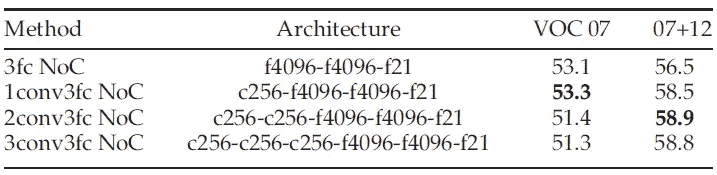

**NoC as ConvNet for PASCAL VOC 07 Using a** [**ZFNet**](http://ZFNet)

*   **NoC 中带有 ReLU 的 1 到 3 个附加 conv 层**被研究。
*   VOC 07 trainval 集合太小，无法训练更深的模型。
*   降级是过度拟合的结果。
*   有 conv 层的 NOC 在 VOC 07+12 trainval 集合上训练时表现出改进。高级 2conv3fc NoC 在此基础上提高了 58.9%。
*   使用三个额外的 conv 图层时，地图会变得饱和。

# 4.规模选择的最大输出(从最大输出到最大输出 NoC)

## 4.1.最大输出

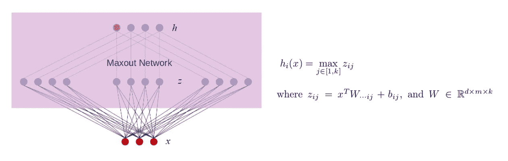

**Maxout Network with k=3**

*   [**Maxout**](https://arxiv.org/abs/1302.4389) 是发明 GAN 的 GoodFellow 发明的。这是一篇名为“ [Maxout Networks](https://arxiv.org/abs/1302.4389) ”的 **2013 ICML** 论文，被引用超过 **1300 次**。
*   它被命名为 Maxout，因为它的输出是一组输入中的最大值，也因为它是 dropout 的天然伴侣。
*   它被用作一种激活功能。
*   如上图所示，紫粉色区域是最大输出网络。
*   通过在 *k* 个仿射特征图中取最大值来构建最大输出特征图。

## 4.2.最大输出 NoC

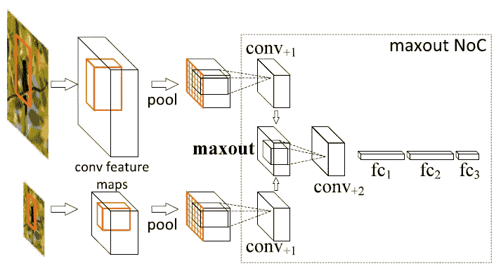

**A maxout NoC of “c256-mo-c256-f4096-f4096-f21”**

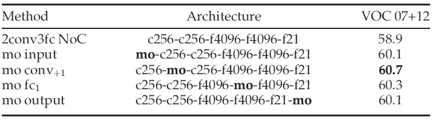

**Maxout NoC for PASCAL VOC 07 Using a** [**ZFNet**](http://ZFNet)

*   这里，最大输出 NoC 是使用**元素方式的最大值**将**的两个特征图(针对两个尺度)合并成相同维度的单个特征**。
*   在最大值之前有两条路径，它们的权重是共享的。因此，当使用 Maxout 时，**总权重数不变**。
*   最大输出的 4 个变体优于非最大输出 NoC。
*   然而，除了最大输出之外，还有许多其他方式来合并两个特征图，例如:1)简单地按元素相加在一起，2)使用/不使用 L2 归一化的连接，然后 1×1 卷积来降低维度，就像 [U-Net](https://towardsdatascience.com/review-u-net-biomedical-image-segmentation-d02bf06ca760) 或 [ParseNet](https://medium.com/datadriveninvestor/review-parsenet-looking-wider-to-see-better-semantic-segmentation-aa6b6a380990) 一样，或者 3)按元素相乘，就像 [DSSD](https://towardsdatascience.com/review-dssd-deconvolutional-single-shot-detector-object-detection-d4821a2bbeb5) 一样。应对此进行消融研究。

# 5.NoC 的其他分析

## 5.1.微调

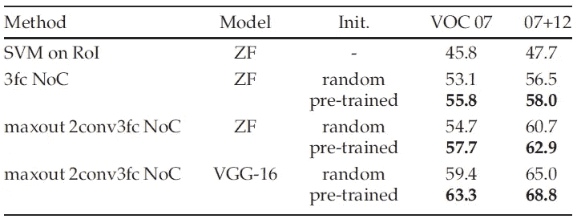

**NoC for PASCAL VOC 07 Using** [**ZF**](http://ZFNet)**/**[**VGG-16**](https://medium.com/coinmonks/paper-review-of-vggnet-1st-runner-up-of-ilsvlc-2014-image-classification-d02355543a11) **Nets with Different Initialization**

*   在预训练模型中具有 [**VGG-16**](https://medium.com/coinmonks/paper-review-of-vggnet-1st-runner-up-of-ilsvlc-2014-image-classification-d02355543a11) 和 fc 层，并且具有初始化为身份映射的附加 conv 层，初始网络状态相当于预训练的三个 fc 结构。
*   获得了 68.8%的 mAP。

## 5.2.误差分析

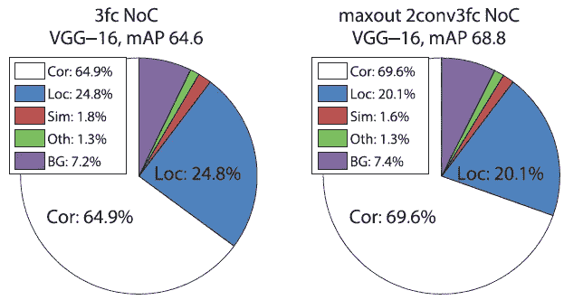

**Distribution of top-ranked True Positives (TP) and False Positives (FP), Cor** (correct), **Loc** (false due to poor localization), **Sim** (confusion with a similar category), **Oth** (confusion with a dissimilar category), **BG** (fired on background).

*   **与三个 fc 基线相比，定位误差大大减少**。
*   片上网络主要用于定位对象。
*   本地化敏感信息仅在 RoI 汇集后提取，并由 NOC 使用。

# 6.使用[ResNet](https://towardsdatascience.com/review-resnet-winner-of-ilsvrc-2015-image-classification-localization-detection-e39402bfa5d8)/[GoogLeNet](https://medium.com/coinmonks/paper-review-of-googlenet-inception-v1-winner-of-ilsvlc-2014-image-classification-c2b3565a64e7)的[更快 R-CNN](https://towardsdatascience.com/review-faster-r-cnn-object-detection-f5685cb30202) 的 NoC 结果

如上使用[快速 R-CNN](http://Fast R-CNN) 配合 [ZFNet](http://ZFNet) 或 [VGGNet](https://medium.com/coinmonks/paper-review-of-vggnet-1st-runner-up-of-ilsvlc-2014-image-classification-d02355543a11) 研究 NoC，我们可以得出结论，使用 ConvNet 作为 NoC 是最优的 NoC 架构。

## 6.1.可可女士

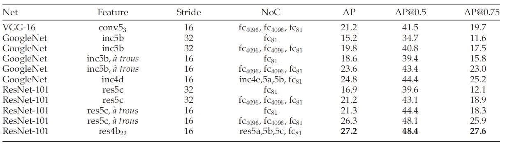

**Detection Results of** [**Faster R-CNN**](https://towardsdatascience.com/review-faster-r-cnn-object-detection-f5685cb30202) **on the MS COCO Val Set**

*   使用带 [ResNet](https://towardsdatascience.com/review-resnet-winner-of-ilsvrc-2015-image-classification-localization-detection-e39402bfa5d8) 或 [GoogLeNet](https://medium.com/coinmonks/paper-review-of-googlenet-inception-v1-winner-of-ilsvlc-2014-image-classification-c2b3565a64e7) 的[更快 R-CNN](https://towardsdatascience.com/review-faster-r-cnn-object-detection-f5685cb30202) 的 NoC。
*   用 [ResNet-101](https://towardsdatascience.com/review-resnet-winner-of-ilsvrc-2015-image-classification-localization-detection-e39402bfa5d8) (用[洞算法](http://DeepLabv1 & DeepLabv2)放大的特征图)，在 res4b22 提取特征，用 ConvNet 作为 NoC (res5a，5b，5c，fc81)，得到 27.2%的整体图。
*   从下面开始的结果来自于 [ResNet](https://towardsdatascience.com/review-resnet-winner-of-ilsvrc-2015-image-classification-localization-detection-e39402bfa5d8) 论文的补充部分。

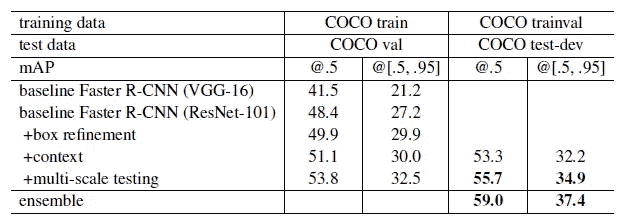

**Object detection improvements on MS COCO using** [**Faster R-CNN**](https://towardsdatascience.com/review-faster-r-cnn-object-detection-f5685cb30202) **and** [**ResNet-101**](https://towardsdatascience.com/review-resnet-winner-of-ilsvrc-2015-image-classification-localization-detection-e39402bfa5d8)**.**

*   **盒子细化**:为了进行推理，**从回归盒子中汇集新的特征，并获得新的分类得分和新的回归盒子。**在 val 集上获得了 29.9%的映射。
*   **全局背景**:给定全图 conv 特征地图，**通过全局空间金字塔池**将特征与“单级”金字塔( [SPPNet](https://medium.com/coinmonks/review-sppnet-1st-runner-up-object-detection-2nd-runner-up-image-classification-in-ilsvrc-906da3753679) )进行池化。这个全局特征**与原始的每个区域特征**连接在一起。在 val 集上获得了 30.0%的 mAP，在 test-dev 集上获得了 32.2%的 mAP。
*   **多尺度测试**:利用训练好的模型，在图像金字塔上计算 conv 特征图，其中图像的短边为{200，400，600，800，1000}。**从金字塔中选择两个相邻的尺度，ROI 合并，并通过 Maxout 合并。**在测试开发集上获得了 34.9%的 mAP。
*   **集合**:通过三个网络、**的**集合，在测试开发集上得到 37.4% mAP** 。这个成绩**获得了 COCO 2015** 探测任务第一名。**

## 6.2.帕斯卡 VOC

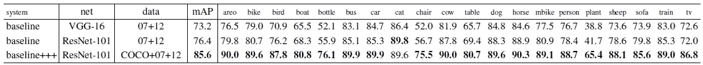

**Detection results on the PASCAL VOC 2007 test set**

*   利用 COCO 数据集上的单个模型，在 PASCAL VOC 集上对模型进行微调。
*   系统"**baseline ++ ++**"包括上述 6.1 中提到的**框细化、全局上下文和多尺度测试。(无组件，只有单一型号)**
*   在 PASCAL VOC 2007 测试集上获得了 85.6%的 mAP。

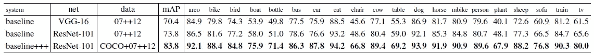

**Detection results on the PASCAL VOC 2012 test set**

*   同样，在 PASCAL VOC 2012 测试集上获得了 83.8%的 mAP。

## 6.3.ILSVRC 探测(DET)任务

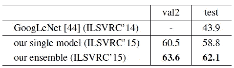

**ImageNet detection dataset**

*   这些网络根据 1000 级 ImageNet 分类集进行预训练，并根据 DET 数据进行微调。
*   同样通过**框细化、全局上下文和多尺度测试**，使用单一模型获得了 58.8%的地图。
*   利用 3 个模型的**集合，得到 **62.1%的 mAP** 。这个成绩**在 ILSVRC 2015** 的 ImageNet 检测任务中获得第一名。**

要了解 NoC，推荐阅读 Maxout 网络，NoC，以及从 arXiv 下载的 [ResNet](https://towardsdatascience.com/review-resnet-winner-of-ilsvrc-2015-image-classification-localization-detection-e39402bfa5d8) 的补充章节。

## 参考

【2013 ICML】【Maxout】
[Maxout 网络](https://arxiv.org/abs/1302.4389)

【2016 CVPR】【ResNet】
[用于图像识别的深度残差学习](https://arxiv.org/abs/1512.03385)

【2017 TPAMI】【NoCs】
[卷积特征图上的物体检测网络](https://arxiv.org/abs/1504.06066)

## 我的相关评论

)(我)(们)(都)(不)(想)(到)(这)(些)(人)(,)(我)(们)(都)(不)(想)(要)(到)(这)(些)(人)(,)(但)(是)(这)(些)(人)(还)(不)(想)(到)(这)(些)(人)(,)(我)(们)(还)(没)(想)(到)(这)(些)(事)(,)(我)(们)(就)(想)(到)(了)(这)(些)(人)(们)(,)(我)(们)(们)(都)(不)(想)(要)(到)(这)(些)(人)(,)(但)(我)(们)(还)(没)(想)(到)(这)(些)(事)(,)(我)(们)(还)(没)(想)(到)(这)(里)(来)(。 )(我)(们)(都)(不)(知)(道)(,)(我)(们)(还)(是)(不)(知)(道)(,)(我)(们)(还)(是)(不)(知)(道)(,)(我)(们)(还)(是)(不)(知)(道)(,)(我)(们)(还)(是)(不)(知)(道)(,)(我)(们)(还)(是)(不)(知)(道)(,)(我)(们)(还)(是)(不)(知)(道)(,)(我)(们)(还)(是)(不)(知)(道)(。

**物体检测** [过食](https://medium.com/coinmonks/review-of-overfeat-winner-of-ilsvrc-2013-localization-task-object-detection-a6f8b9044754)[R-CNN](https://medium.com/coinmonks/review-r-cnn-object-detection-b476aba290d1)[快 R-CNN](https://medium.com/coinmonks/review-fast-r-cnn-object-detection-a82e172e87ba)[快 R-CNN](https://towardsdatascience.com/review-faster-r-cnn-object-detection-f5685cb30202)[DeepID-Net](https://towardsdatascience.com/review-deepid-net-def-pooling-layer-object-detection-f72486f1a0f6)[R-FCN](https://towardsdatascience.com/review-r-fcn-positive-sensitive-score-maps-object-detection-91cd2389345c)】[离子](https://towardsdatascience.com/review-ion-inside-outside-net-2nd-runner-up-in-2015-coco-detection-object-detection-da19993f4766)[多路](https://towardsdatascience.com/review-multipath-mpn-1st-runner-up-in-2015-coco-detection-segmentation-object-detection-ea9741e7c413)[SSD](https://towardsdatascience.com/review-ssd-single-shot-detector-object-detection-851a94607d11)[DSSD](https://towardsdatascience.com/review-dssd-deconvolutional-single-shot-detector-object-detection-d4821a2bbeb5)

**语义切分** [FCN](https://towardsdatascience.com/review-fcn-semantic-segmentation-eb8c9b50d2d1)[de convnet](https://towardsdatascience.com/review-deconvnet-unpooling-layer-semantic-segmentation-55cf8a6e380e)[deeplabv 1&deeplabv 2](https://towardsdatascience.com/review-deeplabv1-deeplabv2-atrous-convolution-semantic-segmentation-b51c5fbde92d)】[parse net](https://medium.com/datadriveninvestor/review-parsenet-looking-wider-to-see-better-semantic-segmentation-aa6b6a380990)】[dilated net](https://towardsdatascience.com/review-dilated-convolution-semantic-segmentation-9d5a5bd768f5)[PSPNet](https://towardsdatascience.com/review-pspnet-winner-in-ilsvrc-2016-semantic-segmentation-scene-parsing-e089e5df177d)]

**生物医学图像分割** 

**实例分割** [ [深度掩码](https://towardsdatascience.com/review-deepmask-instance-segmentation-30327a072339) ] [ [清晰度掩码](https://towardsdatascience.com/review-sharpmask-instance-segmentation-6509f7401a61) ] [ [多路径](https://towardsdatascience.com/review-multipath-mpn-1st-runner-up-in-2015-coco-detection-segmentation-object-detection-ea9741e7c413)][[MNC](https://towardsdatascience.com/review-mnc-multi-task-network-cascade-winner-in-2015-coco-segmentation-instance-segmentation-42a9334e6a34)][[Instance fcn](https://towardsdatascience.com/review-instancefcn-instance-sensitive-score-maps-instance-segmentation-dbfe67d4ee92)]