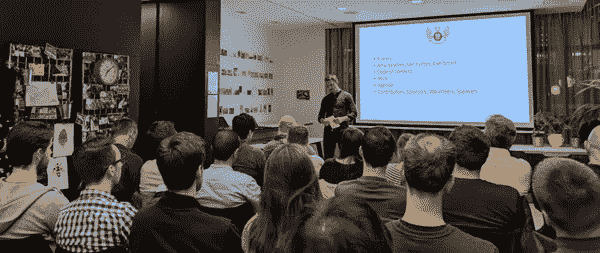

# 回顾:西北测试人员聚会

> 原文：<https://medium.datadriveninvestor.com/review-north-west-tester-gathering-meetup-40cfb3bbbd4c?source=collection_archive---------13----------------------->

我开始参加[North West Tester Gathering](https://www.meetup.com/North-West-Tester-Gathering/)Meetup，以获得关于测试行业的专业知识，并建立有价值的联系，所有这些都是为了大大改善我们在 Evolution 的内部应用程序的测试结构。

在 IT 团队中，我们目前正在计划开发一个集成的测试流程，并在将来发布给用户。这些聚会有助于我们获得关于如何完善我们的测试程序的创新想法，以便 Evolution 的员工能够更有效地工作，并更好地为试图获得理想工作的候选人提供出色的服务。

 [## 风险投资家在给创业公司播种时会考虑什么标准？-数据驱动型投资者

### 2017 年，风险投资资金攀升至十年来的最高水平。你的创业公司目前吸引风险投资的机会是…

www.datadriveninvestor.com](https://www.datadriveninvestor.com/2018/04/20/what-criteria-do-venture-capitalists-consider-when-seeding-a-startup/) 

本月早些时候的聚会教会了我很多关于测试中心部署管道的知识。来自[金钱超市](https://twitter.com/MSMGroupcareers)的约翰·尚德和来自 BookingGo 的[丹·斯马特](https://twitter.com/theSmartass83)两位杰出的演讲者都深入探讨了他们严格实施的部署策略，以确保他们的消费者获得流畅、可靠和无错误的体验。

由 BrightBox 公司的 Amy Newton 主持的这次活动经过了完美的策划，为与会者提供了一个知识丰富、信息丰富的会议，同时在一个令人兴奋、有趣和社交的环境中进行展示。像这样的会议对于年轻的开发人员和测试人员来说都是有用的，可以有效地学习和建立联系，对于业内更多的资深人士来说，可以传播他们的知识，以创造更美好的明天。

第一个演讲者，John Shand，做了一个关于契约和消费者驱动的契约测试的内容丰富的演讲。PACT 是消费者驱动的契约测试工具；契约测试是一种确保服务(比如 API 提供者和客户端)可以相互通信的方法。如果没有契约测试，知道服务可以通信的唯一方法就是使用昂贵而脆弱的集成测试。

约翰和 PACT 网站都用了一个很好的类比:“你会为了测试你的烟雾报警器而放火烧了你的房子吗？不，你用耳朵通过测试按钮测试它持有的契约。PACT 为您的代码提供了测试按钮，允许您安全地确认您的应用程序将一起工作，而不必先部署到世界各地。”

当使用 PACT 时，契约被编写为消费者测试的一部分。这种模式的一个主要优点是，只有消费者实际使用的通信部分得到测试。这反过来意味着，当前消费者不使用的任何提供者行为都可以在不破坏测试的情况下自由更改。

第二位演讲者 Dan Smart 深入讨论了 BookingGo 的整个部署流程，使用了单元、浏览器、合同和服务集成测试，只需点击一个按钮即可完成。Dan 描述的整个发布过程从头到尾都是自动化的，这让开发人员和测试人员相信他们的产品是可靠的。

他们的每个微服务(UX、API)和用户前端都单独测试，也作为一个整体一起测试。这应该能让人相信，整个系统能够和谐地协同工作。Dan 描述的测试过程包括模拟和真实世界数据的混合，提供了为客户提供最佳用户体验所涉及的所有系统的真正完整覆盖。

我会向 IT 行业的每个人推荐西北测试者聚会——不仅仅是测试者。我从我参加的活动中获得了很多知识和想法，我能够将这些知识和想法带回进化，以改善内部系统，为所有相关方提供更好、更有成效的体验。

像这样的聚会也是一个结交你感兴趣的行业的朋友的好地方，以你不能仅仅通过浏览互联网在社交媒体上联系的方式来促进你的职业生涯！

想和我一起参加下一次[西北测试员聚会](https://www.meetup.com/North-West-Tester-Gathering/)的聚会，请在这里回复:【https://www.meetup.com/North-West-Tester-Gathering/】T4

*原载于 2019 年 3 月 27 日*[*www.evolutionjobs.com*](https://www.evolutionjobs.com/uk/media/review-north-west-tester-gathering-meetup-176970/)*。*