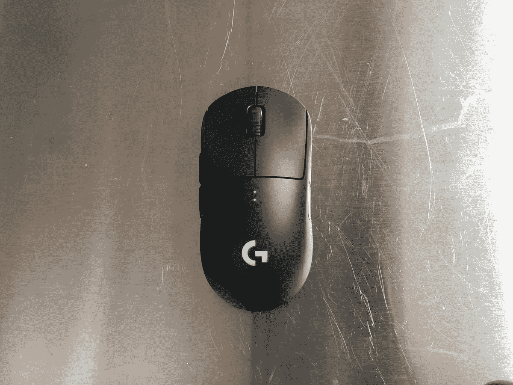
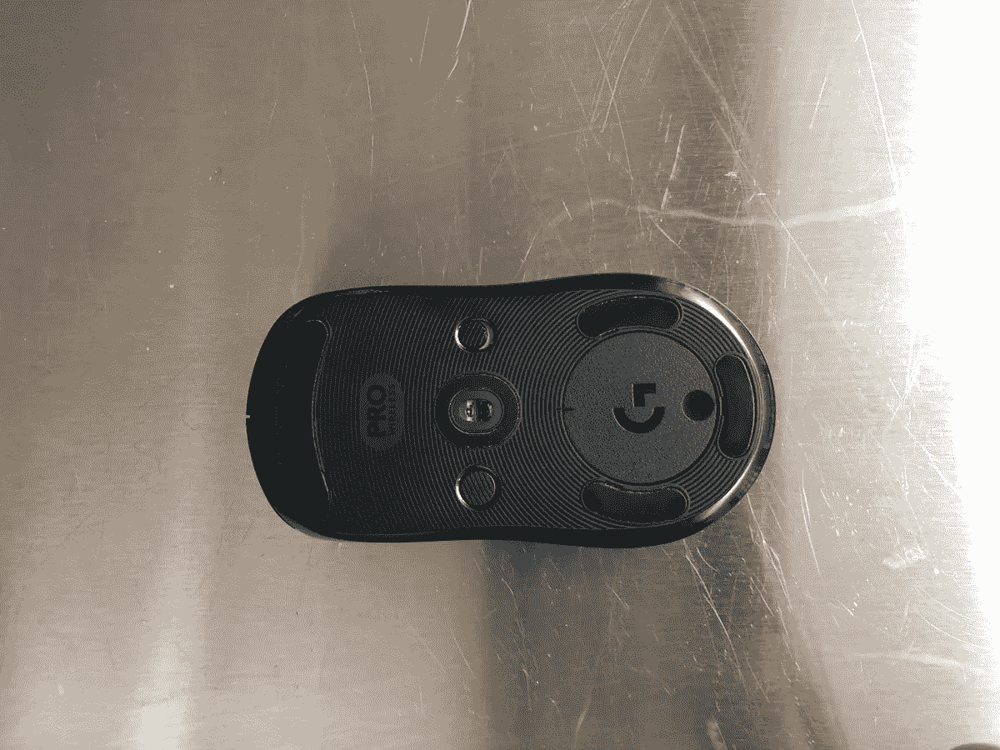

# 罗技 G Pro 无线鼠标综述

> 原文：<https://medium.datadriveninvestor.com/review-of-logitech-g-pro-wireless-mouse-12f01a8b9af3?source=collection_archive---------11----------------------->

罗技 G Pro 无线是一个神奇的鼠标，电池寿命惊人，传感器响应完美无瑕&它舒适地放在手掌中。

**建造和造型:**

罗技的 G Pro 无线鼠标是一个伟大的多功能鼠标，Nixeus Revel 在形状和易用性方面将是 G Pro 最接近的竞争对手。 [G Pro Wireless](https://thegamingsetup.com/gaming-mice/gaming-mice-reviews/logitech-g-pro-wireless-super-light-ambidextrous-wireless/) 更圆更高，更能填满手，鼠标两侧的前部倾斜度更小，角度更平缓。

这种外形加上 80 克的轻重量使这款鼠标非常容易操作和拿起。

**按钮和滚轮:**

Logitech G Pro wireless 具有可拆卸的侧按钮，以适应所有类型的游戏风格。

Pro 无线鼠标中包含的按钮有:

2 次主要的左右点击

左侧有两个侧按钮

右侧有两个侧按钮

滚动点击

顶部没有 DPI 切换器，它位于底部。

除了充当 DPI 转换或可用于其他宏功能的右侧按钮之外，可定制的侧按钮为游戏玩家提供了极大的灵活性。

G Pro 安装了一个实心滚轮，带有安静的触觉步骤，与 G305 相比稍微轻了一点。就我个人而言，我更喜欢有点僵硬的滚轮，但在需要的时候用它交换武器没有任何问题。

**传感器和性能:**

Logitech G Pro Wireless 配备了 HERO 16K，这是 G305 中传感器的更新版本。传感器本身可以精确跟踪高达 16000 DPI 到 100 DPI 的图像。离地距离低，无法在 Logitech 软件中调整 LOD。

一个伟大的传感器，符合人体工程学的形状&重量只有 80 克，这让这款鼠标成为我见过的性能最好的鼠标之一。无论是不是游戏玩家，它都是性能最好的鼠标。

# 优点:

HERO 16K 中的完美传感器

轻量级老鼠:80 克

[游戏鼠标](https://thegamingsetup.com/gaming-mice/best/best-wireless-gaming-mouse/)的最佳电池寿命，长达 60 小时

可更换的侧按钮

无线充电能力

很棒的形状

**缺点:**

昂贵，G903 的价格最高

鼠标顶部没有 DPI 切换按钮。