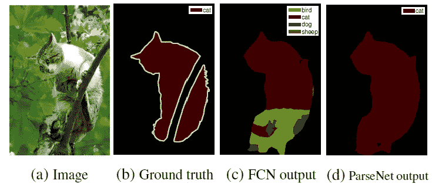
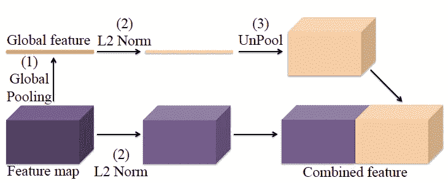
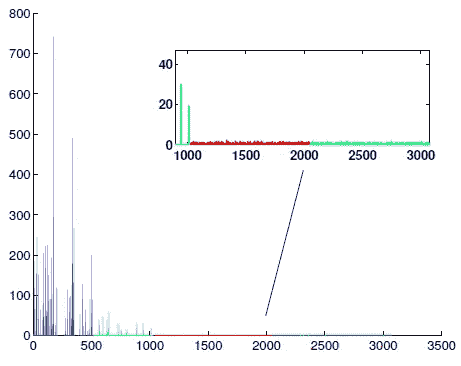
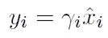
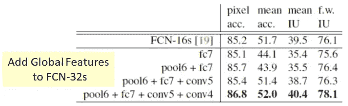
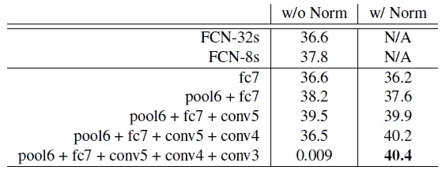
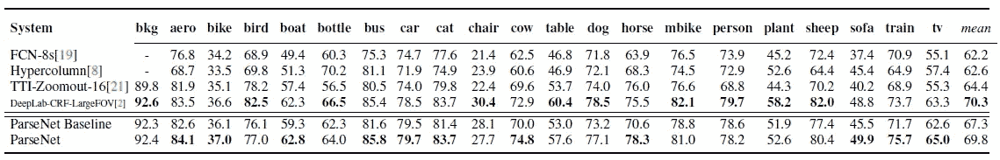
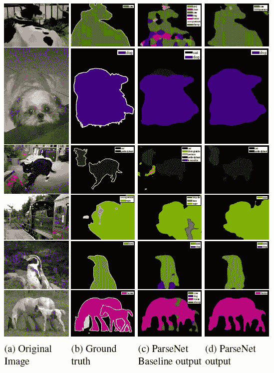
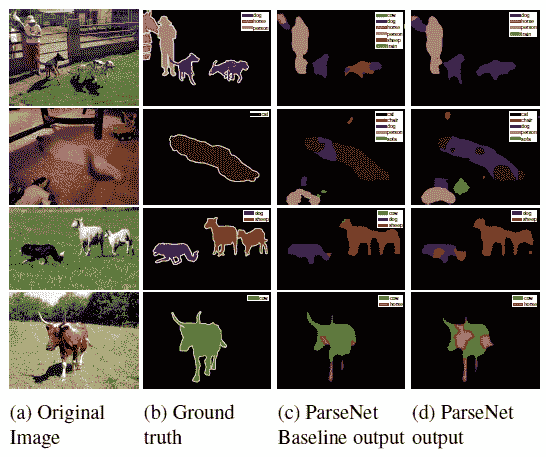

# 回顾:parse net——看得更宽，看得更清楚(语义分段)

> 原文：<https://medium.datadriveninvestor.com/review-parsenet-looking-wider-to-see-better-semantic-segmentation-aa6b6a380990?source=collection_archive---------2----------------------->

在这个故事中， **ParseNet** 被短暂回顾。通过使用 ParseNet，增加了**全局上下文**，提高了准确率。这是一篇 **2016 ICLR** 论文，在我写这个故事的时候有超过 **200 篇引用**。( [Sik-Ho Tsang](https://medium.com/u/aff72a0c1243?source=post_page-----aa6b6a380990--------------------------------) @中)

**Example of ParseNet**

通过使用 ParseNet，上图中的猫不会被错误地归类为鸟、狗或羊。提到了全局上下文可以帮助对局部补丁进行分类。让我们看看它是如何工作的。

# 涵盖哪些内容

1.  **ParseNet 模块**
2.  **结果**

# 1.ParseNet 模块

**ParseNet Module**

实际上，ParseNet 很简单，如上图所示。

**Normalization Using l2 Norm for each channel**

在较低路径，在某个 conv 层，使用 l2 范数对每个通道进行归一化。

在上面的路径中，在特定的 conv 层，我们在 conv 层执行这些特征地图的全局平均汇集，并使用 l2 范数执行归一化。取消池化只是将全局平均池化向量的值复制到与较低路径相同的大小，以便它们可以连接在一起。

**Features are in different scale at different layers**

**存在 L2 范数的原因是，因为早期层通常比后期层具有更大的值。**

上述示例显示了不同图层的要素具有不同的值范围。归一化后，所有要素将具有相同的值范围。它们都连接在一起。

归一化后还引入了每个通道的**可学习比例因子γ:**

# 3.结果

## 3.1.SiftFlow

**SiftFlow Dataset**

**使用 ParseNet 模块对**[**FCN-32s**](https://towardsdatascience.com/review-fcn-semantic-segmentation-eb8c9b50d2d1)**进行 pool6 + fc7 + conv5 + conv4 相加归一化，得到 40.4%的平均 IOU**，优于 [FCN-16s](https://towardsdatascience.com/review-fcn-semantic-segmentation-eb8c9b50d2d1) 。

## 3.2.PASCAL 上下文

**PASCAL Context Dataset**

**通过使用 ParseNet 模块对**[**FCN-32s**](https://towardsdatascience.com/review-fcn-semantic-segmentation-eb8c9b50d2d1)**添加并归一化 pool6 + fc7 + conv5 + conv4 + conv3，得到 40.4%的 IOU**，优于 [FCN-8s](https://towardsdatascience.com/review-fcn-semantic-segmentation-eb8c9b50d2d1) 。

我们还可以看到，如果没有规范化，它就不能很好地用于 ParseNet 模块。

## 3.3.帕斯卡 VOC 2012

**PASCAL VOC 2012 Dataset**

*   **ParseNet 基线**:不含 CRF 的 [DeepLabv1](https://towardsdatascience.com/review-deeplabv1-deeplabv2-atrous-convolution-semantic-segmentation-b51c5fbde92d) ，67.3%
*   **ParseNet** :带 ParseNet 模块的 ParseNet 基线，69.8%
*   **deep lab-CRF-large FOV**:[deep lab v1](https://towardsdatascience.com/review-deeplabv1-deeplabv2-atrous-convolution-semantic-segmentation-b51c5fbde92d)，70.3%

虽然 ParseNet 的性能低于 DeepLab-CRF-LargeFOV，但它仍然具有竞争力，它是端到端的学习框架，而 CRF 是一个后处理步骤，这使得 [DeepLabv1](https://towardsdatascience.com/review-deeplabv1-deeplabv2-atrous-convolution-semantic-segmentation-b51c5fbde92d) 没有。

**Some Qualitative Results**

**Failure Cases**

我们可以看到，当物体由多种颜色组成，或者被遮挡时，上面的失败案例总是发生。

虽然比 [DeepLabv1](https://towardsdatascience.com/review-deeplabv1-deeplabv2-atrous-convolution-semantic-segmentation-b51c5fbde92d) (带 CRF)性能低，但在 DeepLabv3 和 DeepLabv3+中使用。

# 参考

*   【2016 ICLR】【parse net】
    [parse net:看得更宽才能看得更清楚](https://arxiv.org/abs/1506.04579)

# 我的相关评论

[ [FCN](https://towardsdatascience.com/review-fcn-semantic-segmentation-eb8c9b50d2d1) ] [ [解除网络](https://towardsdatascience.com/review-deconvnet-unpooling-layer-semantic-segmentation-55cf8a6e380e) ] [ [深度实验室 v1 &深度实验室 v2](https://towardsdatascience.com/review-deeplabv1-deeplabv2-atrous-convolution-semantic-segmentation-b51c5fbde92d) ]

