# 综述:红网——残差编码器-解码器网络(去噪/超分辨率)

> 原文：<https://medium.datadriveninvestor.com/review-red-net-residual-encoder-decoder-network-denoising-super-resolution-cb6364ae161e?source=collection_archive---------3----------------------->

## **图像恢复包括图像去噪**、**超分辨率**、 **JPEG 去块**、**图像去模糊**和 I **图像修复**。

在这个故事中，回顾了用于图像恢复的**红网(残差编解码网络)**。假设我们有一个损坏的图像 y:

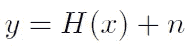

其中 *x* 为 *y* 的干净版； *H* 是退化函数， *n* 是加性噪声。通过使用相同的网络架构，但使用不同的数据集训练，即使用不同组的 *x* 和 *y* ，红网可以帮助完成**图像去噪**、**超分辨率**、 **JPEG 去块**、**图像去模糊**和**图像修复**的任务。

发表在 **2016 NIPS** 上，引用 **200 余次**。在 **2016 arXiv** 中也有更详细版本的技术报告。([曾植和](https://medium.com/u/aff72a0c1243?source=post_page-----cb6364ae161e--------------------------------) @中)

# 涵盖哪些内容

1.  **网络架构**
2.  **消融研究**
3.  **图像去噪、超分辨率、JPEG 去块、图像去模糊和图像修复的结果**

# **1。网络架构**

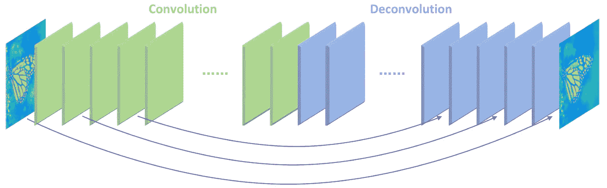

**RED-Net Network Architecture**

该网络包含对称卷积层(编码器)和反卷积层(解码器)。

## 盘旋

卷积层充当特征提取器，它捕获图像内容的抽象，同时消除噪声/破坏。

## 反褶积

然后将反卷积层组合起来以恢复图像内容的细节。解卷积层将单个输入激活与多个输出相关联。反卷积通常用作**可学习的上采样层**。

## 跳过/快捷连接

从卷积要素地图到镜像反卷积要素地图，每隔几层(在本例中为两层)就会连接一次跳过/快捷连接。因此，来自卷积层的响应被向前和向后直接传播到相应的镜像解卷积层。传递的卷积特征映射被逐元素地加到去卷积特征映射，并在校正后传递到下一层。

# 2.**消融研究**

## 2.1.卷积和反卷积的不同组合

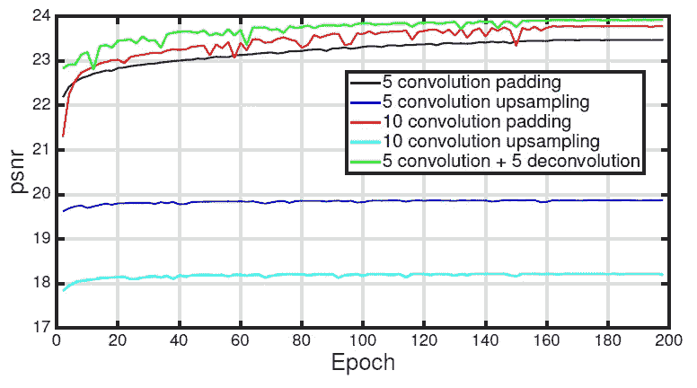

**PSNR on Image Denoising (σ=70) Validation Set During Training**

*   通过仅使用 5 或 10 去卷积(conv 上采样)，获得的 PSNR 不好。
*   通过仅使用 5 或 10 个 conv，获得的 PSNR 更好。
*   通过使用 5 conv 和 5 deconv，获得的 PSNR 好得多。

## 2.2.跳过/快捷连接的有效性

**PSNR on Image Denoising (σ=70) Validation Set During Training**

*   对于跳过连接，PSNR 要好得多。
*   原因可能是更深的网络会破坏图像细节，这对于逐像素密集回归是不希望的。跳过连接携带重要的图像细节，这有助于重建清晰的图像。
*   使用非常深的网络可能容易遭受训练问题，例如梯度消失。使用跳过连接有助于解决这个问题。

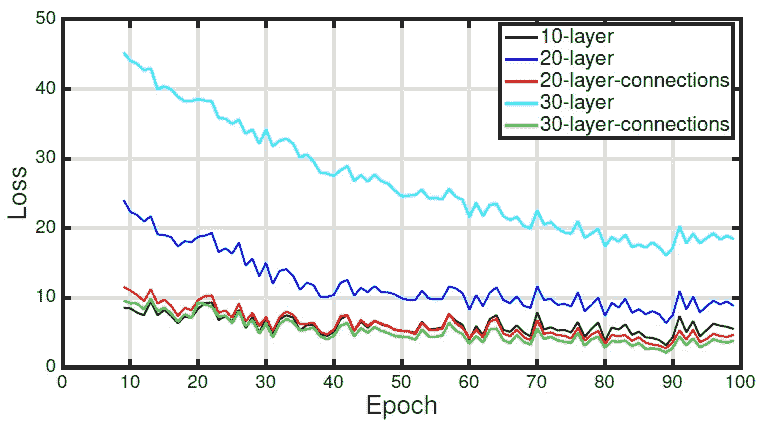

**Training Loss**

*   在没有跳跃连接的情况下，与层数较少的网络相比，层数较多的网络甚至会增加训练过程中的损耗。
*   在跳过连接的情况下，30 层网络优于 20 层网络，训练损失较小。

**Skip Connections Types**

*   由长短对称跳过连接组成的红网比 ResNet 中的 ResNet 构建块要好。

# **3。图像去噪、超分辨率、JPEG 去块和图像修复的结果**

## 3.1.图像去噪

*   降低噪声图像的噪声。
*   数据集:14 个公共基准图像和 BSD 数据集。

## **3.1.1。一种噪声等级对应一种型号**

**Average PSNR and SSIM results of σ 10, 30, 50, 70**

*   RED2n: n conv 和 n deconv，采用对称跳过连接
*   RED10 已经取得了比其他先进方法更好的结果
*   RED30 的效果甚至更好。

## 3.1.2.一个模型适用于所有噪声水平

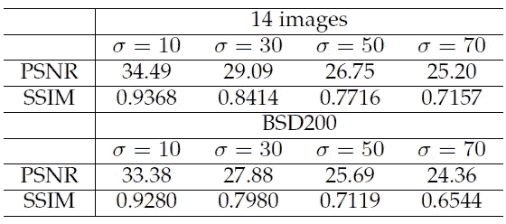

**Average PSNR and SSIM results for image denoising using a single 30-layer network**

*   与单独的模型相比，PSNR 是退化的，但是它仍然胜过现有的方法。

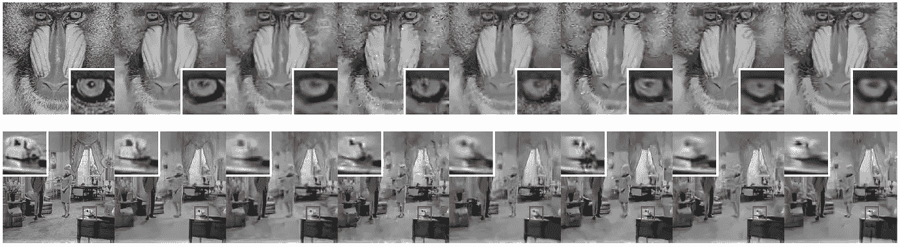

**Visual results of image denoising. Images from left to right column are: clean image; the recovered image of RED30, BM3D, EPLL, NCSR, PCLR, PGPD, WNNM**

## 3.2.超分辨率

*   放大图像的尺寸。
*   数据集:集合 5、集合 14 和 BSD100

## 3.2.1.一个模型对应一个比例因子

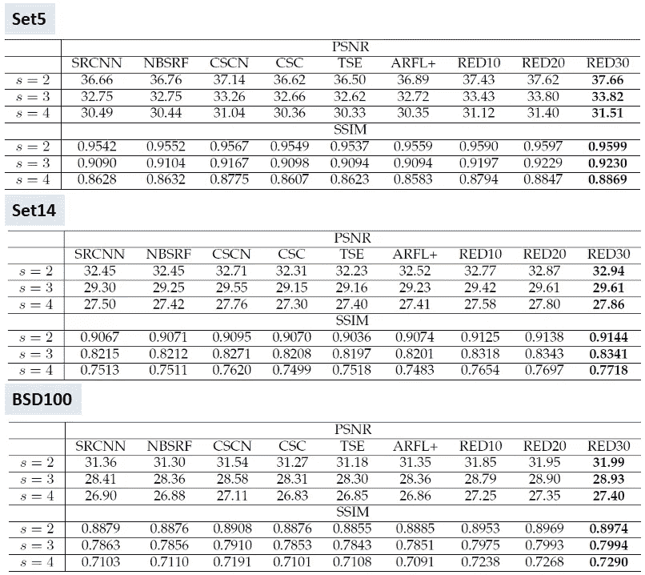

**Average PSNR and SSIM results of scaling 2, 3 and 4**

*   RED30 再次获得最高 PSNR，优于 [SRCNN](https://medium.com/coinmonks/review-srcnn-super-resolution-3cb3a4f67a7c) 。

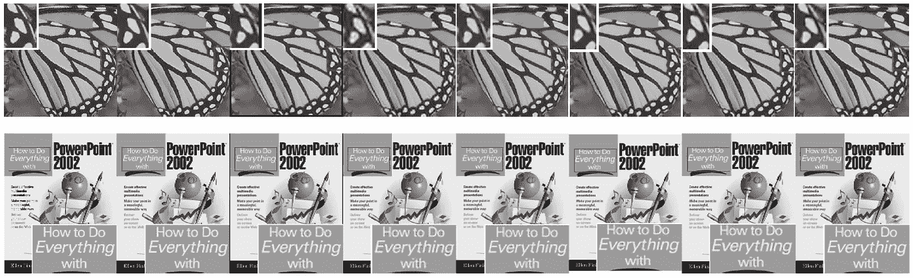

**Visual results of image super-resolution. Images from left to right column are: High resolution image; the recovered image of RED30, ARFL+, CSC, CSCN, NBSRF, SRCNN, TSE**

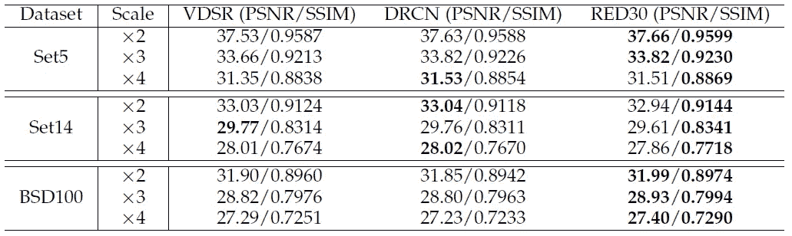

**Average PSNR and SSIM results of scaling 2, 3 and 4**

*   在红网发展的同时，超分辨率的并行工程 VDSR 和 DRCN 被发明出来。
*   对于所有数据集和缩放因子，RED30 几乎表现最佳。

## 3.2.2.一个模型适用于所有比例因子

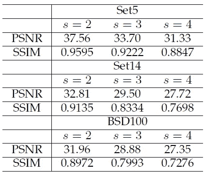

**Average PSNR and SSIM results of scaling 2, 3 and 4 using a single 30-layer network**

*   RED30 表现还是相当不错的。

## 3.3.JPEG 去块

*   诸如 JPEG 之类的有损压缩引入了复杂的压缩伪像，尤其是块效应、振铃效应和模糊。
*   减少 JPEG 压缩伪像。
*   数据集:LIVE1

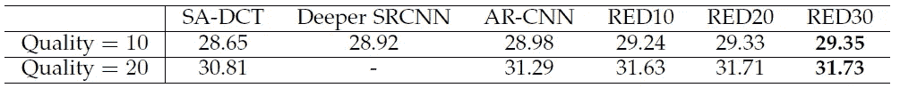

**JPEG compression deblock: average PSNR results of LIVE1**

*   有了这样的深度网络，RED30 与更深的 [SRCNN](https://medium.com/coinmonks/review-srcnn-super-resolution-3cb3a4f67a7c) 和 [AR-CNN](https://towardsdatascience.com/review-arcnn-deblocking-denoising-a098deeb792) 相比再次获得最好的结果。

## 3.4.**图像去模糊**

*   减少图像中的模糊。

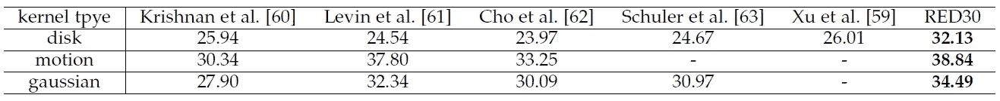

**The performance on deblurring “disk”, “motion” and “gaussian” kernels**

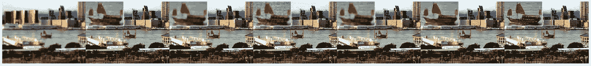

**Visual comparisons on non-blind deblurring. Images from left to right are: blurred images, the results of Cho [62], Krishnan [60], Levin [61], Schuler [63], Xu [59] and RED30**

*   RED30 表现最好，PSNR 最高。

## 3.5.图像修复

*   填补漏洞或损坏的部分。

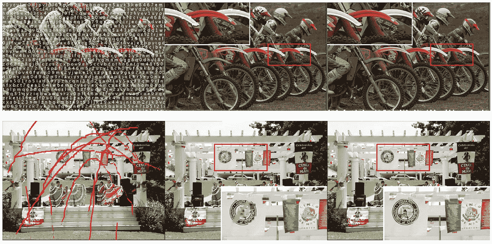

**Images from left to right are: Corrupted images, the inpainting results of FoE and the inpainting results of RED30**

*   与 FoE 相比，RED30 具有更好的结果。

## 参考

【2016 NIPS】
[使用具有对称跳跃连接的甚深卷积编码器-解码器网络的图像恢复](https://arxiv.org/abs/1603.09056)

【2016 arXiv】
[使用具有对称跳跃连接的卷积自动编码器的图像恢复](https://arxiv.org/abs/1606.08921)

## 我的相关评论

**超分辨率
[[Sr CNN](https://medium.com/coinmonks/review-srcnn-super-resolution-3cb3a4f67a7c)][[fsr CNN](https://towardsdatascience.com/review-fsrcnn-super-resolution-80ca2ee14da4)][[VDSR](https://towardsdatascience.com/review-vdsr-super-resolution-f8050d49362f)][[ESPCN](https://medium.com/datadriveninvestor/review-espcn-real-time-sr-super-resolution-8dceca249350)]**

**神器还原** [ARCNN](https://towardsdatascience.com/review-arcnn-deblocking-denoising-a098deeb792)