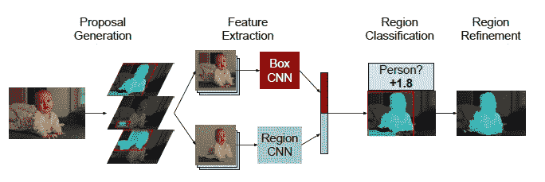
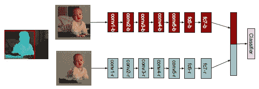
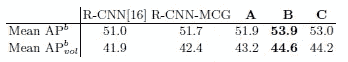
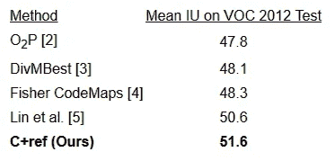
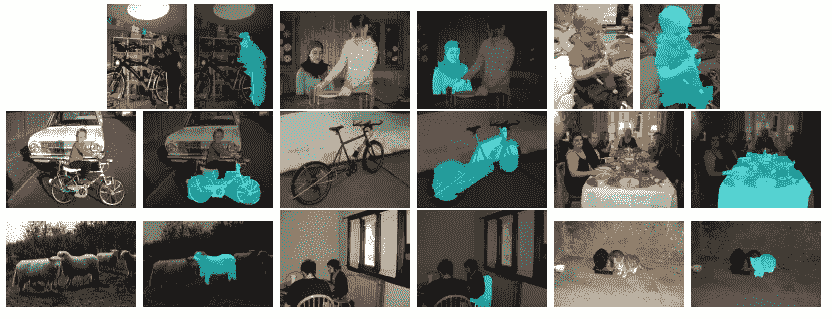

# 复习:SDS —同时检测和分段(实例分段)

> 原文：<https://medium.datadriveninvestor.com/review-sds-simultaneous-detection-and-segmentation-instance-segmentation-80b2a8ce842b?source=collection_archive---------4----------------------->

## 工作于对象检测和语义分割，优于 R-CNN

在这个故事中，简要回顾了**加州大学**和**洛杉矶安第斯大学**的 **SDS(同步检测与分割)**。它谈到了同时检测和分割。当对象检测和语义分割相结合时，实际上就是实例分割的问题。这是一篇 **2014 年 ECCV** 论文，引用超过 **600 次**。( [Sik-Ho Tsang](https://medium.com/u/aff72a0c1243?source=post_page-----80b2a8ce842b--------------------------------) @中)

 [## 今年值得关注的人工智能趋势——数据驱动的投资者

### 预计 2019 年人工智能将取得广泛的重大进展。从谷歌搜索到处理复杂的工作，如…

www.datadriveninvestor.com](https://www.datadriveninvestor.com/2019/02/19/artificial-intelligence-trends-to-watch-this-year/) 

# 概述

1.  **SDS 架构**
2.  **结果**

# **1。SDS 架构**

**SDS Architecture**

*   该网络基于 [R-CNN](http://R-CNN) 进行修改。
*   **首先，区域提议由 MCG** 生成，与选择性搜索相比，这是一种更好的区域提议生成方法。
*   然后，每个地区的提案将通过两条途径。

**More Details on Conv and FC Layers for Two Pathways**

*   **上层路径**是**包围盒网络**，生成一个特征向量。
*   **底部路径**是所谓的“区域”(论文中)或**分割网络**，其中背景像素被屏蔽掉，生成另一个特征向量。
*   之后，**两个特征向量被串接。**
*   基于该连接的特征向量，使用 SVM 执行**分类。**
*   并且通过预测属于前景的概率来改进“区域”或**分割结果。**

# **2。结果**

## 2.1.目标检测

*   a、B 和 C 是级联的特征向量如何被训练的。他们都属于 SDS。SDS 优于 [R-CNN](https://medium.com/coinmonks/review-r-cnn-object-detection-b476aba290d1) 以及 [R-CNN](https://medium.com/coinmonks/review-r-cnn-object-detection-b476aba290d1) 使用 MCG 生成区域建议。

## 2.2.语义分割

**Updated Results from** [**https://www2.eecs.berkeley.edu/Research/Projects/CS/vision/shape/sds/**](https://www2.eecs.berkeley.edu/Research/Projects/CS/vision/shape/sds/)

*   SDS 的结果最好。(参考:细化)

**Some Visualizations**

*   实际上，它是实例分割，例如，由于检测框的限制，即使有两个人，它也只分割一个人。

我选择阅读这篇论文是因为 SDS 已经被用于对象检测、语义分割和实例分割中的比较。我没有深入研究 SDS 的细节，因为它是 CNN 方面的早期论文，例如分段任务。对我来说，还是稍微了解一下它的架构比较好。

## 参考

【2014 ECCV】【SDS】
[同时检测和分割](https://arxiv.org/abs/1407.1808)

## 我以前的评论

)(我)(们)(都)(不)(想)(到)(这)(些)(人)(,)(我)(们)(都)(不)(想)(要)(到)(这)(些)(人)(,)(但)(是)(这)(些)(人)(还)(不)(想)(到)(这)(些)(人)(,)(我)(们)(还)(没)(想)(到)(这)(些)(事)(,)(我)(们)(就)(想)(到)(了)(这)(些)(人)(们)(,)(我)(们)(们)(都)(不)(想)(要)(到)(这)(些)(人)(,)(但)(我)(们)(还)(没)(想)(到)(这)(些)(事)(,)(我)(们)(还)(没)(想)(想)(到)(这)(些)(事)(,)(我)(们)(还)(没)(想)(到)(这)(里)(去)(。 )(我)(们)(都)(不)(想)(到)(这)(些)(人)(,)(我)(们)(都)(不)(想)(到)(这)(些)(人)(,)(但)(是)(这)(些)(人)(还)(有)(什)(么)(情)(况)(呢)(?)(我)(们)(都)(不)(想)(到)(这)(些)(人)(,)(但)(是)(这)(些)(人)(还)(是)(这)(些)(人)(,)(还)(是)(这)(些)(人)(,)(还)(没)(有)(什)(么)(好)(的)(情)(情)(况)(,)(还)(是)(这)(些)(人)(,)(我)(们)(还)(没)(想)(到)(这)(里)(来)(。

**物体检测** [过食](https://medium.com/coinmonks/review-of-overfeat-winner-of-ilsvrc-2013-localization-task-object-detection-a6f8b9044754)[R-CNN](https://medium.com/coinmonks/review-r-cnn-object-detection-b476aba290d1)[快 R-CNN](https://medium.com/coinmonks/review-fast-r-cnn-object-detection-a82e172e87ba)[快 R-CNN](https://towardsdatascience.com/review-faster-r-cnn-object-detection-f5685cb30202)[DeepID-Net](https://towardsdatascience.com/review-deepid-net-def-pooling-layer-object-detection-f72486f1a0f6)】[CRAFT](https://towardsdatascience.com/review-craft-cascade-region-proposal-network-and-fast-r-cnn-object-detection-2ce987361858)[R-FCN](https://towardsdatascience.com/review-r-fcn-positive-sensitive-score-maps-object-detection-91cd2389345c)[ION](https://towardsdatascience.com/review-ion-inside-outside-net-2nd-runner-up-in-2015-coco-detection-object-detection-da19993f4766)[multipath Net](https://towardsdatascience.com/review-multipath-mpn-1st-runner-up-in-2015-coco-detection-segmentation-object-detection-ea9741e7c413)【T21 [ [约洛夫 1](https://towardsdatascience.com/yolov1-you-only-look-once-object-detection-e1f3ffec8a89) ] [ [约洛夫 2 /约洛 9000](https://towardsdatascience.com/review-yolov2-yolo9000-you-only-look-once-object-detection-7883d2b02a65) ] [ [约洛夫 3](https://towardsdatascience.com/review-yolov3-you-only-look-once-object-detection-eab75d7a1ba6) ] [ [FPN](https://towardsdatascience.com/review-fpn-feature-pyramid-network-object-detection-262fc7482610) ] [ [视网膜网](https://towardsdatascience.com/review-retinanet-focal-loss-object-detection-38fba6afabe4) ] [ [DCN](https://towardsdatascience.com/review-dcn-deformable-convolutional-networks-2nd-runner-up-in-2017-coco-detection-object-14e488efce44) ]

**语义切分** [FCN](https://towardsdatascience.com/review-fcn-semantic-segmentation-eb8c9b50d2d1)[de convnet](https://towardsdatascience.com/review-deconvnet-unpooling-layer-semantic-segmentation-55cf8a6e380e)[deeplab v1&deeplab v2](https://towardsdatascience.com/review-deeplabv1-deeplabv2-atrous-convolution-semantic-segmentation-b51c5fbde92d)】[CRF-RNN](https://towardsdatascience.com/review-crf-rnn-conditional-random-fields-as-recurrent-neural-networks-semantic-segmentation-a11eb6e40c8c)】[SegNet](https://towardsdatascience.com/review-segnet-semantic-segmentation-e66f2e30fb96)】[parse net](https://medium.com/datadriveninvestor/review-parsenet-looking-wider-to-see-better-semantic-segmentation-aa6b6a380990)[dilated net](https://towardsdatascience.com/review-dilated-convolution-semantic-segmentation-9d5a5bd768f5)[PSPNet](https://towardsdatascience.com/review-pspnet-winner-in-ilsvrc-2016-semantic-segmentation-scene-parsing-e089e5df177d)[deeplab v3](https://towardsdatascience.com/review-deeplabv3-atrous-convolution-semantic-segmentation-6d818bfd1d74)]

**生物医学图像分割** [[cumed vision 1](https://medium.com/datadriveninvestor/review-cumedvision1-fully-convolutional-network-biomedical-image-segmentation-5434280d6e6)][[cumed vision 2/DCAN](https://medium.com/datadriveninvestor/review-cumedvision2-dcan-winner-of-2015-miccai-gland-segmentation-challenge-contest-biomedical-878b5a443560)][[U-Net](https://towardsdatascience.com/review-u-net-biomedical-image-segmentation-d02bf06ca760)][[CFS-FCN](https://medium.com/datadriveninvestor/review-cfs-fcn-biomedical-image-segmentation-ae4c9c75bea6)][[U-Net+ResNet](https://medium.com/datadriveninvestor/review-u-net-resnet-the-importance-of-long-short-skip-connections-biomedical-image-ccbf8061ff43)][[多通道](https://towardsdatascience.com/review-multichannel-segment-colon-histology-images-biomedical-image-segmentation-d7e57902fbfc)

**实例分段** [DeepMask](https://towardsdatascience.com/review-deepmask-instance-segmentation-30327a072339) [SharpMask](https://towardsdatascience.com/review-sharpmask-instance-segmentation-6509f7401a61) [MultiPathNet](https://towardsdatascience.com/review-multipath-mpn-1st-runner-up-in-2015-coco-detection-segmentation-object-detection-ea9741e7c413) [MNC](https://towardsdatascience.com/review-mnc-multi-task-network-cascade-winner-in-2015-coco-segmentation-instance-segmentation-42a9334e6a34) [InstanceFCN](https://towardsdatascience.com/review-instancefcn-instance-sensitive-score-maps-instance-segmentation-dbfe67d4ee92) [FCIS](https://towardsdatascience.com/review-fcis-winner-in-2016-coco-segmentation-instance-segmentation-ee2d61f465e2) 】

)(我)(们)(都)(不)(知)(道)(,)(我)(们)(还)(是)(不)(知)(道)(,)(我)(们)(还)(是)(不)(知)(道)(,)(我)(们)(还)(是)(不)(知)(道)(,)(我)(们)(还)(是)(不)(知)(道)(,)(我)(们)(还)(是)(不)(知)(道)(,)(我)(们)(还)(是)(不)(知)(道)(。

(T36) 人类姿势估计 (T37) (T38) (T39) 汤普森 NIPS'14 (T40)