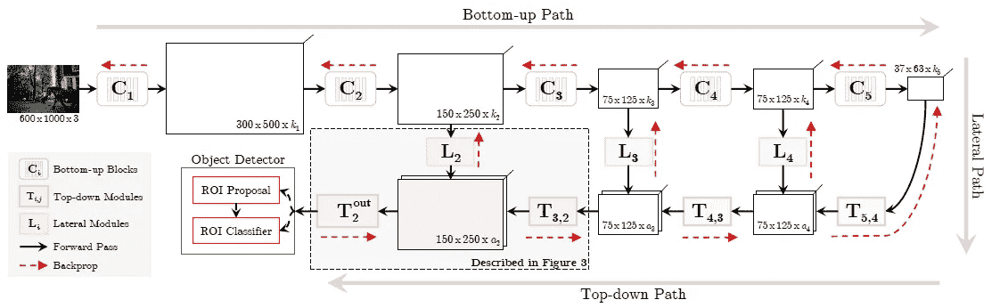
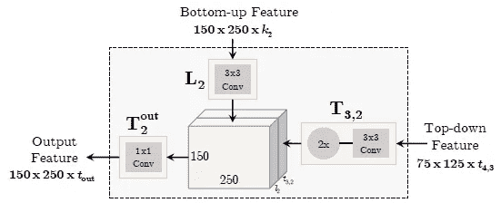
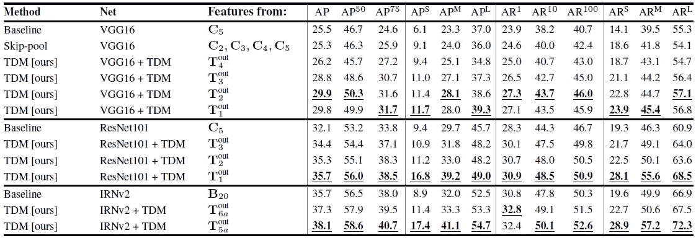
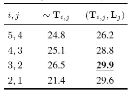
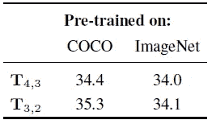
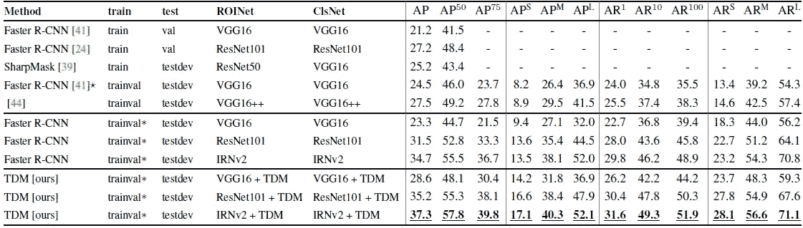
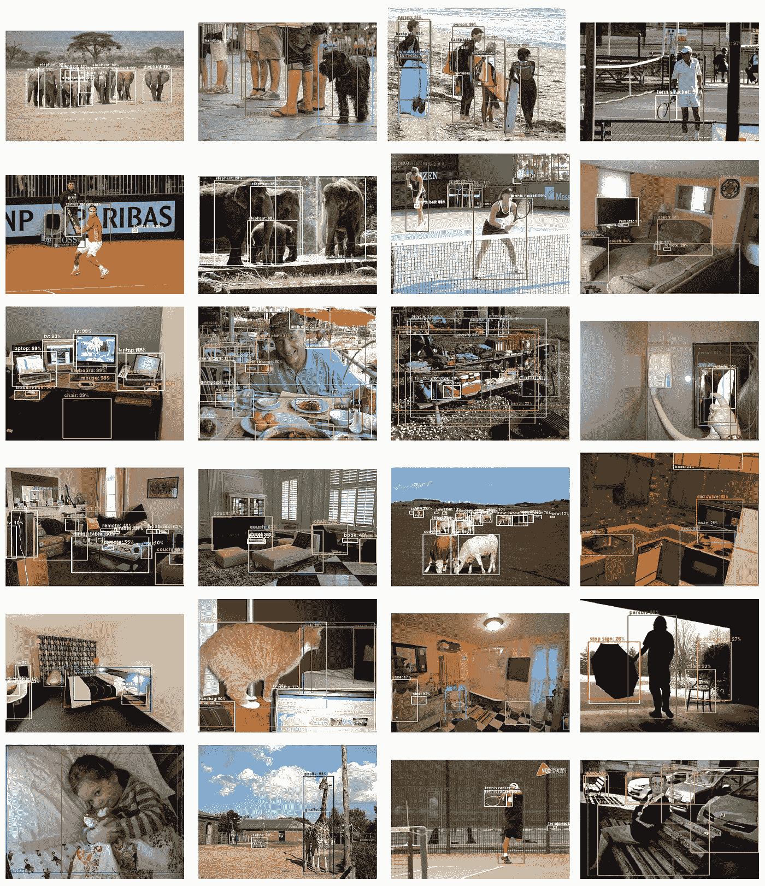

# 复习:TDM —自上而下调制(目标检测)

> 原文：<https://medium.datadriveninvestor.com/review-tdm-top-down-modulation-object-detection-3f0efe9e0151?source=collection_archive---------6----------------------->

## 使用具有更快 R-CNN 的 TDM 的编码器-解码器架构

在这个故事中， **TDM** ( **自上而下调制**)被简要回顾。人们发现，通过使用 TDM 将高级和低级特征结合起来，可以检测到许多硬物体，从而大大提高了 COCO 基准测试的性能。我之所以选择回顾这篇论文，是因为后来的一些先进方法(如 YOLOv3 和 RetinaNet)选择了 TDM 进行比较。这说明 TDM 在物体检测方面有其一定的重要性。这是一份 **2017 arXiv** 技术报告，引用超过 **70 次**。( [Sik-Ho Tsang](https://medium.com/u/aff72a0c1243?source=post_page-----3f0efe9e0151--------------------------------) @中)

# 概述

1.  **TDM 网络**
2.  **TDM 详情**
3.  **消融研究**
4.  **结果**

# 1.时分复用网络

**TDM Network**

**A Basic TDM Module**

*   在自下而上的路径中，它是用于特征提取的标准 conv 路径。然而，特征地图变得越来越小，位置信息丢失。
*   在自上而下的路径中，TDM 用于在底部路径的特征地图的帮助下逐渐放大特征地图，正如我们在基本 TDM 模块中看到的那样。
*   最后，我们可以有 ROI 提议和 ROI 分类器。
*   实际上，当时有许多并行的工作在编码器-解码器架构上进行。例如， [DSSD](https://towardsdatascience.com/review-dssd-deconvolutional-single-shot-detector-object-detection-d4821a2bbeb5) 用于物体检测，[锐度掩模](https://towardsdatascience.com/review-sharpmask-instance-segmentation-6509f7401a61)用于实例分割， [U-Net](https://towardsdatascience.com/review-u-net-biomedical-image-segmentation-d02bf06ca760) 用于生物医学图像分割，[红网](https://medium.com/datadriveninvestor/review-red-net-residual-encoder-decoder-network-denoising-super-resolution-cb6364ae161e)用于图像恢复。而 TDM 是基于[更快的 R-CNN](https://towardsdatascience.com/review-faster-r-cnn-object-detection-f5685cb30202) 进行物体检测的。

# 2.**TDM 详情**

**Details of TDM**

## 2.1.TDM 结构

*   **自下而上特征**穿过 **3×3 conv** (L2)，此称为**侧向模块**。
*   **自上而下的特征**经过 **3×3 conv** (T3，2)，然后**上采样**以匹配更高的分辨率，如果需要的话。(T4 没有进行上采样。)
*   然后**串接**，经过 1 个 **×1 个 conv** (T2out)成为 TDM 的输出特征。
*   然后，输出特征将作为自上而下的特征进入下一个 TDM。

## 2.2.培养

*   **使用预训练的自底向上网络**。
*   并且**自上而下的 TDM 被一个接一个的递增**。这意味着，例如，(L4，T5，4)被添加，然后被训练用于对象检测。之后加上(L3，T3，3)再训练，以此类推。

# 3.消融研究

[VGG-16](https://medium.com/coinmonks/paper-review-of-vggnet-1st-runner-up-of-ilsvlc-2014-image-classification-d02355543a11) 、[雷斯网-101](https://towardsdatascience.com/review-resnet-winner-of-ilsvrc-2015-image-classification-localization-detection-e39402bfa5d8) 和[Inception-雷斯网-v2](https://towardsdatascience.com/review-inception-v4-evolved-from-googlenet-merged-with-resnet-idea-image-classification-5e8c339d18bc) 在实验中用作快速 R-CNN 的主干。

## **3.1。自上而下的调制应该低到什么程度？**

**All methods are trained on trainval and evaluated on minival set on COCO**

*   **Skip-Pool** :与 [ION](https://towardsdatascience.com/review-ion-inside-outside-net-2nd-runner-up-in-2015-coco-detection-object-detection-da19993f4766) 类似，不使用自上而下的模块，而是在不同的层获得特征，然后进行 L2 归一化、连接和缩减。
*   对于[**VGG-16**](https://medium.com/coinmonks/paper-review-of-vggnet-1st-runner-up-of-ilsvlc-2014-image-classification-d02355543a11)**+TDM**，多加一个 TDM 就有从 29.9%下降到 29.8%的 mAP。我想由于缺少跳跃连接，收敛会有困难。
*   对于[**ResNet-101**](https://towardsdatascience.com/review-resnet-winner-of-ilsvrc-2015-image-classification-localization-detection-e39402bfa5d8)**+TDM**，得到 35.7%的 mAP。
*   对于 [**盗梦空间-ResNet-v2**](https://towardsdatascience.com/review-inception-v4-evolved-from-googlenet-merged-with-resnet-idea-image-classification-5e8c339d18bc)**+TDM**，甚至达到了 38.1%的 mAP。

## 3.2.没有横向模块

**No Lateral Module (Left), Have LAteral Module (Right) Using** [**VGG-16**](https://medium.com/coinmonks/paper-review-of-vggnet-1st-runner-up-of-ilsvlc-2014-image-classification-d02355543a11)

*   当使用横向模块时，获得了大的余量，这表明横向模块是重要的。

## 3.3.预培训

**Impact of Pre-training**

*   关于 COCO 的前期培训稍微好一点。

# 4.结果

**COCO Results from Paper (Top), Re-implemented Fast R-CNN (Middle), TDM (Bottom)**

## 4.1.总 AP

*   RPN 和 RCN 使用 128 个 ROI。
*   [VGG-16](https://medium.com/coinmonks/paper-review-of-vggnet-1st-runner-up-of-ilsvlc-2014-image-classification-d02355543a11) +TDM (28.6%)优于 [SharpMask](https://towardsdatascience.com/review-sharpmask-instance-segmentation-6509f7401a61) (25.2%)，架构差不多。
*   使用 [ResNet-101](https://towardsdatascience.com/review-resnet-winner-of-ilsvrc-2015-image-classification-localization-detection-e39402bfa5d8) +TDM，获得 35.2%的 mAP。
*   使用 [Inception-ResNet-v2](https://towardsdatascience.com/review-inception-v4-evolved-from-googlenet-merged-with-resnet-idea-image-classification-5e8c339d18bc) +TDM，获得 37.3%的 mAP。

## 4.2.改进的本地化

*   如果我们看看 AP⁷⁵，比较 TDM(底部)与基线[更快的 R-CNN](http://Faster R-CNN) 变体(中间)，AP⁷⁵有大幅度的提高。

## 4.3.小物件的改进

*   如果我们看看 AP^S，比较 TDM(底部)与基线[更快的 R-CNN](http://Faster R-CNN) 变体(中间)，AP^S 也有大幅度提高。

## 4.4.定性结果

**COCO minival set**

## 参考

【2017 arXiv】【TDM】
[超越跳跃连接:物体检测的自上而下调制](https://arxiv.org/abs/1612.06851)

## 我的相关评论

)(我)(们)(都)(不)(想)(到)(这)(些)(人)(,)(我)(们)(都)(不)(想)(要)(到)(这)(些)(人)(,)(但)(是)(这)(些)(人)(还)(不)(想)(到)(这)(些)(人)(,)(我)(们)(还)(没)(想)(到)(这)(些)(事)(,)(我)(们)(就)(想)(到)(了)(这)(些)(人)(们)(,)(我)(们)(们)(都)(不)(想)(要)(到)(这)(些)(人)(,)(但)(我)(们)(还)(没)(想)(到)(这)(些)(事)(,)(我)(们)(还)(没)(想)(到)(这)(里)(来)(。 )(我)(们)(都)(不)(知)(道)(,)(我)(们)(还)(是)(不)(知)(道)(,)(我)(们)(还)(是)(不)(知)(道)(,)(我)(们)(还)(是)(不)(知)(道)(,)(我)(们)(还)(是)(不)(知)(道)(,)(我)(们)(还)(是)(不)(知)(道)(,)(我)(们)(还)(是)(不)(知)(道)(,)(我)(们)(还)(是)(不)(知)(道)(。

**物体检测** [过食](https://medium.com/coinmonks/review-of-overfeat-winner-of-ilsvrc-2013-localization-task-object-detection-a6f8b9044754)[R-CNN](https://medium.com/coinmonks/review-r-cnn-object-detection-b476aba290d1)[快 R-CNN](https://medium.com/coinmonks/review-fast-r-cnn-object-detection-a82e172e87ba)[快 R-CNN](https://towardsdatascience.com/review-faster-r-cnn-object-detection-f5685cb30202)[DeepID-Net](https://towardsdatascience.com/review-deepid-net-def-pooling-layer-object-detection-f72486f1a0f6)】[R-FCN](https://towardsdatascience.com/review-r-fcn-positive-sensitive-score-maps-object-detection-91cd2389345c)】[离子](https://towardsdatascience.com/review-ion-inside-outside-net-2nd-runner-up-in-2015-coco-detection-object-detection-da19993f4766)[多路径网](https://towardsdatascience.com/review-multipath-mpn-1st-runner-up-in-2015-coco-detection-segmentation-object-detection-ea9741e7c413)[NoC](https://medium.com/datadriveninvestor/review-noc-winner-in-2015-coco-ilsvrc-detection-object-detection-d5cc84e372a)

**语义切分** [FCN](https://towardsdatascience.com/review-fcn-semantic-segmentation-eb8c9b50d2d1)[de convnet](https://towardsdatascience.com/review-deconvnet-unpooling-layer-semantic-segmentation-55cf8a6e380e)[deeplabv 1&deeplabv 2](https://towardsdatascience.com/review-deeplabv1-deeplabv2-atrous-convolution-semantic-segmentation-b51c5fbde92d)】[parse net](https://medium.com/datadriveninvestor/review-parsenet-looking-wider-to-see-better-semantic-segmentation-aa6b6a380990)】[dilated net](https://towardsdatascience.com/review-dilated-convolution-semantic-segmentation-9d5a5bd768f5)[PSPNet](https://towardsdatascience.com/review-pspnet-winner-in-ilsvrc-2016-semantic-segmentation-scene-parsing-e089e5df177d)]

**生物医学图像分割** 

**实例分割
[[深度掩码](https://towardsdatascience.com/review-deepmask-instance-segmentation-30327a072339) ] [ [清晰度掩码](https://towardsdatascience.com/review-sharpmask-instance-segmentation-6509f7401a61) ] [ [多路径](https://towardsdatascience.com/review-multipath-mpn-1st-runner-up-in-2015-coco-detection-segmentation-object-detection-ea9741e7c413) ] [ [MNC](https://towardsdatascience.com/review-mnc-multi-task-network-cascade-winner-in-2015-coco-segmentation-instance-segmentation-42a9334e6a34) ]**

**超分辨率** [Sr CNN](https://medium.com/coinmonks/review-srcnn-super-resolution-3cb3a4f67a7c)[fsr CNN](https://towardsdatascience.com/review-fsrcnn-super-resolution-80ca2ee14da4)[VDSR](https://towardsdatascience.com/review-vdsr-super-resolution-f8050d49362f)[ESPCN](https://medium.com/datadriveninvestor/review-espcn-real-time-sr-super-resolution-8dceca249350)[红网](https://medium.com/datadriveninvestor/review-red-net-residual-encoder-decoder-network-denoising-super-resolution-cb6364ae161e)】