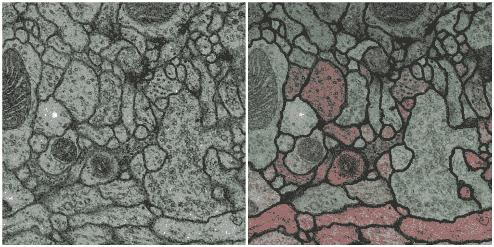
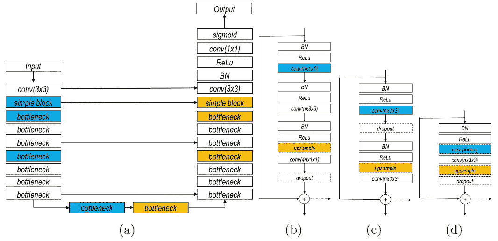
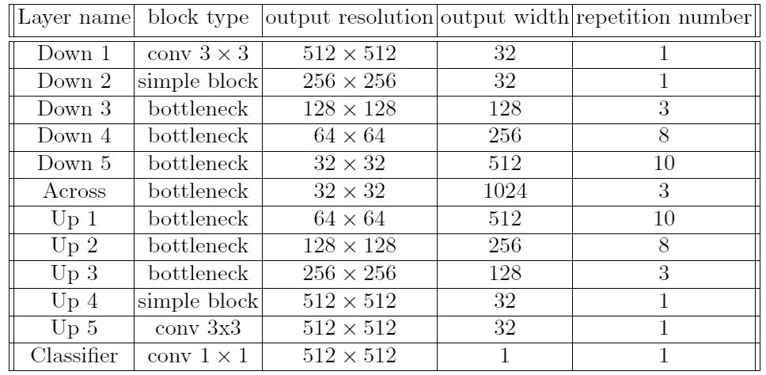
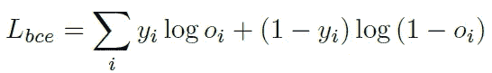
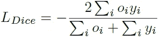
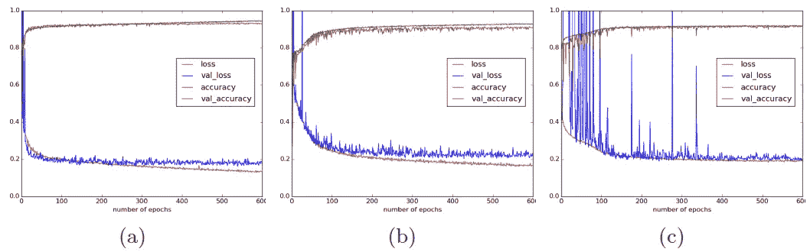
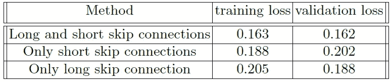
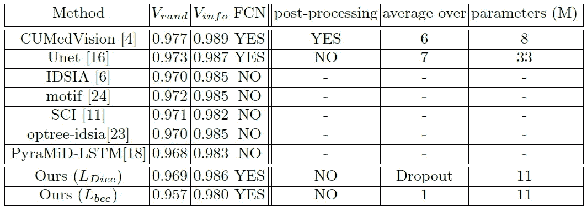
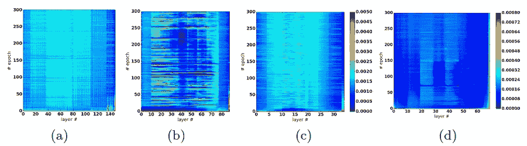

# 回顾:U-Net+ResNet——长短跳跃连接的重要性(生物医学图像分割)

> 原文：<https://medium.datadriveninvestor.com/review-u-net-resnet-the-importance-of-long-short-skip-connections-biomedical-image-ccbf8061ff43?source=collection_archive---------2----------------------->

## 一个非常深的全卷积网络(FCN)，具有长跳和短跳连接

T 这一次，**一个全卷积网络(FCN)，具有长和短跳连接**，用于生物医学图像分割，是审查。

上次我已经复习了 [**RoR (ResNet 的 ResNet，残网的残网)**](https://towardsdatascience.com/review-ror-resnet-of-resnet-multilevel-resnet-image-classification-cd3b0fcc19bb) (是 2018 TCSVT 的论文，如果有兴趣，请访问我的复习。)在 [RoR](https://towardsdatascience.com/review-ror-resnet-of-resnet-multilevel-resnet-image-classification-cd3b0fcc19bb) 中，通过使用长短跳连接，提高了图像分类精度。实验结果证明了采用长短跳连接的有效性。

这一次，**作者不仅展示了实验结果，还提供了一种通过分析网络中的权重来展示其有效性的方法**。

因此，尽管这项工作的目的是进行生物医学图像分割，但通过观察网络内的权重，我们可以更好地理解长跳连接和短跳连接。并且发表在 **2016 DLMIA(医学图像分析中的深度学习)**上，引用超过 **100 次**。( [Sik-Ho Tsang](https://medium.com/u/aff72a0c1243?source=post_page-----ccbf8061ff43--------------------------------) @中)

**Electron Microscopy (EM) Image Segmentation**

# 概述

1.  **跳过** [**ResNet**](https://towardsdatascience.com/review-resnet-winner-of-ilsvrc-2015-image-classification-localization-detection-e39402bfa5d8) 中的连接
2.  **长短跳连接**
3.  **损失函数**
4.  **结果**
5.  **重量分析**

# **1。跳过** [ResNet](https://towardsdatascience.com/review-resnet-winner-of-ilsvrc-2015-image-classification-localization-detection-e39402bfa5d8) 中的连接

[**ResNet**](https://towardsdatascience.com/review-resnet-winner-of-ilsvrc-2015-image-classification-localization-detection-e39402bfa5d8) **Building Block**

*   在 [**ResNet**](https://towardsdatascience.com/review-resnet-winner-of-ilsvrc-2015-image-classification-localization-detection-e39402bfa5d8) 中，使用了连续的 [ResNet](https://towardsdatascience.com/review-resnet-winner-of-ilsvrc-2015-image-classification-localization-detection-e39402bfa5d8) 积木。
*   **仅使用短跳线连接。**且没有长跳连接。

# **2。长短跳线连接**

**(a) Residual Network with Long Skip Connections, (b) Bottleneck Block, (c) Basic Block, (d) Simple Block.** (**Blue:** Optional Downsampling, **Yellow**: Optional Upsampling)

## **具有长跳跃连接的剩余网络**

*   使用缩减像素采样(蓝色):这是一条收缩路径。
*   有上采样(黄色):这是一条扩展的道路。
*   这是一个类似 FCN 建筑的 U 形网。
*   并且从收缩路径到扩展路径有**长跳跃连接**。

## (二)瓶颈阻碍

*   使用 1×1Conv-3×3Conv-1×1Conv，因此称为瓶颈。它已经在 [ResNet](https://towardsdatascience.com/review-resnet-winner-of-ilsvrc-2015-image-classification-localization-detection-e39402bfa5d8) 中使用。
*   BN-ReLU 在每次 Conv 之前使用，这是来自[预激活 ResNet](https://towardsdatascience.com/resnet-with-identity-mapping-over-1000-layers-reached-image-classification-bb50a42af03e) 的想法。

## (c)基本块

*   两个 3×3Conv，也用于 [ResNet](https://towardsdatascience.com/review-resnet-winner-of-ilsvrc-2015-image-classification-localization-detection-e39402bfa5d8) 。

## (四)简单街区

*   一个 3×3Conv。

## (b)-(d)

*   所有块都包含**短跳线连接**。

**A Detailed Model Architecture**

# 3.损失函数

考虑两个损失函数。

## 3.1.使用二进制交叉熵的损失函数

*   标准的交叉熵损失。

## 3.2.骰子损失

*   骰子损失是生物医学图像分割的另一种常见损失。

# 4.结果

## 4.1.资料组

*   训练集:30 幅尺寸为 512×512 的电子显微镜图像。25 幅图像用于训练，省去 5 幅图像用于验证。
*   测试集:另外 30 幅图像。
*   全分辨率被用作网络的输入。
*   没有后处理步骤。

## 4.2.长、短跳线连接

**Loss/Accuracy against epoches: (a) Long and Short, (b) Only Short, (c) Only Long**

**Best Losses**

*   据观察，在上述 3 种设置中，**同时使用长、短跳线连接可以获得最小的损耗或最高的精度**。

## 4.3.与最先进方法的比较

**ISBI EM Segmentation Challenge (**[http://brainiac2.mit.edu/isbi_challenge/](http://brainiac2.mit.edu/isbi_challenge/))

*   在 ISBI EM 分段挑战赛中，Vrand 和 Vinfo 用于排名评估。
*   **前景受限 rand 评分 Vrand** :是 Rand 拆分评分和 Rand 合并评分的加权调和平均值。分割和合并分数可以被解释为像素对分类中属于相同段(肯定类)或不同段(否定类)的精度和召回率。
*   **信息论得分 Vinfo** :信息论分裂得分和信息论合并得分的加权调和平均值。它是一种互信息(MI)的度量，是 Rand 评分的替代方法。
*   两项指标详情:
    [https://www . frontiersin . org/articles/10.3389/fnana . 2015.00142/full](https://www.frontiersin.org/articles/10.3389/fnana.2015.00142/full)
*   提议的方法(表格底部)与 [CUMedVision](https://medium.com/datadriveninvestor/review-cumedvision1-fully-convolutional-network-biomedical-image-segmentation-5434280d6e6) 和 [U-Net](https://towardsdatascience.com/review-u-net-biomedical-image-segmentation-d02bf06ca760) 相当。虽然它有点差，但所提出的方法不使用任何后处理步骤，这是一种端到端的学习解决方案。

# 5.重量分析

**(a) Long & short skip connections, (b) Only long skip connections with 9 repetitions of simple block, (c) Only long skip connections with 3 repetitions of simple block, (d) Only long skip connections with 7 repetitions of simple block without BN.**

*   蓝色:小权重值。
*   红色:重量值大。

## **长&短跳跃连接**

*   当长跳跃连接和短跳跃连接都存在时，参数更新看起来分布良好。

## (b) **只有 9 次重复简单程序块的长跳跃连接**

*   当短跳连接被移除时，网络的深层部分得到很少的更新。
*   当保留长跳跃连接时，至少可以更新模型的浅层部分。

## **(c)仅长跳跃连接，重复 3 次简单模块**

*   当模型足够浅以至于所有层都被很好地更新时。

## **(d)仅具有 7 次重复的简单块的长跳跃连接，不含 BN。**

*   没有批量标准化的网络向网络中心的更新逐渐减少。

在关于权重分析的结论中，由于消失梯度问题，靠近模型中心的层不能有效地更新，该问题通过短的跳跃连接得以缓解。

## 参考

【2016】【DLMIA】
[跳过连接在生物医学图像分割中的重要性](https://arxiv.org/abs/1608.04117)

## 我的相关评论

)(我)(们)(都)(不)(想)(到)(这)(些)(人)(,)(我)(们)(都)(不)(想)(要)(到)(这)(些)(人)(,)(但)(是)(这)(些)(人)(还)(不)(想)(到)(这)(些)(人)(,)(我)(们)(还)(没)(想)(到)(这)(些)(事)(,)(我)(们)(就)(想)(到)(了)(这)(些)(人)(们)(,)(我)(们)(们)(都)(不)(想)(要)(到)(这)(些)(人)(,)(但)(我)(们)(还)(没)(想)(到)(这)(些)(事)(,)(我)(们)(还)(没)(想)(到)(这)(里)(来)(。 )(我)(们)(都)(不)(知)(道)(,)(我)(们)(还)(是)(不)(知)(道)(,)(我)(们)(还)(是)(不)(知)(道)(,)(我)(们)(还)(是)(不)(知)(道)(,)(我)(们)(还)(是)(不)(知)(道)(,)(我)(们)(还)(是)(不)(知)(道)(,)(我)(们)(还)(是)(不)(知)(道)(,)(我)(们)(还)(是)(不)(知)(道)(。

**物体检测** [过食](https://medium.com/coinmonks/review-of-overfeat-winner-of-ilsvrc-2013-localization-task-object-detection-a6f8b9044754)[R-CNN](https://medium.com/coinmonks/review-r-cnn-object-detection-b476aba290d1)[快 R-CNN](https://medium.com/coinmonks/review-fast-r-cnn-object-detection-a82e172e87ba)[快 R-CNN](https://towardsdatascience.com/review-faster-r-cnn-object-detection-f5685cb30202)[DeepID-Net](https://towardsdatascience.com/review-deepid-net-def-pooling-layer-object-detection-f72486f1a0f6)】[R-FCN](https://towardsdatascience.com/review-r-fcn-positive-sensitive-score-maps-object-detection-91cd2389345c)】[离子](https://towardsdatascience.com/review-ion-inside-outside-net-2nd-runner-up-in-2015-coco-detection-object-detection-da19993f4766)[多路径网](https://towardsdatascience.com/review-multipath-mpn-1st-runner-up-in-2015-coco-detection-segmentation-object-detection-ea9741e7c413)[NoC](https://medium.com/datadriveninvestor/review-noc-winner-in-2015-coco-ilsvrc-detection-object-detection-d5cc84e372a)

**语义切分** [FCN](https://towardsdatascience.com/review-fcn-semantic-segmentation-eb8c9b50d2d1)[de convnet](https://towardsdatascience.com/review-deconvnet-unpooling-layer-semantic-segmentation-55cf8a6e380e)[deeplab v1&deeplab v2](https://towardsdatascience.com/review-deeplabv1-deeplabv2-atrous-convolution-semantic-segmentation-b51c5fbde92d)[parse net](https://medium.com/datadriveninvestor/review-parsenet-looking-wider-to-see-better-semantic-segmentation-aa6b6a380990)】[dilated net](https://towardsdatascience.com/review-dilated-convolution-semantic-segmentation-9d5a5bd768f5)[PSPNet](https://towardsdatascience.com/review-pspnet-winner-in-ilsvrc-2016-semantic-segmentation-scene-parsing-e089e5df177d)】[deeplab v3](https://towardsdatascience.com/review-deeplabv3-atrous-convolution-semantic-segmentation-6d818bfd1d74)

**生物医学图像分割** [cumed vision 1](https://medium.com/datadriveninvestor/review-cumedvision1-fully-convolutional-network-biomedical-image-segmentation-5434280d6e6)[cumed vision 2/DCAN](https://medium.com/datadriveninvestor/review-cumedvision2-dcan-winner-of-2015-miccai-gland-segmentation-challenge-contest-biomedical-878b5a443560)[U-Net](https://towardsdatascience.com/review-u-net-biomedical-image-segmentation-d02bf06ca760)[CFS-FCN](https://medium.com/datadriveninvestor/review-cfs-fcn-biomedical-image-segmentation-ae4c9c75bea6)】

**实例分割** [ [深度遮罩](https://towardsdatascience.com/review-deepmask-instance-segmentation-30327a072339) ] [ [锐度遮罩](https://towardsdatascience.com/review-sharpmask-instance-segmentation-6509f7401a61) ] [ [多路径网](https://towardsdatascience.com/review-multipath-mpn-1st-runner-up-in-2015-coco-detection-segmentation-object-detection-ea9741e7c413)][[MNC](https://towardsdatascience.com/review-mnc-multi-task-network-cascade-winner-in-2015-coco-segmentation-instance-segmentation-42a9334e6a34)][[Instance fcn](https://towardsdatascience.com/review-instancefcn-instance-sensitive-score-maps-instance-segmentation-dbfe67d4ee92)][[FCIS](https://towardsdatascience.com/review-fcis-winner-in-2016-coco-segmentation-instance-segmentation-ee2d61f465e2)]

**超分辨率
[[Sr CNN](https://medium.com/coinmonks/review-srcnn-super-resolution-3cb3a4f67a7c)][[fsr CNN](https://towardsdatascience.com/review-fsrcnn-super-resolution-80ca2ee14da4)][[VDSR](https://towardsdatascience.com/review-vdsr-super-resolution-f8050d49362f)][[ESPCN](https://medium.com/datadriveninvestor/review-espcn-real-time-sr-super-resolution-8dceca249350)][[红网](https://medium.com/datadriveninvestor/review-red-net-residual-encoder-decoder-network-denoising-super-resolution-cb6364ae161e) ]**