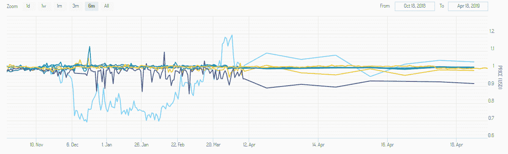
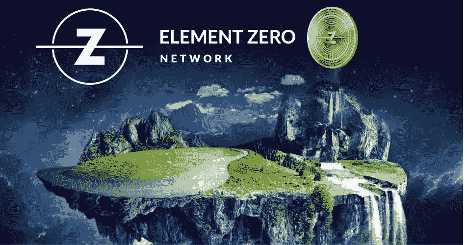

# 回顾稳定硬币和测试新的稳定性协议

> 原文：<https://medium.datadriveninvestor.com/reviewing-stable-coins-and-testing-a-new-stability-protocol-dc9067a70629?source=collection_archive---------8----------------------->

# Element Zero 的公共测试网带领用户体验不同的用例，突出行业领导者创造的技术。

在充满秘密和不确定性的加密市场中，透明度是赢得信任的关键因素。我们看到像泰瑟这样的代币为了富人的利益滥用这种公众信任。稳定的硬币是大规模采用的必要条件，但它们的透明度和“稳定性”可能会在前进的道路上造成重大挫折。

关注这种透明度， [Element Zero Network](https://www.elementzero.network/) 认为，市场内共享的信息越多，用户对新的稳定性协议方法就越有信心，他们正在邀请公众使用和验证[这里](https://www.elementzero.network/stablecoin/)。

 [## 创新提醒:区块链 3.0、Terra 协议、ICO 门户和更多|数据驱动的投资者

### 尽管过去几个月加密货币的价格波动很小，但这项技术并没有停止发展…

www.datadriveninvestor.com](https://www.datadriveninvestor.com/2019/03/16/innovation-alert-blockchain-3-0-terra-protocol-an-ico-portal-more/) 

为什么是测试网？因为挑战——或者说今天所有稳定公司的“圣杯”——是确保任何市场条件下的稳定。Element Zero Network 的下一代支付系统解决了现有 stablecoin 方法的弱点，即波动性和不稳定性。我们新的稳定性协议方法不与任何法定货币、资产或商品挂钩，这消除了硬币价格波动的可能性。因此在图表上，如 Stablecoin 指数，建立在 Element Zero 平台上的硬币将由一条直线表示，硬币持有者可以期望他们的硬币价值保持不变。

Stablecoins tout stability but their charts and daily trading show otherwise

*今日交易量最大的八只稳定债券的六个月展望。*

“我们建立了 Element Zero Network，作为一个属于公众的非营利组织，因此我们邀请用户通过访问 Testnet 来参与这一过程是非常合理的，”Element Zero 的创始人兼董事长 Jude Regev 说。“在我们的内部 Testnet 阶段，我们将 Element Zero 作为一个可行的解决方案，现在用户可以亲眼看到我们的 stablecoin 如何为他们提供每笔交易的稳定性。”

硬币爱好者会发现测试网很容易使用。有一个简短的视频解释了如何设置测试，以便您的用户可以通过智能合约购买和出售零元稳定币(EZO)来参与模拟交易。在 Testnet 模拟期间，用户将验证 Element Zero stablecoin 解决方案，并了解 Element Zero 的 stablecoin (EZO)如何在任何交易中保持固定的面值，从而保护硬币免受市场波动的影响。

The Element Zero TestNet is a demo which allows users to validate the Element Zero stable coin solution

让公众参与零元素测试网的运作有巨大的价值。“通过在我们正式进入市场之前让用户验证这项技术，用户现在可以亲眼看到我们的 stablecoin 如何经得起时间的考验，将提供保护，免受众多波动性因素的影响，”Regev 说。“我们认为这是革命性的，并对市场通过这个测试网分享这种情绪感到兴奋。”

为什么要等？通过今天试用我们的 [Testnet](https://www.elementzero.network/stablecoin/) ，成为首批体验 stablecoins 下一代的人之一。