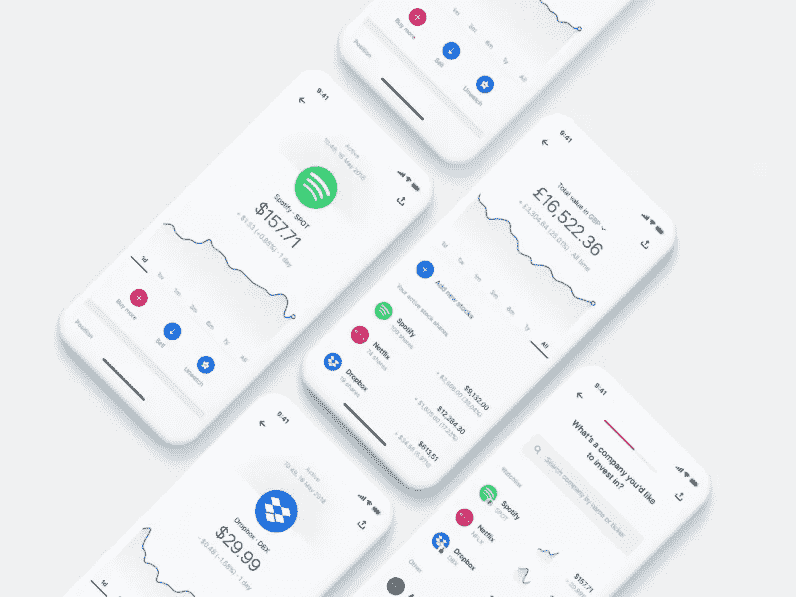

# Revolut 加入贸易世界

> 原文：<https://medium.datadriveninvestor.com/revolut-joins-the-world-of-trading-cf285b653f2?source=collection_archive---------5----------------------->

在金融科技领域经历了相对较长的一段时间后，Revolut 现在推出了免佣金交易服务，其中有一些惊喜！这看起来像是他们在创建你需要的唯一金融应用程序和超越银行的世界的旅程中迈出的又一步。

Revolut 不是第一家，也不太可能是最后一家进入这个免佣金交易领域的公司。RobinHood 可能是第一个这样做的，并成功撼动了美国市场——他们拥有超过 500 万客户，现在已经获得 FCA 的批准，并将英国纳入了他们的视线。自由贸易在英国真正启动并运行，现在已将国际审计准则加入其产品清单。EToro 在美国也很大，当他们提供加密交易时，看到了很多吸引力。

 [## 分散金融的出现|数据驱动的投资者

### 当前的全球金融体系为拥有资源、知识和财富的人创造了巨大的财富

www.datadriveninvestor.com](https://www.datadriveninvestor.com/2019/03/14/the-emergence-of-decentralized-finance/) 

因此，这很嘈杂，显然有一个更广泛的市场趋势在这里发挥作用。事实证明，这甚至比 Revolut 推出时的细微差别更有趣。

# 发布会有什么内容？

首先，我们来讨论一下关于 Revolut 的免佣金交易功能的几点。

可以说，Revolut 推出的最令人印象深刻的元素是部分投资功能。简而言之，这允许你买一部分股票，而不是买一整股。这使得客户可以准确选择他们想要投资的金额，而不是受限于整股的成本。一只股票有时本身就很贵，因此这提供了非常低的进入点，使任何人都能进入投资。正如他们所说——这让交易变得包容——没有人会因为价格过高而放弃投资。

值得注意的是，最初只有美国股票可用——这可能是因为在美国，部分投资更容易。但听起来，随着时间的推移，来自更多地区的更多股票将被添加到这项服务中。鉴于 Revolut 在整个欧洲都有先见之明，而且有传言说它正在考虑在美国发行，这对发行来说并不是一件坏事。大多数最受关注的大品牌和公司都位于美国(想想:苹果、Alphabet/谷歌、脸书、优步、特斯拉)。看看 Revolut 引入其他市场的速度会有多快将是一件有趣的事情，我不认为他们目前的限制会在短期内抑制吸收，但如果其中一些竞争对手拥有更广泛的市场，则可能会在较长时期内阻碍吸收。

值得注意的是，自由贸易现在已经被批准在[英国和欧洲](https://blog.freetrade.io/fractions-for-all-7cc8b49d35c2)提供部分交易，所以竞争正在升温，这很可能是 Revolut 跟随的方向。

大多数观察家预计这将是一项付费服务，因此预测 Revolut 将为其高级和金属客户提供这项服务。然而，他们引入了非常智能的分层结构。任何使用 Revolut 的免费用户(在他们的标准价格范围内)每个月最多可以进行 3 次自由交易。想再来几杯吗？没关系，升级到 Premium 并支付每月订阅费。需要 8 个以上？你需要金属，多付一点。

这看起来是一个聪明的策略，旨在吸引客户到更高的价格带。一般来说，如果你是为了长期储蓄而投资，你一个月不应该需要超过 3 笔交易，然而，一些更多的“交易”心态的人试图快速赚钱，更频繁地购买和出售，他们需要那些成本订阅。这与当前关于加密和外汇的 Revolut 角度密切相关，这两者都非常容易，并在更高的订阅选项中提供更多好处。

# 在职者应该担心吗？

这最初看起来更像是真正的交易挑战，而不是帮助 Revolut 用户通过长期投资积累储蓄的工具。Revolut 的受众往往是千禧一代，免佣金交易符合他们的其他功能，我们知道他们的客户已经喜欢这些功能。然而，鉴于这是一个稳定的交易，储蓄和投资领域的许多从业者不会将此视为一个直接的挑战。

目前的储蓄和投资平台是帮助客户一生积累财富的专家，通常较低风险的投资选择是实现这一目标的更明智的方式。因此，那些提供长期投资服务的公司，如一些银行、Hargreaves Lansdown、AJ Bell、Aviva、Fidelity 等，可能不会将此视为直接竞争。一些人甚至可能非常高兴，免佣金交易将向更广泛的受众介绍投资，并期望用户一旦发现有更好、风险更低的方式来长期积累资金，就会转向长期投资。

投资基金通常仍被视为最受青睐的长期投资。这正是目前这些新进入者的不足之处:他们没有提供这些更安全、更长期的选择来帮助用户储蓄和积累财富，也没有提供多少指导来帮助他们做出明智的决定。这是更传统的平台的专长，也是它们做得如此好的原因。现任者还拥有一整套节税包装(保存你的钱的产品，不会因为你的投资可能获得的增长而惩罚你)，这是 Revolut 目前无法提供的，但自由贸易可以部分提供(他们有 isa，但还没有养老金)。

此外，这些特性需要有一个警告。这有可能会变得混乱。投资本来就是高风险的，股票更是如此。这一切会不会变得太容易了？会不会是我们回过头来看，没有正确和适当的指导，没有受过教育的投资泛滥，是造成亏损的原因？这如何保护那些努力存钱以做出正确理财决定的弱势客户？鉴于很多人在相对缺乏指导的情况下投入大量资金，监管机构会采取行动确保用户充分意识到风险吗？

甚至在本周，我们已经看到，由于美中贸易战升级，股市遭受了打击。全球经济放缓可能会严重伤害投资者，对于那些没有做出明智决策的人来说，这可能会产生不利影响，让他们放弃对未来的投资。Revolut for one 不需要更多的负面报道，也不希望被视为提供一项暴露人们财务状况的服务。这些都是值得考虑的有趣问题，退一步说，没有一家金融科技公司经历过包括崩盘在内的完整市场周期。当经济低迷、人们的支出受到真正挤压时，金融科技用户的态度会发生怎样的变化？

# 这将如何发展？

回到无佣金交易。这里的真正趋势是什么，市场将如何演变？

这在很大程度上将取决于这些金融科技公司的路线图。他们是打算通过这种方式来帮助那些寻求长期积累的人，从而对这些现任者构成真正的挑战，还是认为这只是银行业的一项功能，只是向人们介绍投资？

如果是前者，他们将需要超越交易，进入一个真正有助于人们储蓄和投资的世界，而不仅仅是进入股市的途径。

鉴于 RobinHood 和 FreeTrade 向客户提供的一些投资选择，它们在这里看起来是最好的选择(实际上，你可以投资于有限范围内更便宜的非托管基金)。RobinHood 还致力于现金管理，因此似乎正在转向一种能够真正帮助人们管理各种投资和长期储蓄的服务。

更广泛地说，我们正在目睹的是股票交易的商品化。我认为，我们将开始看到越来越多的其他银行应用程序提供这一功能，因为一个或多个金融科技公司希望遵循分销战略，通过其他应用程序推广他们的产品。

如果这种策略成功了，那么我们可能会看到更多的大型金融机构将这一特性加入到他们膨胀的业务中。想象一下，能够通过你的银行应用程序使用自由贸易的服务……如果这些功能能够与经常账户相联系，以帮助人们最大限度地利用他们的闲钱，那就太好了。更好的是，在指导下，以适合他们风险状况的方式来真正帮助那些储蓄不足的人群。

我的观点是，目前仍然存在一种真正的服务，帮助指导和支持个人以明智的方式积累财富，其中建议和指导是关键。股票是高风险的，拥有包括基金在内的多元化投资组合仍然非常重要，并且在千禧一代以外的受众中非常受欢迎，千禧一代往往更富有。没有一家金融科技公司能比得上储蓄和投资平台所提供的多样性……至少目前还没有……但请关注这个领域。