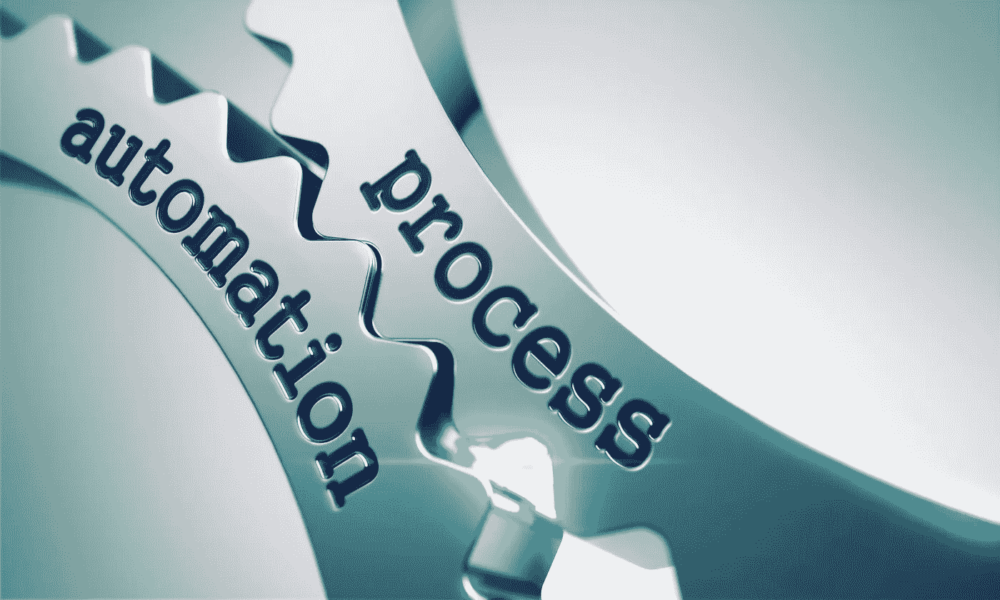

# 自动化趋势和技术带来的财务和会计革命

> 原文：<https://medium.datadriveninvestor.com/revolution-in-finance-and-accounting-with-automation-trends-and-techniques-cf865801c7f9?source=collection_archive---------7----------------------->

众所周知，21 世纪是科技的先锋。不用说，这是科技时代。因此，每时每刻，尖端技术都在让我们的生活变得更加轻松、舒适和快捷。现在，技术已被引入人类活动的几乎所有部门，从而提高了准确性，减少了人工劳动，提高了成本效益等。

Scalable accounting process automation

为了使技术更上一层楼，未来的趋势和技术肯定会在未来几年给金融和会计领域带来巨大的变化。毫无疑问，这将彻底改变这个行业的面貌。

 [## 不管准备好了没有，革命就在我们面前|数据驱动的投资者

### “对于技术如何影响我们的生活和重塑经济，我们必须形成全面的全球共识……

www.datadriveninvestor.com](https://www.datadriveninvestor.com/2019/02/12/ready-or-not-the-revolution-is-upon-us/) 

财务和会计自动化的引入和实施不仅会使簿记和会计更有效、更容易，而且会改变企业管理财务的方式。此外，实时业务洞察力将加快公司的增长速度。

自动化至关重要的另一个原因是，它有助于有效地利用资源，并最大限度地减少操作流程中的延迟。自动化带来了令人瞠目结舌的变化的一些领域包括规划、预算和预测、财务报告、运营会计、分配和调整、对账、公司间交易和及时结算。简而言之，组织能够利用先进的自动化概念充分地简化他们的业务流程。

现在，让我们来看看自动化趋势和技术是如何为更简单和新颖的会计方法铺平道路的。

***跨职能见解***

自动化有助于整合组织中不同部门的系统和流程。这些部门可能是供应链、市场、销售、人力资源等。因此，整个组织中的员工应该有足够的能力相互一致地共享精确的数据集和其他信息。这将有助于各部门跟踪其他部门的工作流程。

***风险评估***

及时访问关于组织的准确信息，由财务专家使用不同的变量集(如利率、通货膨胀或货币波动)运行自动化场景；评估现有竞争市场中的潜在和潜在风险，并帮助他们在新兴市场中把握机会。

***增强型全局方法***

自动化功能使会计行业能够遵守不同国家的法规，提供多语言和多币种支持，并自动支持本地子公司的帐户。因此，组织可以享受到增强的全球业务方法带来的真实无缝的体验。

***大圈补强金融***

自动化和机器学习肯定会在不久的将来取代耗时的传统会计。简而言之，现在财务团队将有足够的效率将他们的大部分宝贵时间花在盈利项目上。

换句话说，时间将被适当地分配给不同的任务。剩下的时间可以投入到其他重要的项目中，使财务部门更加精通。人工努力和错误将被完全消除。最终事情会变得更容易、更快、更精确。

***无与伦比的防护能力***

网络安全已经成为一种威胁和一个紧迫问题，现在正成为一个主要问题。在目前的舞台上，每个部门都需要迅速、警惕和积极主动。目睹了最近与数据泄露有关的问题，网络安全不容忽视。

毫不夸张地说，可以很容易地预测，在 2019 年，金融和会计部门将率先加强其安全性。各组织将确保采用自动化技术进行适当的财务控制，并为财务或会计数据提供更好的可视性。

被赋予财务和会计自动化，将有可能打击网络犯罪。

***结论*** :

随着计算的完美性和效率突飞猛进，机器学习、RPA 和海量数据分析等先进技术将在更短的时间内执行复杂的事务性任务。我们，在财务和会计领域，将能够接近实时地探索对一个组织的成就至关重要的财务事实。最终，未来几年将出现对专业金融和会计专业人士解读这些数据的战略价值的需求，并创造出解读自动化见解的优秀岗位。

我们知道一句著名的谚语“顺应时代的要求”。因此，这一背景在 2019 年与未来趋势和技术的财务和会计自动化的未来相关。只有在正确的时间获得信息技术的组织才能在竞争激烈的市场中赢得领先地位。