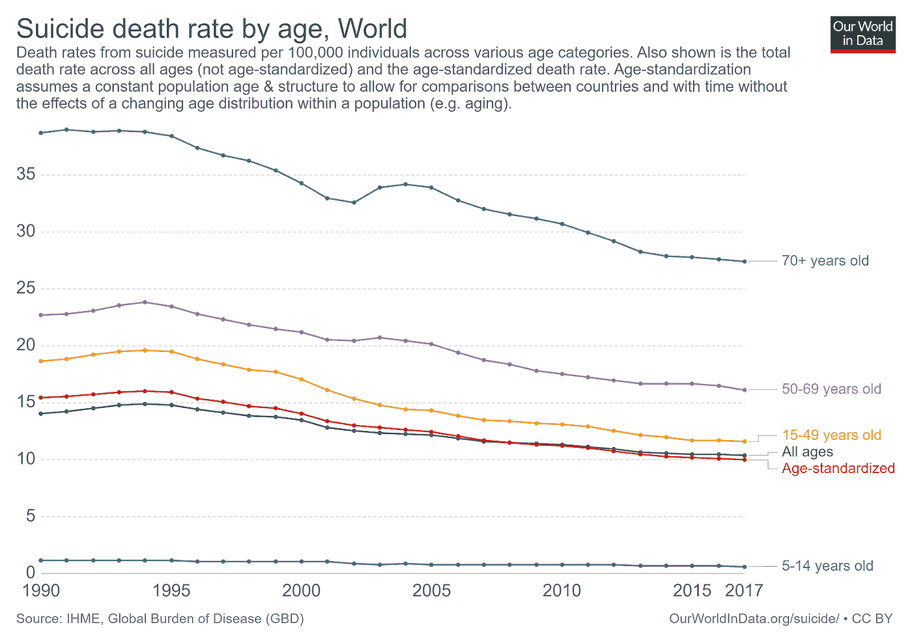

# 革命性的数字数据和人工智能技术用于自杀预防

> 原文：<https://medium.datadriveninvestor.com/revolutionizing-digital-data-and-ai-technology-for-suicide-prevention-870a6ff0d6a8?source=collection_archive---------7----------------------->

哈利·戴维森·雷加

自杀死亡是一场悲剧，由一个人的希望和个人灾难的变迁而引起。世界卫生组织(世卫组织)估计，每年有超过 80 万人死于自杀，相当于每 10 万人中约 11.5 人的年龄标准化比率——这一数字相当于每 40 秒钟就有一人自杀。这是 15 至 29 岁人群死亡的主要原因。

自杀是一个极其复杂的问题，到目前为止，仍然有许多可能的原因。其中之一是抑郁症，它被认为是影响一个人心理健康的最重要的风险因素。

今年，世界精神卫生联合会(WFMH)决定将“预防自杀”作为去年 10 月 10 日世界精神卫生日的主题。心理卫生联合会对自杀率的惊人增长提出了警告，而预防资源、教育、危机热线和行动计划却没有跟上这一趋势或至少没有跟上。这种情况值得心理健康领域所有行为者的关注，包括科学和专业组织。从好的方面来看，无论自杀有多神秘，总会有一种希望浮出水面，那就是它仍然是可以预防的，因此也是可以避免的。

心理健康运动是每个人都关心的问题，作为 IT 行业的人，现在是我们利用技术突破的时候了，这是我们向前迈进的必要条件，以开发创新的替代方案来应对这一普遍存在的全球公共健康问题。

 [## 挑战你对人工智能和社会看法的 4 本书|数据驱动的投资者

### 深度学习、像人类一样思考的机器人、人工智能、神经网络——这些技术引发了…

www.datadriveninvestor.com](https://www.datadriveninvestor.com/2019/02/28/4-books-on-ai/) 

随着数据驱动的创新趋势和大数据的激增，我们非常重视借助技术的力量来获得直观的见解，以最大限度地提高和优化精神医疗保健的可及性、效率和有效性。虽然我们认识到技术不是结束这一心理健康危机的核心解决方案，但我们也必须明白，它是逐步寻求跨部门和跨学科行动来抗击自杀的一个关键。

配备了越来越多的数据，这是一种不可耗尽的资源，软件行业可以通过使用人工智能技术和数据科学来预防自杀。Neurum Health 的联合创始人兼首席执行官 Megan Lam 支持这一想法，她声称需要通过利用精神病学和神经学研究的最新发展以及数字数据，将前沿研究转化为现实世界。

认识到自杀的问题和征兆是预防自杀的第一步。任何有关自杀的言论或行为都必须认真对待，因为有自杀想法的人不仅会表现出自杀倾向的警告信号，还会大声呼救。

无处不在的计算和行为传感专家 Tanzeem Choudhury 教授引用了自杀者经历的行为模式中断，如身体活动的异常变化，睡眠和言语模式的不一致，孤立以及社会接触和互动的逐渐减少。虽然这些并不是自杀倾向的指示性指标，但她澄清说，这些行为变化可能是预防自杀的潜在信息。她还强调了从数据到干预简化预防措施的必要性，并指出这些常见行为可以使用智能手机和可穿戴设备进行量化。

正确的行为干预可以稳定一个人的心理健康状态。很难观察和理解那些描绘自杀征兆的人，因为他们想把自己和周围的人隔离开来。Lam 提到，智能手机和可穿戴设备是预防自杀的秘密来源，因为人们每天都带着它们并与之互动。一个人可以通过分析客观和可测量的指标，如来自 GPS、搜索引擎、在线社交账户和语音技术分析的数据，来检测抑郁症的存在。

处于高级人工智能技术前沿的自动化行业可以与领先的医疗保健服务合作，设计更好的疾病管理和数据驱动的方法来防止自杀。RAX 自动化套件最近发布了其认知自动化功能，作为一个实现人工智能技术最大潜力的行业，我们努力利用机器人流程自动化(RPA)来解决现实世界的问题，直接惠及商业、健康和其他服务。

**立即获得免费的机器人过程自动化(RPA)软件！**

[下载这里](https://www.raxsuite.com/freedownload?utm_source=Medium%20Post&utm_medium=medium&utm_campaign=medium_footer)

参考资料:

 [## 自杀

### 自杀是一个复杂的问题，有一系列潜在的原因和风险因素。主要的风险因素是什么，以及…

ourworldindata.org](https://ourworldindata.org/suicide)  [## 心理健康的数字干预:现状和未来方向

### 如果没有……增加医疗保健的可及性、效率和有效性几乎是不可能的

www.frontiersin.org](https://www.frontiersin.org/research-topics/9243/digital-interventions-in-mental-health-current-status-and-future-directions)  [## 预防自杀

### 世界卫生组织估计，每年大约有 100 万人死于自杀。是什么驱使如此…

www.helpguide.org](https://www.helpguide.org/articles/suicide-prevention/suicide-prevention.htm) 

[https://www . researchgate . net/publication/332077435 _ The _ digital _ revolution _ and _ its _ impact _ on _ mental _ health _ care](https://www.researchgate.net/publication/332077435_The_digital_revolution_and_its_impact_on_mental_health_care)

[https://wfmh . global/world-mental-health-day-2019/https://wfmh . global/world-mental-health-day-2019/](https://wfmh.global/world-mental-health-day-2019/)