# 用卷积神经网络革新息肉切除术

> 原文：<https://medium.datadriveninvestor.com/revolutionizing-polypectomies-with-convolutional-neural-networks-76d686ce995a?source=collection_archive---------5----------------------->

# **人性=有缺陷**😱

人类并不完美，相反，我认为我们恰恰相反。我们犯**错误**。我们**忘记**的东西。我们**自我合理化**并宣称我们还没有真正开发的某些能力。也就是说，错误是人们学习、成长和进化的前提。

> **😶**

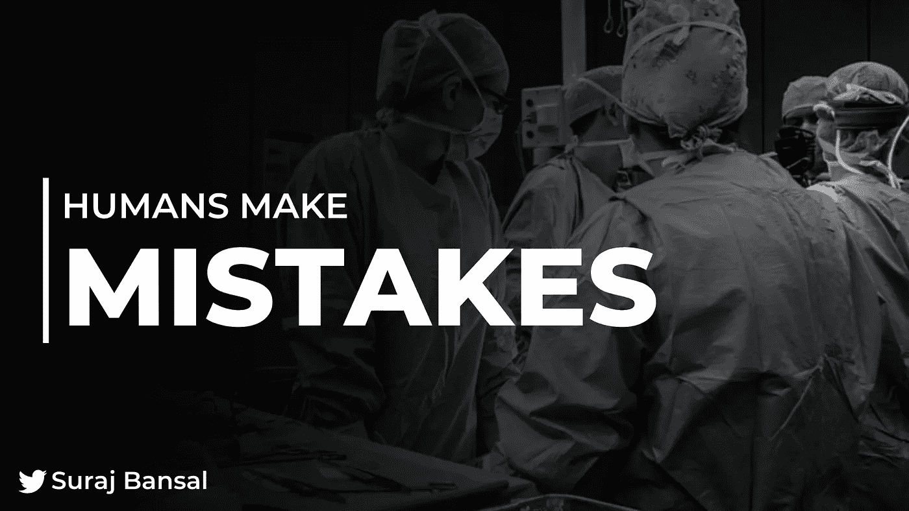

*托起*。让我们回溯一下。

**仅仅因为*结肠镜检查和息肉切除术的人为失误，每年就有 136，080 名美国人失去生命***—结肠癌成为**美国无与伦比的死亡率的第二大原因**。

去年夏天，我在圣迈克尔李嘉诚研究中心协助开展了一项研究，该研究中心开发了一种增强现实辅助和胃肠病学的跨学科方法。我们为 UofT 胃肠病学研究员制作了结肠镜检查和息肉切除模拟-基本上是培训未来的内科医生、外科医生和研究人员 aliek 定位和移除这些吸盘。

# **珊瑚虫——那些到底是什么🤔**

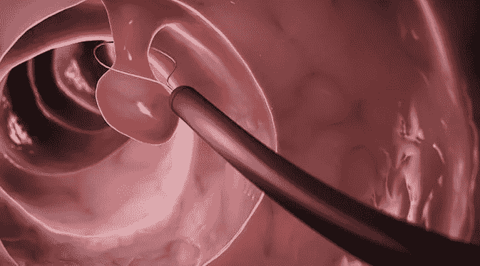

**息肉**是*本质上异常的组织生长*，存在于你的**胃肠道**中，并且经常在你的肠道内层发现。息肉要么被归类为**增生**(好人！！)或**腺瘤**，它们是癌症的前兆。

 [## 大笔资金和尖端技术:人工智能/人工智能投资将如何革新医疗保健…

### 在过去几年人工智能(AI)和机器学习(ML)的显著发展中…

www.datadriveninvestor.com](https://www.datadriveninvestor.com/2018/03/22/big-money-and-cutting-edge-technology-how-investment-in-ai-ml-will-revolutionize-the-healthcare-industry/) 

从长远来看，发现的**息肉**中有 31.3%归类为*腺瘤*，**其中 10%** 为*癌*。好吧- 0.318%的息肉被归类为癌症似乎并不令人生畏。然而，考虑到每一个阅读这篇文章的人(包括你！！)要求他们在 50 岁前进行结肠镜检查，这影响了空前多的人。

> *息肉切除过程可由以下过程定义。*
> 
> *经结肠镜+活检钳+电流+电灼=拜拜息肉*👋

然而，尽管技术进步，如全光谱结肠镜检查、逆行观察附件和内囊辅助结肠镜检查**，27%的息肉被遗漏**。

最近的一项研究显示，38.69%的患者(255/659 名患者)在医生不知情的情况下，在结肠镜检查后残留了 *1 息肉*。主治医师和研究员之间的表现差异虽然令人担忧，但往往被忽视，因为研究员没有完成培训，缺乏经验。然而，自从医院结构建立以来，这已经变得越来越普遍，研究员执行手术，而主治医师监督。

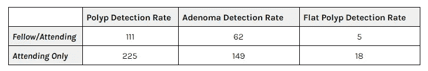

> *是啊-* 现在差异变得更成问题了*……**🙃*

我更多地思考了问题的范围，并意识到受到负面影响的人的数量**简直是疯狂的** -他们的痛苦是我们错误的累积产物*简直让我震惊*。

鉴于每次结肠镜检查的费用为 3.180 美元，我开始思考是否有什么方法可以改善这种情况，以及我是否可以提高胃肠病学家的平均准确率。

快进 1 周后，我利用卷积神经网络构建了我自己的息肉检测模型，实现了比一般胃肠病学专家高 93%- 20%的准确率🤩 🤩 🤩

> 让我解释一下我到底是怎么做的😁

# **我们来谈谈卷积神经网络**

在学习我到底是如何建立神经网络之前，我肯定会建议你快速复习一下**卷积神经网络**的基础知识——请看👉 [***本条***](https://medium.com/datadriveninvestor/convolutional-neural-networks-explained-7fafea4de9c9) 👈我写道，解释了✍️每一层背后的架构和直觉

本质上，卷积神经网络由**卷积层、ReLU 激活函数、最大池层和分类发生的全连接层**构成。我为每一层添加了**剔除**和**批量归一化**以减少过度拟合💡

# **将概念转化为代码**

*好！*现在我们可以理解卷积神经网络的原理如何实际应用于**解决一些医疗保健效率低下的问题**😤

> *本文将作为构建您自己的* ***息肉检测模型*** *的演练！*

## **步骤 1 —导入库**

这些库，即 **Tensorflow** 和 **Keras** 对于启用允许模型学习和训练的某些功能非常重要。从 Keras 导入预先训练的**序列模型**允许你简单地添加层到网络中，这将比创建你自己的模型简单得多。

其他层对于构建您的模型也是必不可少的；Conv2D 和 MaxPool2D 用于**卷积**和**最大池层**，密集层、下降层和平坦层用于将张量输出压缩为更易于合成和解释的内容，以便进行分类。

**ModelCheckpoint** 将在每个*历元*后保存模型，一旦定义的度量(精度)停止提高， **ReduceLROnPlateau** 将降低*学习率*。

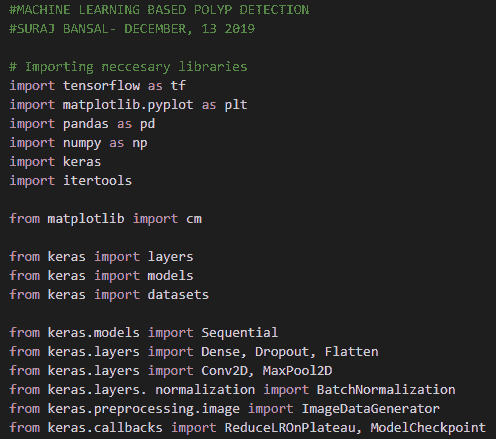

## **步骤 2——定义有用的变量**

定义数据集中存在的**训练和验证图像**的数量。只需打开数据集，查看每个文件夹中输入了多少图像。

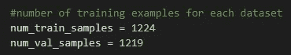

为您的验证和培训确定**批量**。批量大小指的是*每个时期网络将处理多少幅图像*。我建议保持训练和验证集的批量大小一致。目标是平均数据集大小的批量大小在 15-50 之间。

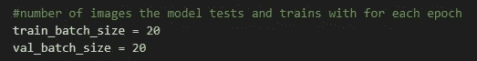

**调整数据集内图像的大小**。

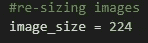

定义每次需要多少步骤，这可以由样本总数和定义的批量的商来确定。np.ceil 返回数组元素的 ceil。标量**x 的上限是最小的整数 I，因此 i > = x**

## **步骤 3 —创建数据集的路径**

> *你可以找到我在这里使用的息肉数据集的路径->C:\ Users \ Hp \ Desktop \ DATA*

*(为了简单起见，我将数据集存储在我桌面的某个地方)*

在这里，我只是将两个变量赋给了计算机中文件夹的位置。

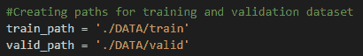

接下来，我使用**随机图像生成器**从我的数据集中绘制 20 张图像*(批量大小)*，并将每张图像的大小调整为 **224** 。

> *重复此过程进行培训、验证和测试。*

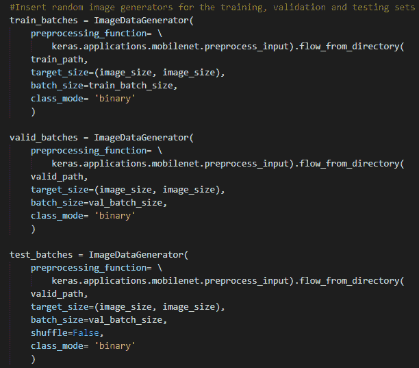

## **步骤 4——构建模型**

首先定义**预训练序列模型**。从这里，我们将添加层，以提高模型的准确性。

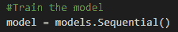

用 3 x 3 大小的**滤镜**添加你的第一个**卷积层**，定义你输入的大小。该滤波器将从本质上**提取图像的显著特征**，并应用*矩阵乘法*。

**ReLU 激活**功能将引入**非线性**。对输入应用“相同”**填充**将确保*输出与输入具有相同的长度。*

接下来，用一个 2 x 2 的矩阵介绍你的**最大池层**——这将减少你的图像的**空间参数**，同时作为**噪声抑制**。这将把信息综合成更容易计算的东西*——最大池比平均池支持更强的分类。*

***批量标准化**标准化每一层的输入，并限制协变量移位*(输入值分布的变化)*。这个函数在每一层稳定地分配输入-这将加速你的网络的训练。*

***dropout** 层随机选择神经元，并在整个训练过程中忽略它们。这种技术是可行的，因为网络将变得对特定的神经元值不那么敏感，并且具有更好的泛化能力。脱落层基本上**减少过拟合**。*

*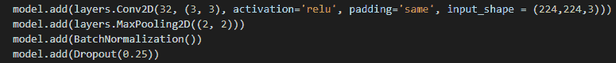*

> *然后我们再重复同样的步骤四次。*

*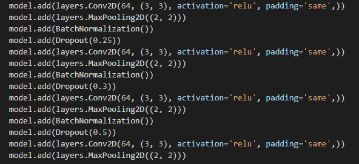*

*接下来你可以用下面的代码打印你的模型的概要。*

**

*您的输出应该是这样的！*

*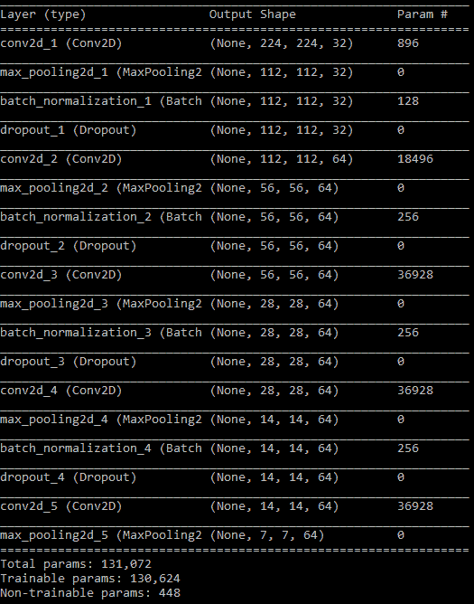*

## ***第五步——致密层和展平层***

*就在图像被输入到**全连接图层**之前，我应用了**密集和平坦图层**。当前输入输出一个难以计算的三维张量。*

***展平**层将*三维矩阵*展开成*一维矢量*然后应用**密集层**减少矢量的空间参数。最后，通常应用一个 **softmax 函数**，将*输出值转换成概率。**

*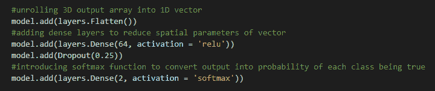*

*然后我打印了另一个**型号概要**，代码和上面一样。输出看起来像这样！*

*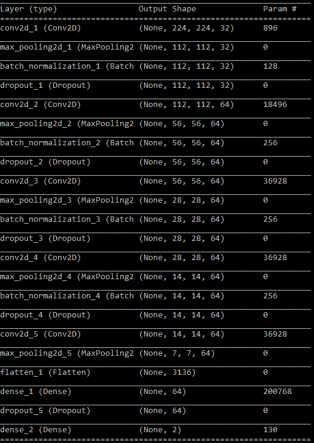**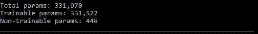*

## ***步骤 6——训练模型***

*我使用**亚当**作为我的*优化函数*用于**学习速率衰减**。**稀疏分类交叉熵**将作为*损失函数*，我们使用它来测量观察到的类别标签的分布和类别标签的预测概率之间的差异。*指标*定义为**精度**来衡量模型的性能。*

**

## ***步骤 7——定义精确度***

*接下来，我们定义模型的最高精度。*

*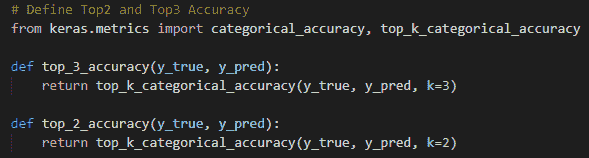*

## ***步骤 8 —保存模型***

*将**检查点**定义为模型的版本，其中权重和偏差被*优化*。 **Mode = max** 使机器保存精度最高的迭代； **verbose = 1** 将训练过程表示为*进度条*。*

*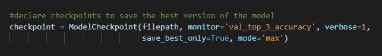*

## ***步骤 9 —优化学习率***

*一旦定义的度量*(准确度)*停止增加，这将降低**学习率**。**监控**值对应于监控的数量。**因子**值定义了*学习率将降低多少*。**耐心**是产生无改善的监控量的*周期数*，在此之后训练停止。 **min_lr** 定义学习率的*下限*。*

*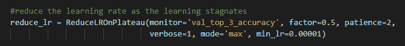*

## ***第 10 步—拟合模型***

*使模型符合数据意味着选择哪个统计模型预测的值最接近实际结果中观察到的值。用最佳参数拟合的模型将最好地定义给定的问题。在 verbose = 1 的情况下训练模型 **50 个时期**以查看进度。*

*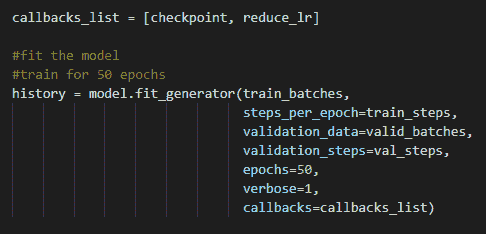*

*产品应该是这样的！我能够用我的卷积神经网络达到 93%的准确率。*

*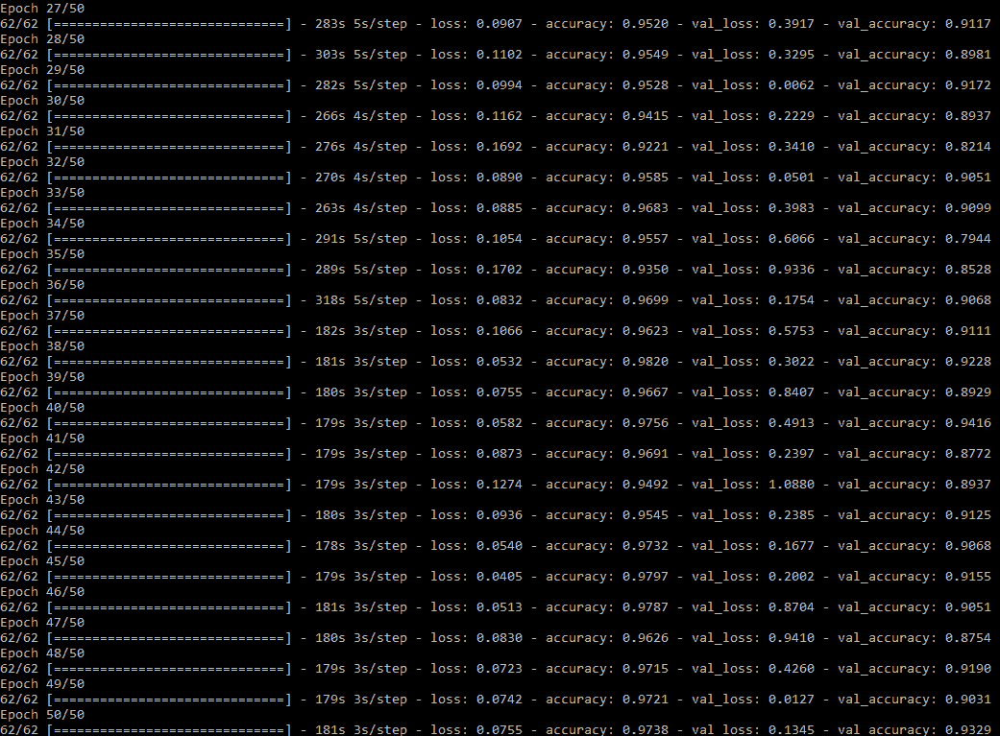*

# ***医疗保健的未来***

*我创建的机器学习模型能够实现比普通胃肠病学专家高 20%的准确性**。也就是说，无论是医生还是机器都无法单独解决这些医疗保健效率低下的问题。***

*相反，医疗专业人员和技术的独特组合将开创医疗保健的未来。每种方法都有独特的相关优势。我真的相信，一旦我们放大了训练有素的医生和人工智能的力量，我们就能建设医疗保健的**未来**—*减少人为错误，优化拯救生命的未来。**

**

# *最后一件事😅*

> **感谢您阅读我的文章，我希望您了解了更多关于* ***卷积神经网络*** *如何通过我制作的息肉检测模型来彻底改变医疗保健🙏如果你能做以下事情来支持我，那对我来说就意味着一切！**

1.  *给我的文章发些掌声👏*
2.  ***在 [LinkedIn](https://www.linkedin.com/in/suraj-bansal/) 上连接**和我👈*
3.  *跟着我去✍️*
4.  *查看我的作品集，了解我的最新作品💪*
5.  *关注我的旅程，订阅我的每月时事通讯🦄*