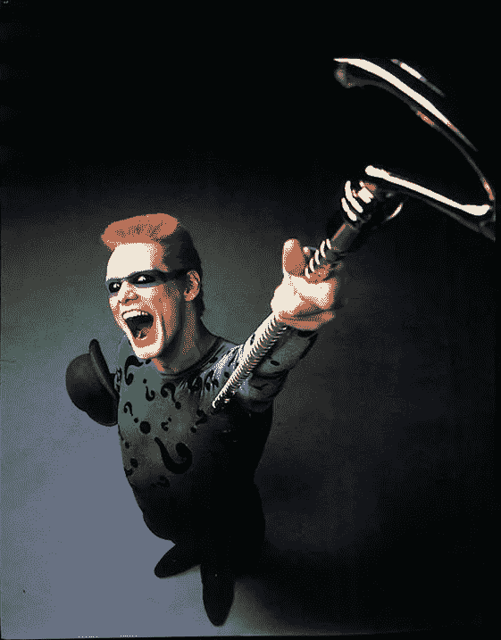
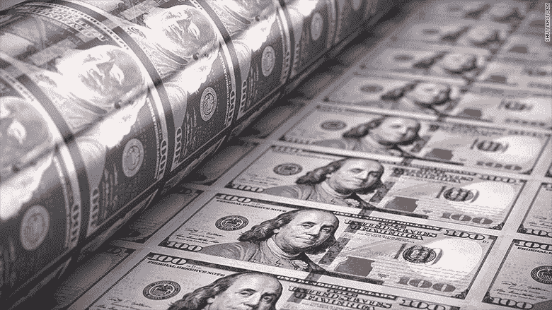

# 给我出个谜题:比特币是有史以来最伟大的法定货币吗？

> 原文：<https://medium.datadriveninvestor.com/riddle-me-this-is-bitcoin-the-greatest-fiat-currency-ever-c60a0e0cf7fe?source=collection_archive---------3----------------------->

Pondering the utility value of bitcoin

你觉得这是虚构的吗？比特币应该是我们的救世主，是我们脱离央行控制的法定货币的去中心化手段。我确实认为，比特币与其他法定货币有着根本的区别，但它正开始获得与主权货币相似的品质。但首先我们需要就一个关键术语达成一致。

法定货币是政府发行的没有内在价值的货币。基本上，它的价值是我们(世界)认同的价值，与硬商品(如黄金或白银)没有固定汇率，也没有法定储备。每一种政府货币目前都是法定货币。1971 年，尼克松总统打破了美元与黄金的固定汇率，美元成为法定货币。那么是什么关键特征使得法定货币和比特币相似呢？

1.  没有内在价值——这很简单。比特币或世界上任何法定货币都没有固定的固定资产汇率。最后一种法定黄金需求的政府货币是瑞士法郎；2000 年，瑞士取消了 40%的黄金储备要求。
2.  权力集中—等一下！这是比特币的关键原则之一！权力是分散的，信息控制也是分散的。是的，但是比特币挖矿变得非常集中。曾经是某人的旧 PC 设置为采矿钻机，现在已经成为硬件密集型业务，资本支出超过 100 万美元。前六大矿池控制了 80%以上的哈希表分布。比特币仍然有固有的去中心化方面，但比特币挖矿正在成为一个赢家。

3.增加货币供应的能力——这是怎么回事？比特币供应的增量已经注定！是的，但是我们有加密货币的硬分叉。什么是硬叉？这是一种加密货币从一种分裂成两种加密货币，并需要不同的区块链技术。比特币在 2017 年经历了一次名为比特币现金的硬分叉，这不是第一次也不是最后一次硬分叉，但却是最成功的硬分叉之一。

有人可能会说，硬分叉不会增加货币供应量，从而降低价值。然而，任何硬分叉都会从原始货币中取走边际需求，并以非常相似的货币增加供给。硬叉子不是经典的“印钞”或量化宽松，但有类似的效果。

比特币和政府法定货币还是有巨大区别的。比特币不是包装不同的法定货币。然而，随着比特币“长大”并被拉向不同的方向，它已经具备了一些法定货币的特征。

