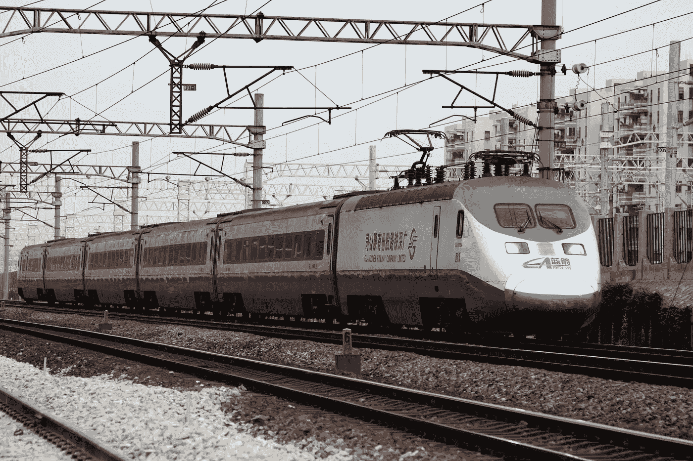

# 乘坐中国铁路

> 原文：<https://medium.datadriveninvestor.com/riding-the-chinese-rails-c2eea3b0cbb?source=collection_archive---------23----------------------->

虽然中国的汽车行业长期以来一直是投资者的热门话题，但现在有一个新的行业正在酝酿之中:铁路行业。

该国已经拥有世界上最长的铁路网之一——延伸 10 万公里，并且还在增加。

例如，刚刚开始研究中国高铁行业的分析师 Edmond Huang 和 Rong 表示，中国高铁里程已达到 1 万公里，而预计今年中国高铁里程将达到 6200 至 6600 公里，2015 年将达到 3900 公里。

 [## 当前全球金融系统的风险和缺点——数据驱动的投资者

### 关于当前的全球金融体系，你肯定会听到两种截然不同的观点，这取决于你问的是谁，一种是…

www.datadriveninvestor.com](https://www.datadriveninvestor.com/2019/02/20/the-risks-drawbacks-of-the-current-global-financial-system/) 

从 2006 年到 2013 年，中国的城市轨道交通系统也扩大了 300%以上，达到 2500 多公里，预计到 2020 年将达到 7000 公里。

政府最近批准了 1420 亿元人民币(230 亿美元)的铁路项目，这对中国企业中国南车、中国中铁和和利时自动化来说是个好消息。

该行业推动的就业增长和原材料需求也应该有助于放缓的经济。

*2014 年首次发表于《金融家》。*

【jenserikgould.com】